# Chapitre 1 — Listes chaînées simples : rappels et encapsulation

=== "Version simplifiée"

    Le module prolonge **TI202** (P1). Les nouveautés de ce premier cours :
    l'**encapsulation** (une liste devient une structure qui *contient* le pointeur
    de tête) et la notion de **collection** (des algorithmes qui ne dépendent pas
    du type stocké).

    !!! abstract "Prérequis"
        Structures (définition, accès aux champs), fonctions (prototype, définition,
        appel, fichiers `.c` / `.h`), pointeurs (passage de paramètres, `malloc`).

    ## Encapsulation

    **Principe** : regrouper les données qui vont ensemble dans une structure
    intermédiaire, puis écrire les fonctions pour cette structure.

    Exemple classique : un tableau a besoin de trois informations (les valeurs, la
    taille logique, la taille physique). On les range dans une seule structure
    `t_tab`, plutôt que de traîner trois variables séparées.

    ## Les types `t_cell` et `t_list`

    === "Version P1"

        ```c
        typedef struct maillon {
            int value;
            struct maillon *next;
        } MAILLON;

        typedef MAILLON *LISTE;    /* une liste EST un pointeur */
        ```

    === "Version P2 (celle du module)"

        ```c
        typedef struct s_cell {
            int value;
            struct s_cell *next;
        } t_cell;

        typedef struct s_list {
            t_cell *head;          /* une liste CONTIENT un pointeur */
        } t_list;
        ```

    ```text
     L (t_list)
    ┌──────┐     ┌───────┬──────┐     ┌───────┬──────┐
    │ head │──▶ │  12   │  @ ──┼──▶ │  -3   │ NULL │
    └──────┘     └───────┴──────┘     └───────┴──────┘
                 value    next        value    next
    ```

    Le pointeur de tête se nomme **`L.head`**. Une `t_list` n'est **pas** un
    pointeur : c'est une structure dont l'unique champ est un pointeur.

    !!! definition "Conventions de nommage (CM « bonnes pratiques »)"
        `struct s_…` pour les structures, `t_…` pour les types après `typedef`,
        `p_…` ou `ptr_…` pour les pointeurs. Détails dans
        [Bonnes pratiques en C](bonnes-pratiques-c.md).

    ## Collections et type générique `T`

    Une **collection** regroupe des données de même type (tableaux, listes chaînées
    en C ; listes, tuples, dictionnaires en Python…). Les algorithmes ne dépendent
    (presque) pas du type stocké : un tri à bulles est le même pour des `int`, des
    `char` ou des `char *`. La seule exigence est de savoir **comparer** deux
    valeurs (`<`, `>`, `==` pour les nombres, `strcmp()` pour les chaînes).

    On écrit donc les algorithmes avec un type quelconque noté **`T`**, puis on
    choisit `int` pour le C. En algorithmique :

    ```text
    structure t_cell
        value : T
        next  : pointeur sur t_cell
    structure t_list
        head  : pointeur sur t_cell
    ```

    Seul l'affichage dépend vraiment du type, à cause du format de `printf` :
    `"%d"` (int), `"%c"` (char), `"%f"` (float), `"%s"` ou `puts()` (char *).

    ## Concevoir une fonction : les 4 questions

    Avant d'écrire une ligne de code, on fixe :

    1. le **périmètre** : ce que fait la fonction, et ce qu'elle ne fait **pas**
       (« ajouter une cellule » n'affiche rien) ;
    2. les **paramètres** : les informations dont elle a besoin ;
    3. le **type de retour** : l'information qu'elle fournit ;
    4. un **nom** explicite (verbe d'action).

    | Fonctionnalité | Nom | Paramètre(s) | Retour |
    |----------------|-----|--------------|--------|
    | Créer une cellule | `createCell` | valeur à stocker | `t_cell *` |
    | Créer une liste vide | `createList` | aucun | `t_list` |
    | Ajouter en tête | `addCell` | **pointeur** sur liste, valeur | rien |
    | Afficher une cellule | `displayCell` | cellule | rien |
    | Afficher une liste | `displayList` | liste | rien |
    | Rechercher une valeur | `searchList` | liste, valeur | vrai / faux |
    | Compter les cellules | `countItems` | liste | entier |

    ## « Modifier » une structure de données

    C'est **la** question du module : faut-il passer la structure par valeur ou par
    pointeur ?

    !!! theoreme "Règle de modification d'une liste simplement chaînée"
        La liste est modifiée **si et seulement si** l'adresse de la première
        cellule (`head`) est modifiée.

        - Modifiée → on passe un **pointeur** : `t_list *ptr_list`.
        - Non modifiée → on passe la liste **par valeur** : `t_list list`.

    Il faut distinguer le point de vue logique et le point de vue machine :

    - **logique** : la liste représente l'ensemble des valeurs ;
    - **machine** : `L` est une variable qui ne stocke qu'une seule chose,
      l'adresse de la première cellule.

    C'est exactement comme un tableau : écrire `tab[2] = 4;` ne modifie pas `tab`
    (l'adresse du premier élément), seulement une case.

    | Opération | `head` change ? | Paramètre |
    |-----------|:---------------:|-----------|
    | Ajout en tête | oui | `t_list *` |
    | Suppression en tête (ou d'une valeur qui peut être en tête) | oui | `t_list *` |
    | Ajout en fin de liste non vide | non | `t_list` suffit |
    | Modifier les valeurs des cellules | non | `t_list` |
    | Afficher, chercher, compter | non | `t_list` |

    !!! piege "Par valeur ≠ protégé"
        Une copie de `t_list` contient **le même pointeur** `head` que l'original :
        elle pointe sur **les mêmes cellules**. Si la fonction modifie le contenu
        d'une cellule (`curr->value = …`), l'original le voit aussi. Seul le champ
        `head` de l'appelant est protégé.

    ## Les fonctions de base

    ```c
    t_cell *createCell(int val)
    {
        t_cell *nouv;
        nouv = (t_cell *)malloc(sizeof(t_cell));
        nouv->value = val;
        nouv->next = NULL;
        return nouv;
    }

    t_list createList(void)          /* appelée createEmptyList dans le CM */
    {
        t_list nouvliste;
        nouvliste.head = NULL;
        return nouvliste;
    }

    void addCell(t_list *ptr_list, int val)   /* ajout en tête */
    {
        t_cell *nouv = createCell(val);
        nouv->next = ptr_list->head;   /* 1. la nouvelle pointe sur l'ancienne première */
        ptr_list->head = nouv;         /* 2. la nouvelle devient la première */
    }
    ```

    !!! piege "L'ordre des deux lignes de `addCell`"
        Si on écrit d'abord `ptr_list->head = nouv;`, on perd l'adresse de
        l'ancienne première cellule : toute la liste devient inaccessible.

    Les ajouts en tête **inversent l'ordre** : après `addCell(&l, 104)`,
    `addCell(&l, 101)`, `addCell(&l, 108)`, la liste vaut `108 → 101 → 104`.

    ## Parcourir une liste

    | | Tableau | Liste chaînée |
    |---|---------|---------------|
    | Accès | **direct** (par indice) | **séquentiel** (de cellule en cellule) |
    | Accéder à l'élément $k$ | $O(1)$ | $O(N)$ |

    On ne connaît que l'adresse de la première cellule et pas le nombre
    d'éléments : on parcourt avec une boucle **tant que** et un pointeur `curr`.

    ```c
    void displayList(t_list l)
    {
        t_cell *curr = l.head;
        while (curr != NULL)          /* on pointe bien sur une cellule */
        {
            printf("%d ", curr->value);
            curr = curr->next;        /* on passe à la suivante */
        }
    }
    ```

    !!! methode "Recherche dans une collection"
        Au départ : pas trouvé. **Tant qu'on n'a pas trouvé et qu'il reste des
        valeurs**, on compare ; si égalité on s'arrête, sinon on passe à la suivante.
        En liste : `while (curr != NULL && curr->value != val)`. L'ordre des deux
        tests compte : on vérifie `curr != NULL` **avant** de lire `curr->value`
        (évaluation paresseuse de `&&`). Écrite en [TD 1](../td/td-1-listes.md).

    ### Pourquoi passer par une fonction ?

    Le CM montre ce programme « naïf » écrit directement dans le `main` :

    ```c
    while (L.head != NULL)
    {
        printf("%c", L.head->value);
        L.head = L.head->next;      /* on modifie L.head ! */
    }
    ```

    À la sortie, `L.head` vaut `NULL` : la première cellule n'est plus accessible,
    donc aucune ne l'est. En passant la liste **par valeur** à `displayList`, la
    fonction travaille sur une **copie** du champ `head` ; l'original ne bouge pas.

    ## Listes et récursivité

    Une liste contient un pointeur vers une cellule, et chaque cellule contient un
    pointeur vers une cellule : **chaque `next` est la tête d'une sous-liste**. Un
    algorithme sur la liste peut donc s'appliquer à `next`.

    !!! methode "Écrire une fonction récursive sur une `t_list`"
        Les types `t_list` et `t_cell *` sont **différents**. On écrit donc deux
        fonctions :

        1. la fonction **récursive** pour le type `t_cell *` ;
        2. une fonction pour `t_list` qui lance le premier appel avec `list.head`.

    ```c
    void afficheCellRec(t_cell *ptr_cell)
    {
        if (ptr_cell != NULL)
        {
            printf("%d ", ptr_cell->value);
            afficheCellRec(ptr_cell->next);   /* appel récursif */
        }
    }

    void afficheListRec(t_list list)
    {
        afficheCellRec(list.head);            /* démarrage à la tête */
    }
    ```

    ## Libérer une liste

    Les cellules sont créées par `malloc` : il faut les rendre avec `free` quand la
    liste devient inutile. On procède récursivement, en faisant **l'appel récursif
    avant le `free`** : si on libère d'abord une cellule, on perd l'accès à sa
    suivante. Les libérations se font donc de la dernière à la première.

    ```c
    void freeCellRec(t_cell *ptr_cell)
    {
        if (ptr_cell != NULL)
        {
            freeCellRec(ptr_cell->next);   /* d'abord les suivantes */
            free(ptr_cell);                /* puis celle-ci */
        }
    }

    void freeList(t_list *ptr_list)        /* pointeur : head devient NULL */
    {
        freeCellRec(ptr_list->head);
        ptr_list->head = NULL;
    }
    ```

=== "Version papier"

    Les diapos du CM 1 de N. Flasque (support 2023-2024) : diapo 1 puis diapos 4 à 52 (les diapos 2-3, présentation administrative du module, sont omises). Dans ce support, la liste s'appelle encore `t_std_list`. Les énoncés d'exercices sont dans la [version papier du TD 1](../td/td-1-listes.md).

    [{ loading=lazy .papier }](papier/ch1/p01.jpg)
    <p class="papier-legende">Page de titre · CM 1 — Présentation, rappels (N. Flasque, 2023-2024), diapo 1</p>

    [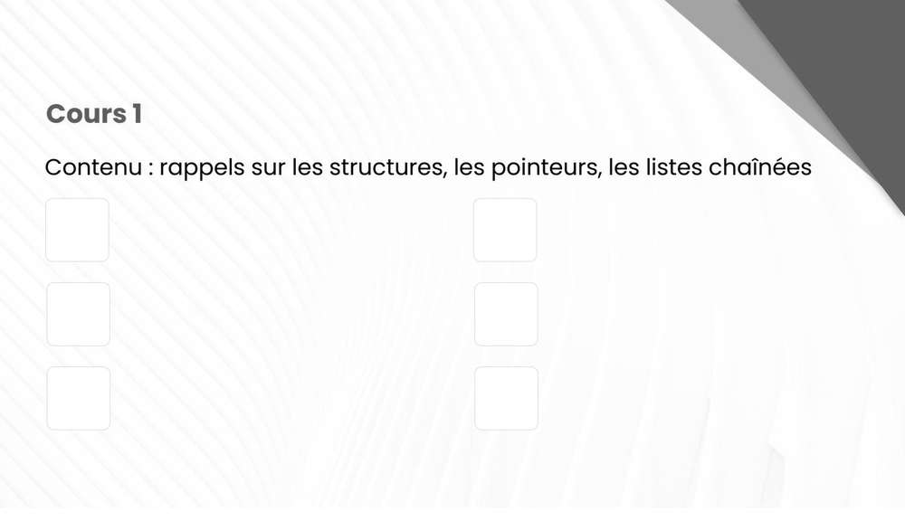{ loading=lazy .papier }](papier/ch1/p04.jpg)
    <p class="papier-legende">Cours 1 : contenu · CM 1 — Présentation, rappels (N. Flasque, 2023-2024), diapo 4</p>

    [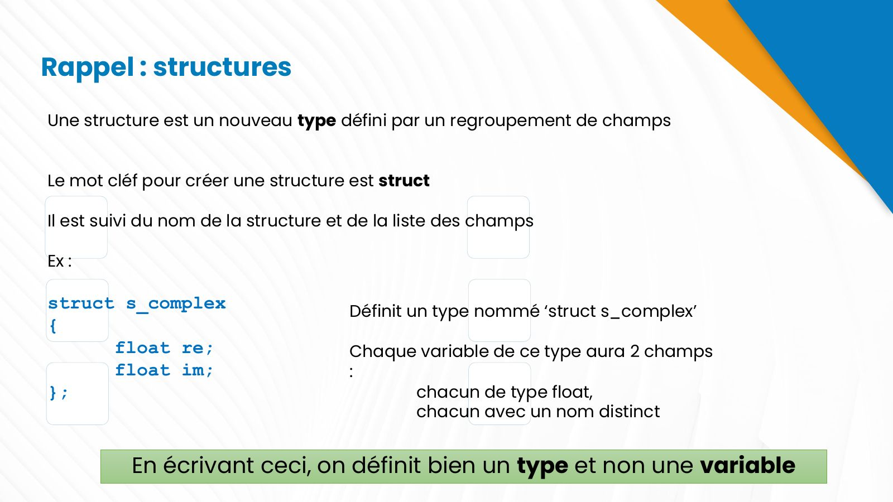{ loading=lazy .papier }](papier/ch1/p05.jpg)
    <p class="papier-legende">Rappel : structures · CM 1 — Présentation, rappels (N. Flasque, 2023-2024), diapo 5</p>

    [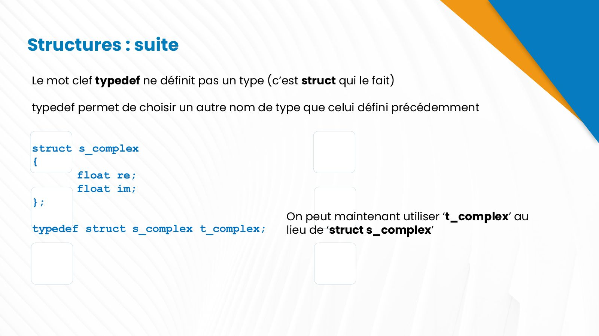{ loading=lazy .papier }](papier/ch1/p06.jpg)
    <p class="papier-legende">Structures : suite · CM 1 — Présentation, rappels (N. Flasque, 2023-2024), diapo 6</p>

    [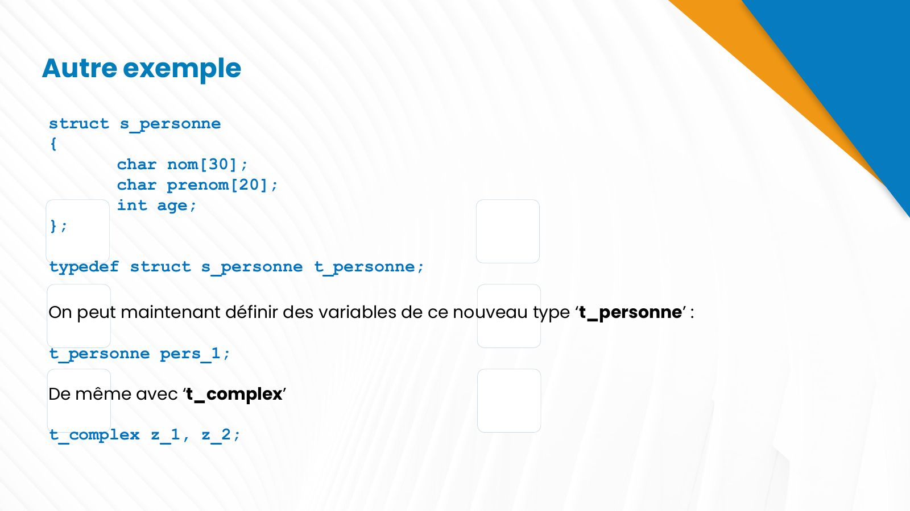{ loading=lazy .papier }](papier/ch1/p07.jpg)
    <p class="papier-legende">Autre exemple · CM 1 — Présentation, rappels (N. Flasque, 2023-2024), diapo 7</p>

    [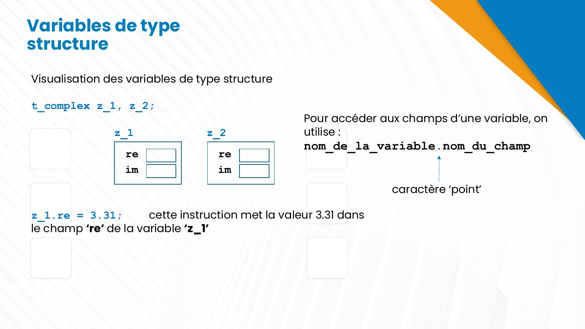{ loading=lazy .papier }](papier/ch1/p08.jpg)
    <p class="papier-legende">Variables de type structure · CM 1 — Présentation, rappels (N. Flasque, 2023-2024), diapo 8</p>

    [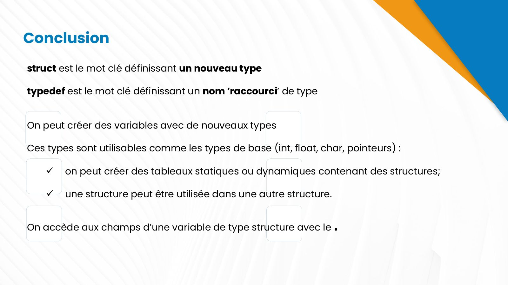{ loading=lazy .papier }](papier/ch1/p09.jpg)
    <p class="papier-legende">Conclusion · CM 1 — Présentation, rappels (N. Flasque, 2023-2024), diapo 9</p>

    [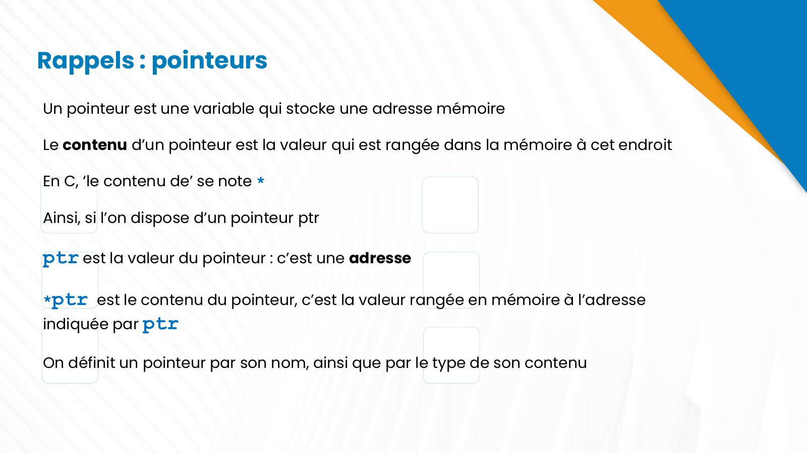{ loading=lazy .papier }](papier/ch1/p10.jpg)
    <p class="papier-legende">Rappels : pointeurs · CM 1 — Présentation, rappels (N. Flasque, 2023-2024), diapo 10</p>

    [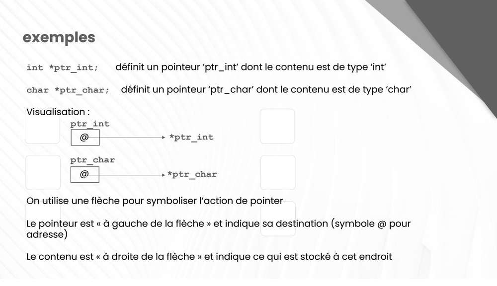{ loading=lazy .papier }](papier/ch1/p11.jpg)
    <p class="papier-legende">Exemples · CM 1 — Présentation, rappels (N. Flasque, 2023-2024), diapo 11</p>

    [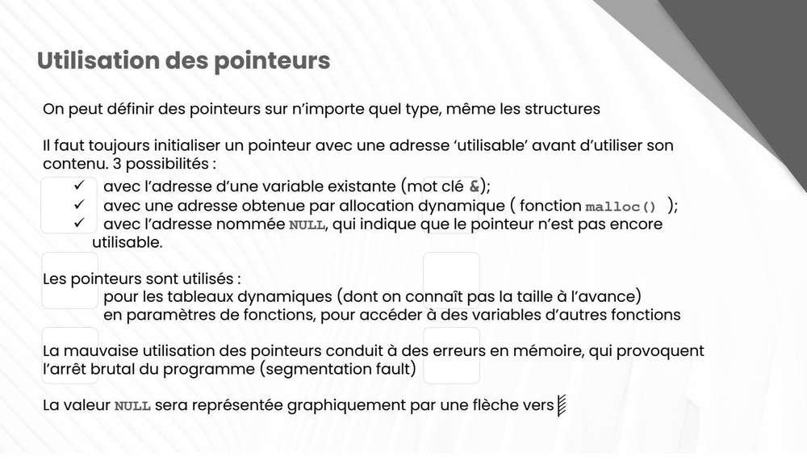{ loading=lazy .papier }](papier/ch1/p12.jpg)
    <p class="papier-legende">Utilisation des pointeurs · CM 1 — Présentation, rappels (N. Flasque, 2023-2024), diapo 12</p>

    [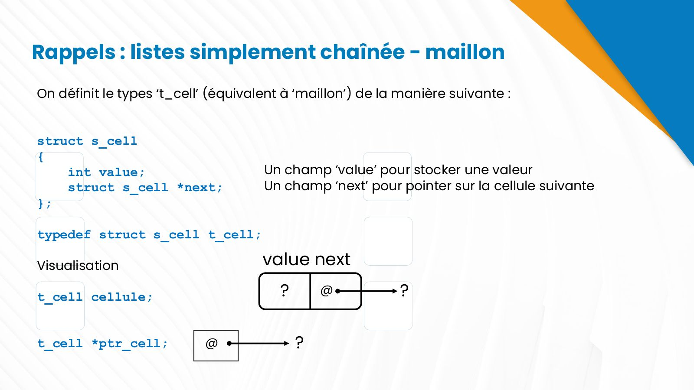{ loading=lazy .papier }](papier/ch1/p13.jpg)
    <p class="papier-legende">Rappels : listes simplement chaînée – maillon · CM 1 — Présentation, rappels (N. Flasque, 2023-2024), diapo 13</p>

    [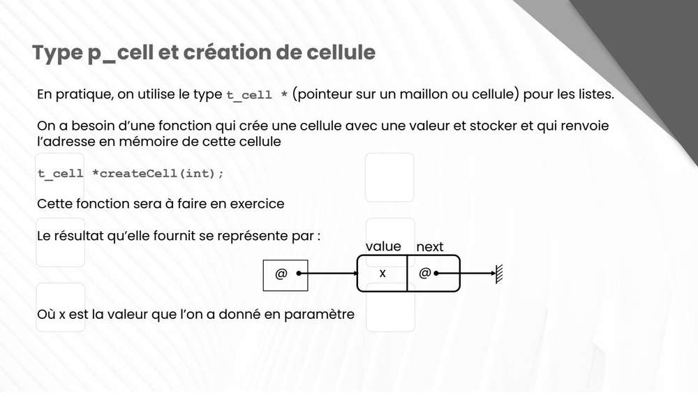{ loading=lazy .papier }](papier/ch1/p14.jpg)
    <p class="papier-legende">Type p_cell et création de cellule · CM 1 — Présentation, rappels (N. Flasque, 2023-2024), diapo 14</p>

    [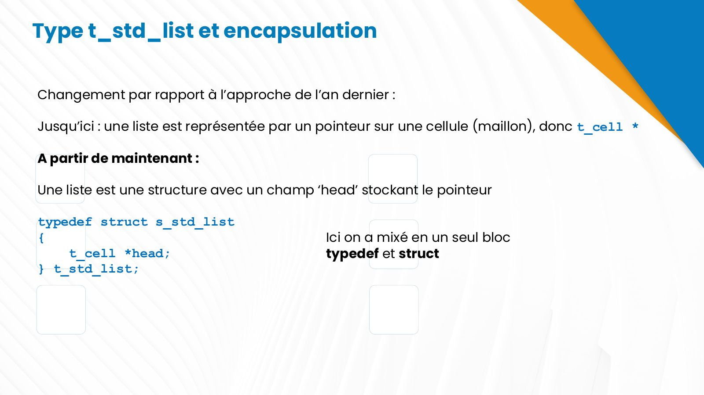{ loading=lazy .papier }](papier/ch1/p15.jpg)
    <p class="papier-legende">Type t_std_list et encapsulation · CM 1 — Présentation, rappels (N. Flasque, 2023-2024), diapo 15</p>

    [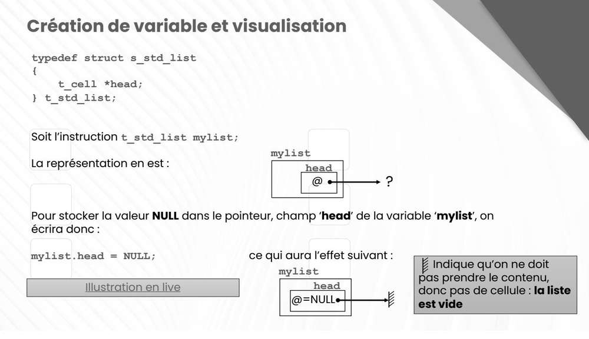{ loading=lazy .papier }](papier/ch1/p16.jpg)
    <p class="papier-legende">Création de variable et visualisation · CM 1 — Présentation, rappels (N. Flasque, 2023-2024), diapo 16</p>

    [{ loading=lazy .papier }](papier/ch1/p17.jpg)
    <p class="papier-legende">Rappel : chaînage en tête de liste · CM 1 — Présentation, rappels (N. Flasque, 2023-2024), diapo 17</p>

    [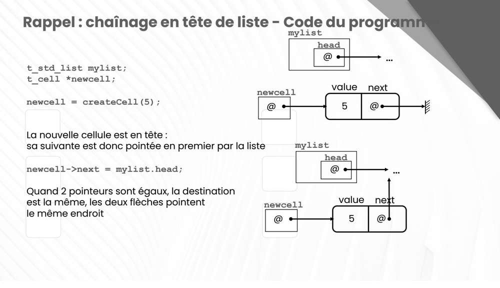{ loading=lazy .papier }](papier/ch1/p18.jpg)
    <p class="papier-legende">Rappel : chaînage en tête de liste – Code du programme · CM 1 — Présentation, rappels (N. Flasque, 2023-2024), diapo 18</p>

    [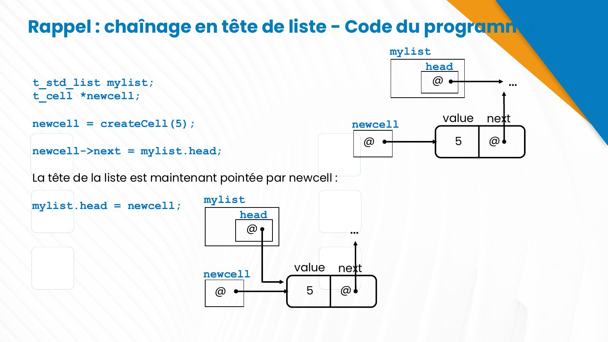{ loading=lazy .papier }](papier/ch1/p19.jpg)
    <p class="papier-legende">Rappel : chaînage en tête de liste – Code du programme (suite) · CM 1 — Présentation, rappels (N. Flasque, 2023-2024), diapo 19</p>

    [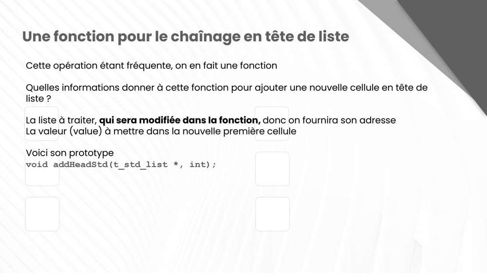{ loading=lazy .papier }](papier/ch1/p20.jpg)
    <p class="papier-legende">Une fonction pour le chaînage en tête de liste · CM 1 — Présentation, rappels (N. Flasque, 2023-2024), diapo 20</p>

    [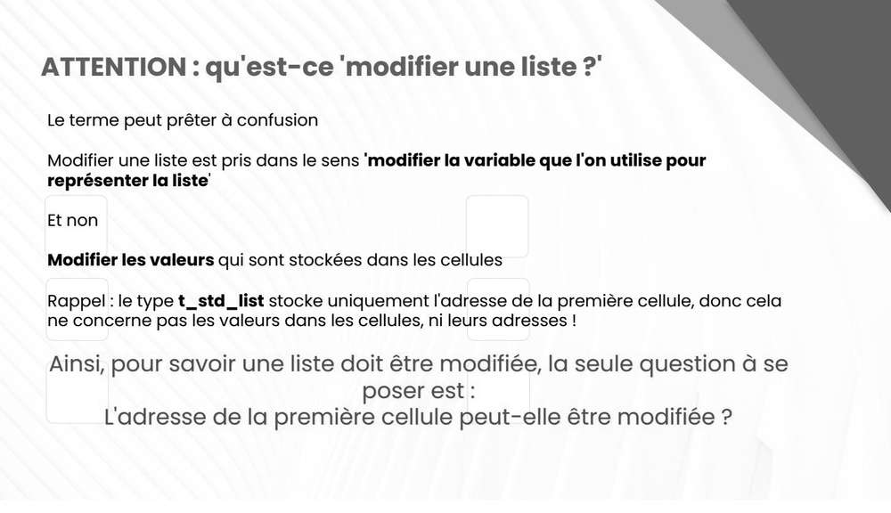{ loading=lazy .papier }](papier/ch1/p21.jpg)
    <p class="papier-legende">ATTENTION : qu'est-ce 'modifier une liste ?' · CM 1 — Présentation, rappels (N. Flasque, 2023-2024), diapo 21</p>

    [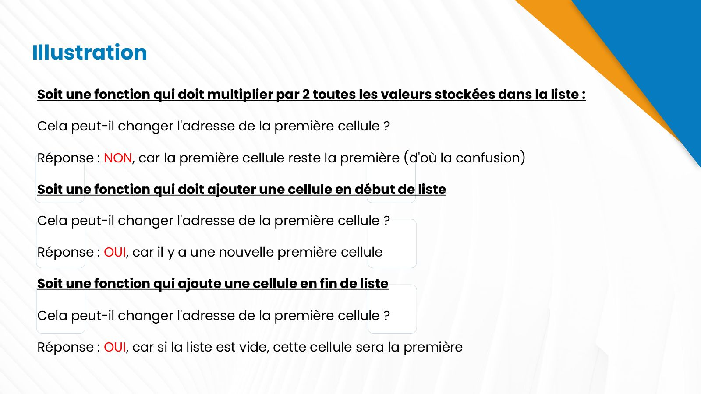{ loading=lazy .papier }](papier/ch1/p22.jpg)
    <p class="papier-legende">Illustration · CM 1 — Présentation, rappels (N. Flasque, 2023-2024), diapo 22</p>

    [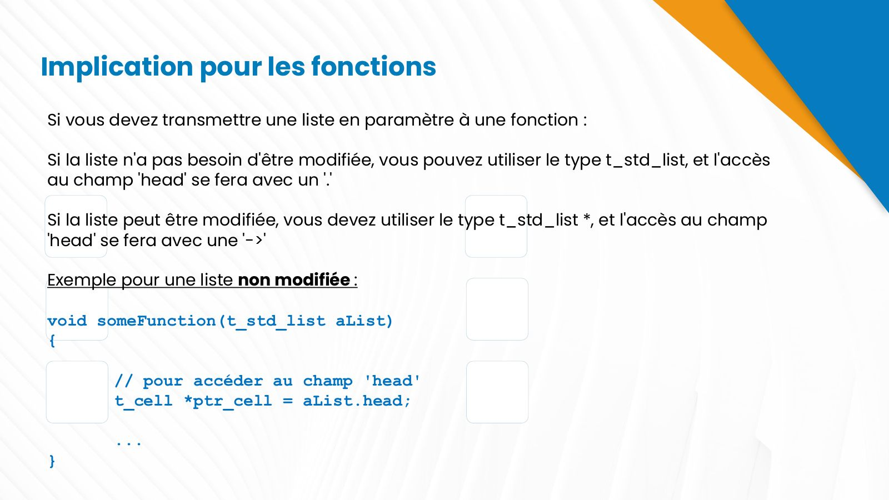{ loading=lazy .papier }](papier/ch1/p23.jpg)
    <p class="papier-legende">Implication pour les fonctions · CM 1 — Présentation, rappels (N. Flasque, 2023-2024), diapo 23</p>

    [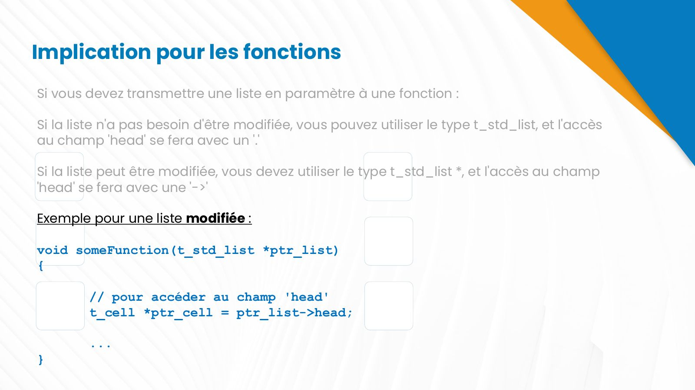{ loading=lazy .papier }](papier/ch1/p24.jpg)
    <p class="papier-legende">Implication pour les fonctions (liste modifiée) · CM 1 — Présentation, rappels (N. Flasque, 2023-2024), diapo 24</p>

    [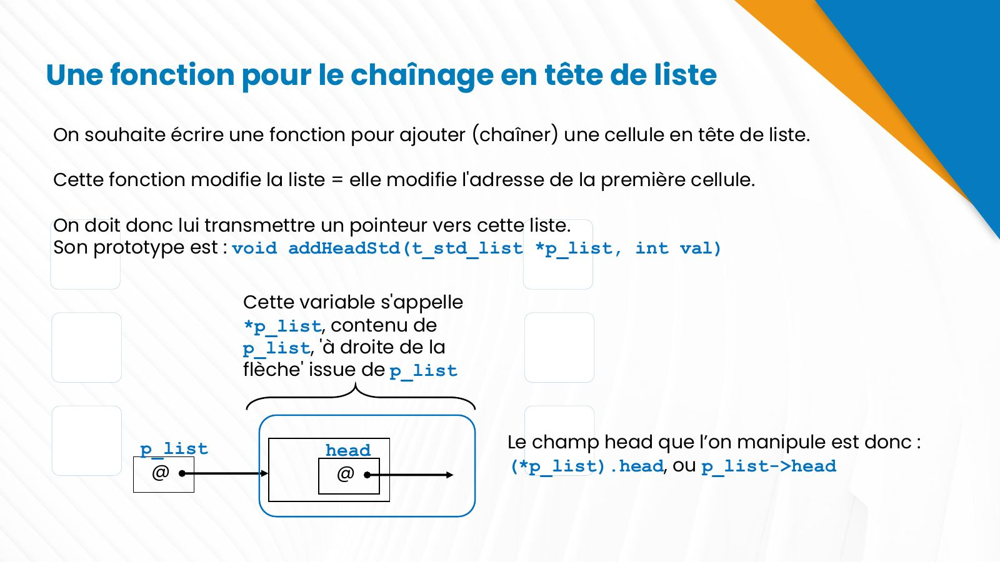{ loading=lazy .papier }](papier/ch1/p25.jpg)
    <p class="papier-legende">Une fonction pour le chaînage en tête de liste · CM 1 — Présentation, rappels (N. Flasque, 2023-2024), diapo 25</p>

    [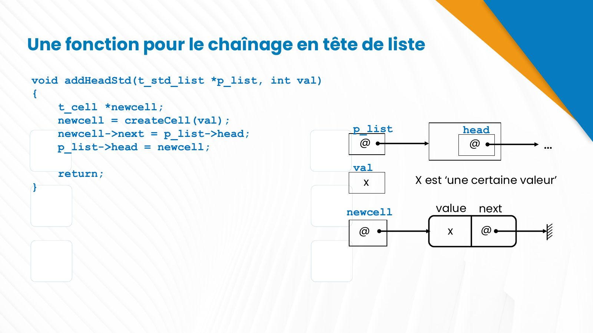{ loading=lazy .papier }](papier/ch1/p26.jpg)
    <p class="papier-legende">Une fonction pour le chaînage en tête de liste (code) · CM 1 — Présentation, rappels (N. Flasque, 2023-2024), diapo 26</p>

    [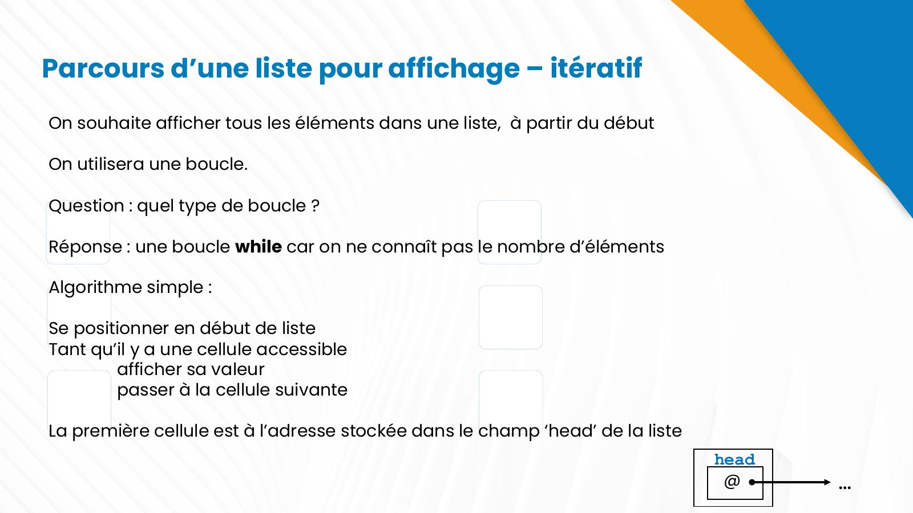{ loading=lazy .papier }](papier/ch1/p27.jpg)
    <p class="papier-legende">Parcours d'une liste pour affichage – itératif · CM 1 — Présentation, rappels (N. Flasque, 2023-2024), diapo 27</p>

    [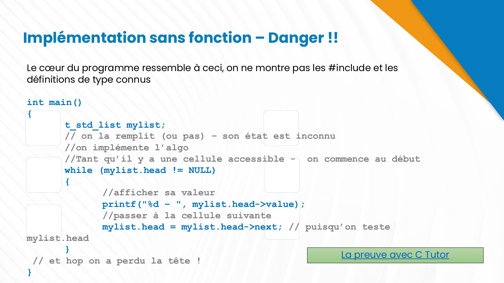{ loading=lazy .papier }](papier/ch1/p28.jpg)
    <p class="papier-legende">Implémentation sans fonction – Danger !! · CM 1 — Présentation, rappels (N. Flasque, 2023-2024), diapo 28</p>

    [{ loading=lazy .papier }](papier/ch1/p29.jpg)
    <p class="papier-legende">Comment éviter ce phénomène ? · CM 1 — Présentation, rappels (N. Flasque, 2023-2024), diapo 29</p>

    [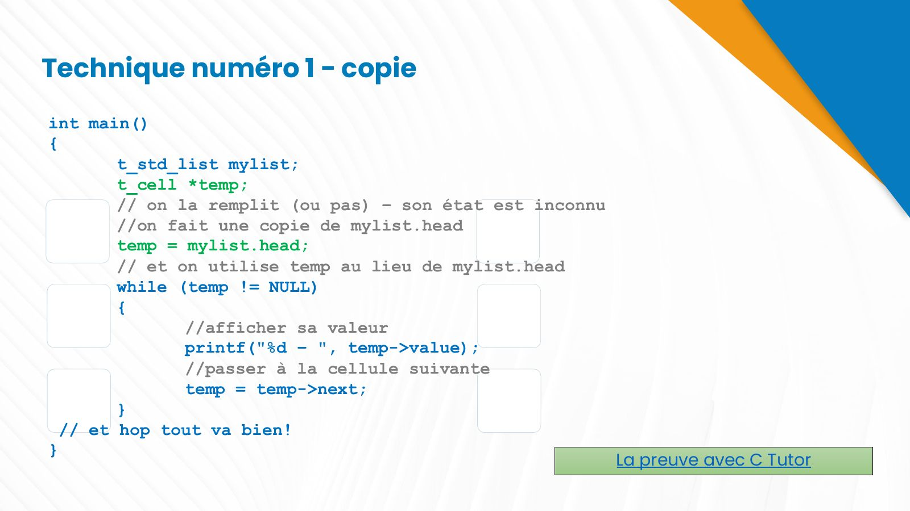{ loading=lazy .papier }](papier/ch1/p30.jpg)
    <p class="papier-legende">Technique numéro 1 – copie · CM 1 — Présentation, rappels (N. Flasque, 2023-2024), diapo 30</p>

    [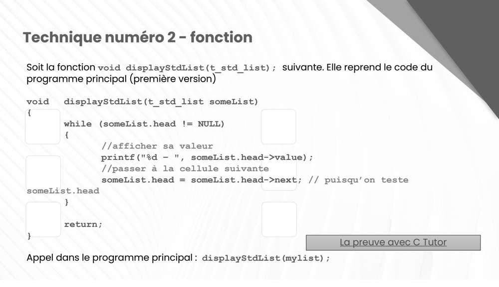{ loading=lazy .papier }](papier/ch1/p31.jpg)
    <p class="papier-legende">Technique numéro 2 – fonction · CM 1 — Présentation, rappels (N. Flasque, 2023-2024), diapo 31</p>

    [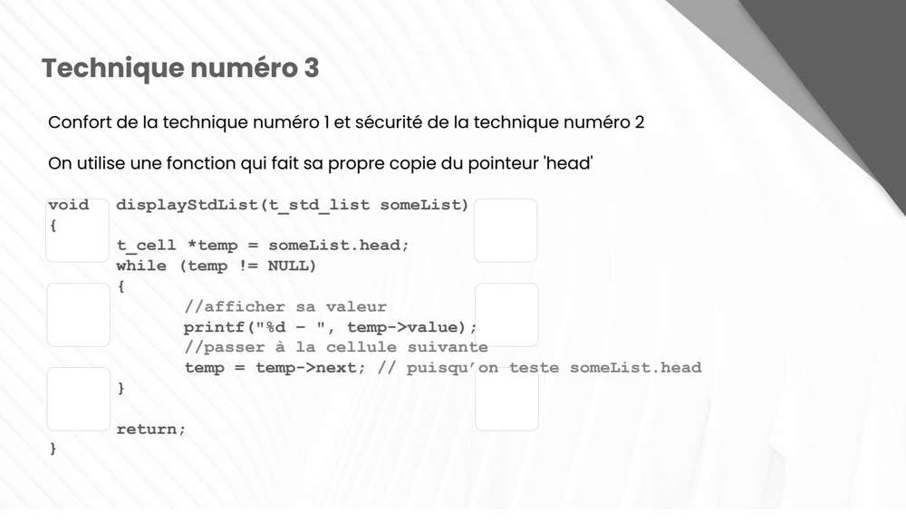{ loading=lazy .papier }](papier/ch1/p32.jpg)
    <p class="papier-legende">Technique numéro 3 · CM 1 — Présentation, rappels (N. Flasque, 2023-2024), diapo 32</p>

    [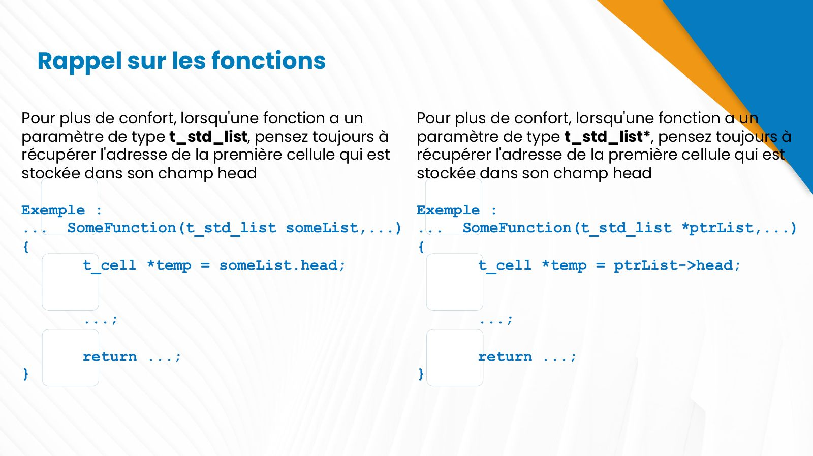{ loading=lazy .papier }](papier/ch1/p33.jpg)
    <p class="papier-legende">Rappel sur les fonctions · CM 1 — Présentation, rappels (N. Flasque, 2023-2024), diapo 33</p>

    [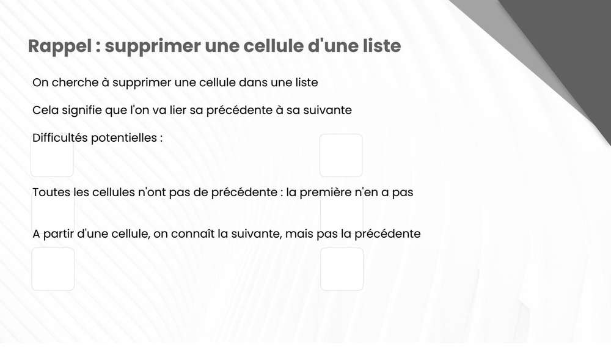{ loading=lazy .papier }](papier/ch1/p34.jpg)
    <p class="papier-legende">Rappel : supprimer une cellule d'une liste · CM 1 — Présentation, rappels (N. Flasque, 2023-2024), diapo 34</p>

    [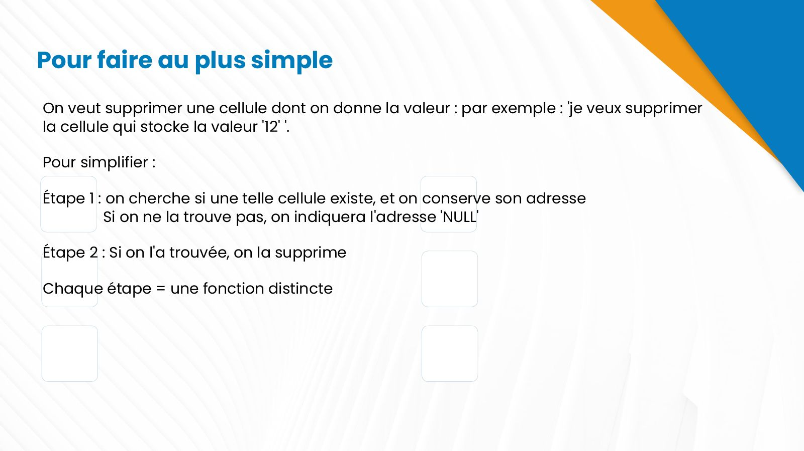{ loading=lazy .papier }](papier/ch1/p35.jpg)
    <p class="papier-legende">Pour faire au plus simple · CM 1 — Présentation, rappels (N. Flasque, 2023-2024), diapo 35</p>

    [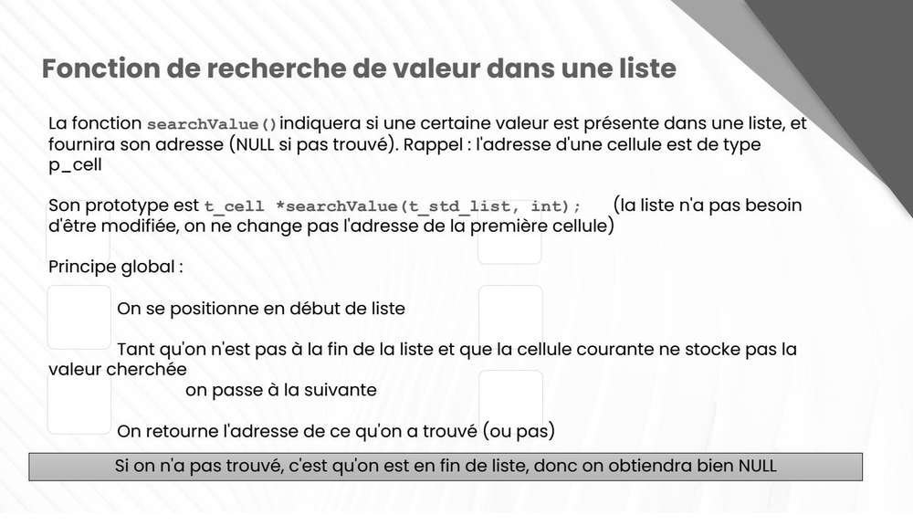{ loading=lazy .papier }](papier/ch1/p36.jpg)
    <p class="papier-legende">Fonction de recherche de valeur dans une liste · CM 1 — Présentation, rappels (N. Flasque, 2023-2024), diapo 36</p>

    [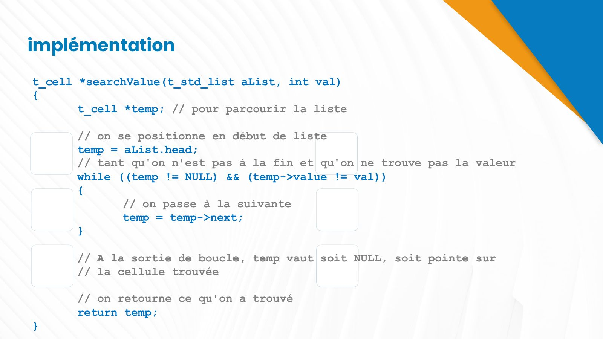{ loading=lazy .papier }](papier/ch1/p37.jpg)
    <p class="papier-legende">Implémentation · CM 1 — Présentation, rappels (N. Flasque, 2023-2024), diapo 37</p>

    [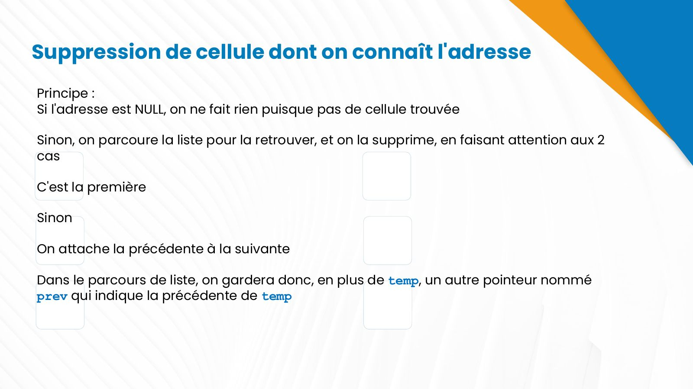{ loading=lazy .papier }](papier/ch1/p38.jpg)
    <p class="papier-legende">Suppression de cellule dont on connaît l'adresse · CM 1 — Présentation, rappels (N. Flasque, 2023-2024), diapo 38</p>

    [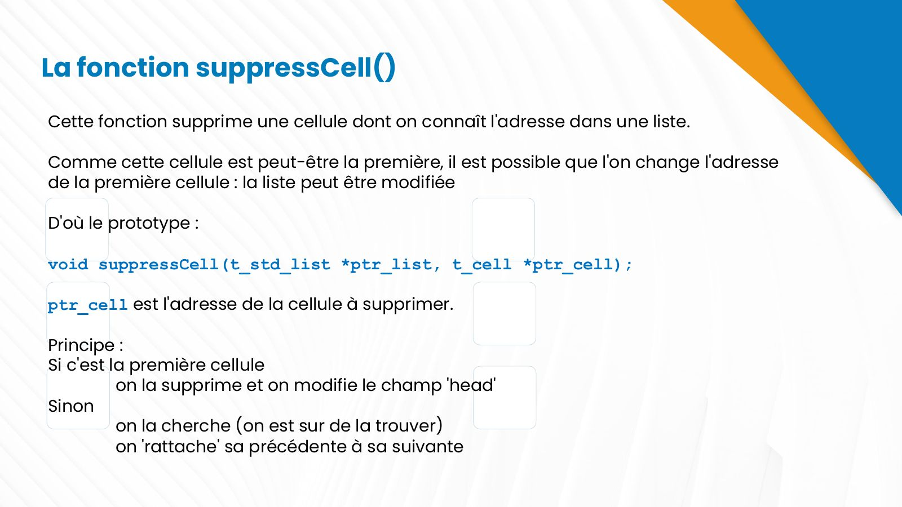{ loading=lazy .papier }](papier/ch1/p39.jpg)
    <p class="papier-legende">La fonction suppressCell() · CM 1 — Présentation, rappels (N. Flasque, 2023-2024), diapo 39</p>

    [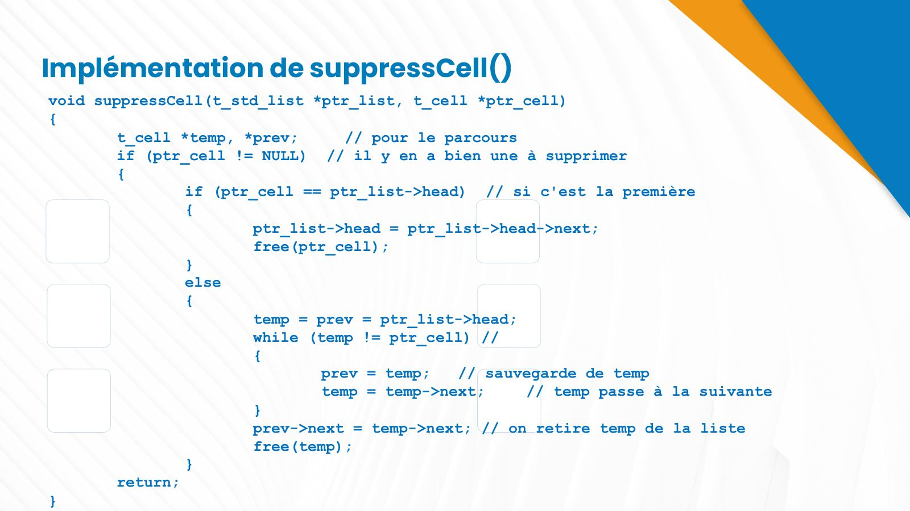{ loading=lazy .papier }](papier/ch1/p40.jpg)
    <p class="papier-legende">Implémentation de suppressCell() · CM 1 — Présentation, rappels (N. Flasque, 2023-2024), diapo 40</p>

    [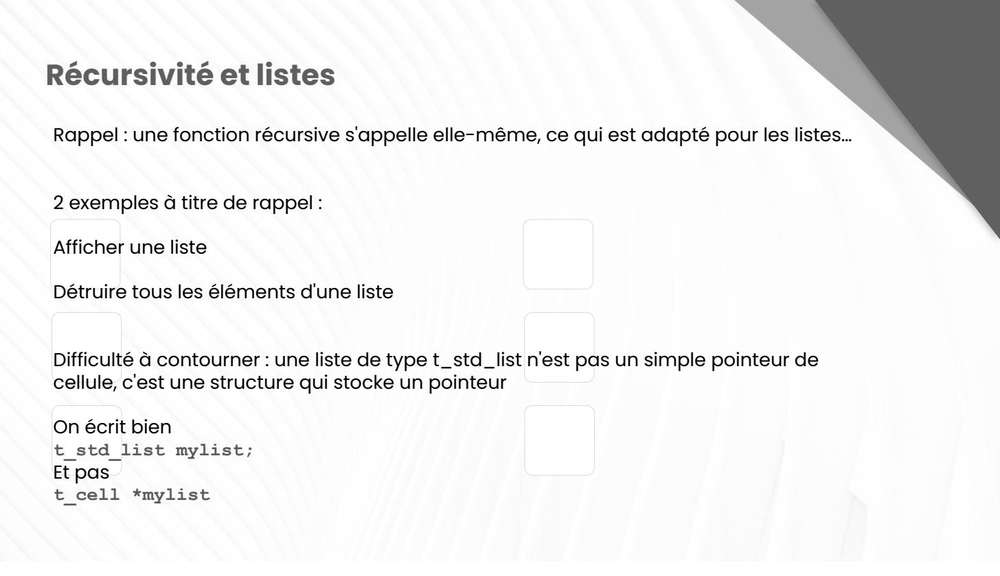{ loading=lazy .papier }](papier/ch1/p41.jpg)
    <p class="papier-legende">Récursivité et listes · CM 1 — Présentation, rappels (N. Flasque, 2023-2024), diapo 41</p>

    [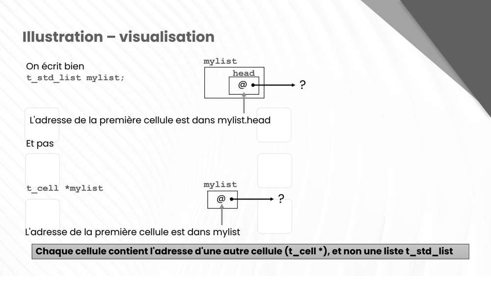{ loading=lazy .papier }](papier/ch1/p42.jpg)
    <p class="papier-legende">Illustration – visualisation · CM 1 — Présentation, rappels (N. Flasque, 2023-2024), diapo 42</p>

    [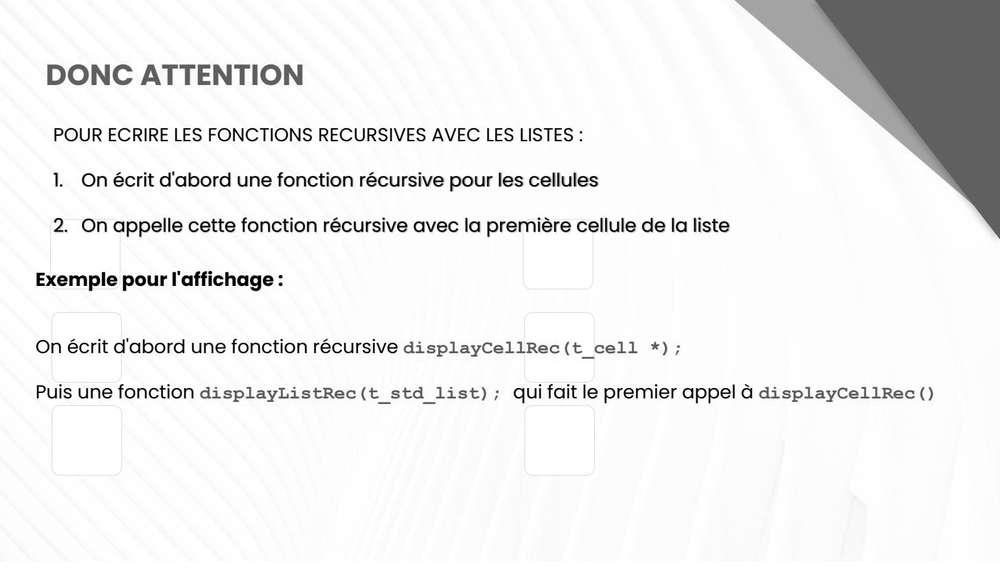{ loading=lazy .papier }](papier/ch1/p43.jpg)
    <p class="papier-legende">DONC ATTENTION · CM 1 — Présentation, rappels (N. Flasque, 2023-2024), diapo 43</p>

    [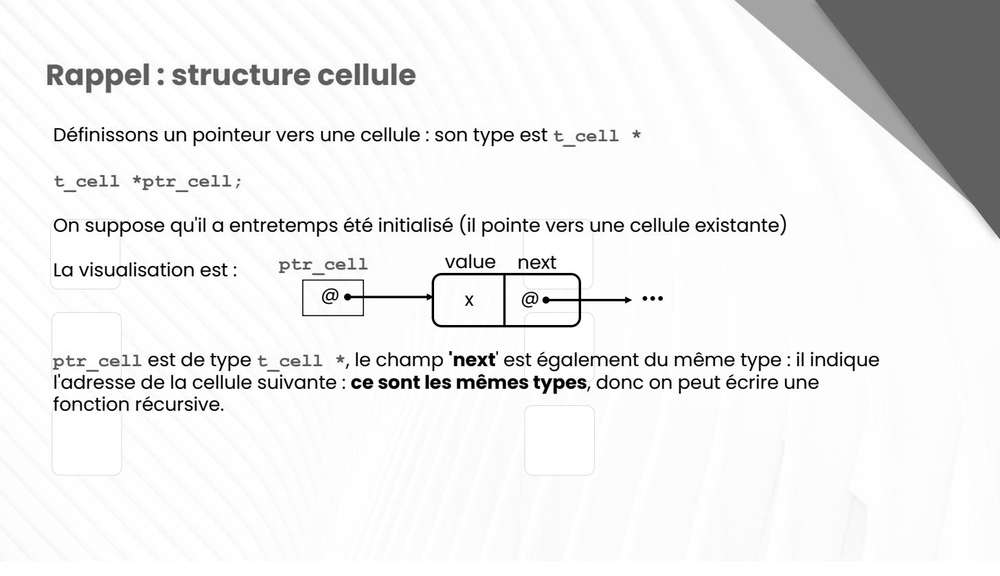{ loading=lazy .papier }](papier/ch1/p44.jpg)
    <p class="papier-legende">Rappel : structure cellule · CM 1 — Présentation, rappels (N. Flasque, 2023-2024), diapo 44</p>

    [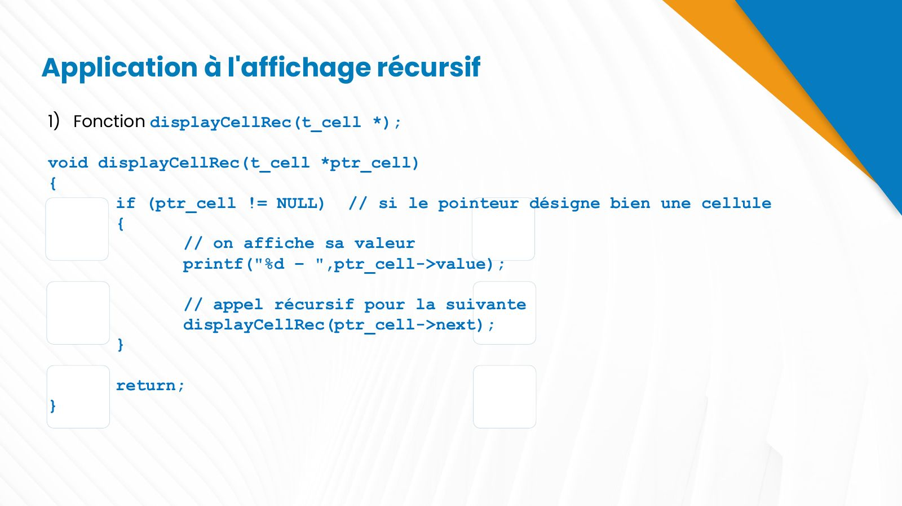{ loading=lazy .papier }](papier/ch1/p45.jpg)
    <p class="papier-legende">Application à l'affichage récursif · CM 1 — Présentation, rappels (N. Flasque, 2023-2024), diapo 45</p>

    [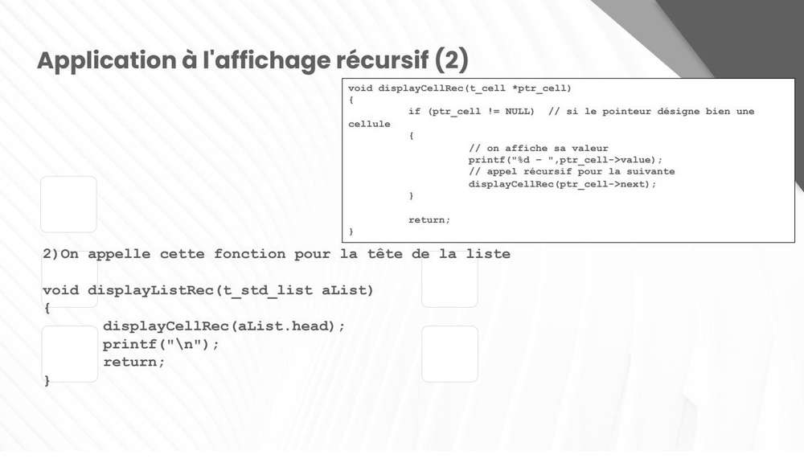{ loading=lazy .papier }](papier/ch1/p46.jpg)
    <p class="papier-legende">Application à l'affichage récursif (2) · CM 1 — Présentation, rappels (N. Flasque, 2023-2024), diapo 46</p>

    [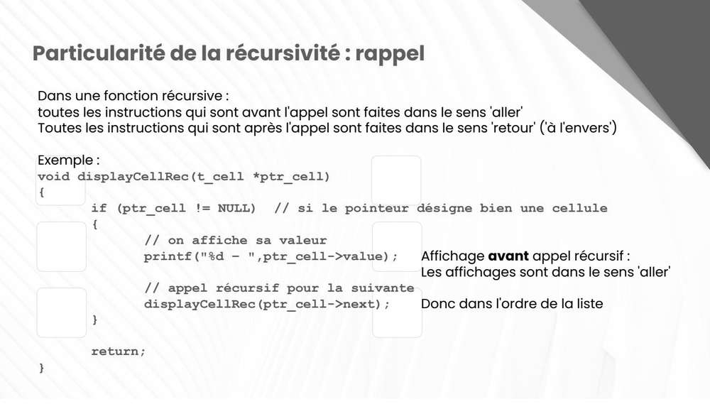{ loading=lazy .papier }](papier/ch1/p47.jpg)
    <p class="papier-legende">Particularité de la récursivité : rappel · CM 1 — Présentation, rappels (N. Flasque, 2023-2024), diapo 47</p>

    [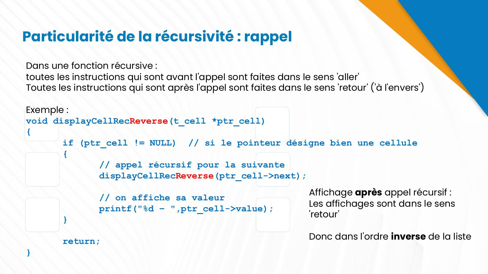{ loading=lazy .papier }](papier/ch1/p48.jpg)
    <p class="papier-legende">Particularité de la récursivité : rappel (affichage inversé) · CM 1 — Présentation, rappels (N. Flasque, 2023-2024), diapo 48</p>

    [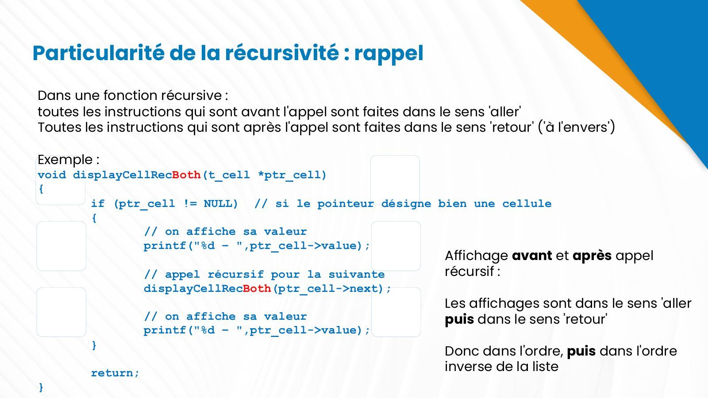{ loading=lazy .papier }](papier/ch1/p49.jpg)
    <p class="papier-legende">Particularité de la récursivité : rappel (affichage dans les deux sens) · CM 1 — Présentation, rappels (N. Flasque, 2023-2024), diapo 49</p>

    [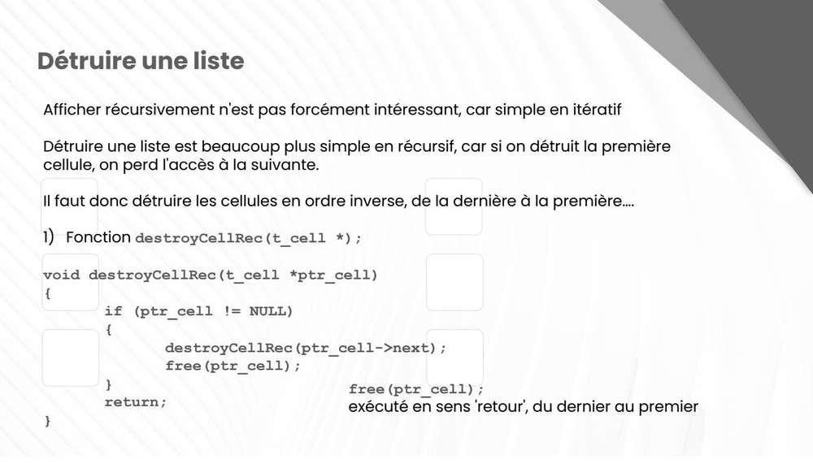{ loading=lazy .papier }](papier/ch1/p50.jpg)
    <p class="papier-legende">Détruire une liste · CM 1 — Présentation, rappels (N. Flasque, 2023-2024), diapo 50</p>

    [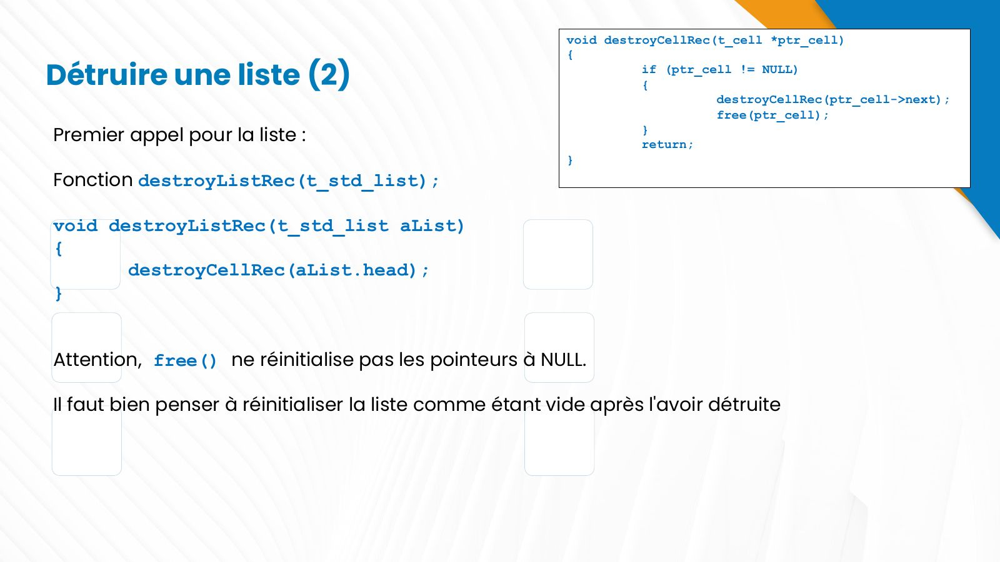{ loading=lazy .papier }](papier/ch1/p51.jpg)
    <p class="papier-legende">Détruire une liste (2) · CM 1 — Présentation, rappels (N. Flasque, 2023-2024), diapo 51</p>

    [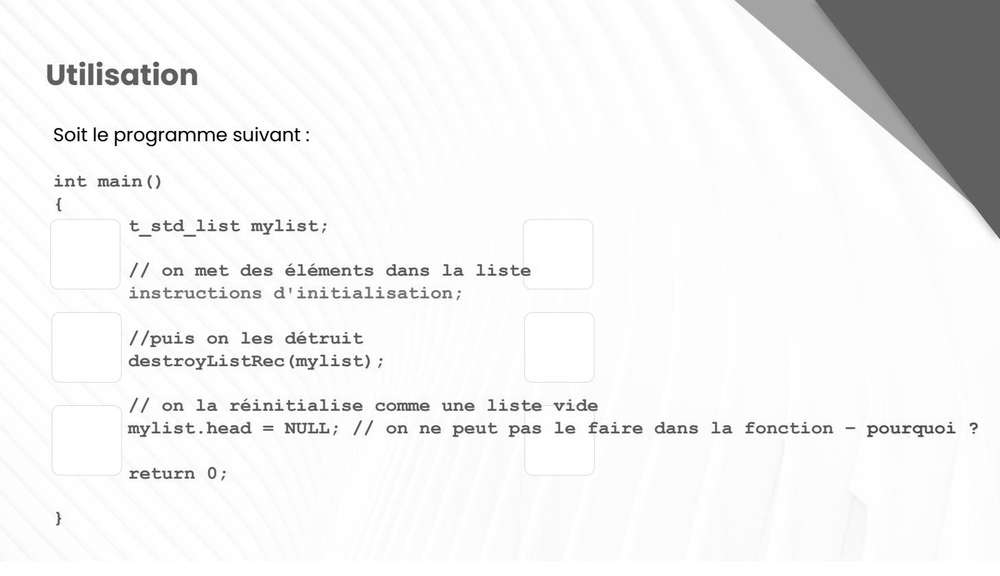{ loading=lazy .papier }](papier/ch1/p52.jpg)
    <p class="papier-legende">Utilisation · CM 1 — Présentation, rappels (N. Flasque, 2023-2024), diapo 52</p>
