# Chapitre 4 — Arbres binaires

=== "Version simplifiée"

    Un arbre binaire ressemble à une liste chaînée, sauf que chaque élément pointe
    vers **deux** autres éléments au lieu d'un. On le dessine de haut en bas.

    ## Les types `t_node` et `t_tree`

    ```c
    typedef struct s_node
    {
        struct s_node *left;
        int value;               /* T : int, char, float... */
        struct s_node *right;
    } t_node;

    typedef struct s_tree
    {
        t_node *root;            /* comme t_list stocke head */
    } t_tree;
    ```

    | Liste | Arbre |
    |-------|-------|
    | `t_cell` : `value`, `next` | `t_node` : `left`, `value`, `right` |
    | `t_list` : `head` | `t_tree` : `root` (la **racine**) |
    | `createCell(val)` | `createNode(val)`, qui renvoie un `t_node *` dont `left` et `right` valent `NULL` |
    | liste vide : `head == NULL` | arbre vide : `root == NULL` |

    ```c
    t_node *createNode(int val)
    {
        t_node *p_nouv = (t_node *)malloc(sizeof(t_node));
        p_nouv->value = val;
        p_nouv->left = NULL;
        p_nouv->right = NULL;
        return p_nouv;
    }

    t_tree createEmptyTree(void)      /* appelée EmptyTree() dans le CM */
    {
        t_tree atree;
        atree.root = NULL;
        return atree;
    }
    ```

    ## Vocabulaire

    ```text
                  -          profondeur 0   ← racine
                /   \
               +     /       profondeur 1
              / \   / \
             3   1 7   x     profondeur 2
                      / \
                     3   2   profondeur 3   ← feuilles : 3, 1, 7, 3, 2
    ```

    !!! definition "Définitions"
        - **Racine** : le « premier » nœud (`root`).
        - **Feuille** : nœud dont `left` **et** `right` valent `NULL`.
        - **Profondeur** d'un nœud : sa distance à la racine (la racine est à 0).
        - **Hauteur** d'un arbre : la profondeur maximale de ses nœuds. Une feuille
          seule a une hauteur de **0**, l'arbre vide une hauteur de **−1**.
        - **Sous-arbre gauche / droit** d'un nœud : l'arbre dont la racine est
          `left` / `right`.

    ## Arbres et récursivité

    `mytree.root`, `pn->left` et `pn->right` sont **tous** de type `t_node *` :
    chaque fils est la racine d'un sous-arbre. La récursivité devient le moyen
    « naturel » de traiter un arbre (et il faut la maîtriser).

    !!! methode "Écrire une fonction récursive sur un arbre"
        1. Écrire la fonction récursive pour le type **`t_node *`** (cas de base :
           `pn == NULL`).
        2. Écrire la fonction pour **`t_tree`**, qui lance le premier appel avec
           `mytree.root`.

    ### Exemple : la hauteur

    - arbre vide (`NULL`) : hauteur $-1$ ;
    - sinon : $1 + \max(\text{hauteur gauche}, \text{hauteur droite})$.

    ```c
    int max(int a, int b)            /* max n'existe pas en C standard */
    {
        return (a > b) ? a : b;
    }

    int nodeHeight(t_node *pn)       /* ne modifie rien : retourne un int */
    {
        int height;
        if (pn == NULL)
        {
            height = -1;
        }
        else
        {
            height = 1 + max(nodeHeight(pn->left), nodeHeight(pn->right));
        }
        return height;
    }

    int treeHeight(t_tree t)
    {
        return nodeHeight(t.root);
    }
    ```

    !!! piege "Le cas de base est `pn == NULL`, pas « pn est une feuille »"
        Tester seulement `pn->left == NULL && pn->right == NULL` plante dès qu'un
        nœud a **un seul** fils : l'appel sur le fils absent reçoit `NULL` et lit
        `pn->left`. C'est une question du [DE 2024](../td/annale-de-2024.md#partie-3-arbres).

    Le comptage des nœuds (`countNode`) suit le même schéma : voir
    [TD 4](../td/td-4-arbres-binaires.md).

    ## Ajouter un nœud au hasard

    `addRandomNode()` crée un nœud et descend dans l'arbre en tirant à chaque étape
    gauche (0) ou droite (1), jusqu'à trouver une place libre.

    ```c
    void addRandomNode(t_tree *p_tree, char somechar)   /* pointeur : root peut changer */
    {
        t_node *p_nouv = createNode(somechar);
        t_node *temp = p_tree->root;
        int placed = 0;

        if (p_tree->root == NULL)                /* arbre vide : nouvelle racine */
        {
            p_tree->root = p_nouv;
            return;
        }
        while (!placed)
        {
            if (rand() % 2 == 0)                 /* essayer à gauche */
            {
                if (temp->left == NULL) { temp->left = p_nouv; placed = 1; }
                else                    { temp = temp->left; }
            }
            else                                 /* essayer à droite */
            {
                if (temp->right == NULL) { temp->right = p_nouv; placed = 1; }
                else                     { temp = temp->right; }
            }
        }
    }
    ```

    ## Parcours en profondeur

    Schéma général d'une fonction récursive sur les nœuds :

    ```text
    traiter(pn)
        bloc (1)
        si pn->left != NULL : traiter(pn->left)
        bloc (2)
        si pn->right != NULL : traiter(pn->right)
        bloc (3)
    ```

    La **position** de l'action (afficher la valeur) par rapport aux deux appels
    donne trois parcours :

    | Parcours | Ordre | Arbre ci-dessus | Usage |
    |----------|-------|-----------------|-------|
    | **Préfixe** | nœud, gauche, droite | `- + 3 1 / 7 x 3 2` | notation polonaise (vieilles calculatrices) |
    | **Infixe** | gauche, nœud, droite | `3 + 1 - 7 / 3 x 2` | écriture usuelle ; **valeurs triées pour un ABR** |
    | **Postfixe** | gauche, droite, nœud | `3 1 + 7 3 2 x / -` | notation polonaise inverse, libération d'un arbre |

    ```c
    void prefix(t_node *pn)
    {
        if (pn != NULL)
        {
            printf("%d ", pn->value);   /* bloc (1) */
            prefix(pn->left);
            prefix(pn->right);
        }
    }

    void infix(t_node *pn)
    {
        if (pn != NULL)
        {
            infix(pn->left);
            printf("%d ", pn->value);   /* bloc (2) */
            infix(pn->right);
        }
    }

    void postfix(t_node *pn)
    {
        if (pn != NULL)
        {
            postfix(pn->left);
            postfix(pn->right);
            printf("%d ", pn->value);   /* bloc (3) */
        }
    }
    ```

    !!! piege "L'infixe « perd » les parenthèses"
        `3 + 1 - 7 / 3 x 2` ne dit pas que `+` est calculé avant `-`. La gestion
        des parenthèses et des priorités est vue en TD / TP.

    ## Parcours en largeur

    On visite les nœuds **niveau par niveau**, de gauche à droite. Pour l'arbre
    ci-dessus : `- + / 3 1 7 x 3 2`.

    Difficile à écrire récursivement : à chaque nœud, on **range ses enfants pour
    les visiter après**. Les premiers rangés sont les premiers visités : c'est une
    **file** (de `t_node *`).

    ```text
    parcoursEnLargeur(t : t_tree)
        q ← file vide
        si t.root ≠ NULL : enfiler(q, t.root)
        tant que q n'est pas vide
            cur ← défiler(q)
            traiter cur
            si cur->left  ≠ NULL : enfiler(q, cur->left)
            si cur->right ≠ NULL : enfiler(q, cur->right)
    ```

    !!! tip "Profondeur = pile, largeur = file"
        Remplacer la file par une **pile** (en empilant d'abord le fils droit)
        donne un parcours **préfixe** itératif.

    ## Catégories d'arbres binaires

    | Catégorie | Définition |
    |-----------|-----------|
    | **Strict** (localement complet) | chaque nœud a **0 ou 2** fils |
    | **Complet** | tous les niveaux sont remplis, sauf éventuellement le dernier, dont les feuilles sont **alignées à gauche** |
    | **Parfait** | **tous** les niveaux sont remplis |
    | **Dégénéré** | chaque nœud a **au plus un** fils : c'est une liste |

    ```text
     strict, ni complet ni parfait   complet, non parfait     parfait
             o                            o                      o
            / \                         /   \                  /   \
           o   o                       o     o                o     o
              / \                     / \   /                / \   / \
             o   o                   o   o o                o   o o   o
    ```

    Un arbre parfait est complet ; un arbre complet n'est pas forcément strict (un
    nœud du dernier niveau peut n'avoir qu'un fils gauche).

    ## Arbres binaires de recherche (ABR / BST)

    !!! definition "ABR — *Binary Search Tree*"
        Pour **chaque** nœud :

        - toutes les valeurs de son sous-arbre **gauche** sont **inférieures** à la sienne ;
        - toutes les valeurs de son sous-arbre **droit** sont **supérieures**.

    ```text
              8
            /   \
           3     10
          / \      \
         1   6      14
            / \    /
           4   7  13
    ```

    Préfixe `8 3 1 6 4 7 10 14 13` ; postfixe `1 4 7 6 3 13 14 10 8` ;
    infixe `1 3 4 6 7 8 10 13 14` : **trié**.

    !!! theoreme "Infixe d'un ABR"
        Un arbre binaire est un ABR **si et seulement si** son parcours infixe donne
        les valeurs dans l'ordre croissant.

    ### Insertion

    Une nouvelle valeur s'insère **toujours comme une feuille**. On descend depuis
    la racine : à gauche si la valeur est plus petite, à droite sinon, jusqu'à une
    place libre. Exemple : insérer 5 → 8 (gauche) → 3 (droite) → 6 (gauche) → 4
    (droite) : 5 devient le fils droit de 4.

    Comme pour l'insertion dans une liste, on garde un pointeur `parent` (le
    `prev` des listes) pour pouvoir accrocher le nouveau nœud :

    ```c
    void insertBST(t_tree *p_tree, int val)
    {
        t_node *pn = createNode(val);
        t_node *temp, *parent = NULL;

        if (p_tree->root == NULL)          /* arbre vide : pn devient la racine */
        {
            p_tree->root = pn;
            return;
        }
        temp = p_tree->root;
        while (temp != NULL)
        {
            parent = temp;                 /* pour accrocher pn à la fin */
            if (val < temp->value) temp = temp->left;
            else                   temp = temp->right;
        }
        if (val < parent->value) parent->left = pn;
        else                     parent->right = pn;
    }
    ```

    !!! piege "L'ordre d'insertion change la forme"
        Les mêmes valeurs donnent des ABR différents selon l'ordre d'insertion.
        Pire cas : insérer des valeurs **déjà triées** (1, 2, 3, 4…) donne un arbre
        **dégénéré**, où `right` joue le rôle de `next` : c'est une liste. La suite
        (complexité, équilibrage) est au [chapitre 5](chapitre-5-abr-avl.md).

=== "Version papier"

    Les diapos du CM 4 de N. Flasque (support 2023-2024), diapos 1 à 64. La dernière diapo (65, problèmes de complexité des BST) ouvre le [chapitre 5](chapitre-5-abr-avl.md). Les énoncés d'exercices sont dans la [version papier du TD 4](../td/td-4-arbres-binaires.md).

    [{ loading=lazy .papier }](papier/ch4/p01.jpg)
    <p class="papier-legende">Page de titre · CM 4 — Arbres binaires (N. Flasque, 2023-2024), diapo 1</p>

    [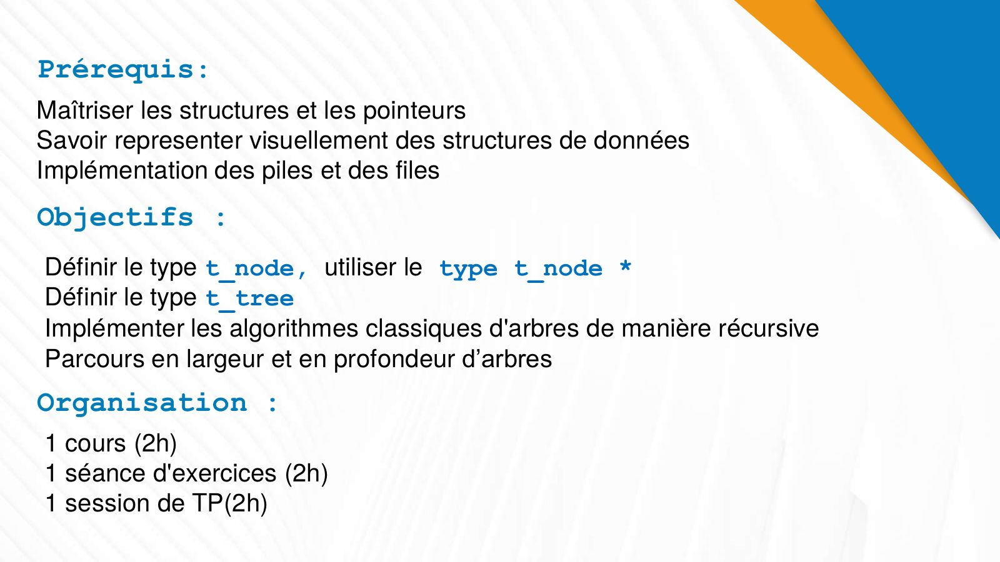{ loading=lazy .papier }](papier/ch4/p02.jpg)
    <p class="papier-legende">Prérequis, objectifs · CM 4 — Arbres binaires (N. Flasque, 2023-2024), diapo 2</p>

    [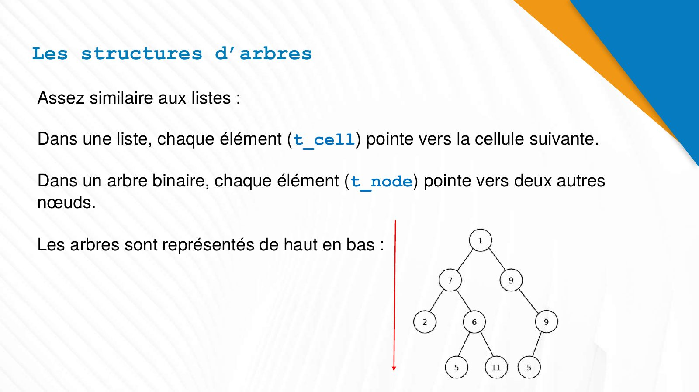{ loading=lazy .papier }](papier/ch4/p03.jpg)
    <p class="papier-legende">Les structures d'arbres · CM 4 — Arbres binaires (N. Flasque, 2023-2024), diapo 3</p>

    [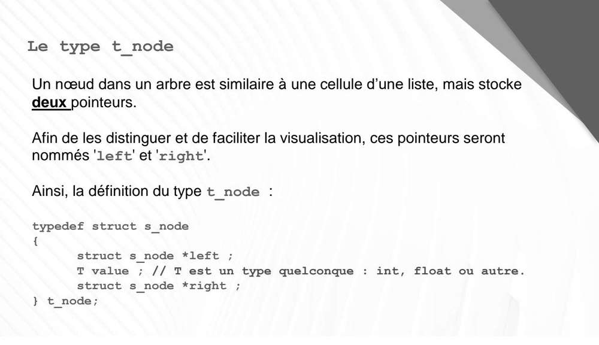{ loading=lazy .papier }](papier/ch4/p04.jpg)
    <p class="papier-legende">Le type t_node · CM 4 — Arbres binaires (N. Flasque, 2023-2024), diapo 4</p>

    [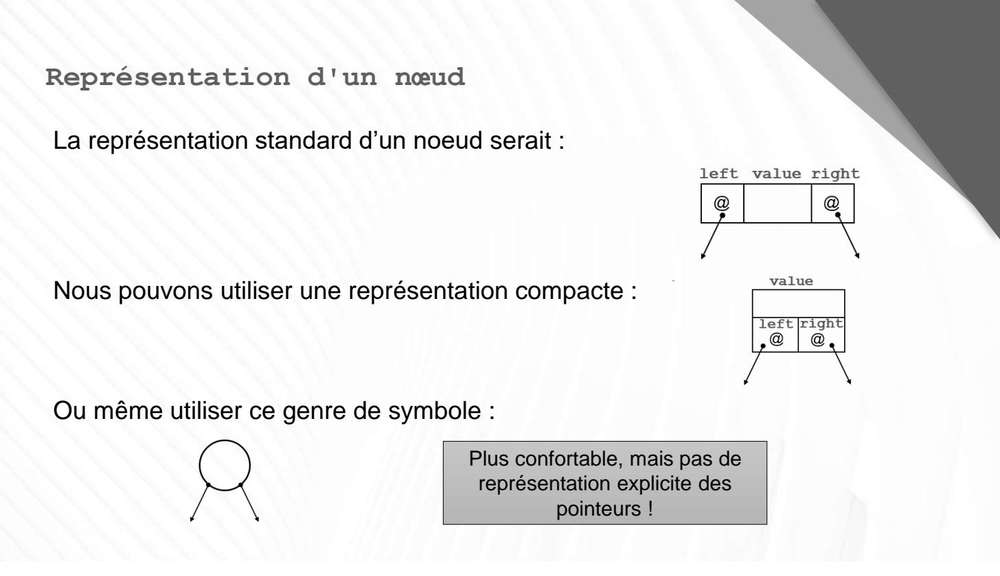{ loading=lazy .papier }](papier/ch4/p05.jpg)
    <p class="papier-legende">Représentation d'un nœud · CM 4 — Arbres binaires (N. Flasque, 2023-2024), diapo 5</p>

    [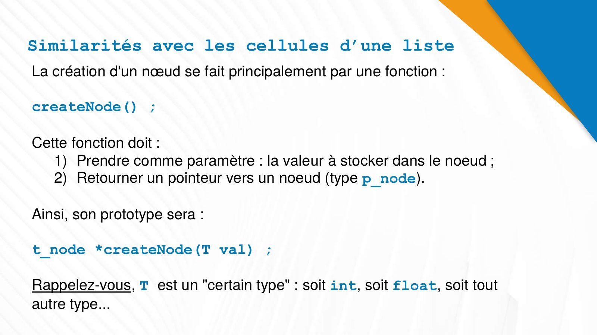{ loading=lazy .papier }](papier/ch4/p06.jpg)
    <p class="papier-legende">Similarités avec les cellules d'une liste · CM 4 — Arbres binaires (N. Flasque, 2023-2024), diapo 6</p>

    [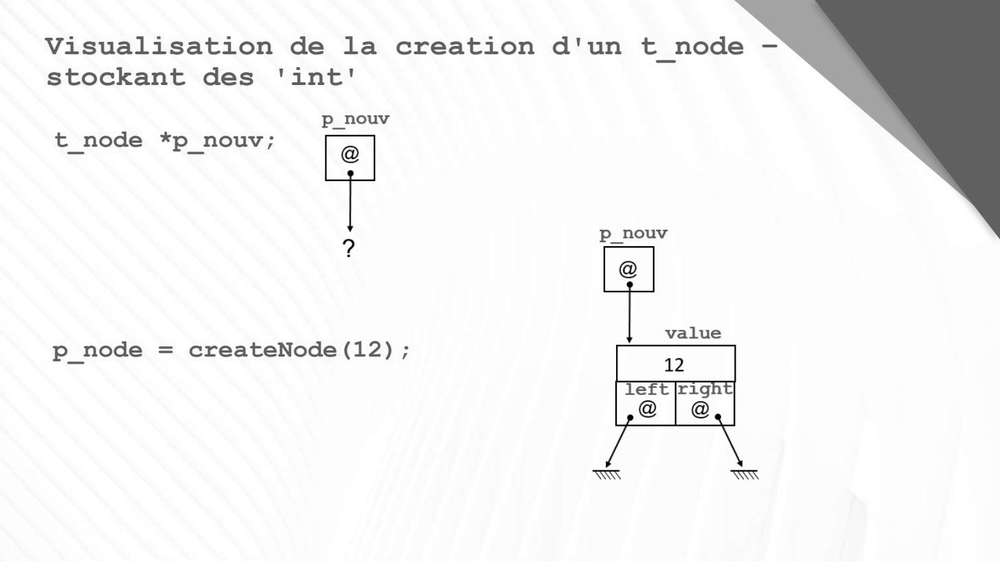{ loading=lazy .papier }](papier/ch4/p07.jpg)
    <p class="papier-legende">Visualisation de la création d'un t_node – stockant des 'int' · CM 4 — Arbres binaires (N. Flasque, 2023-2024), diapo 7</p>

    [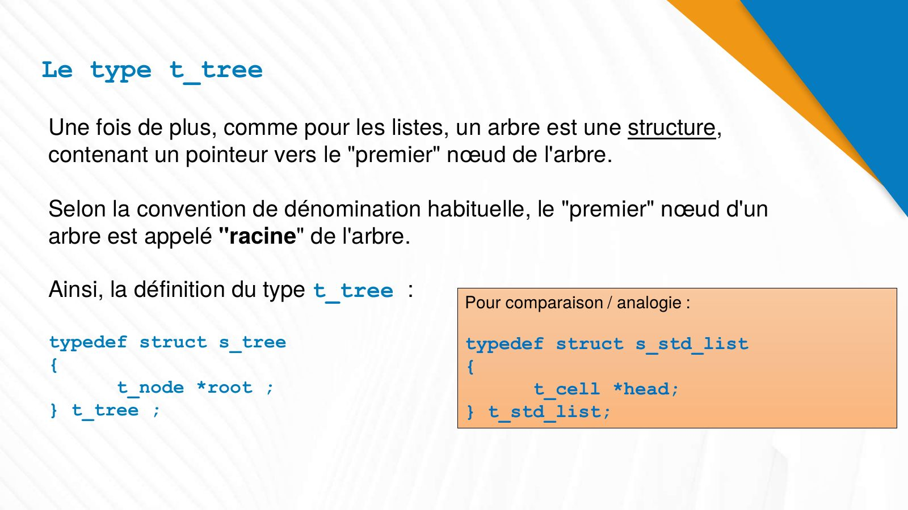{ loading=lazy .papier }](papier/ch4/p08.jpg)
    <p class="papier-legende">Le type t_tree · CM 4 — Arbres binaires (N. Flasque, 2023-2024), diapo 8</p>

    [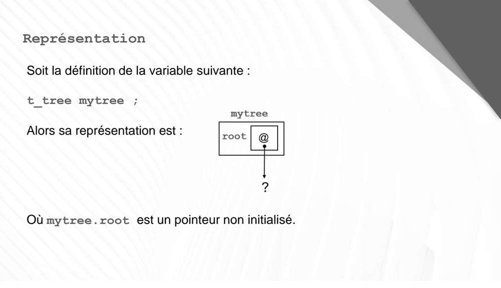{ loading=lazy .papier }](papier/ch4/p09.jpg)
    <p class="papier-legende">Représentation · CM 4 — Arbres binaires (N. Flasque, 2023-2024), diapo 9</p>

    [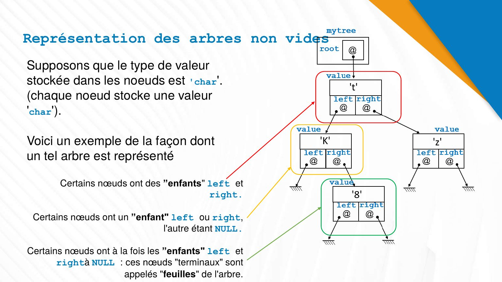{ loading=lazy .papier }](papier/ch4/p10.jpg)
    <p class="papier-legende">Représentation des arbres non vides · CM 4 — Arbres binaires (N. Flasque, 2023-2024), diapo 10</p>

    [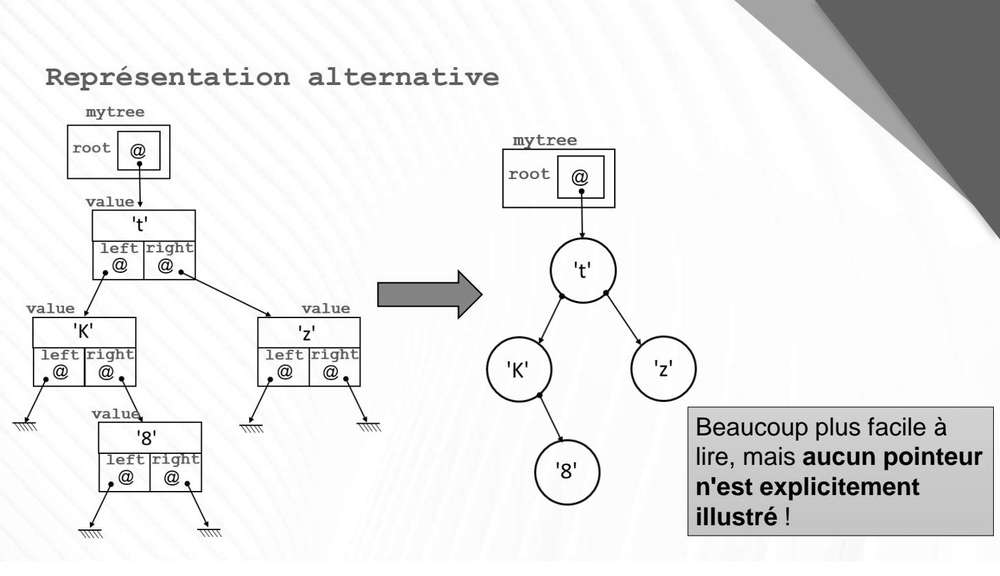{ loading=lazy .papier }](papier/ch4/p11.jpg)
    <p class="papier-legende">Représentation alternative · CM 4 — Arbres binaires (N. Flasque, 2023-2024), diapo 11</p>

    [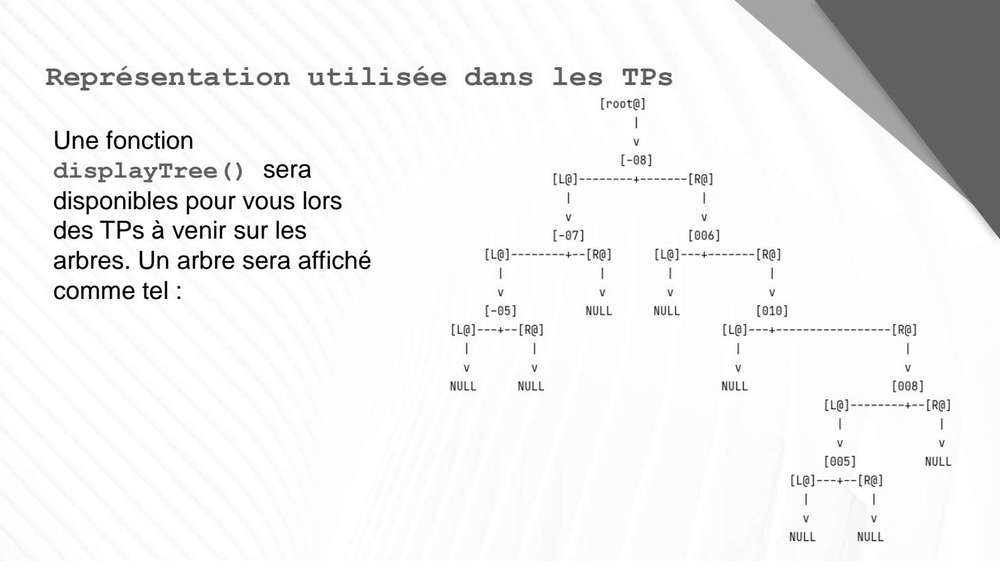{ loading=lazy .papier }](papier/ch4/p12.jpg)
    <p class="papier-legende">Représentation utilisée dans les TPs · CM 4 — Arbres binaires (N. Flasque, 2023-2024), diapo 12</p>

    [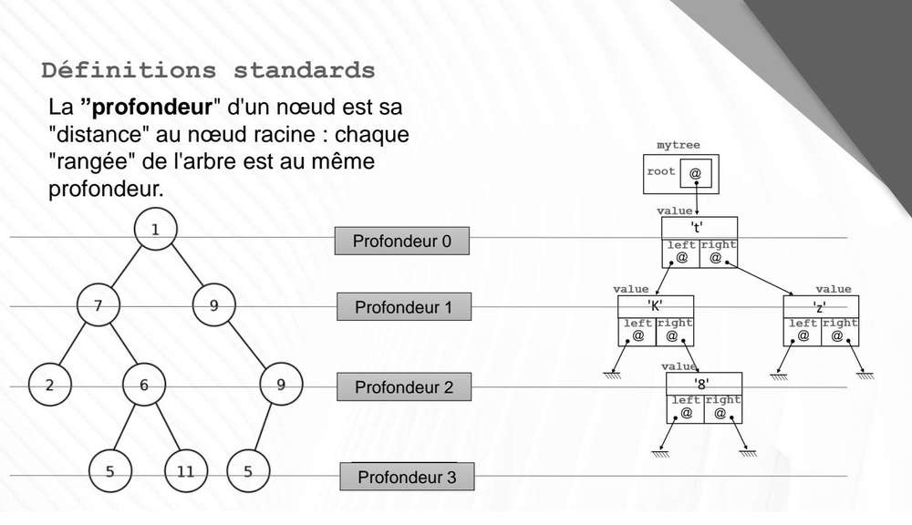{ loading=lazy .papier }](papier/ch4/p13.jpg)
    <p class="papier-legende">Définitions standards (profondeur) · CM 4 — Arbres binaires (N. Flasque, 2023-2024), diapo 13</p>

    [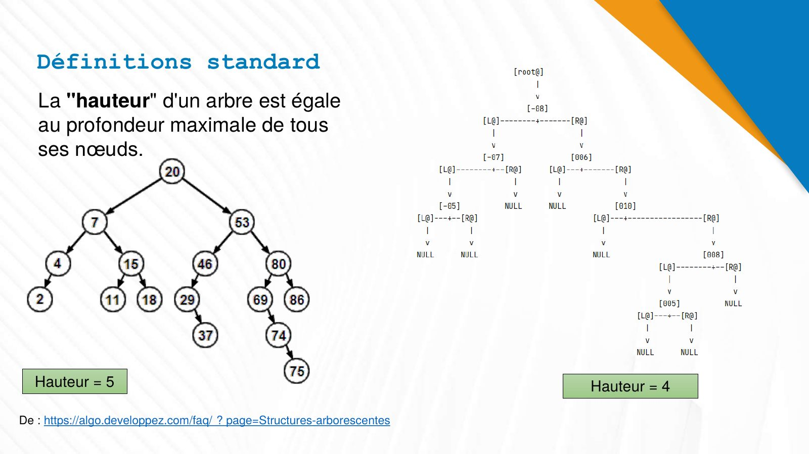{ loading=lazy .papier }](papier/ch4/p14.jpg)
    <p class="papier-legende">Définitions standard (hauteur) · CM 4 — Arbres binaires (N. Flasque, 2023-2024), diapo 14</p>

    [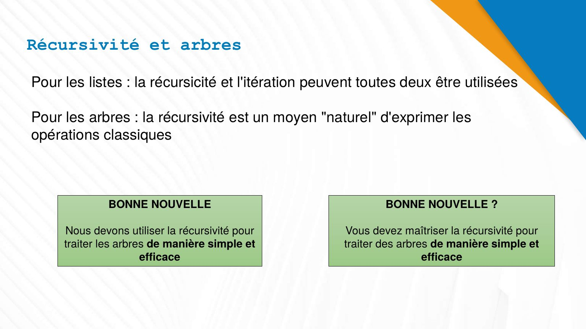{ loading=lazy .papier }](papier/ch4/p15.jpg)
    <p class="papier-legende">Récursivité et arbres · CM 4 — Arbres binaires (N. Flasque, 2023-2024), diapo 15</p>

    [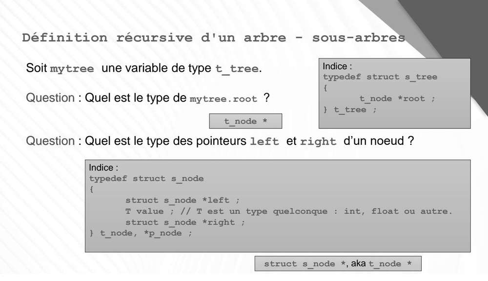{ loading=lazy .papier }](papier/ch4/p16.jpg)
    <p class="papier-legende">Définition récursive d'un arbre – sous-arbres · CM 4 — Arbres binaires (N. Flasque, 2023-2024), diapo 16</p>

    [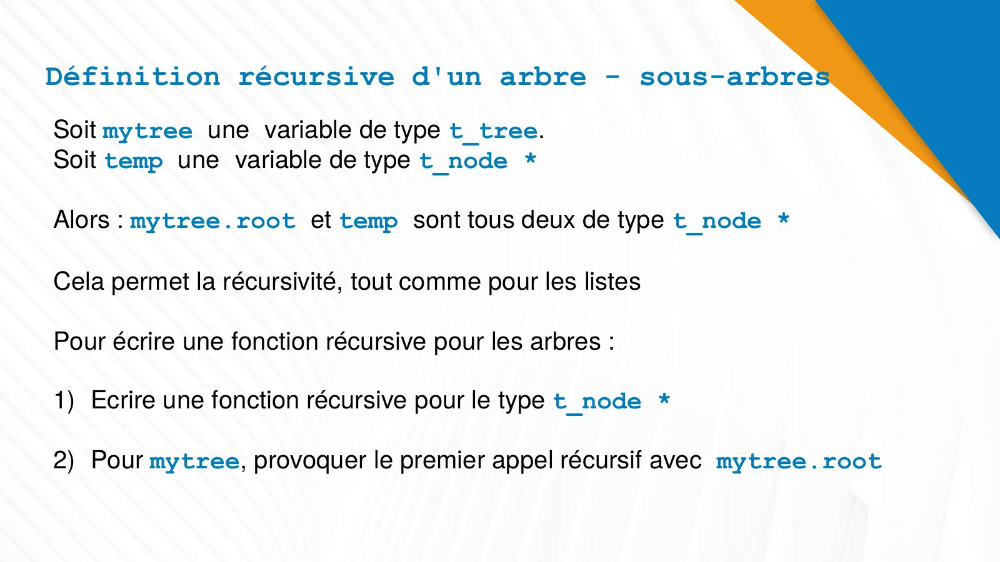{ loading=lazy .papier }](papier/ch4/p17.jpg)
    <p class="papier-legende">Définition récursive d'un arbre – sous-arbres (suite) · CM 4 — Arbres binaires (N. Flasque, 2023-2024), diapo 17</p>

    [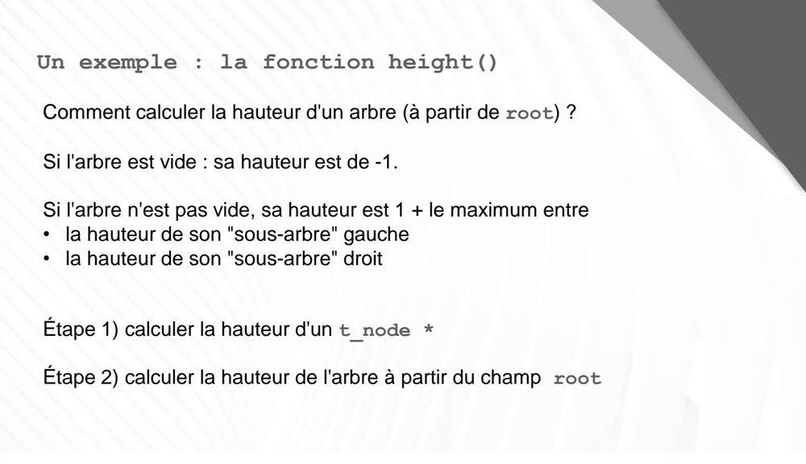{ loading=lazy .papier }](papier/ch4/p18.jpg)
    <p class="papier-legende">Un exemple : la fonction height() · CM 4 — Arbres binaires (N. Flasque, 2023-2024), diapo 18</p>

    [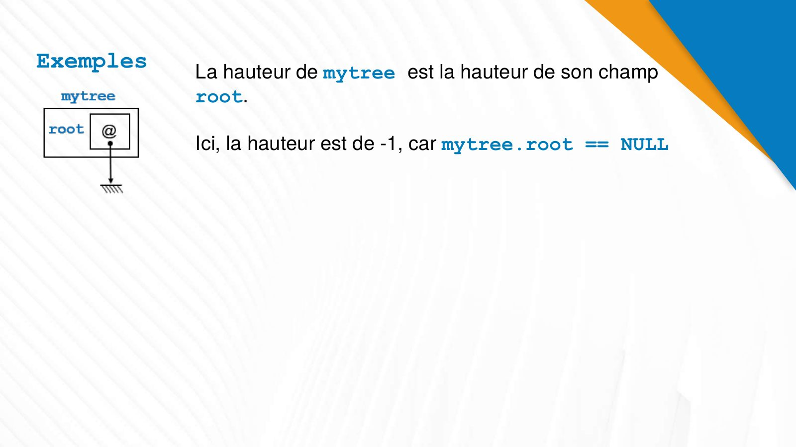{ loading=lazy .papier }](papier/ch4/p19.jpg)
    <p class="papier-legende">Exemples · CM 4 — Arbres binaires (N. Flasque, 2023-2024), diapo 19</p>

    [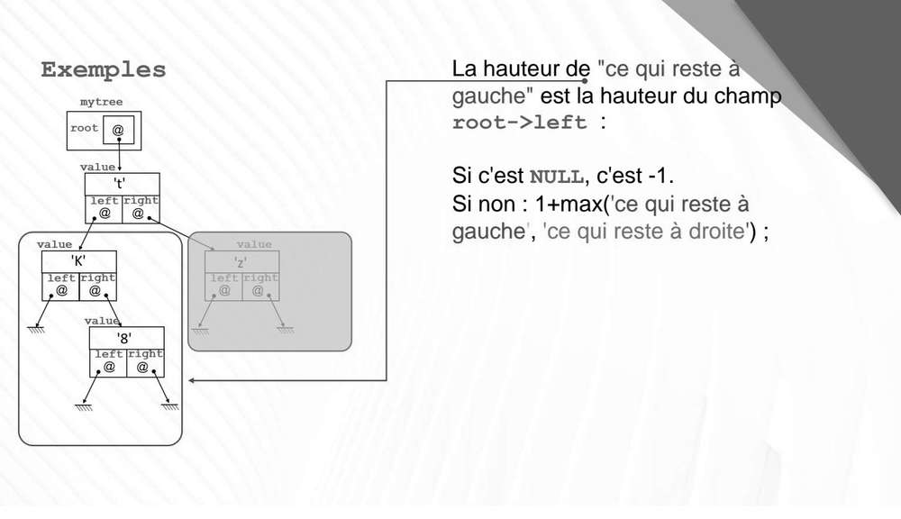{ loading=lazy .papier }](papier/ch4/p20.jpg)
    <p class="papier-legende">Exemples (suite) · CM 4 — Arbres binaires (N. Flasque, 2023-2024), diapo 20</p>

    [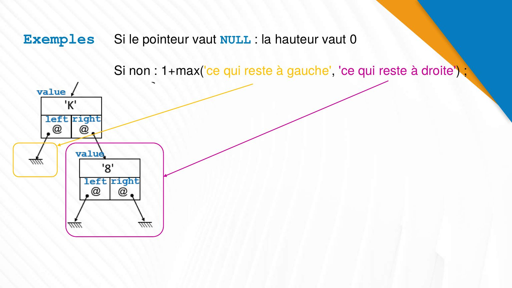{ loading=lazy .papier }](papier/ch4/p21.jpg)
    <p class="papier-legende">Exemples (fin) · CM 4 — Arbres binaires (N. Flasque, 2023-2024), diapo 21</p>

    [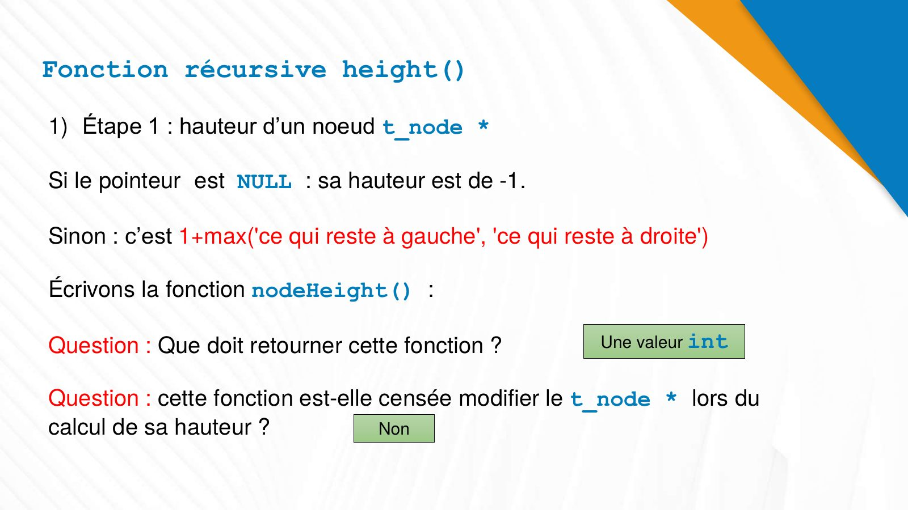{ loading=lazy .papier }](papier/ch4/p22.jpg)
    <p class="papier-legende">Fonction récursive height() · CM 4 — Arbres binaires (N. Flasque, 2023-2024), diapo 22</p>

    [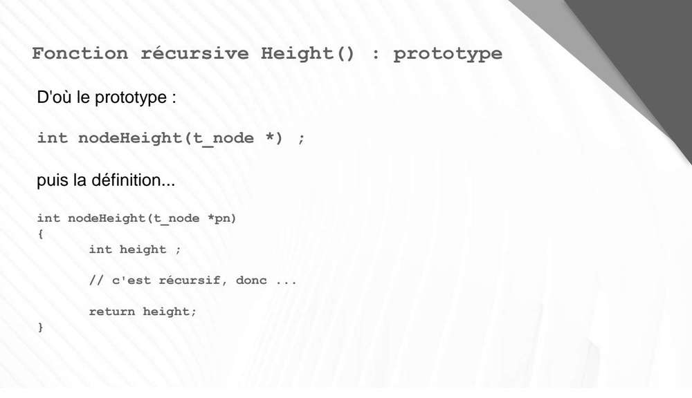{ loading=lazy .papier }](papier/ch4/p23.jpg)
    <p class="papier-legende">Fonction récursive Height() : prototype · CM 4 — Arbres binaires (N. Flasque, 2023-2024), diapo 23</p>

    [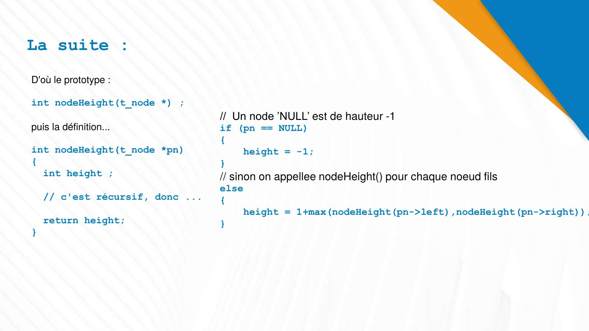{ loading=lazy .papier }](papier/ch4/p24.jpg)
    <p class="papier-legende">La suite · CM 4 — Arbres binaires (N. Flasque, 2023-2024), diapo 24</p>

    [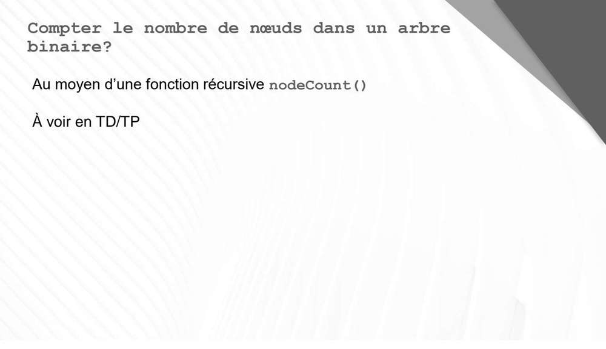{ loading=lazy .papier }](papier/ch4/p25.jpg)
    <p class="papier-legende">Compter le nombre de nœuds dans un arbre binaire ? · CM 4 — Arbres binaires (N. Flasque, 2023-2024), diapo 25</p>

    [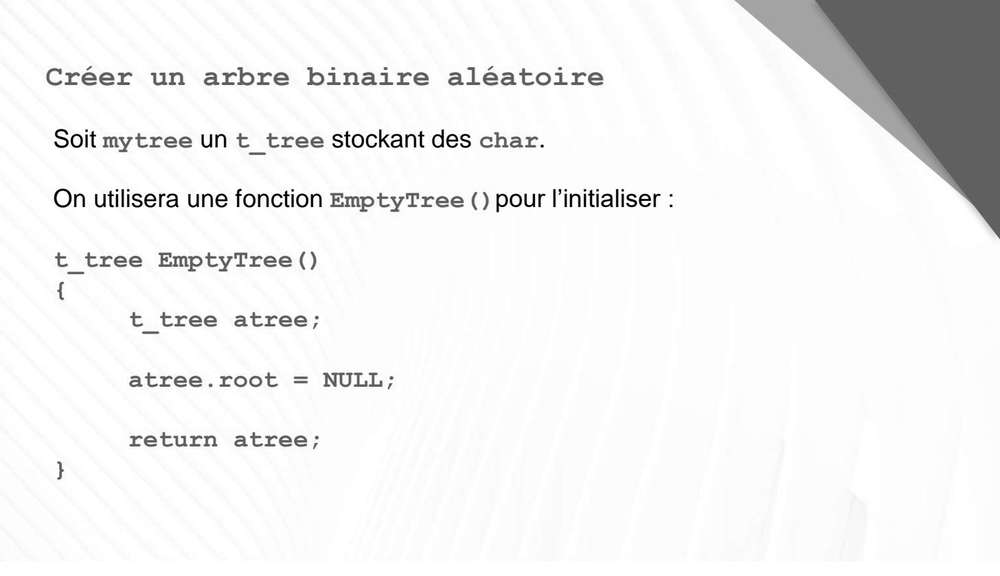{ loading=lazy .papier }](papier/ch4/p26.jpg)
    <p class="papier-legende">Créer un arbre binaire aléatoire · CM 4 — Arbres binaires (N. Flasque, 2023-2024), diapo 26</p>

    [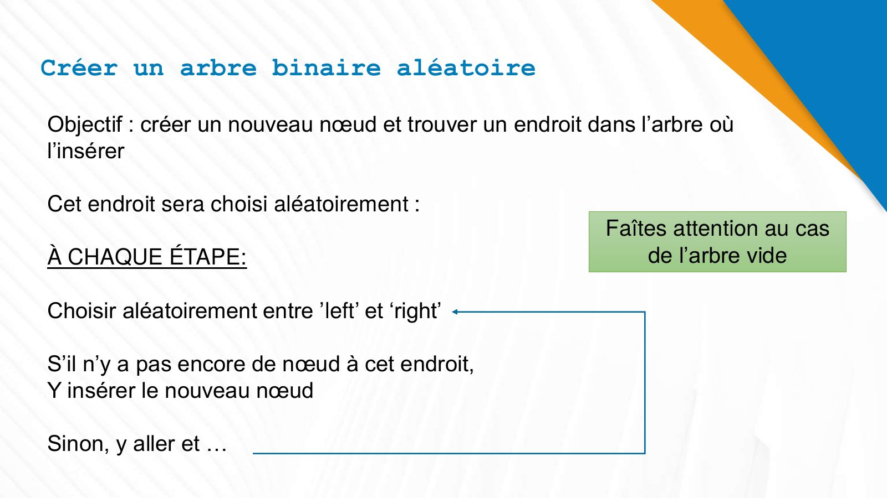{ loading=lazy .papier }](papier/ch4/p27.jpg)
    <p class="papier-legende">Créer un arbre binaire aléatoire (principe) · CM 4 — Arbres binaires (N. Flasque, 2023-2024), diapo 27</p>

    [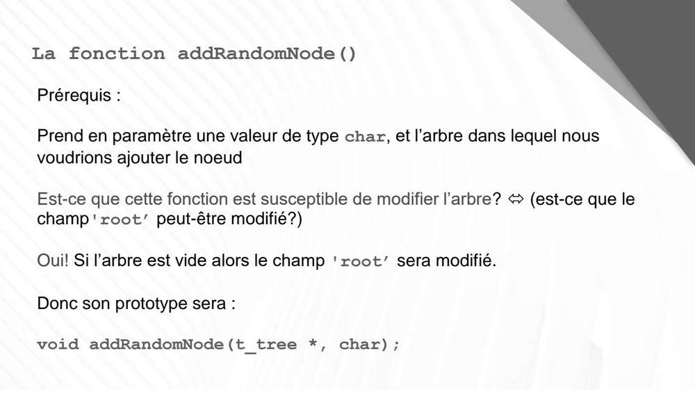{ loading=lazy .papier }](papier/ch4/p28.jpg)
    <p class="papier-legende">La fonction addRandomNode() · CM 4 — Arbres binaires (N. Flasque, 2023-2024), diapo 28</p>

    [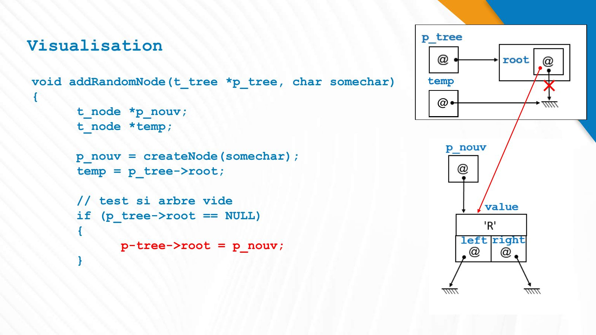{ loading=lazy .papier }](papier/ch4/p29.jpg)
    <p class="papier-legende">Visualisation · CM 4 — Arbres binaires (N. Flasque, 2023-2024), diapo 29</p>

    [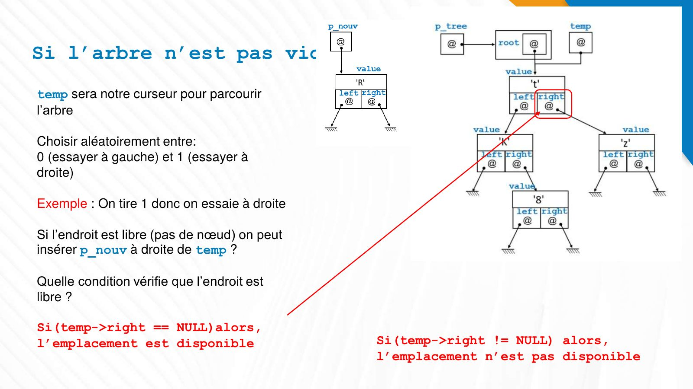{ loading=lazy .papier }](papier/ch4/p30.jpg)
    <p class="papier-legende">Si l'arbre n'est pas vide · CM 4 — Arbres binaires (N. Flasque, 2023-2024), diapo 30</p>

    [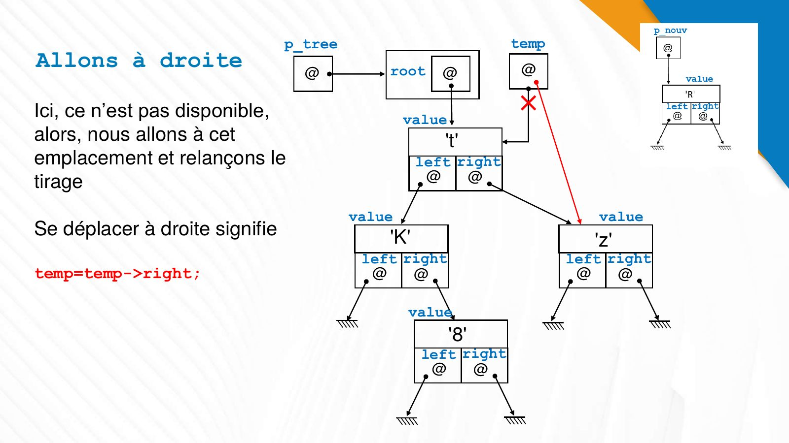{ loading=lazy .papier }](papier/ch4/p31.jpg)
    <p class="papier-legende">Allons à droite · CM 4 — Arbres binaires (N. Flasque, 2023-2024), diapo 31</p>

    [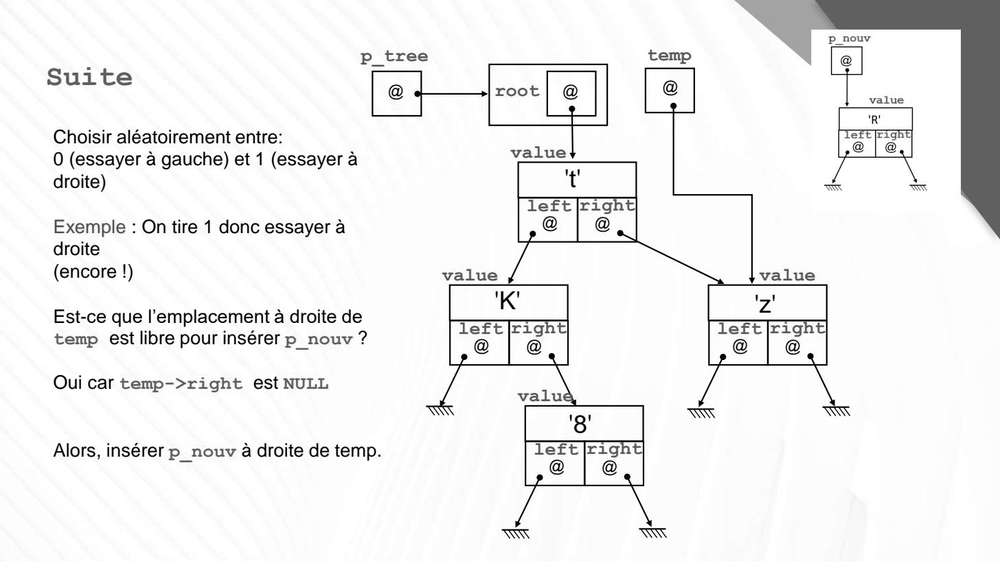{ loading=lazy .papier }](papier/ch4/p32.jpg)
    <p class="papier-legende">Suite · CM 4 — Arbres binaires (N. Flasque, 2023-2024), diapo 32</p>

    [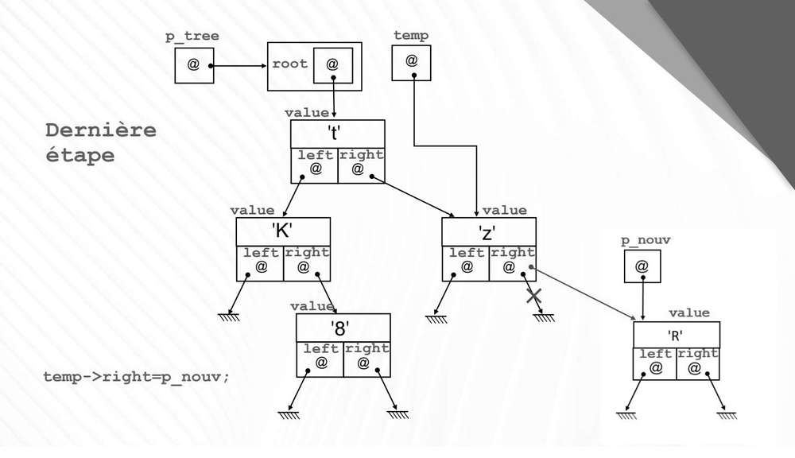{ loading=lazy .papier }](papier/ch4/p33.jpg)
    <p class="papier-legende">Dernière étape · CM 4 — Arbres binaires (N. Flasque, 2023-2024), diapo 33</p>

    [{ loading=lazy .papier }](papier/ch4/p34.jpg)
    <p class="papier-legende">addRandomNode() · CM 4 — Arbres binaires (N. Flasque, 2023-2024), diapo 34</p>

    [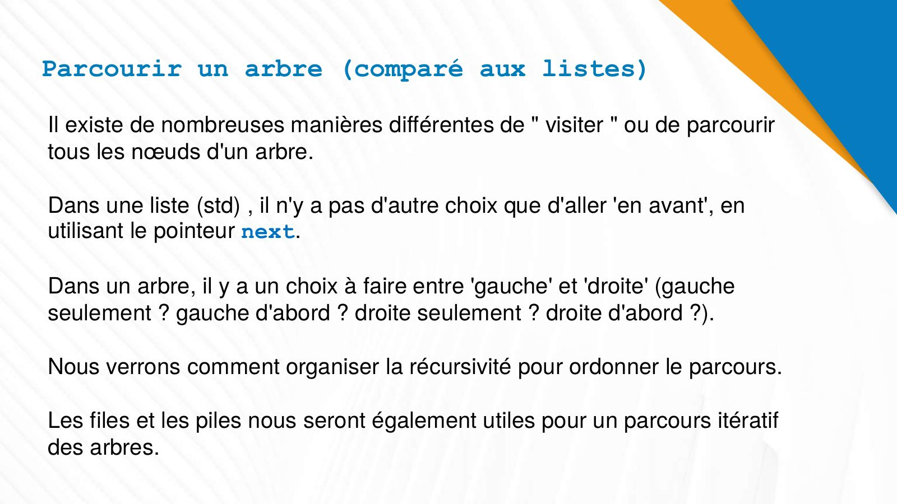{ loading=lazy .papier }](papier/ch4/p35.jpg)
    <p class="papier-legende">Parcourir un arbre (comparé aux listes) · CM 4 — Arbres binaires (N. Flasque, 2023-2024), diapo 35</p>

    [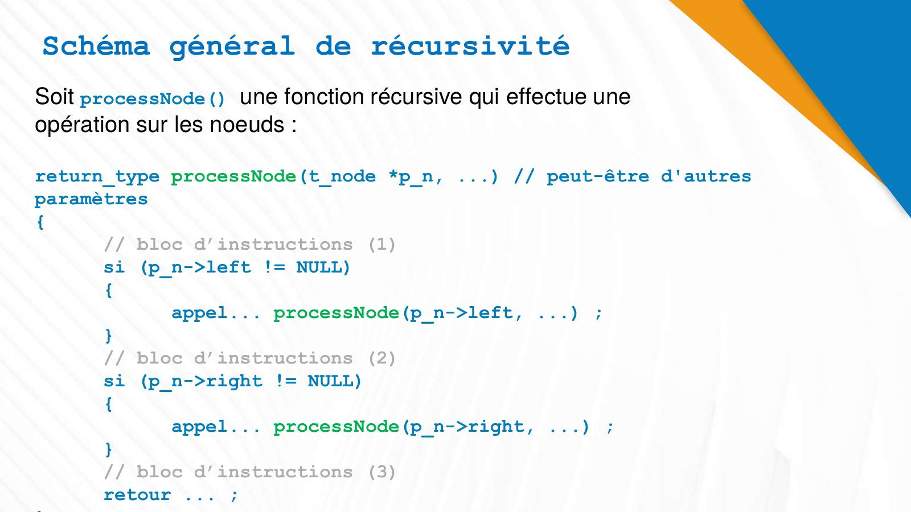{ loading=lazy .papier }](papier/ch4/p36.jpg)
    <p class="papier-legende">Schéma général de récursivité · CM 4 — Arbres binaires (N. Flasque, 2023-2024), diapo 36</p>

    [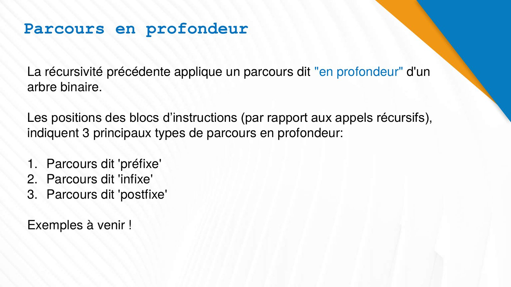{ loading=lazy .papier }](papier/ch4/p37.jpg)
    <p class="papier-legende">Parcours en profondeur · CM 4 — Arbres binaires (N. Flasque, 2023-2024), diapo 37</p>

    [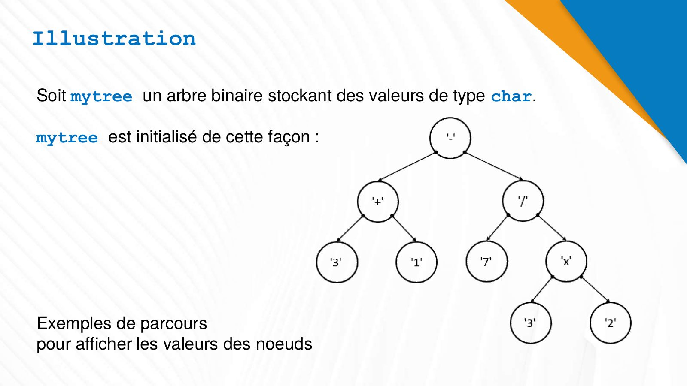{ loading=lazy .papier }](papier/ch4/p38.jpg)
    <p class="papier-legende">Illustration · CM 4 — Arbres binaires (N. Flasque, 2023-2024), diapo 38</p>

    [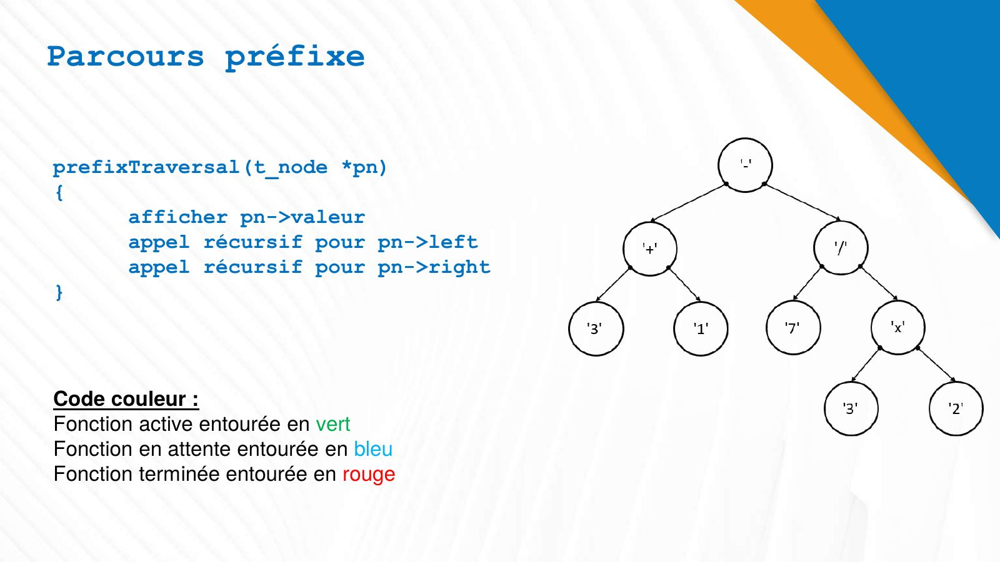{ loading=lazy .papier }](papier/ch4/p39.jpg)
    <p class="papier-legende">Parcours préfixe · CM 4 — Arbres binaires (N. Flasque, 2023-2024), diapo 39</p>

    [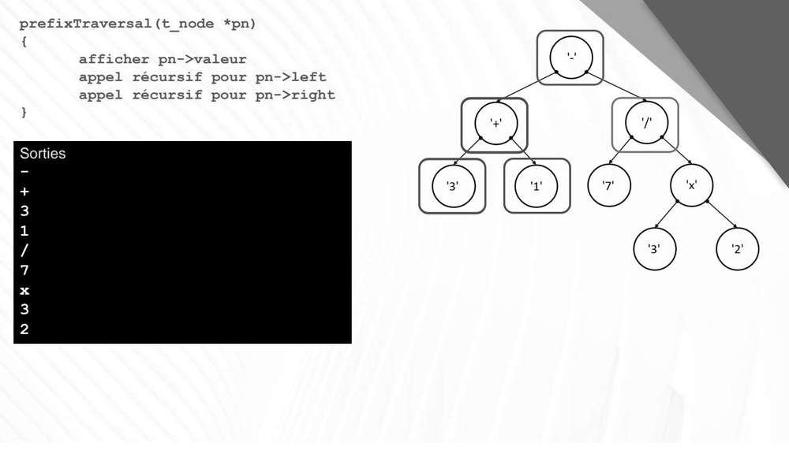{ loading=lazy .papier }](papier/ch4/p40.jpg)
    <p class="papier-legende">Parcours préfixe (sorties) · CM 4 — Arbres binaires (N. Flasque, 2023-2024), diapo 40</p>

    [{ loading=lazy .papier }](papier/ch4/p41.jpg)
    <p class="papier-legende">Parcours préfixe (notation polonaise) · CM 4 — Arbres binaires (N. Flasque, 2023-2024), diapo 41</p>

    [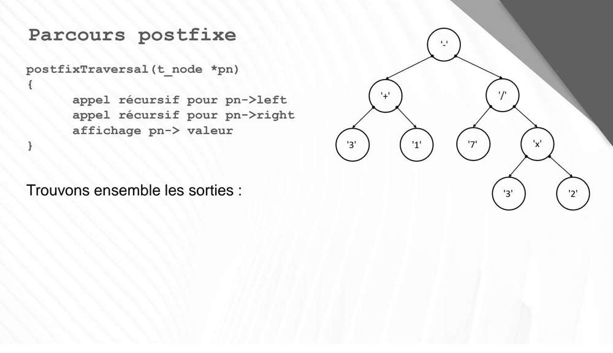{ loading=lazy .papier }](papier/ch4/p42.jpg)
    <p class="papier-legende">Parcours postfixe · CM 4 — Arbres binaires (N. Flasque, 2023-2024), diapo 42</p>

    [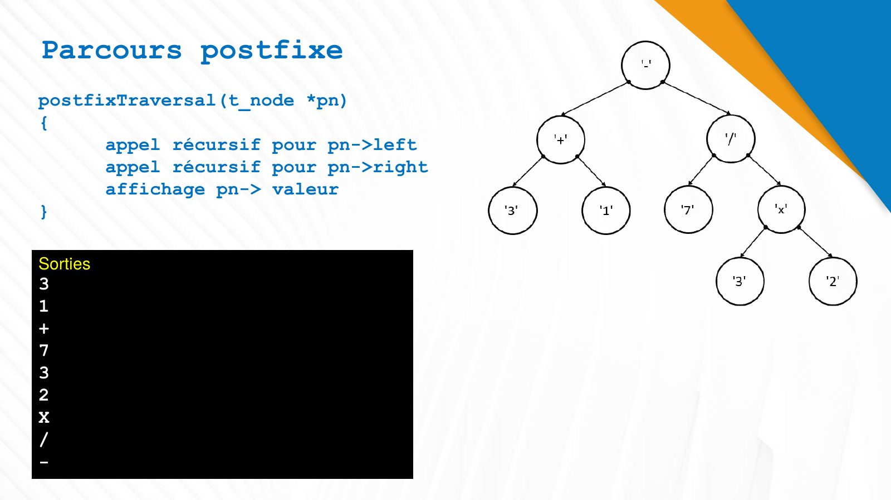{ loading=lazy .papier }](papier/ch4/p43.jpg)
    <p class="papier-legende">Parcours postfixe (sorties) · CM 4 — Arbres binaires (N. Flasque, 2023-2024), diapo 43</p>

    [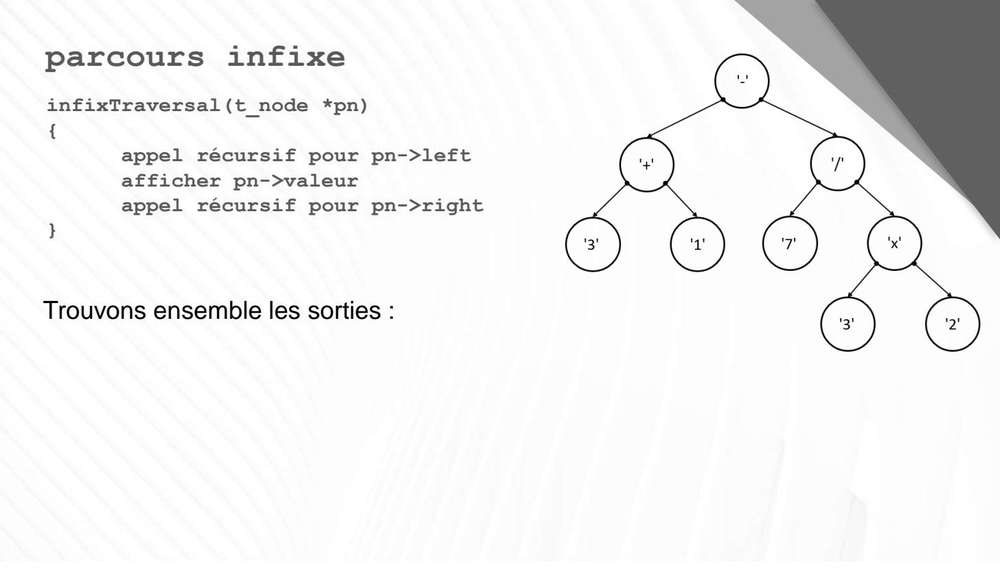{ loading=lazy .papier }](papier/ch4/p44.jpg)
    <p class="papier-legende">Parcours infixe · CM 4 — Arbres binaires (N. Flasque, 2023-2024), diapo 44</p>

    [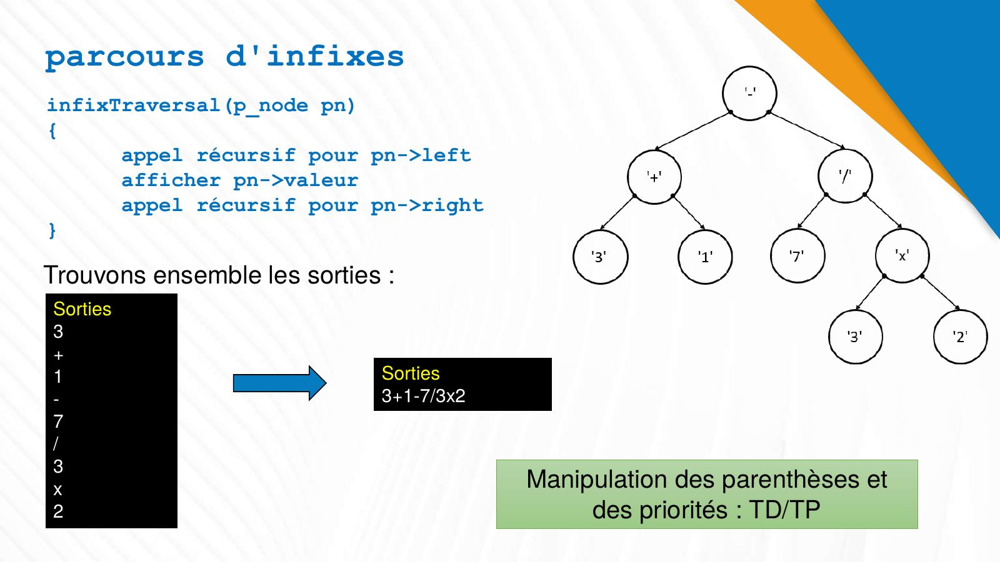{ loading=lazy .papier }](papier/ch4/p45.jpg)
    <p class="papier-legende">Parcours d'infixes (sorties) · CM 4 — Arbres binaires (N. Flasque, 2023-2024), diapo 45</p>

    [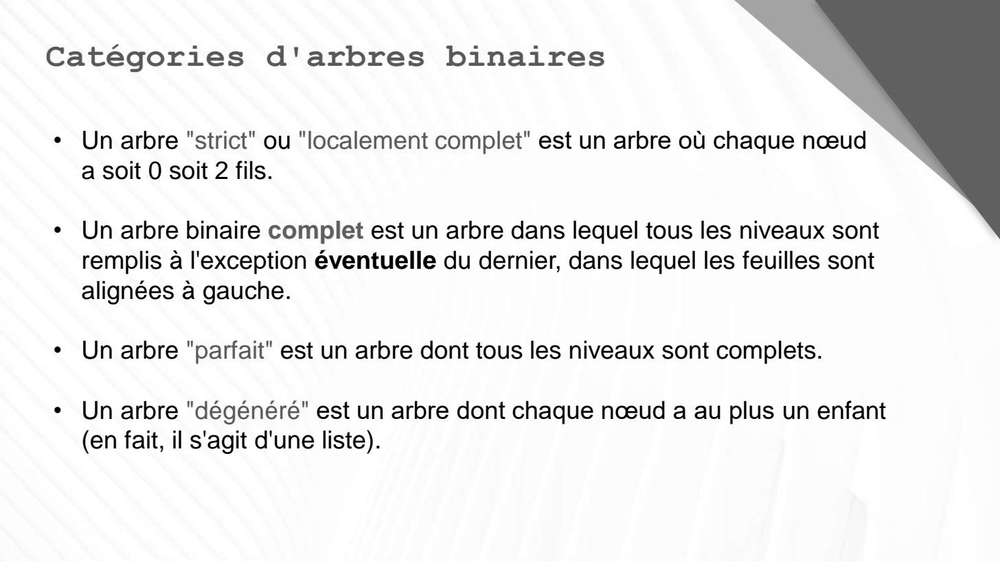{ loading=lazy .papier }](papier/ch4/p46.jpg)
    <p class="papier-legende">Catégories d'arbres binaires · CM 4 — Arbres binaires (N. Flasque, 2023-2024), diapo 46</p>

    [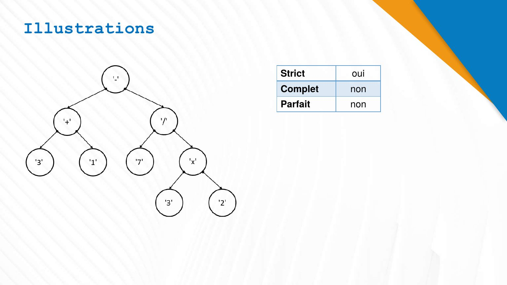{ loading=lazy .papier }](papier/ch4/p47.jpg)
    <p class="papier-legende">Illustrations · CM 4 — Arbres binaires (N. Flasque, 2023-2024), diapo 47</p>

    [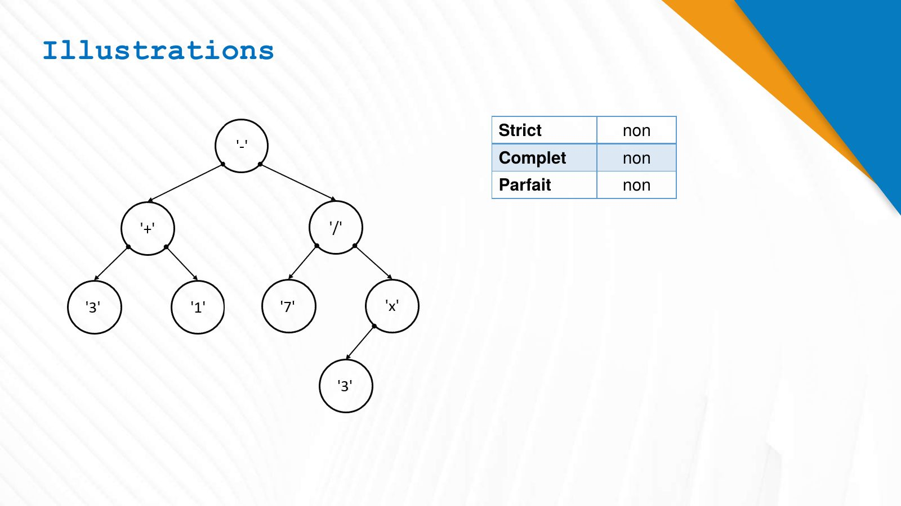{ loading=lazy .papier }](papier/ch4/p48.jpg)
    <p class="papier-legende">Illustrations (2) · CM 4 — Arbres binaires (N. Flasque, 2023-2024), diapo 48</p>

    [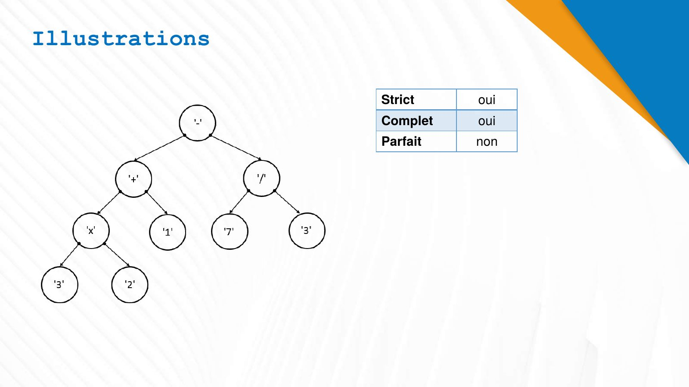{ loading=lazy .papier }](papier/ch4/p49.jpg)
    <p class="papier-legende">Illustrations (3) · CM 4 — Arbres binaires (N. Flasque, 2023-2024), diapo 49</p>

    [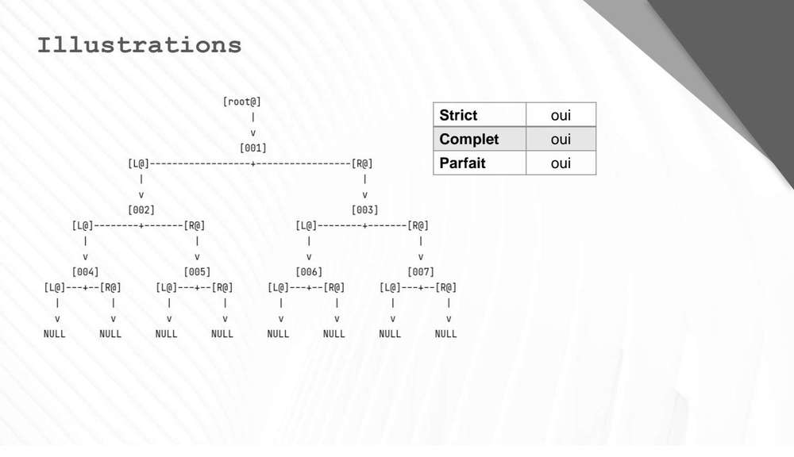{ loading=lazy .papier }](papier/ch4/p50.jpg)
    <p class="papier-legende">Illustrations (4) · CM 4 — Arbres binaires (N. Flasque, 2023-2024), diapo 50</p>

    [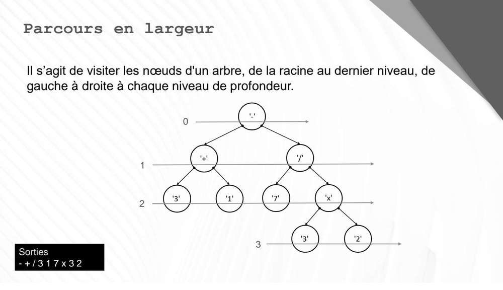{ loading=lazy .papier }](papier/ch4/p51.jpg)
    <p class="papier-legende">Parcours en largeur · CM 4 — Arbres binaires (N. Flasque, 2023-2024), diapo 51</p>

    [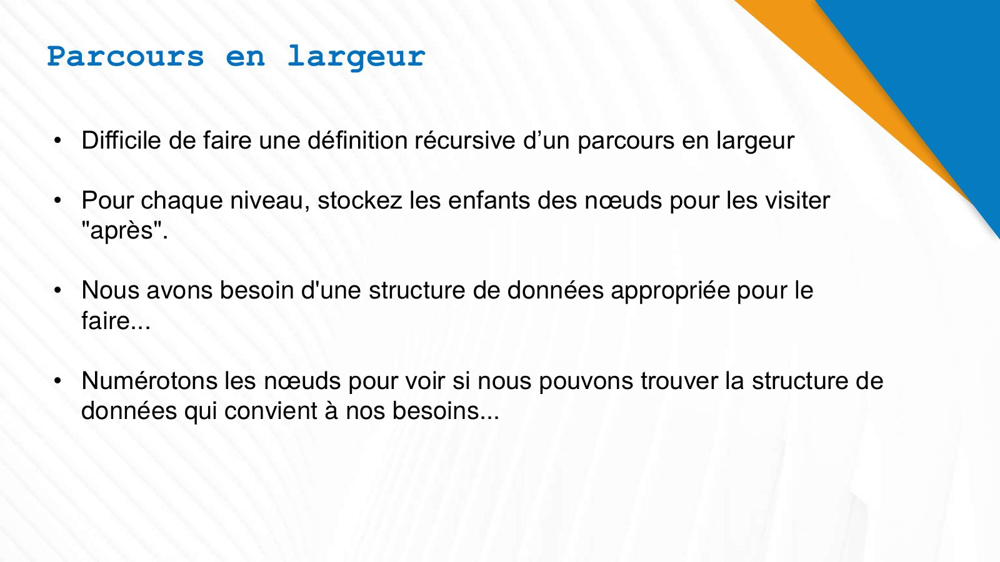{ loading=lazy .papier }](papier/ch4/p52.jpg)
    <p class="papier-legende">Parcours en largeur (principe) · CM 4 — Arbres binaires (N. Flasque, 2023-2024), diapo 52</p>

    [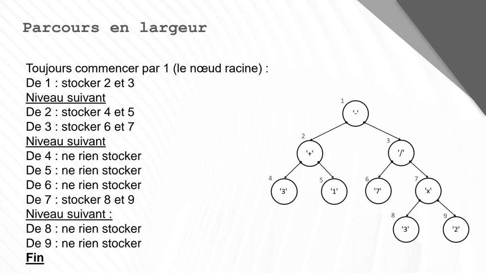{ loading=lazy .papier }](papier/ch4/p53.jpg)
    <p class="papier-legende">Parcours en largeur (numérotation) · CM 4 — Arbres binaires (N. Flasque, 2023-2024), diapo 53</p>

    [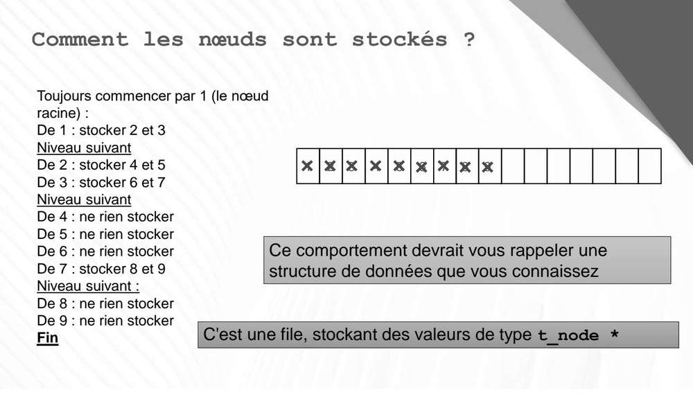{ loading=lazy .papier }](papier/ch4/p54.jpg)
    <p class="papier-legende">Comment les nœuds sont stockés ? · CM 4 — Arbres binaires (N. Flasque, 2023-2024), diapo 54</p>

    [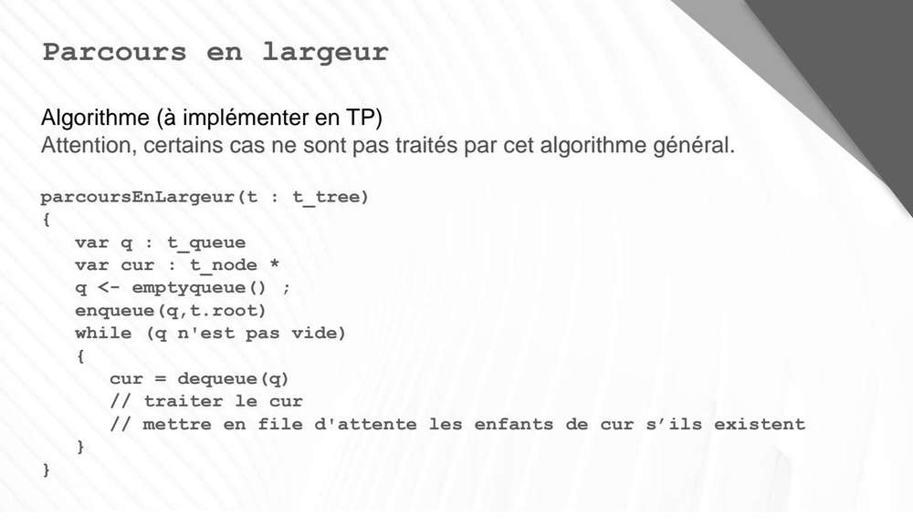{ loading=lazy .papier }](papier/ch4/p55.jpg)
    <p class="papier-legende">Parcours en largeur (algorithme) · CM 4 — Arbres binaires (N. Flasque, 2023-2024), diapo 55</p>

    [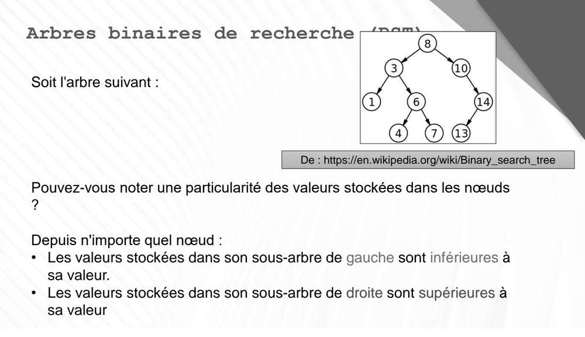{ loading=lazy .papier }](papier/ch4/p56.jpg)
    <p class="papier-legende">Arbres binaires de recherche (BST) · CM 4 — Arbres binaires (N. Flasque, 2023-2024), diapo 56</p>

    [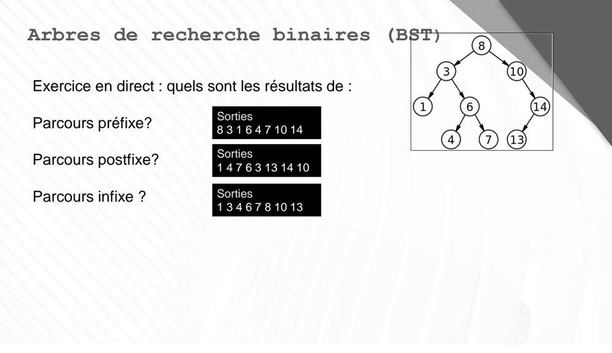{ loading=lazy .papier }](papier/ch4/p57.jpg)
    <p class="papier-legende">Arbres de recherche binaires (BST) : exercice · CM 4 — Arbres binaires (N. Flasque, 2023-2024), diapo 57</p>

    [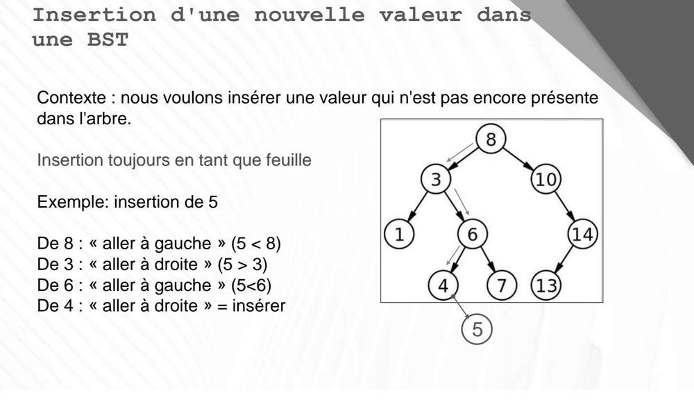{ loading=lazy .papier }](papier/ch4/p58.jpg)
    <p class="papier-legende">Insertion d'une nouvelle valeur dans une BST · CM 4 — Arbres binaires (N. Flasque, 2023-2024), diapo 58</p>

    [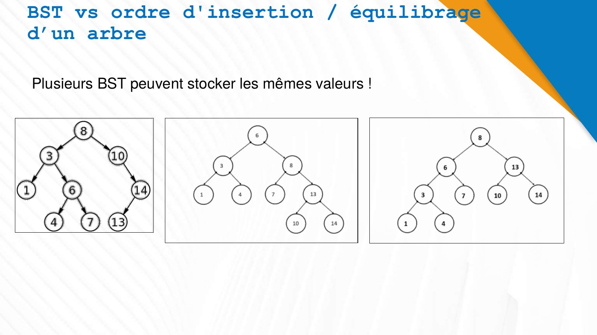{ loading=lazy .papier }](papier/ch4/p59.jpg)
    <p class="papier-legende">BST vs ordre d'insertion / équilibrage d'un arbre · CM 4 — Arbres binaires (N. Flasque, 2023-2024), diapo 59</p>

    [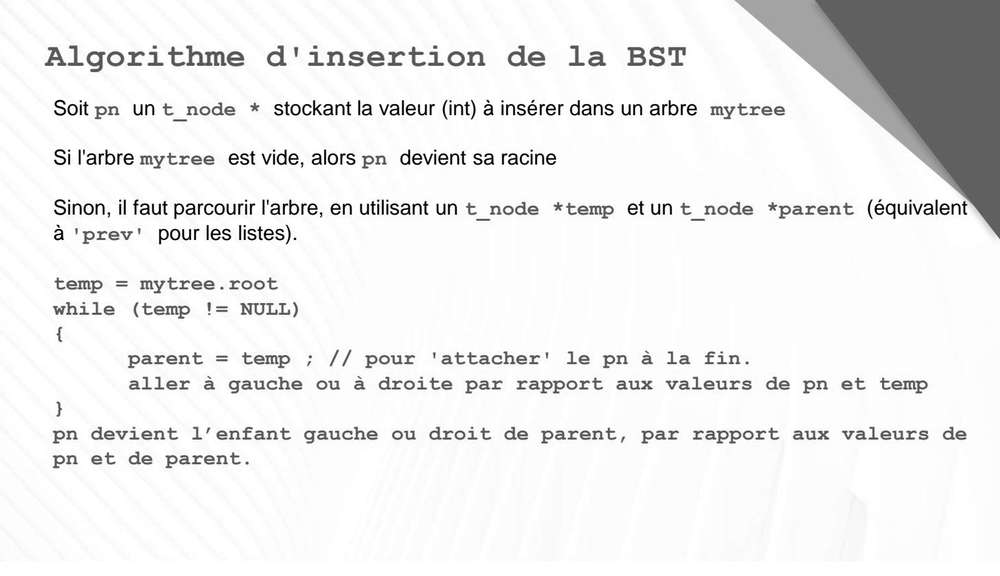{ loading=lazy .papier }](papier/ch4/p60.jpg)
    <p class="papier-legende">Algorithme d'insertion de la BST · CM 4 — Arbres binaires (N. Flasque, 2023-2024), diapo 60</p>

    [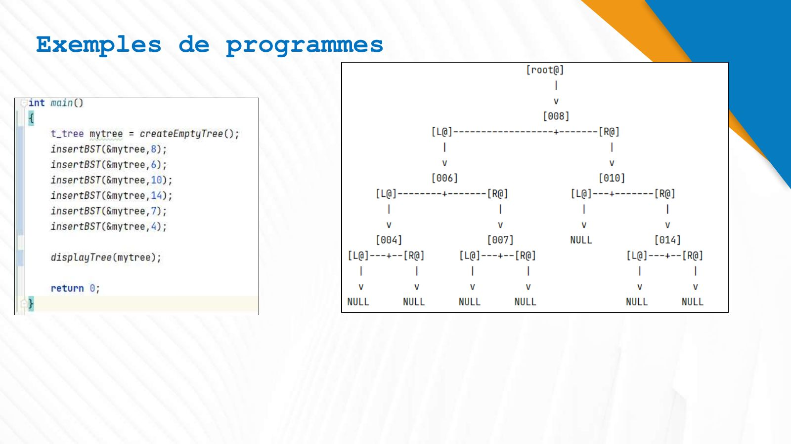{ loading=lazy .papier }](papier/ch4/p61.jpg)
    <p class="papier-legende">Exemples de programmes · CM 4 — Arbres binaires (N. Flasque, 2023-2024), diapo 61</p>

    [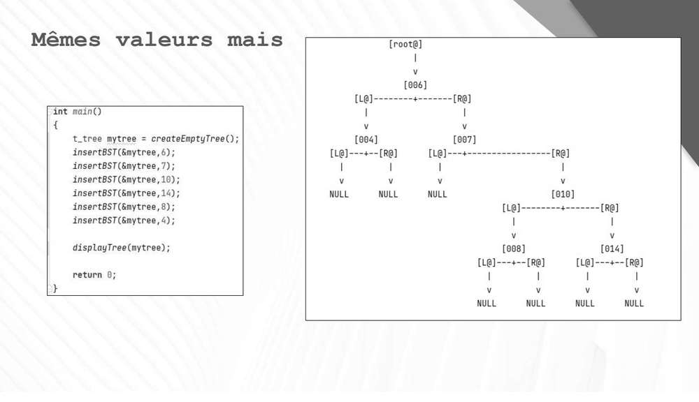{ loading=lazy .papier }](papier/ch4/p62.jpg)
    <p class="papier-legende">Mêmes valeurs mais… · CM 4 — Arbres binaires (N. Flasque, 2023-2024), diapo 62</p>

    [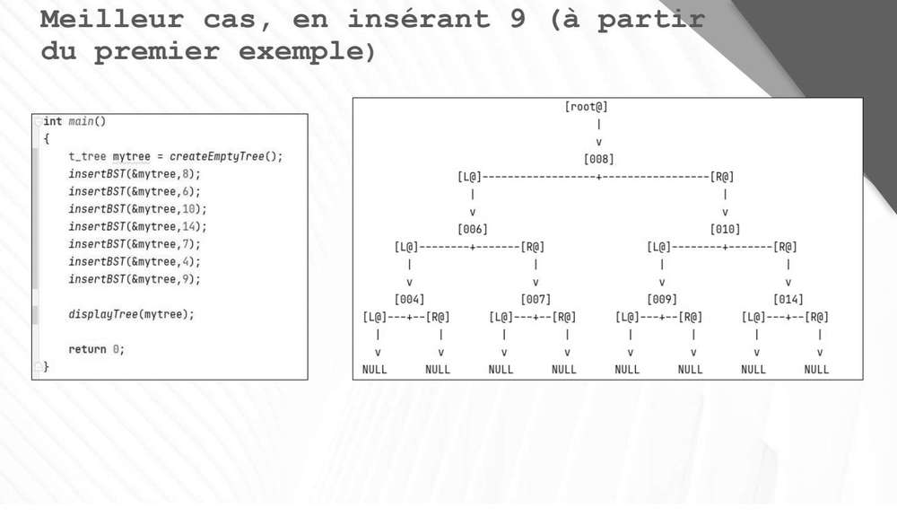{ loading=lazy .papier }](papier/ch4/p63.jpg)
    <p class="papier-legende">Meilleur cas, en insérant 9 (à partir du premier exemple) · CM 4 — Arbres binaires (N. Flasque, 2023-2024), diapo 63</p>

    [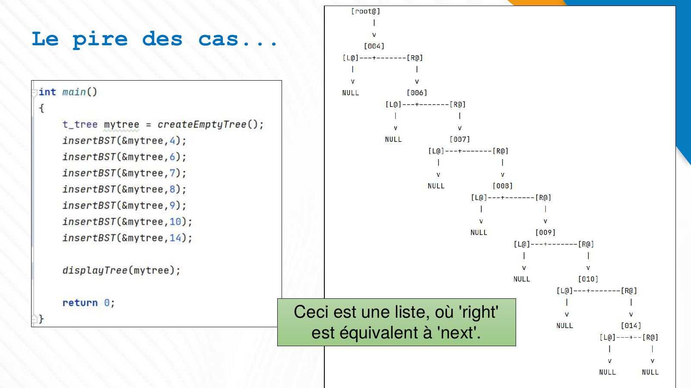{ loading=lazy .papier }](papier/ch4/p64.jpg)
    <p class="papier-legende">Le pire des cas… · CM 4 — Arbres binaires (N. Flasque, 2023-2024), diapo 64</p>
