# Chapitre 5 — Complexité des ABR et arbres AVL

=== "Version simplifiée"

    ## Pourquoi équilibrer ?

    Un ABR permet une recherche **dichotomique** : à chaque nœud, on élimine un
    sous-arbre entier. Insérer ou chercher revient à descendre d'un niveau par
    itération : le coût est la **hauteur** de l'arbre.

    | Forme de l'arbre à $n$ nœuds | Nombre de niveaux | Recherche |
    |------------------------------|-------------------|:---------:|
    | **Dégénéré** (une liste) | $n$ | $O(n)$ |
    | **Parfait** | $\log_2(n+1)$ | $O(\log_2 n)$ |
    | **Complet** | $\lceil \log_2(n+1) \rceil$ | $O(\log_2 n)$ |

    $\log_2 n = k$ signifie $2^k = n$ : $\log_2(65\,536) = 16$ et
    $\log_2(2^{64}) = 64$. Chercher parmi 65 536 valeurs prend au plus 16 étapes
    dans un arbre équilibré, contre 65 536 dans une liste.

    !!! theoreme "Encadrement de la hauteur $h$ d'un arbre binaire à $N$ nœuds"
        $$
        \lfloor \log_2 N \rfloor \;\le\; h \;\le\; N - 1
        $$
        Minimum pour un arbre complet (chaque niveau $k$ contient au plus $2^k$
        nœuds), maximum pour un arbre dégénéré.

    ## Les arbres AVL

    !!! definition "Arbre AVL (Adelson-Velsky et Landis, 1962)"
        Un **AVL** est un ABR dans lequel, **pour chaque nœud**, les hauteurs du
        sous-arbre gauche et du sous-arbre droit diffèrent d'**au plus 1**.

    !!! definition "Facteur d'équilibre (*balance factor*, BF)"
        $$
        BF(pn) = \text{hauteur}(pn\text{->left}) - \text{hauteur}(pn\text{->right})
        $$

        - $BF > 0$ : le côté **gauche** est plus profond ;
        - $BF < 0$ : le côté **droit** est plus profond ;
        - l'arbre est équilibré (AVL) si **tous** ses nœuds ont $BF \in \{-1, 0, +1\}$.

    !!! piege "Calculer le BF de tous les nœuds"
        Le BF se calcule pour **chaque** nœud, pas seulement pour la racine. Rappel
        des hauteurs : sous-arbre vide $= -1$, feuille $= 0$. Une feuille a donc
        $BF = (-1) - (-1) = 0$.

    ```text
     Exemple :          30  (+2)          hauteurs : 8 → 0, 5 → 1, 10 → 2,
                       /   \                         20 → 3, 50 → 1
                 (+2) 20     50 (0)
                     /  \   /  \          BF(5)  = -1 - 0 = -1
               (+2) 10  25 40  60         BF(10) =  1 -(-1) = +2
                   /                      BF(20) =  2 - 0 = +2
             (-1) 5                       BF(30) =  3 - 1 = +2
                   \
                    8 (0)
    ```

    ## Les rotations

    Une rotation réorganise trois « paquets » de sous-arbres **en conservant la
    propriété d'ABR**. C'est le seul outil d'équilibrage.

    ### Rotation droite sur Q

    ```text
              Q                       P
            /   \                   /   \
           P     C     ───▶        A     Q
          / \                           / \
         A   B                         B   C

     A < P < B < Q < C : A et C ne bougent pas, B change de parent
    ```

    Le **pivot** est le fils gauche `P`. Le sous-arbre `B` (entre P et Q) devient le
    fils **gauche** de Q.

    ```c
    t_node *rightRotation(t_node *root)    /* root pointe sur Q, root->left != NULL */
    {
        t_node *pivot = root->left;        /* P */
        root->left = pivot->right;         /* B passe sous Q, à gauche */
        pivot->right = root;               /* Q passe sous P, à droite */
        return pivot;                      /* P est la nouvelle racine du sous-arbre */
    }
    ```

    ### Rotation gauche sur P (symétrique)

    ```text
           P                            Q
          / \                         /   \
         A   Q        ───▶           P     C
            / \                     / \
           B   C                   A   B
    ```

    ```c
    t_node *leftRotation(t_node *root)     /* root pointe sur P, root->right != NULL */
    {
        t_node *pivot = root->right;       /* Q */
        root->right = pivot->left;         /* B passe sous P, à droite */
        pivot->left = root;                /* P passe sous Q, à gauche */
        return pivot;
    }
    ```

    !!! piege "Raccrocher le résultat"
        Dans le CM, la rotation finit par `root = pivot;` sur une copie locale :
        l'appelant ne voit pas le changement. Il faut **retourner** la nouvelle
        racine et la raccrocher au parent :
        `pn->left = rightRotation(pn->left);` ou
        `p_tree->root = rightRotation(p_tree->root);`.

    ## Quelle rotation appliquer ?

    On regarde le nœud déséquilibré `pn` ($BF = \pm 2$) **et** son enfant du côté
    lourd.

    | BF de `pn` | BF de l'enfant | Configuration | Opération(s) |
    |:----------:|:--------------:|---------------|--------------|
    | $-2$ | `pn->right` : $-1$ | droite-droite (en ligne) | **rotation gauche** sur `pn` |
    | $-2$ | `pn->right` : $+1$ | droite-gauche (en zigzag) | rotation **droite** sur `pn->right`, puis rotation **gauche** sur `pn` |
    | $+2$ | `pn->left` : $+1$ | gauche-gauche (en ligne) | **rotation droite** sur `pn` |
    | $+2$ | `pn->left` : $-1$ | gauche-droite (en zigzag) | rotation **gauche** sur `pn->left`, puis rotation **droite** sur `pn` |

    !!! methode "Moyen mnémotechnique"
        - **Mêmes signes** (en ligne) → **une** rotation, du côté **opposé** au
          déséquilibre (trop à droite → rotation gauche).
        - **Signes opposés** (zigzag) → **double** rotation : d'abord sur l'enfant
          pour se ramener au cas « en ligne », puis sur `pn`.

    ### Exemple de double rotation (cas $-2$ / $+1$)

    ```text
         P (-2)                  P                         R
        / \                     / \                      /   \
       A   Q (+1)    rot. D   A   R        rot. G       P     Q
          / \        sur Q ─▶    / \       sur P ─▶    / \   / \
         R   D                  B   Q                 A   B C   D
        / \                        / \
       B   C                      C   D
    ```

    Après la rotation droite sur Q, on retombe sur le cas « en ligne » ; la
    rotation gauche sur P termine.

    ## Insérer dans un AVL

    !!! methode "Insertion AVL = insertion ABR + équilibrage"
        1. Insérer le nouveau nœud comme une feuille (insertion ABR classique).
        2. Remonter vers la racine en recalculant les facteurs d'équilibre, jusqu'à
           trouver (ou non) un nœud à $\pm 2$.
        3. Appliquer la ou les rotations du tableau.

        Si l'arbre était un AVL avant l'insertion, **une seule** correction suffit
        (le premier nœud déséquilibré rencontré en remontant). Si on équilibre un ABR
        quelconque, on continue jusqu'à la racine.

    La version récursive fait la remontée toute seule, au retour des appels :

    ```c
    t_node *balance(t_node *pn)
    {
        int bf = nodeHeight(pn->left) - nodeHeight(pn->right);
        if (bf == -2)
        {
            if (nodeHeight(pn->right->left) > nodeHeight(pn->right->right))  /* enfant à +1 */
                pn->right = rightRotation(pn->right);
            pn = leftRotation(pn);
        }
        else if (bf == 2)
        {
            if (nodeHeight(pn->left->right) > nodeHeight(pn->left->left))    /* enfant à -1 */
                pn->left = leftRotation(pn->left);
            pn = rightRotation(pn);
        }
        return pn;
    }

    t_node *insertAVL(t_node *pn, int val)
    {
        if (pn == NULL) return createNode(val);
        if (val < pn->value) pn->left  = insertAVL(pn->left, val);
        else                 pn->right = insertAVL(pn->right, val);
        return balance(pn);            /* équilibrage en remontant */
    }
    /* appel : mytree.root = insertAVL(mytree.root, 42); */
    ```

    Cette version recalcule les hauteurs à chaque fois (simple mais coûteux) ; une
    implémentation efficace stocke la hauteur dans chaque nœud.

    ### Exemple du cours : rééquilibrer un ABR

    ```text
     Départ :              75                Arrivée :            75
                         /    \                                 /    \
                       59      83                             59      87
                      /  \       \                           /  \    /  \
                    42    62      90                       37    62 83   90
                   /             /                        /  \
                 24             87                      24    42
                   \
                    37
    ```

    1. Nœud 42 : $BF = +2$, enfant 24 à $-1$ → rotation gauche sur 24, puis
       rotation droite sur 42 : le sous-arbre devient `37 (24, 42)`.
    2. Nœud 83 : $BF = -2$, enfant 90 à $+1$ → rotation droite sur 90, puis
       rotation gauche sur 83 : le sous-arbre devient `87 (83, 90)`.
    3. Tous les BF sont dans $\{-1, 0, +1\}$ : terminé.

=== "Version papier"

    La dernière diapo du CM 4 (diapo 65, suite de la partie ABR du [chapitre 4](chapitre-4-arbres-binaires.md)), puis le support « AVL et équilibrage » de N. Flasque, diapos 1 à 39 (il n'a pas de page de titre).

    [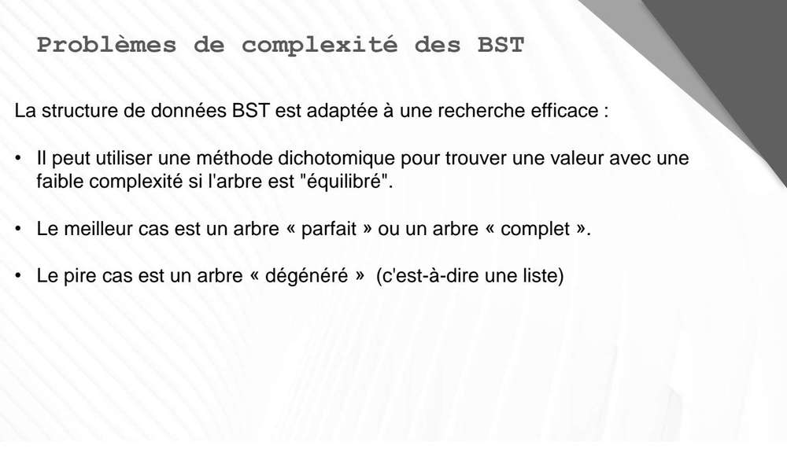{ loading=lazy .papier }](papier/ch5/cm4-p65.jpg)
    <p class="papier-legende">Problèmes de complexité des BST · CM 4 — Arbres binaires (N. Flasque, 2023-2024), diapo 65</p>

    [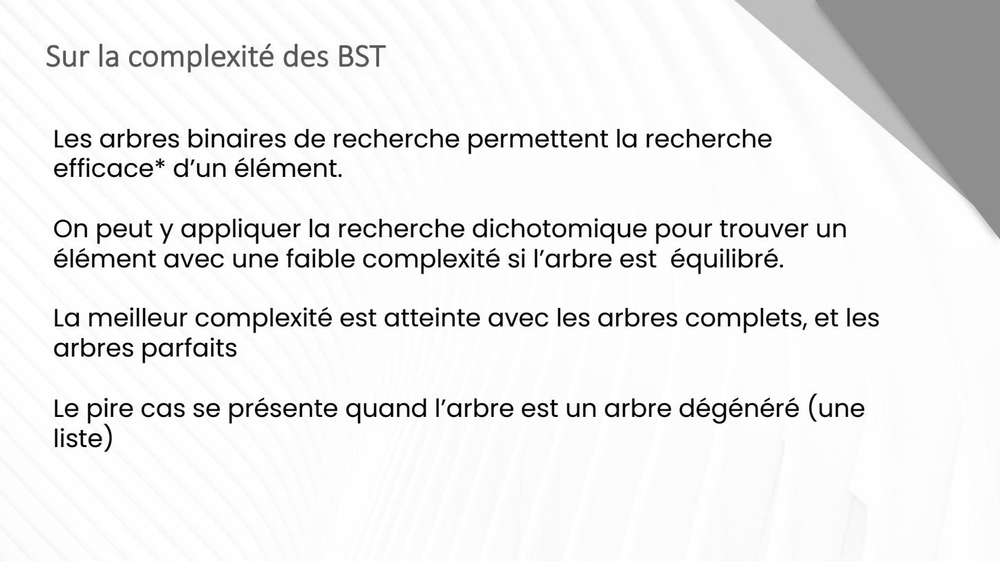{ loading=lazy .papier }](papier/ch5/avl-p01.jpg)
    <p class="papier-legende">Sur la complexité des BST · Support AVL et équilibrage (N. Flasque, 2023-2024), diapo 1</p>

    [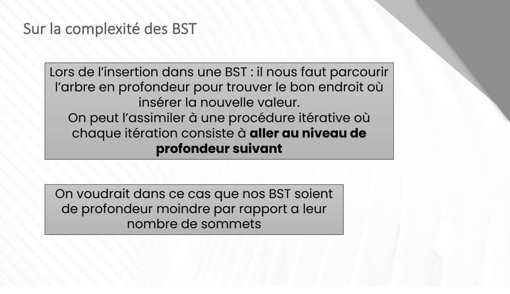{ loading=lazy .papier }](papier/ch5/avl-p02.jpg)
    <p class="papier-legende">Sur la complexité des BST (insertion) · Support AVL et équilibrage (N. Flasque, 2023-2024), diapo 2</p>

    [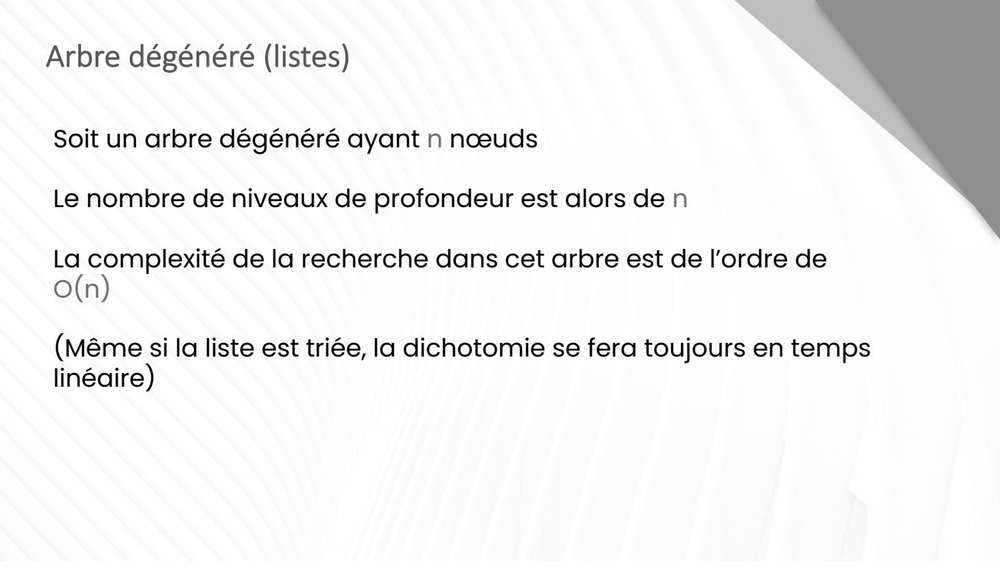{ loading=lazy .papier }](papier/ch5/avl-p03.jpg)
    <p class="papier-legende">Arbre dégénéré (listes) · Support AVL et équilibrage (N. Flasque, 2023-2024), diapo 3</p>

    [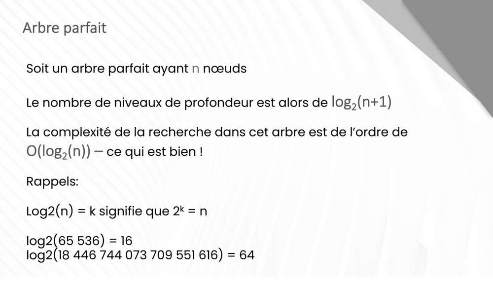{ loading=lazy .papier }](papier/ch5/avl-p04.jpg)
    <p class="papier-legende">Arbre parfait · Support AVL et équilibrage (N. Flasque, 2023-2024), diapo 4</p>

    [{ loading=lazy .papier }](papier/ch5/avl-p05.jpg)
    <p class="papier-legende">Arbre complet (le dernier niveau peut ne pas être rempli) · Support AVL et équilibrage (N. Flasque, 2023-2024), diapo 5</p>

    [{ loading=lazy .papier }](papier/ch5/avl-p06.jpg)
    <p class="papier-legende">Recherche de valeur dans une BST · Support AVL et équilibrage (N. Flasque, 2023-2024), diapo 6</p>

    [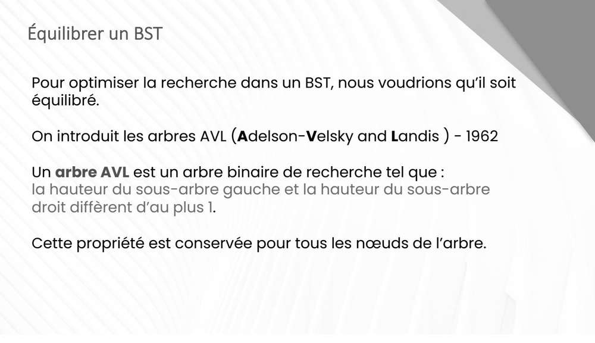{ loading=lazy .papier }](papier/ch5/avl-p07.jpg)
    <p class="papier-legende">Équilibrer un BST · Support AVL et équilibrage (N. Flasque, 2023-2024), diapo 7</p>

    [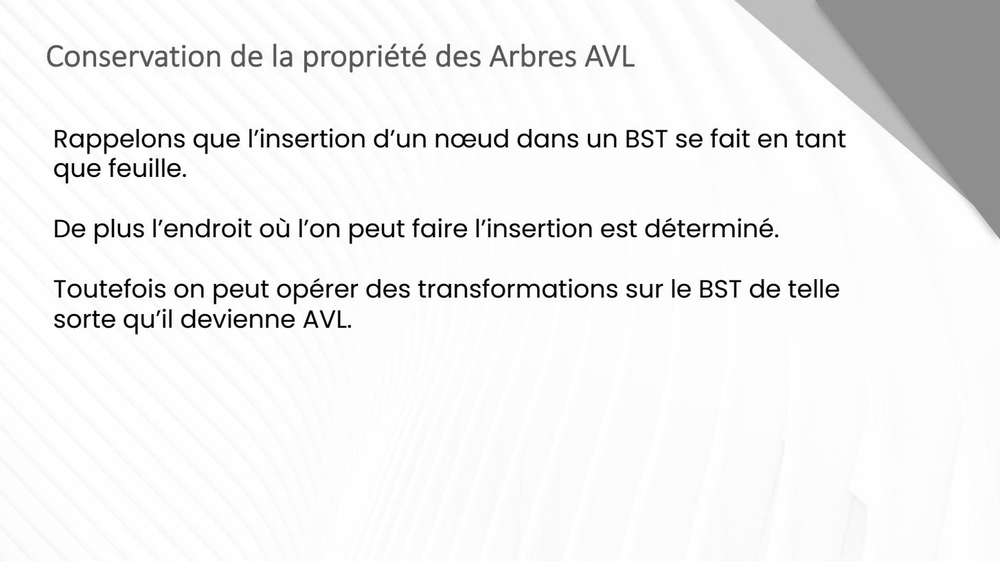{ loading=lazy .papier }](papier/ch5/avl-p08.jpg)
    <p class="papier-legende">Conservation de la propriété des Arbres AVL · Support AVL et équilibrage (N. Flasque, 2023-2024), diapo 8</p>

    [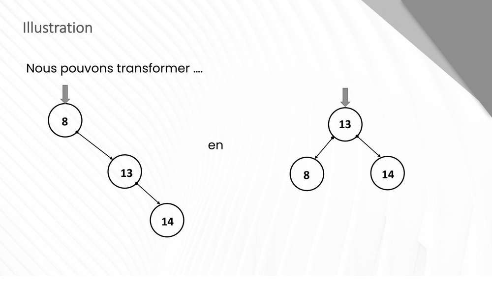{ loading=lazy .papier }](papier/ch5/avl-p09.jpg)
    <p class="papier-legende">Illustration · Support AVL et équilibrage (N. Flasque, 2023-2024), diapo 9</p>

    [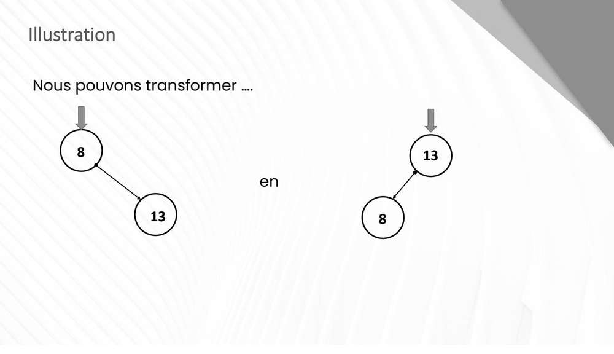{ loading=lazy .papier }](papier/ch5/avl-p10.jpg)
    <p class="papier-legende">Illustration (2) · Support AVL et équilibrage (N. Flasque, 2023-2024), diapo 10</p>

    [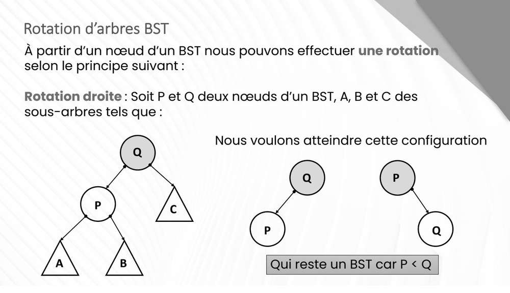{ loading=lazy .papier }](papier/ch5/avl-p11.jpg)
    <p class="papier-legende">Rotation d'arbres BST · Support AVL et équilibrage (N. Flasque, 2023-2024), diapo 11</p>

    [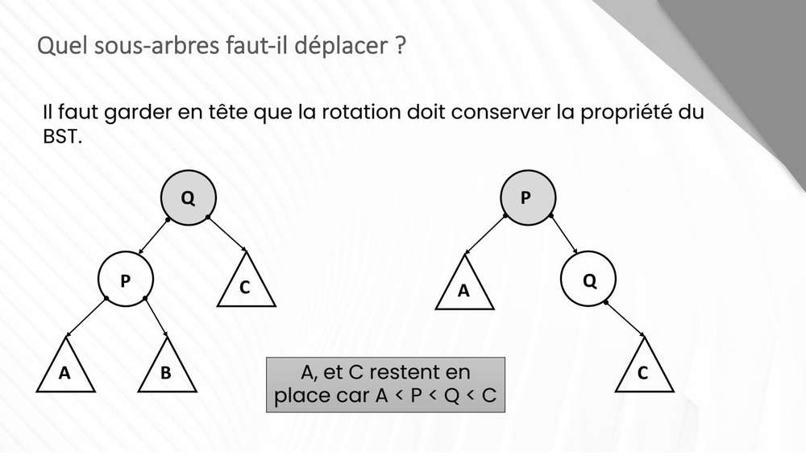{ loading=lazy .papier }](papier/ch5/avl-p12.jpg)
    <p class="papier-legende">Quel sous-arbres faut-il déplacer ? · Support AVL et équilibrage (N. Flasque, 2023-2024), diapo 12</p>

    [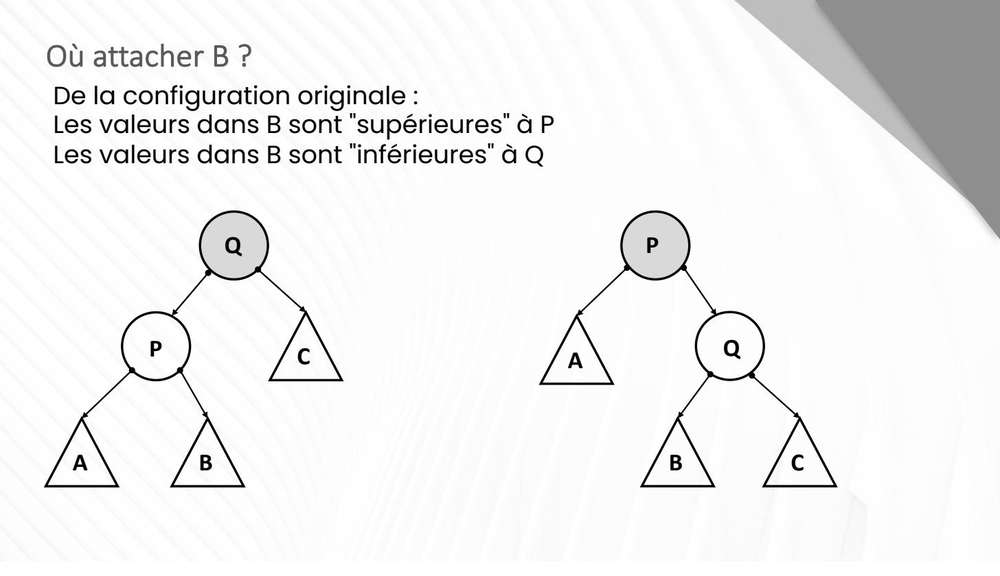{ loading=lazy .papier }](papier/ch5/avl-p13.jpg)
    <p class="papier-legende">Où attacher B ? · Support AVL et équilibrage (N. Flasque, 2023-2024), diapo 13</p>

    [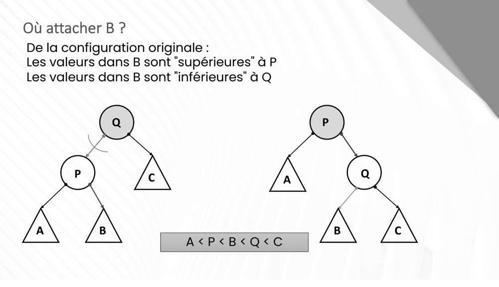{ loading=lazy .papier }](papier/ch5/avl-p14.jpg)
    <p class="papier-legende">Où attacher B ? (A < P < B < Q < C) · Support AVL et équilibrage (N. Flasque, 2023-2024), diapo 14</p>

    [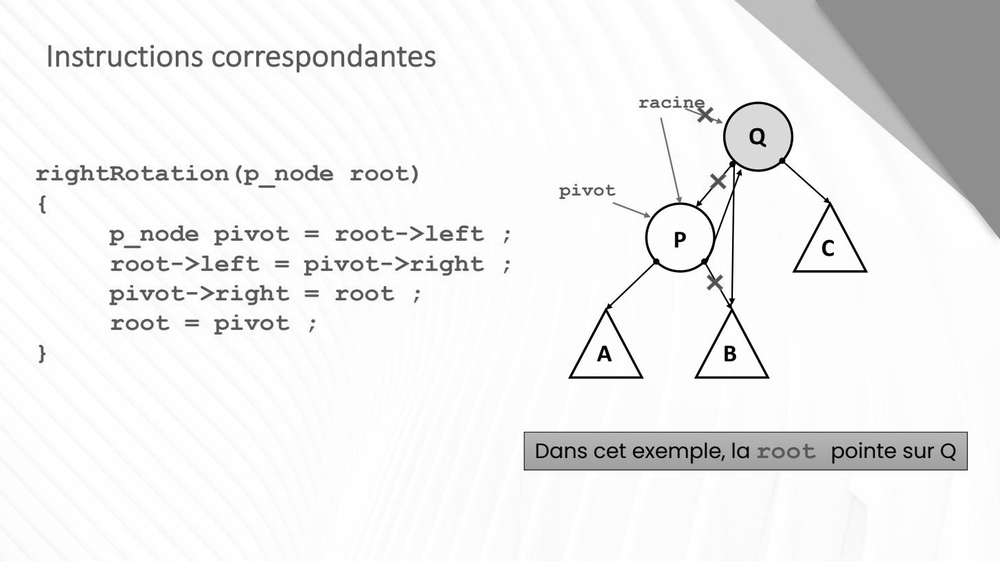{ loading=lazy .papier }](papier/ch5/avl-p15.jpg)
    <p class="papier-legende">Instructions correspondantes · Support AVL et équilibrage (N. Flasque, 2023-2024), diapo 15</p>

    [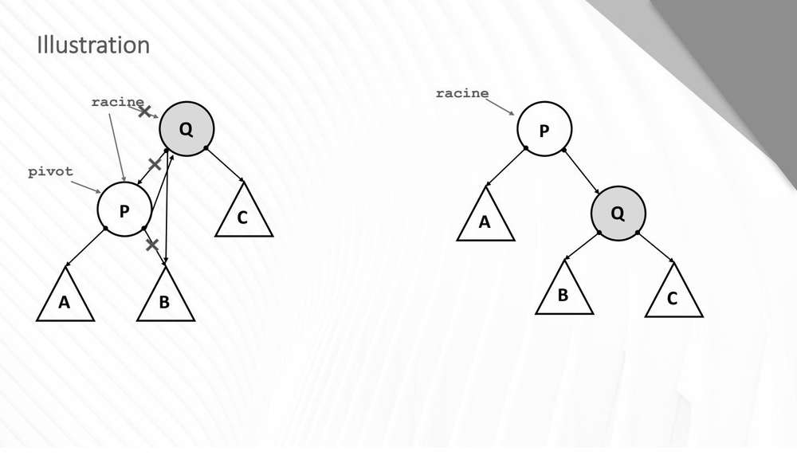{ loading=lazy .papier }](papier/ch5/avl-p16.jpg)
    <p class="papier-legende">Illustration · Support AVL et équilibrage (N. Flasque, 2023-2024), diapo 16</p>

    [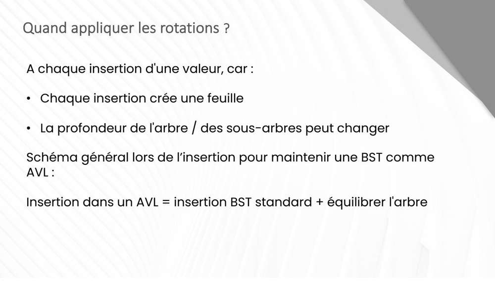{ loading=lazy .papier }](papier/ch5/avl-p17.jpg)
    <p class="papier-legende">Quand appliquer les rotations ? · Support AVL et équilibrage (N. Flasque, 2023-2024), diapo 17</p>

    [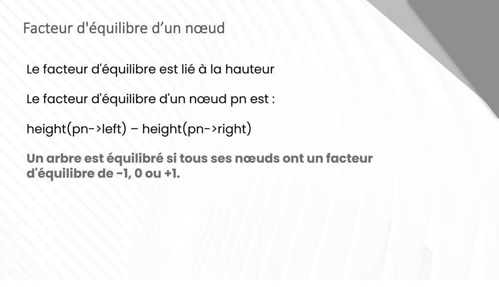{ loading=lazy .papier }](papier/ch5/avl-p18.jpg)
    <p class="papier-legende">Facteur d'équilibre d'un nœud · Support AVL et équilibrage (N. Flasque, 2023-2024), diapo 18</p>

    [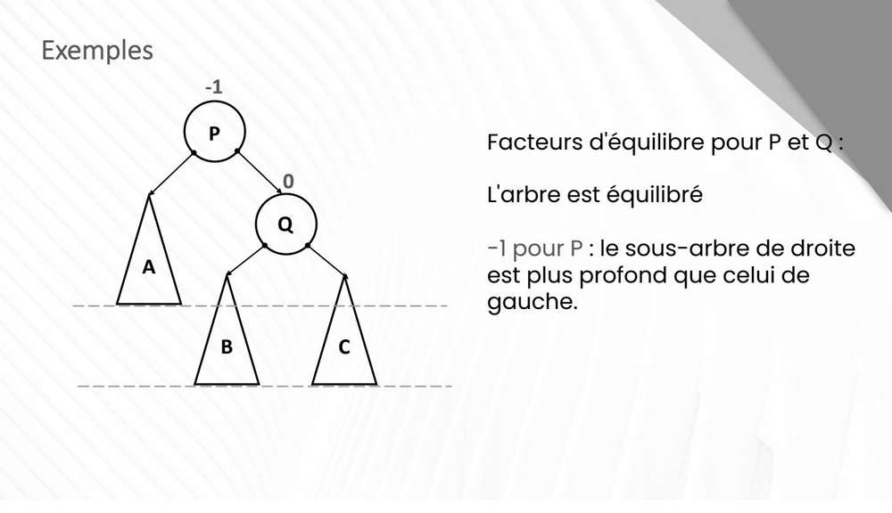{ loading=lazy .papier }](papier/ch5/avl-p19.jpg)
    <p class="papier-legende">Exemples · Support AVL et équilibrage (N. Flasque, 2023-2024), diapo 19</p>

    [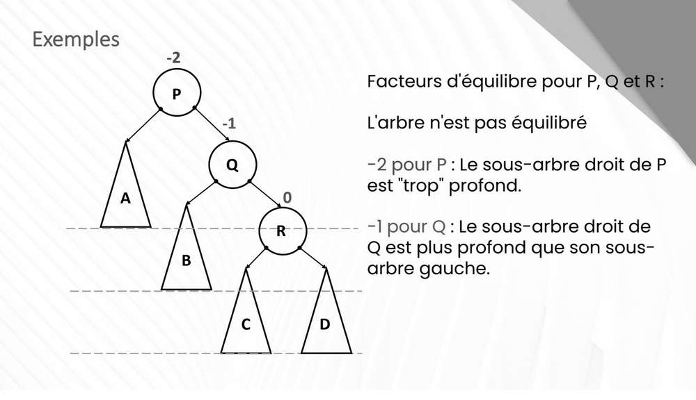{ loading=lazy .papier }](papier/ch5/avl-p20.jpg)
    <p class="papier-legende">Exemples (2) · Support AVL et équilibrage (N. Flasque, 2023-2024), diapo 20</p>

    [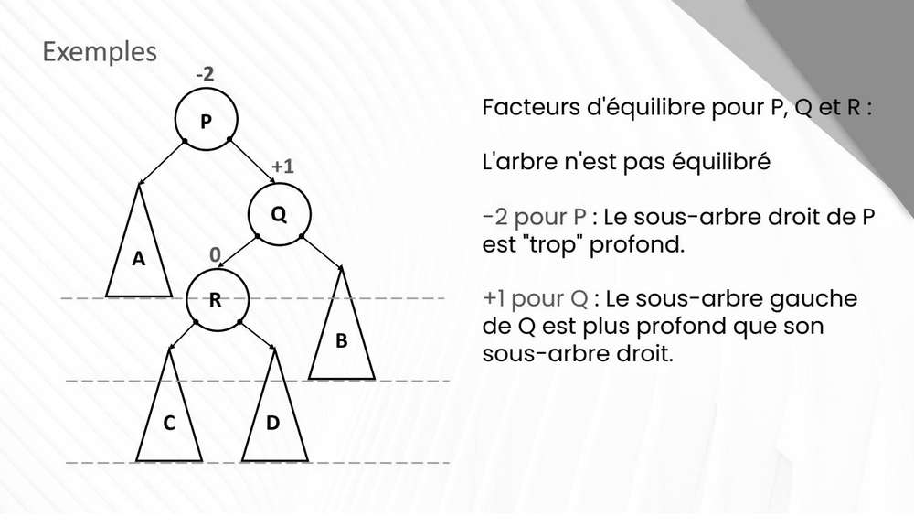{ loading=lazy .papier }](papier/ch5/avl-p21.jpg)
    <p class="papier-legende">Exemples (3) · Support AVL et équilibrage (N. Flasque, 2023-2024), diapo 21</p>

    [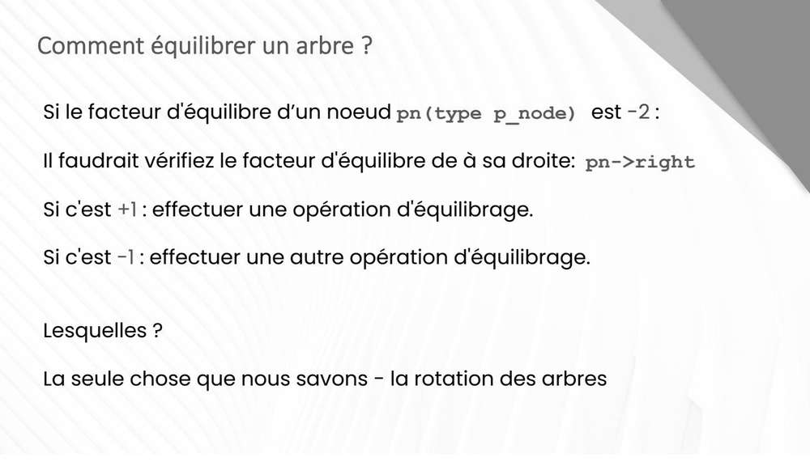{ loading=lazy .papier }](papier/ch5/avl-p22.jpg)
    <p class="papier-legende">Comment équilibrer un arbre ? · Support AVL et équilibrage (N. Flasque, 2023-2024), diapo 22</p>

    [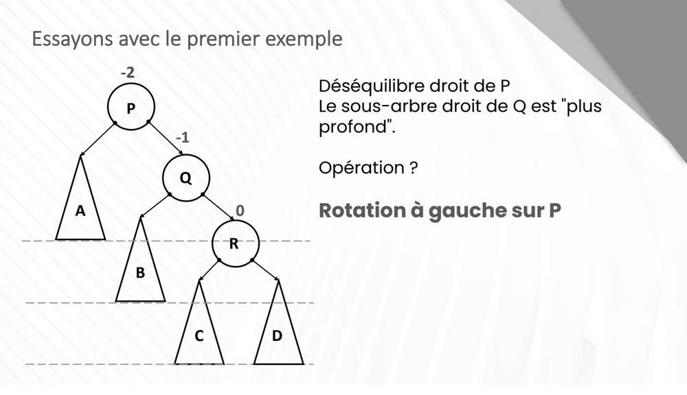{ loading=lazy .papier }](papier/ch5/avl-p23.jpg)
    <p class="papier-legende">Essayons avec le premier exemple · Support AVL et équilibrage (N. Flasque, 2023-2024), diapo 23</p>

    [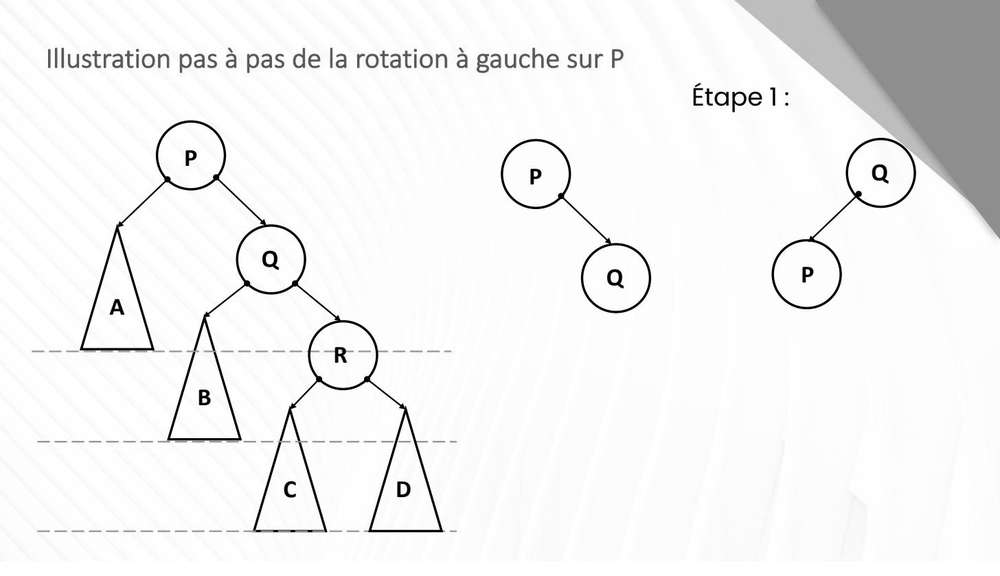{ loading=lazy .papier }](papier/ch5/avl-p24.jpg)
    <p class="papier-legende">Illustration pas à pas de la rotation à gauche sur P (étape 1) · Support AVL et équilibrage (N. Flasque, 2023-2024), diapo 24</p>

    [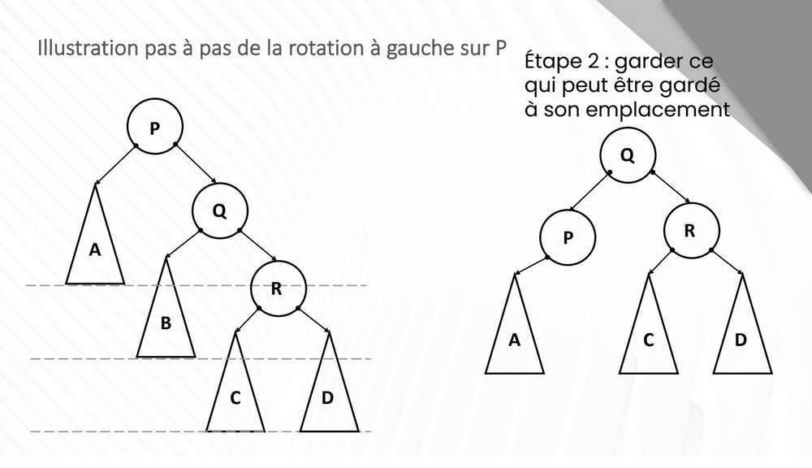{ loading=lazy .papier }](papier/ch5/avl-p25.jpg)
    <p class="papier-legende">Illustration pas à pas de la rotation à gauche sur P (étape 2) · Support AVL et équilibrage (N. Flasque, 2023-2024), diapo 25</p>

    [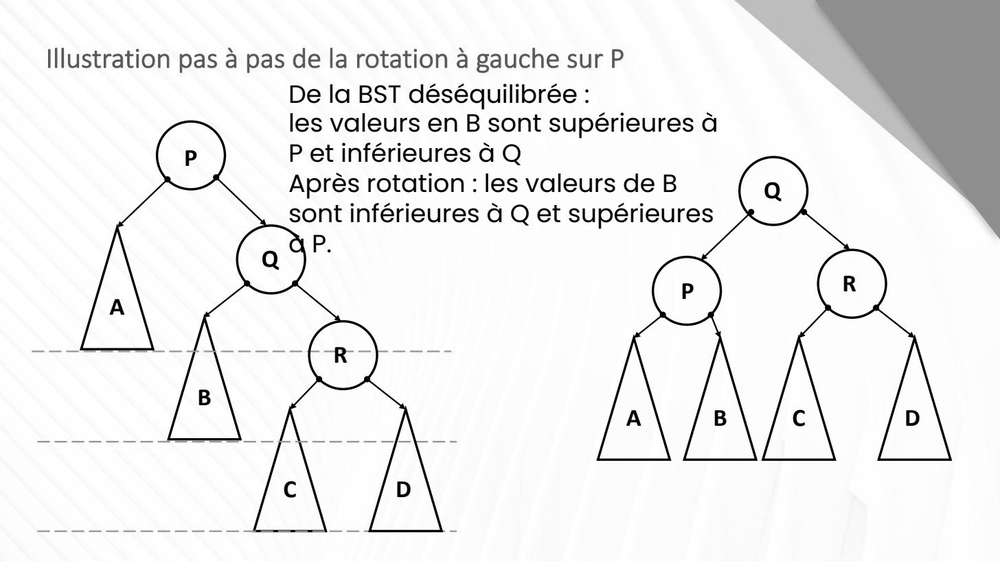{ loading=lazy .papier }](papier/ch5/avl-p26.jpg)
    <p class="papier-legende">Illustration pas à pas de la rotation à gauche sur P (fin) · Support AVL et équilibrage (N. Flasque, 2023-2024), diapo 26</p>

    [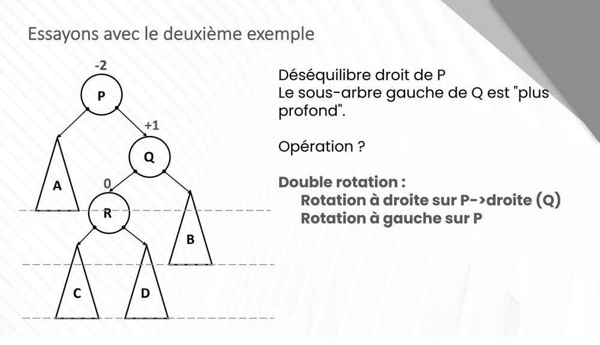{ loading=lazy .papier }](papier/ch5/avl-p27.jpg)
    <p class="papier-legende">Essayons avec le deuxième exemple · Support AVL et équilibrage (N. Flasque, 2023-2024), diapo 27</p>

    [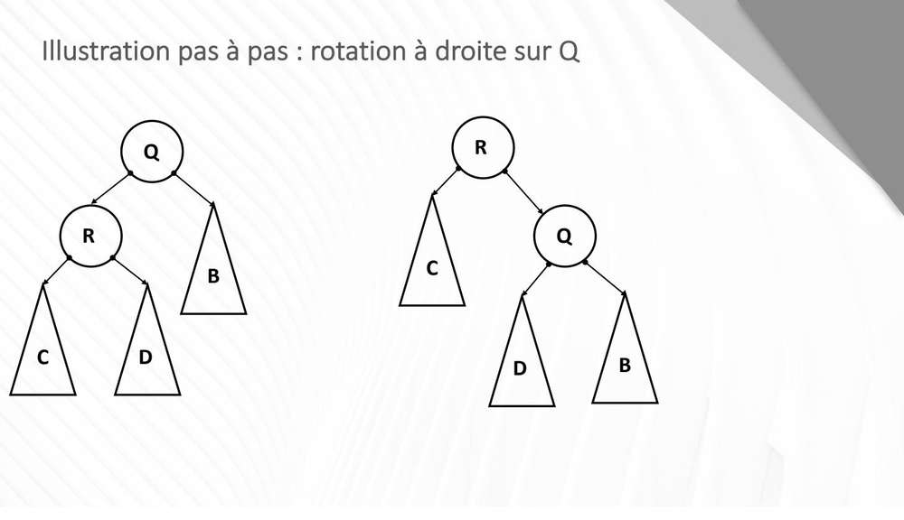{ loading=lazy .papier }](papier/ch5/avl-p28.jpg)
    <p class="papier-legende">Illustration pas à pas : rotation à droite sur Q · Support AVL et équilibrage (N. Flasque, 2023-2024), diapo 28</p>

    [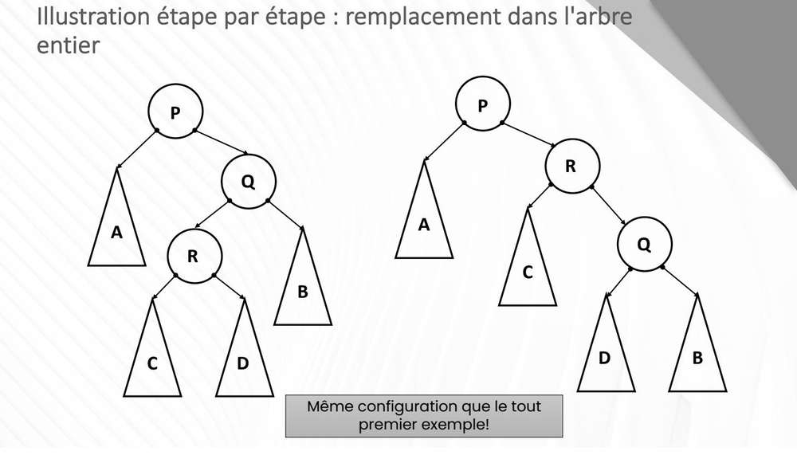{ loading=lazy .papier }](papier/ch5/avl-p29.jpg)
    <p class="papier-legende">Illustration étape par étape : remplacement dans l'arbre entier · Support AVL et équilibrage (N. Flasque, 2023-2024), diapo 29</p>

    [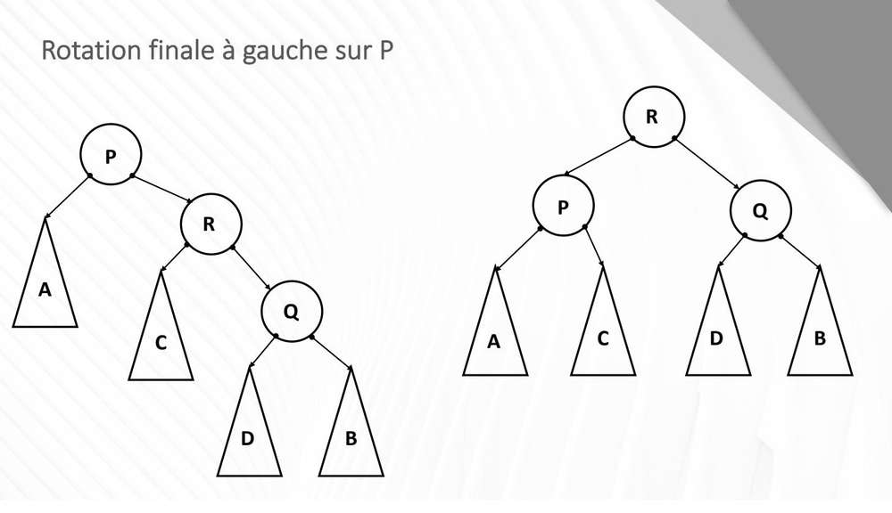{ loading=lazy .papier }](papier/ch5/avl-p30.jpg)
    <p class="papier-legende">Rotation finale à gauche sur P · Support AVL et équilibrage (N. Flasque, 2023-2024), diapo 30</p>

    [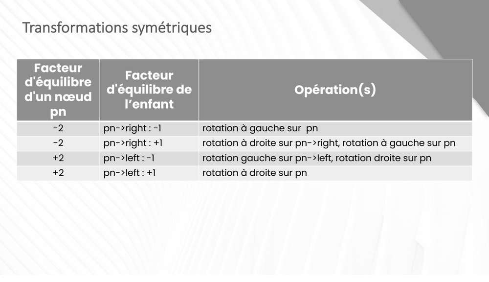{ loading=lazy .papier }](papier/ch5/avl-p31.jpg)
    <p class="papier-legende">Transformations symétriques · Support AVL et équilibrage (N. Flasque, 2023-2024), diapo 31</p>

    [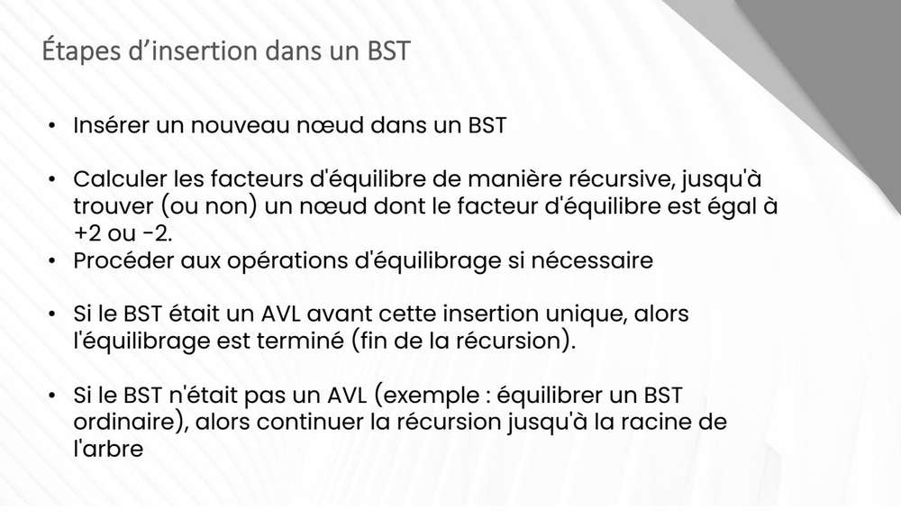{ loading=lazy .papier }](papier/ch5/avl-p32.jpg)
    <p class="papier-legende">Étapes d'insertion dans un BST · Support AVL et équilibrage (N. Flasque, 2023-2024), diapo 32</p>

    [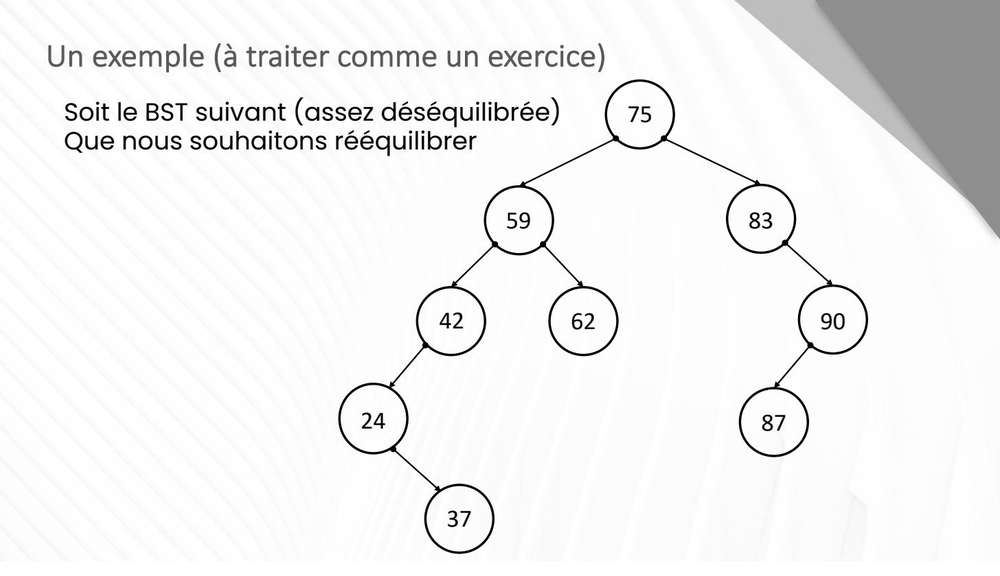{ loading=lazy .papier }](papier/ch5/avl-p33.jpg)
    <p class="papier-legende">Un exemple (à traiter comme un exercice) · Support AVL et équilibrage (N. Flasque, 2023-2024), diapo 33</p>

    [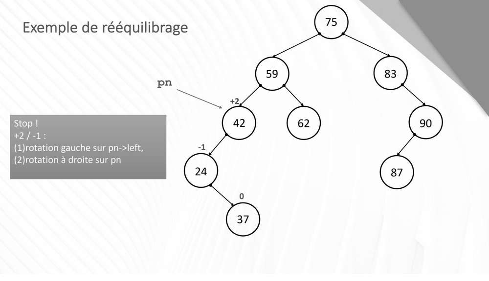{ loading=lazy .papier }](papier/ch5/avl-p34.jpg)
    <p class="papier-legende">Exemple de rééquilibrage · Support AVL et équilibrage (N. Flasque, 2023-2024), diapo 34</p>

    [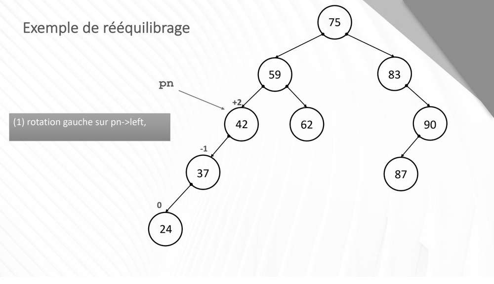{ loading=lazy .papier }](papier/ch5/avl-p35.jpg)
    <p class="papier-legende">Exemple de rééquilibrage (1) · Support AVL et équilibrage (N. Flasque, 2023-2024), diapo 35</p>

    [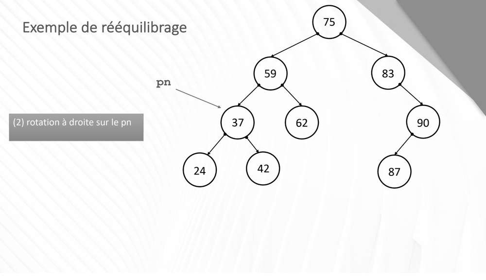{ loading=lazy .papier }](papier/ch5/avl-p36.jpg)
    <p class="papier-legende">Exemple de rééquilibrage (2) · Support AVL et équilibrage (N. Flasque, 2023-2024), diapo 36</p>

    [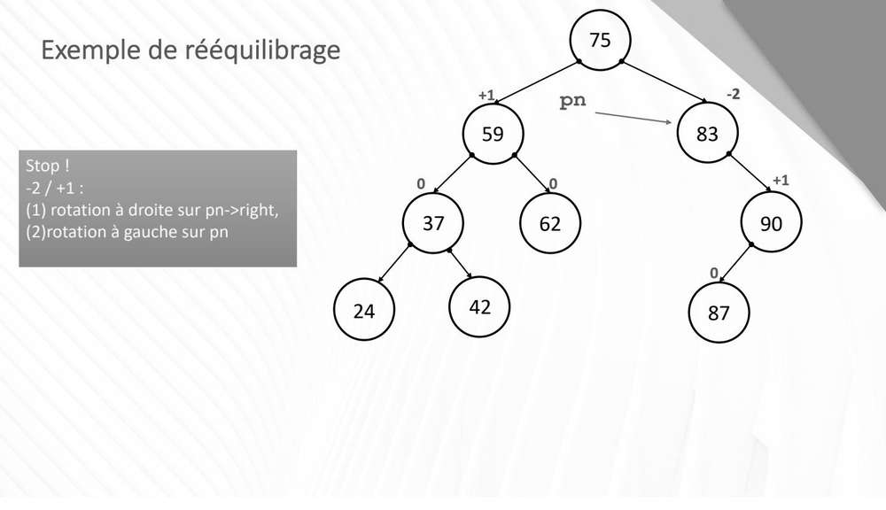{ loading=lazy .papier }](papier/ch5/avl-p37.jpg)
    <p class="papier-legende">Exemple de rééquilibrage (second déséquilibre) · Support AVL et équilibrage (N. Flasque, 2023-2024), diapo 37</p>

    [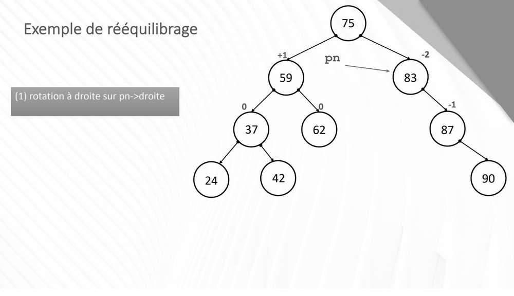{ loading=lazy .papier }](papier/ch5/avl-p38.jpg)
    <p class="papier-legende">Exemple de rééquilibrage (rotation à droite sur pn->droite) · Support AVL et équilibrage (N. Flasque, 2023-2024), diapo 38</p>

    [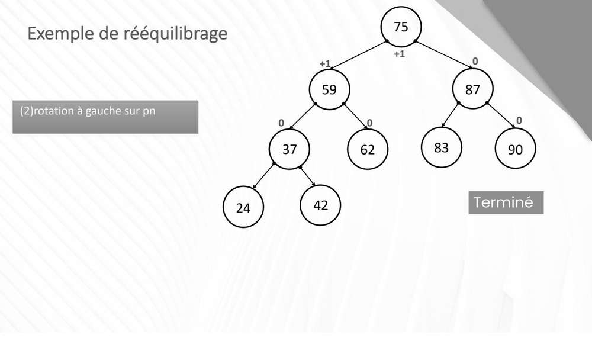{ loading=lazy .papier }](papier/ch5/avl-p39.jpg)
    <p class="papier-legende">Exemple de rééquilibrage (terminé) · Support AVL et équilibrage (N. Flasque, 2023-2024), diapo 39</p>
