# Annale — DE du 14 décembre 2024

=== "Version simplifiée"

    1 h 50, sans calculatrice, sans documents, réponses directement sur le sujet.
    Trois parties : listes, piles et files, arbres (dont ABR et AVL). Sujet de
    N. Flasque.

    !!! tip "Ce qui revient"
        Écrire une fonction courte et **juste** sur les cas limites (liste vide,
        un seul élément), prévoir le résultat d'un code donné, et **toujours
        justifier** (« expliquez », « justifiez » valent des points).

    ## Partie 1 — Listes

    Type `t_ht_list` (`head`, `tail`) sur des cellules `t_cell`.

    **Q1.** Schéma après les ajouts **en tête** de 5, puis 31, puis −4.

    ??? success "Correction"
        ```text
         ┌──────┬──────┐
         │ head │ tail │
         └──┬───┴──┬───┘
            │      └───────────────────────────┐
            ▼                                  ▼
          [ -4 | @ ]──▶ [ 31 | @ ]──▶ [ 5 | NULL ]
        ```
        `tail` désigne 5, la première cellule ajoutée (ajout en tête dans une liste
        vide : elle est aussi la dernière, et le reste ensuite).

    **Q2.** Écrire `addTail()` qui ajoute une cellule directement en fin de liste
    (`createCell()` disponible).

    ??? success "Correction"
        ```c
        void addTail(t_ht_list *p_list, int val)
        {
            t_cell *newcell = createCell(val);
            if (p_list->tail == NULL)            /* liste vide */
            {
                p_list->head = newcell;
                p_list->tail = newcell;
            }
            else
            {
                p_list->tail->next = newcell;
                p_list->tail = newcell;
            }
        }
        ```
        Ne pas oublier : le **paramètre valeur** (la cellule doit stocker quelque
        chose), le **pointeur** sur la liste, le cas **vide**.

    **Q3.** Écrire `concat()` : deux listes ht `liste1` et `liste2` ; après l'appel,
    une liste ht contient les valeurs de `liste1` suivies de celles de `liste2`.

    ??? success "Correction"
        Grâce à `tail`, on raccroche la fin de `liste1` au début de `liste2` en
        $O(1)$, sans rien parcourir. `liste1` est modifiée (au moins `tail`, et
        `head` si elle était vide) → pointeur.

        ```c
        void concat(t_ht_list *p_list1, t_ht_list *p_list2)
        {
            if (p_list2->head == NULL)            /* rien à ajouter */
            {
                return;
            }
            if (p_list1->head == NULL)            /* liste1 vide : elle devient liste2 */
            {
                *p_list1 = *p_list2;
            }
            else
            {
                p_list1->tail->next = p_list2->head;
                p_list1->tail = p_list2->tail;
            }
            *p_list2 = createHtList();            /* les cellules appartiennent à liste1 */
        }
        ```

        On vide `liste2` à la fin : sinon les deux listes **partageraient** les
        mêmes cellules, et une suppression dans l'une casserait l'autre. Variante
        acceptable : recopier les valeurs dans une nouvelle liste ($O(N + M)$, sans
        partage).

        !!! piege "Erreurs vues sur des copies"
            Tester `liste1 == NULL` alors qu'une `t_ht_list` n'est pas un pointeur ;
            écrire deux fois `->head =` au lieu de mettre à jour `tail` ; parcourir
            toute la liste alors que `tail` donne la fin directement.

    **Q4.** Pourquoi utilise-t-on `t_ht_list` pour implémenter les listes
    circulaires plutôt qu'une liste simple ?

    ??? success "Correction"
        Dans une liste circulaire, la dernière cellule doit pointer sur la
        première. Quand on **ajoute en tête**, la première change : il faut mettre à
        jour le `next` de la dernière. Sans `tail`, il faudrait parcourir toute la
        liste pour la trouver ($O(N)$) ; avec `tail`, c'est immédiat ($O(1)$). Même
        chose pour l'ajout en queue.

    ## Partie 2 — Piles et files

    On donne cette fonction (`t_stack` : pile de `char`, implémentation inconnue) :

    ```c
    int fonction(char *expr)
    {
        int pile_ok = 1;
        int result = 0;
        t_stack st = createEmptyStack();
        int size = strlen(expr);
        int i = 0;

        while ((i < size) && (pile_ok == 1))
        {
            char val = expr[i];
            if (val == '(')
            {
                push(&st, val);
            }
            else if (val == ')')
            {
                if (isEmptyStack(st))
                {
                    pile_ok = 0;
                }
                else
                {
                    pop(&st);
                }
            }
        }
        if (pile_ok == 1)
        {
            result = isEmptyStack(st);
        }
        return result;
    }
    ```

    **Q1.** État de la pile et valeur retournée pour `"1+2*6"`, `"(1+(2*6))"`,
    `"(1+4+5"`, `"1+(3*(5+7)))"`.

    ??? success "Correction"
        **Il manque `i++`** dans la boucle : telle quelle, la fonction tourne
        **indéfiniment** sur le premier caractère (sauf si c'est une `)` sur pile
        vide). Il fallait le remarquer. En ajoutant `i++` en fin de boucle :

        | Expression | Pile à la fin | Retour | Pourquoi |
        |------------|---------------|:------:|----------|
        | `1+2*6` | vide | **1** | aucune parenthèse |
        | `(1+(2*6))` | vide | **1** | chaque `(` est fermée |
        | `(1+4+5` | `(` | **0** | une parenthèse jamais fermée |
        | `1+(3*(5+7)))` | vide | **0** | la 3ᵉ `)` arrive sur une pile vide : `pile_ok = 0` |

    **Q2.** Rôle de la fonction ?

    ??? success "Correction"
        Vérifier qu'une expression est **bien parenthésée** : chaque `)` correspond
        à une `(` ouverte avant, et toutes les `(` sont fermées. Elle retourne 1
        dans ce cas, 0 sinon.

    **Q3.** La modifier pour gérer aussi les crochets `[` `]` : `"[(1+2)*6]+4"` et
    `"[[6]]"` → 1 ; `"[ 4 + ( 6 * 7 ] )"` → 0.

    ??? success "Correction"
        On empile `(` **et** `[` ; sur une fermante, le symbole dépilé doit être le
        bon ouvrant.

        ```c
        int fonction(char *expr)
        {
            int pile_ok = 1;
            int result = 0;
            t_stack st = createEmptyStack();
            int size = strlen(expr);
            int i = 0;

            while ((i < size) && (pile_ok == 1))
            {
                char val = expr[i];
                if (val == '(' || val == '[')
                {
                    push(&st, val);
                }
                else if (val == ')' || val == ']')
                {
                    if (isEmptyStack(st))
                    {
                        pile_ok = 0;
                    }
                    else
                    {
                        char ouvrant = pop(&st);
                        if ((val == ')' && ouvrant != '(') || (val == ']' && ouvrant != '['))
                        {
                            pile_ok = 0;              /* mauvaise imbrication */
                        }
                    }
                }
                i++;
            }
            if (pile_ok == 1)
            {
                result = isEmptyStack(st);
            }
            return result;
        }
        ```

    **Files.** Rappeler le principe du parcours en largeur d'un arbre à l'aide
    d'une file, avec une illustration.

    ??? success "Correction"
        On visite l'arbre **niveau par niveau**, de gauche à droite. On enfile la
        racine ; puis, tant que la file n'est pas vide : on défile un nœud, on le
        traite, et on enfile ses fils (gauche puis droit) s'ils existent. La file
        garantit que les nœuds d'un niveau sortent tous avant ceux du niveau
        suivant (FIFO).

        ```text
                3                 file (début à gauche)      sortie
               / \                [3]                         3
              4   5               [4 5]                       4
             / \ / \              [5 6 7]                     5
            6  7 8  9             [6 7 8 9]                   6 7 8 9
        ```
        Résultat : `3 4 5 6 7 8 9`. Il faut **montrer l'état de la file** à chaque
        étape : donner seulement l'ordre final ne suffit pas.

    ## Partie 3 — Arbres

    ```c
    typedef struct s_node { int value; struct s_node *left, *right; } t_node;
    typedef struct s_tree { t_node *root; } t_tree;
    ```

    **Q1.** Définition de la hauteur d'un arbre binaire.

    ??? success "Correction"
        C'est la **profondeur maximale** de ses nœuds, c'est-à-dire le nombre
        d'arêtes du plus long chemin de la racine à une feuille. Récursivement :
        $h(\text{vide}) = -1$, et sinon
        $h = 1 + \max(h(\text{gauche}), h(\text{droit}))$ (une feuille a donc une
        hauteur de 0).

    **Q2.** Hauteur de cet arbre, en expliquant le calcul.

    ```text
            10
           /  \
          5    15
         /    /  \
        2    12   20
                 /
               18
    ```

    ??? success "Correction"
        Feuilles 2, 12, 18 : hauteur 0. Puis 5 : $1 + \max(0, -1) = 1$ ;
        20 : $1 + \max(0, -1) = 1$ ; 15 : $1 + \max(0, 1) = 2$ ;
        10 : $1 + \max(1, 2) = $ **3** (chemin 10 → 15 → 20 → 18).

    **Q3.** On propose :

    ```c
    int hauteur(t_node *pn)
    {
        if ((pn->left == NULL) && (pn->right == NULL))
        {
            return 0;
        }
        return 1 + max(hauteur(pn->left), hauteur(pn->right));
    }
    int hautArbre(t_tree t) { return hauteur(t.root); }
    ```

    Que se passe-t-il avec l'arbre de la Q2 ? Quel est le dernier nœud correctement
    traité ?

    ??? success "Correction"
        La fonction ne teste jamais `pn == NULL`. Elle ne marche que si chaque nœud
        a 0 ou 2 fils. Ici, **5** n'a qu'un fils gauche : `hauteur(5)` calcule
        d'abord `hauteur(2)` (feuille → 0, **dernier nœud correctement traité**),
        puis appelle `hauteur(NULL)` pour le fils droit, qui lit `pn->left` sur
        `NULL` : **plantage** (*segmentation fault*). Elle planterait aussi sur un
        arbre vide.

        (En C, l'ordre d'évaluation des deux arguments de `max` n'est pas garanti :
        la réponse attendue suppose le fils gauche évalué en premier.)

    **Q5.** Proposer une version conforme à la définition.

    ??? success "Correction"
        ```c
        int hauteur(t_node *pn)
        {
            if (pn == NULL)
            {
                return -1;                 /* arbre vide */
            }
            return 1 + max(hauteur(pn->left), hauteur(pn->right));
        }
        ```
        Une feuille donne $1 + \max(-1, -1) = 0$ : plus besoin de cas « feuille ».
        `max` n'existe pas en C standard : l'écrire (fonction ou opérateur
        `a > b ? a : b`).

    ### ABR et AVL — questions de cours

    **Q1.** Quel parcours permet d'indiquer qu'un arbre est un ABR ?

    ??? success "Correction"
        Le parcours **infixe** : un arbre binaire est un ABR si et seulement si
        l'infixe donne les valeurs **dans l'ordre croissant** (on visite tout le
        sous-arbre gauche, plus petit, avant le nœud, puis le droit, plus grand).

    **Q2.** Différence entre un ABR et un AVL ?

    ??? success "Correction"
        Un AVL est un ABR **équilibré** : en **chaque** nœud, les hauteurs des
        sous-arbres gauche et droit diffèrent d'au plus 1 (BF ∈ {−1, 0, +1}). On
        maintient cette propriété par des **rotations** après chaque insertion. Cela
        garantit une hauteur en $O(\log_2 N)$, donc une recherche en $O(\log_2 N)$,
        alors qu'un ABR quelconque peut dégénérer en liste ($O(N)$).

    **Q2 bis.** ABR à $N$ nœuds : borne minimale et maximale de la hauteur ?

    ??? success "Correction"
        $$
        \lfloor \log_2 N \rfloor \;\le\; h \;\le\; N - 1
        $$
        - **Maximum** $N - 1$ : arbre **dégénéré** (une liste, un nœud par niveau,
          $N - 1$ arêtes). Attention, pas $N$ ni $N + 1$.
        - **Minimum** : arbre **complet** ; le niveau $k$ contient au plus $2^k$
          nœuds, donc une hauteur $h$ permet au plus $2^{h+1} - 1$ nœuds, d'où
          $h \ge \log_2(N + 1) - 1$, soit $h \ge \lfloor \log_2 N \rfloor$.
          Exemple : 7 nœuds → hauteur au moins 2 ; 15 nœuds → au moins 3.

    **Q3.** Dans un AVL, le facteur d'équilibre est-il calculé uniquement pour la
    racine, ou pour chaque nœud ?

    ??? success "Correction"
        **Pour chaque nœud** de l'arbre.

    **Q4.** Cet arbre est-il un ABR ? un AVL ?

    ```text
                50
               /  \
             30    70
            /        \
          20          80
         /              \
       10                90
                           \
                            100
    ```

    ??? success "Correction"
        **ABR : oui** — infixe `10 20 30 50 70 80 90 100`, croissant.
        **AVL : non** — BF(30) = $h(20) - h(\text{vide}) = 1 - (-1) = +2$, et
        BF(70) = $-1 - 2 = -3$, BF(80) = $-2$. (Avoir au plus deux fils par nœud
        ne suffit pas à faire un ABR : c'est la condition d'ordre qui compte.)

    **Q5.** Rotation gauche sur 80, puis rotation droite sur 30. Schéma du résultat.

    ??? success "Correction"
        - **Rotation gauche sur 80** : le pivot 90 monte, 80 devient son fils
          gauche, 100 reste à droite de 90. Le fils droit de 70 est maintenant 90.
        - **Rotation droite sur 30** : le pivot 20 monte, 30 devient son fils droit,
          10 reste à gauche de 20. Le fils gauche de 50 est maintenant 20.

        ```text
                   50
                 /    \
               20      70
              /  \       \
            10    30      90
                         /  \
                       80    100
        ```

        Le reste de l'arbre (la racine 50, le nœud 70) **ne bouge pas** : une
        rotation ne touche que le sous-arbre du nœud concerné. L'arbre n'est
        d'ailleurs toujours pas un AVL (BF(70) = −2) : une rotation gauche sur 70
        terminerait le travail.

    **Q6.** Écrire `insertBST`, qui insère une valeur au bon endroit dans un ABR.

    ??? success "Correction"
        === "Itérative (comme le CM)"

            ```c
            void insertBST(t_tree *p_tree, int val)
            {
                t_node *pn = createNode(val);
                t_node *temp, *parent = NULL;

                if (p_tree->root == NULL)
                {
                    p_tree->root = pn;
                    return;
                }
                temp = p_tree->root;
                while (temp != NULL)
                {
                    parent = temp;
                    if (val < temp->value) temp = temp->left;
                    else                   temp = temp->right;
                }
                if (val < parent->value) parent->left = pn;
                else                     parent->right = pn;
            }
            ```

        === "Récursive"

            ```c
            t_node *insertNode(t_node *pn, int val)
            {
                if (pn == NULL)
                {
                    return createNode(val);      /* place libre : la nouvelle feuille */
                }
                if (val < pn->value) pn->left  = insertNode(pn->left, val);
                else                 pn->right = insertNode(pn->right, val);
                return pn;
            }

            void insertBST(t_tree *p_tree, int val)
            {
                p_tree->root = insertNode(p_tree->root, val);
            }
            ```

    **Q7.** Reporter les facteurs d'équilibre.

    ```text
                30
               /  \
             20    50
            /  \   / \
          10   25 40  60
          /
         5
          \
           8
    ```

    ??? success "Correction"
        Hauteurs : 8, 25, 40, 60 → 0 ; 5 → 1 ; 50 → 1 ; 10 → 2 ; 20 → 3 ; 30 → 4.

        | Nœud | 30 | 20 | 10 | 5 | 8 | 25 | 50 | 40 | 60 |
        |------|:--:|:--:|:--:|:-:|:-:|:--:|:--:|:--:|:--:|
        | BF | **+2** | **+2** | **+2** | **−1** | 0 | 0 | 0 | 0 | 0 |

        Exemple : BF(10) = $h(5) - h(\text{vide}) = 1 - (-1) = +2$ ;
        BF(5) = $-1 - h(8) = -1 - 0 = -1$.

    **Q8.** Quelle(s) opération(s) pour équilibrer cet arbre ? Arbre résultant.

    ??? success "Correction"
        On corrige le nœud déséquilibré **le plus bas** : **10**, avec BF = +2, et
        son fils gauche 5 a BF = −1. Cas **+2 / −1** (zigzag) → **double rotation** :

        1. rotation **gauche sur 5** : 8 monte, 5 devient son fils gauche ;
        2. rotation **droite sur 10** : 8 monte, 10 devient son fils droit.

        ```text
                30
               /  \
             20    50
            /  \   / \
           8   25 40  60
          / \
         5   10
        ```

        BF : 8 → 0, 20 → +1, 30 → +1, tous les autres 0 : c'est un **AVL**.
        Répondre seulement « des rotations » ne rapporte rien : il faut **nommer**
        les rotations, **sur quels nœuds**, et **dessiner** le résultat.

    **Q9.** Écrire `t_node *rightRotation(t_node *)` (le paramètre n'est pas `NULL`).

    ??? success "Correction"
        ```c
        t_node *rightRotation(t_node *root)
        {
            t_node *pivot = root->left;      /* le fils gauche monte */
            root->left = pivot->right;       /* son sous-arbre droit change de parent */
            pivot->right = root;             /* l'ancienne racine descend à droite */
            return pivot;                    /* nouvelle racine du sous-arbre */
        }
        ```
        Une rotation n'est **pas** un échange des fils gauche et droit (ce qui
        casserait l'ordre de l'ABR) : c'est le fils gauche qui **remonte**.

    **Q10.** On affirme que cet arbre ne peut pas avoir été construit en insérant
    chaque valeur avec `insertBST()` **puis** en équilibrant pour en faire un AVL.
    Pourquoi ?

    ```text
                50
               /  \
             20    70
            /  \
          10    25
         /     /  \
        5    22    30
    ```

    ??? success "Correction"
        Avec cette méthode, l'arbre est un AVL **après chaque insertion**, donc
        aussi à la fin. Or cet arbre **n'est pas un AVL** : $h(20) = 2$ et
        $h(70) = 0$, donc BF(50) = $2 - 0 = +2$. Il ne peut pas être le résultat de
        la méthode. (C'est pourtant bien un ABR : l'infixe
        `5 10 20 22 25 30 50 70` est trié.)

=== "Version papier"

    Sujet du DE du 14 décembre 2024 (N. Flasque), scanné à partir d'une **copie d'étudiant corrigée** : le nom est masqué et la page de garde retirée. Les réponses manuscrites et la notation en rouge sont celles de cette copie, **pas forcément justes** : la correction complète est dans l'onglet Version simplifiée.

    [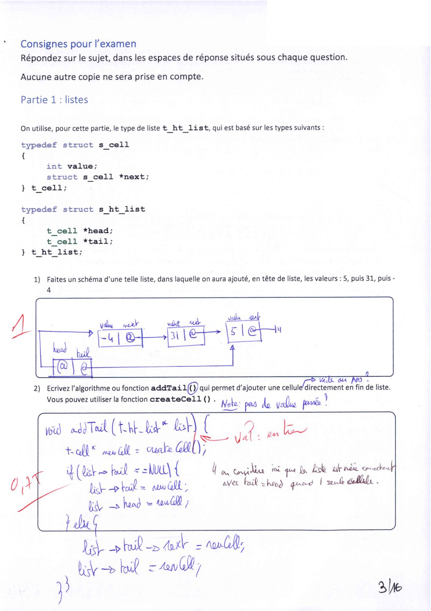{ loading=lazy .papier }](papier/de2024/de2024-p03.jpg)
    <p class="papier-legende">Partie 1 — listes : schéma, addTail() · DE 2024, p. 3/16</p>

    [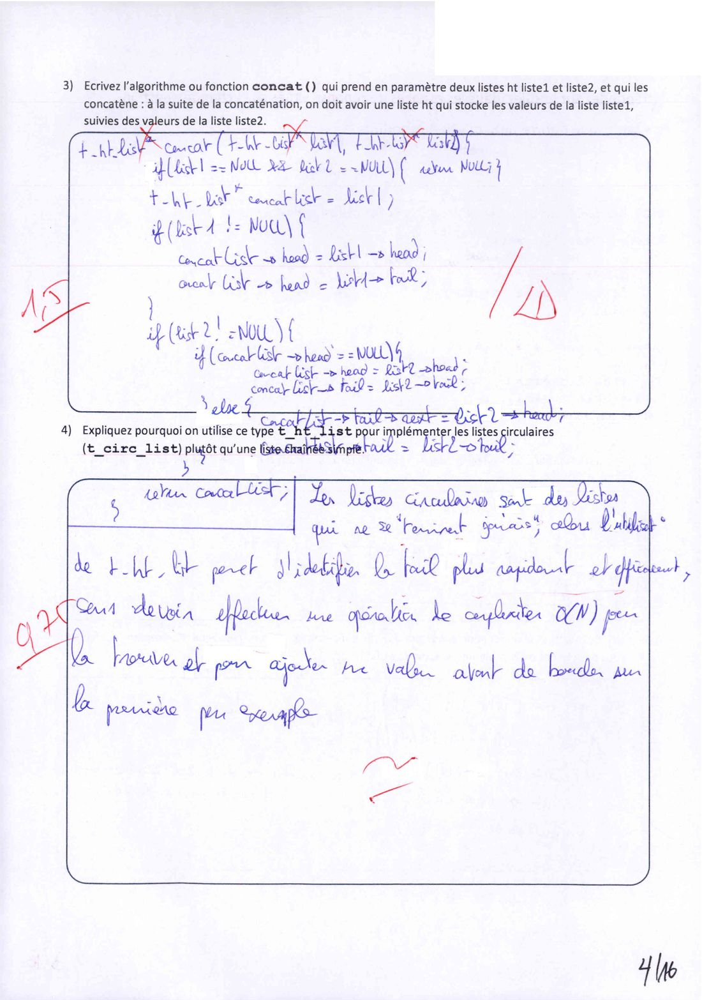{ loading=lazy .papier }](papier/de2024/de2024-p04.jpg)
    <p class="papier-legende">Partie 1 : concat(), pourquoi une liste ht · DE 2024, p. 4/16</p>

    [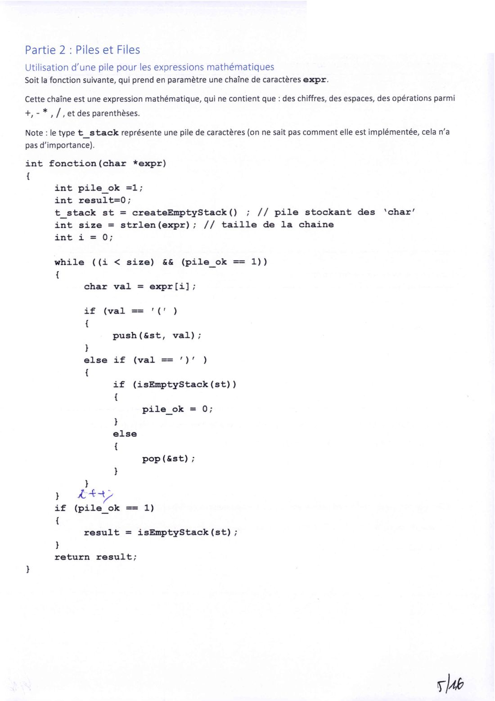{ loading=lazy .papier }](papier/de2024/de2024-p05.jpg)
    <p class="papier-legende">Partie 2 — la fonction à analyser · DE 2024, p. 5/16</p>

    [{ loading=lazy .papier }](papier/de2024/de2024-p06.jpg)
    <p class="papier-legende">Partie 2 : questions 1 à 3 · DE 2024, p. 6/16</p>

    [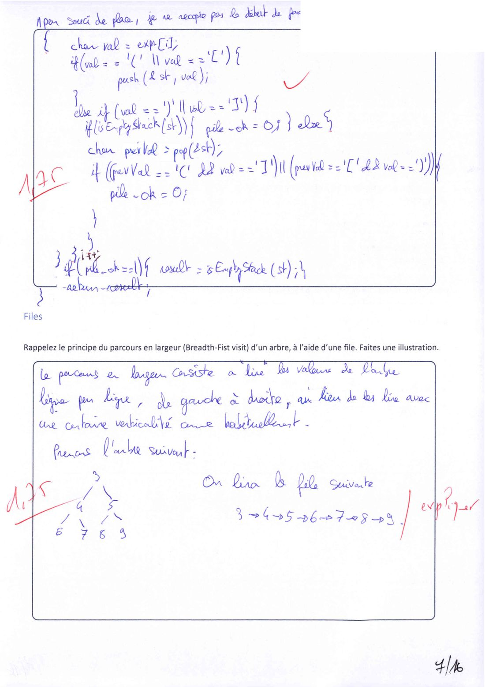{ loading=lazy .papier }](papier/de2024/de2024-p07.jpg)
    <p class="papier-legende">Partie 2 : crochets, parcours en largeur · DE 2024, p. 7/16</p>

    [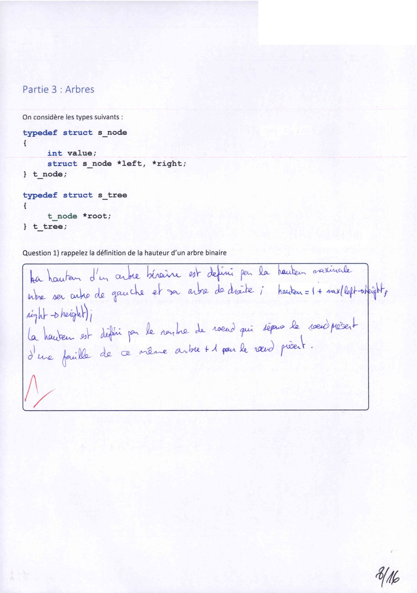{ loading=lazy .papier }](papier/de2024/de2024-p08.jpg)
    <p class="papier-legende">Partie 3 — arbres : définition de la hauteur · DE 2024, p. 8/16</p>

    [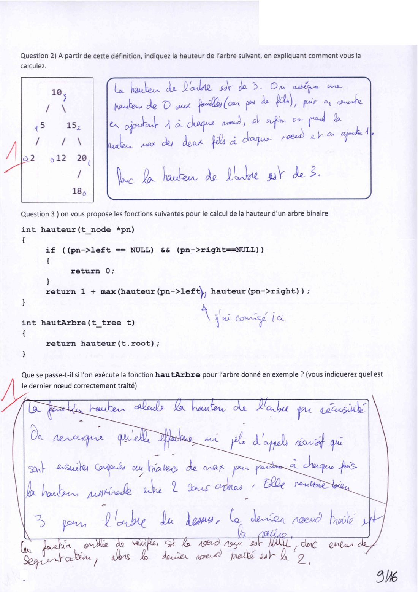{ loading=lazy .papier }](papier/de2024/de2024-p09.jpg)
    <p class="papier-legende">Partie 3 : hauteur, fonction hauteur() fausse · DE 2024, p. 9/16</p>

    [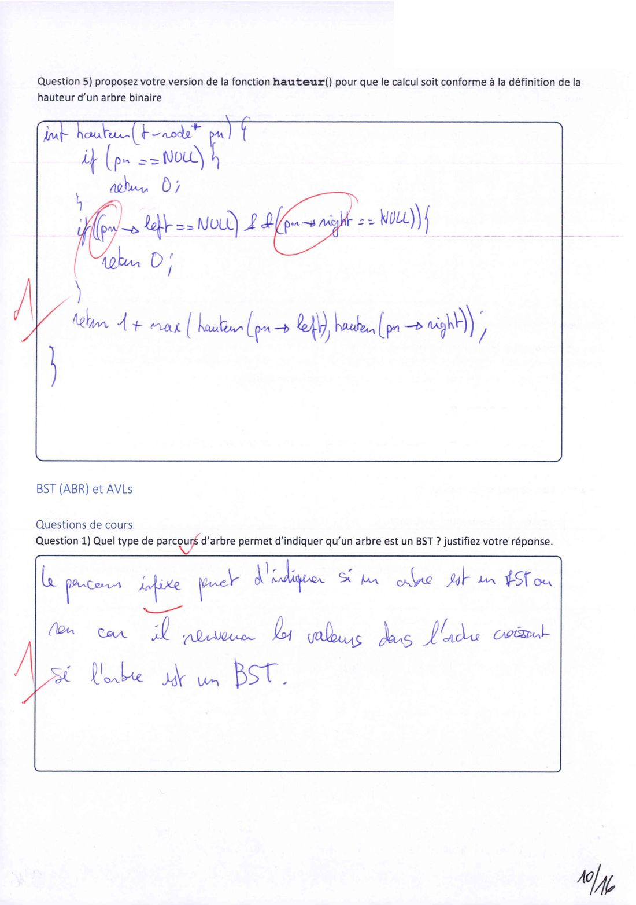{ loading=lazy .papier }](papier/de2024/de2024-p10.jpg)
    <p class="papier-legende">Partie 3 : hauteur() corrigée, ABR question 1 · DE 2024, p. 10/16</p>

    [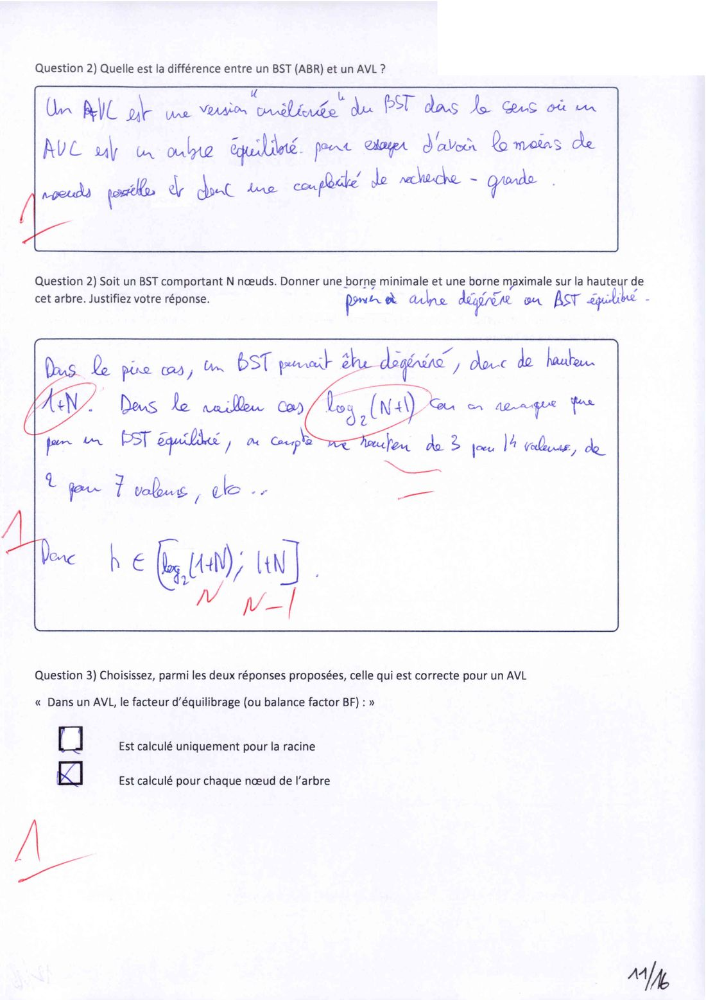{ loading=lazy .papier }](papier/de2024/de2024-p11.jpg)
    <p class="papier-legende">ABR / AVL : questions 2 et 3 · DE 2024, p. 11/16</p>

    [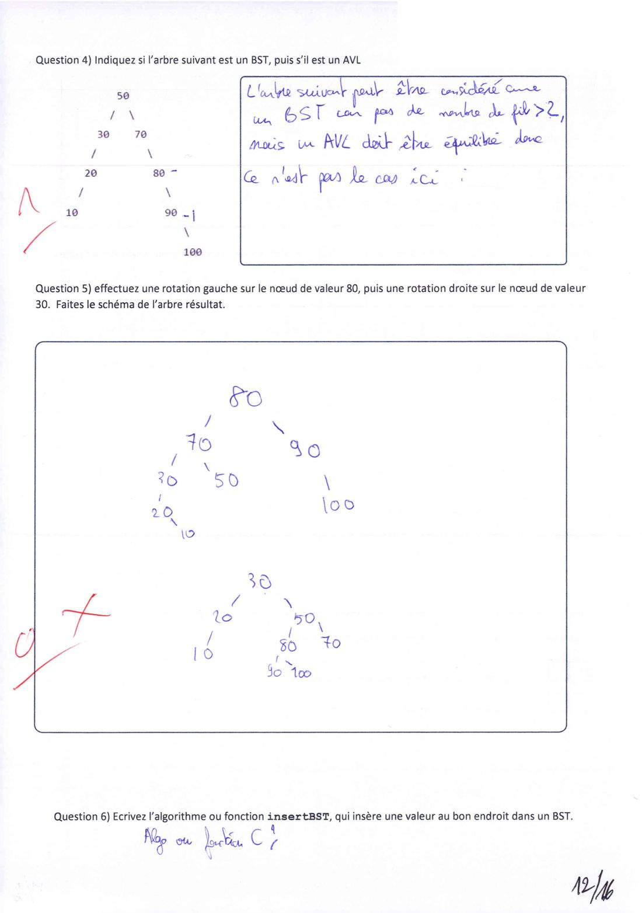{ loading=lazy .papier }](papier/de2024/de2024-p12.jpg)
    <p class="papier-legende">ABR / AVL : questions 4 à 6 · DE 2024, p. 12/16</p>

    [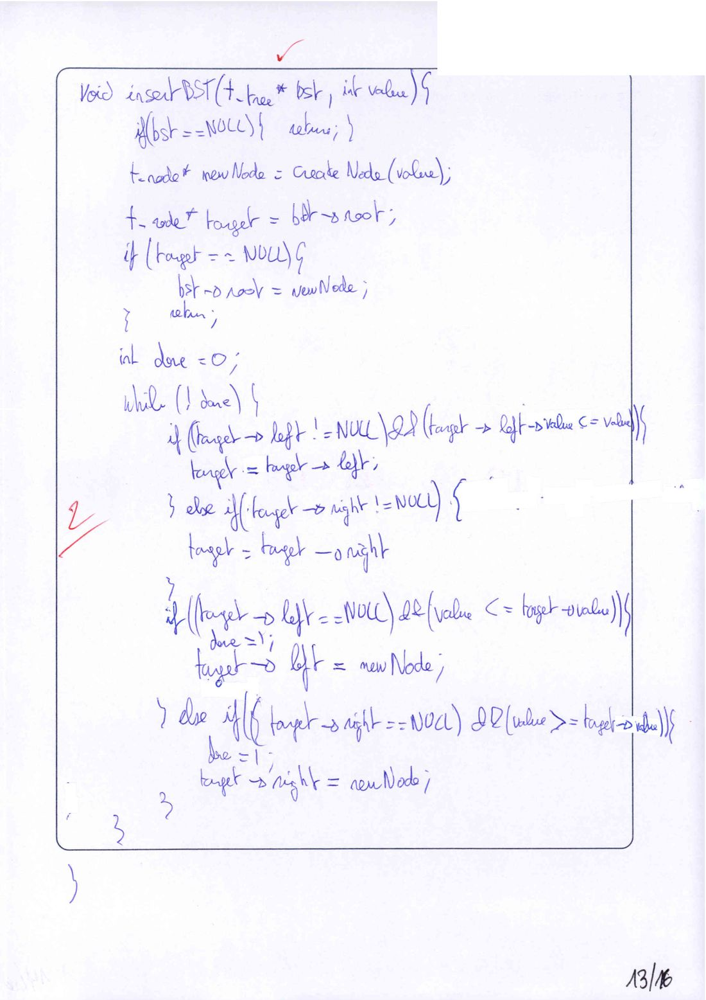{ loading=lazy .papier }](papier/de2024/de2024-p13.jpg)
    <p class="papier-legende">Question 6 : insertBST · DE 2024, p. 13/16</p>

    [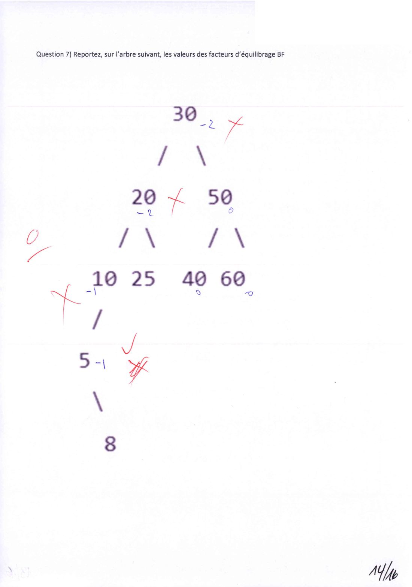{ loading=lazy .papier }](papier/de2024/de2024-p14.jpg)
    <p class="papier-legende">Question 7 : facteurs d'équilibre · DE 2024, p. 14/16</p>

    [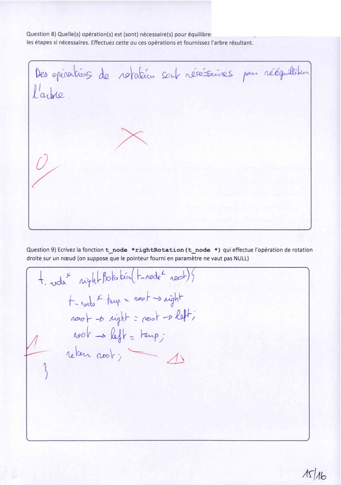{ loading=lazy .papier }](papier/de2024/de2024-p15.jpg)
    <p class="papier-legende">Questions 8 et 9 : équilibrage, rightRotation() · DE 2024, p. 15/16</p>

    [{ loading=lazy .papier }](papier/de2024/de2024-p16.jpg)
    <p class="papier-legende">Question 10 : arbre impossible · DE 2024, p. 16/16</p>
