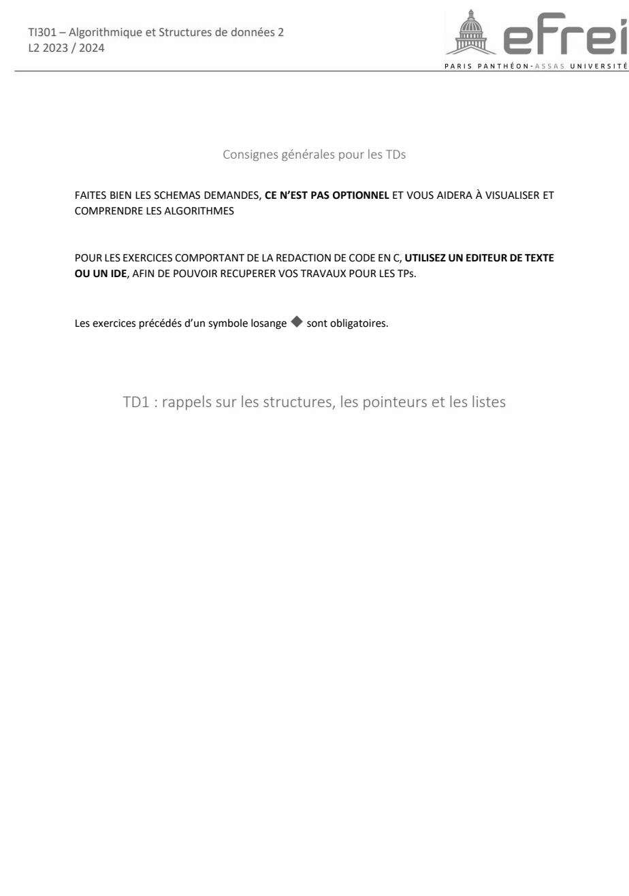
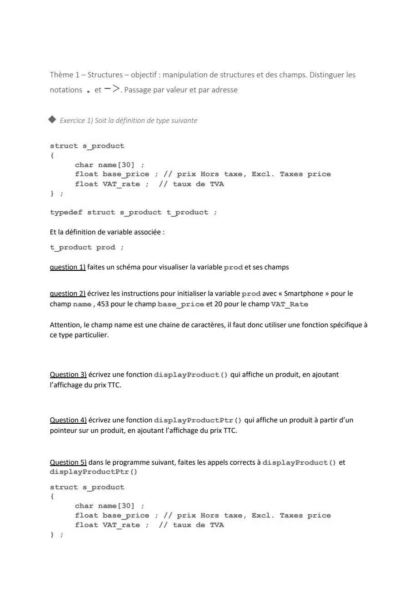
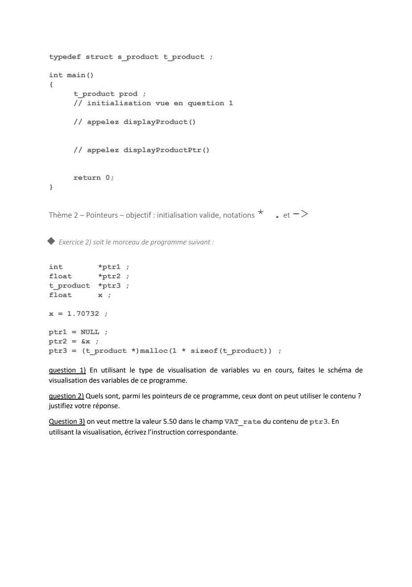
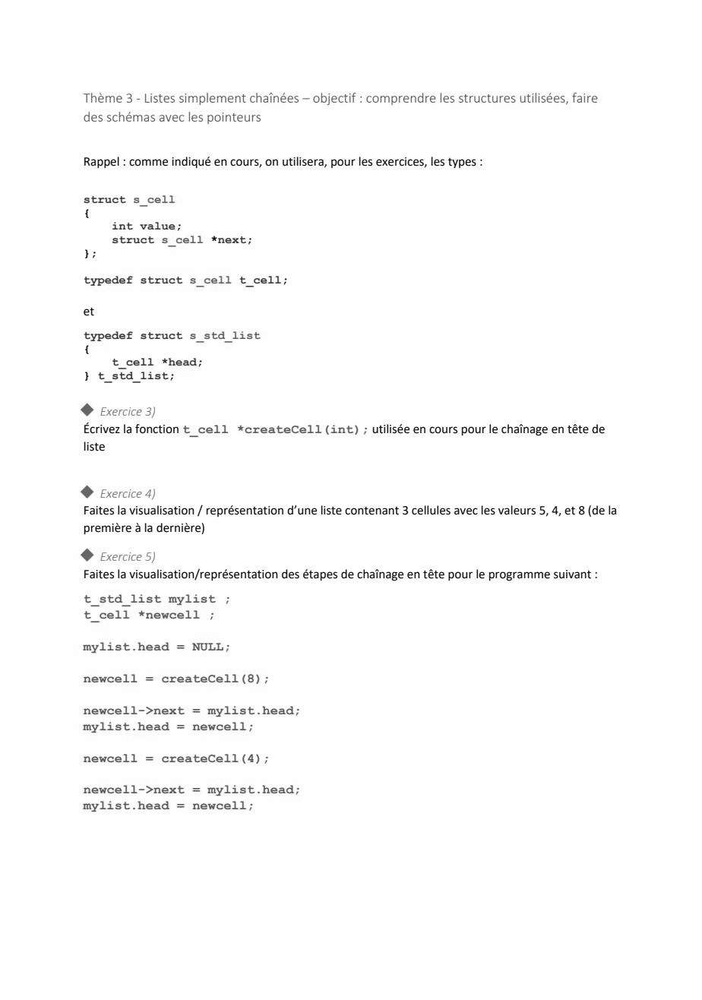
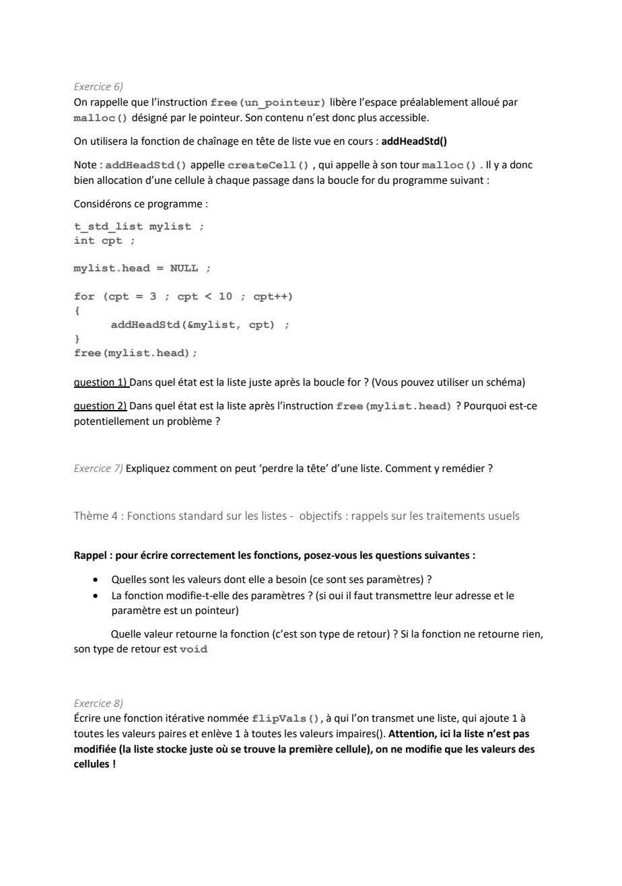
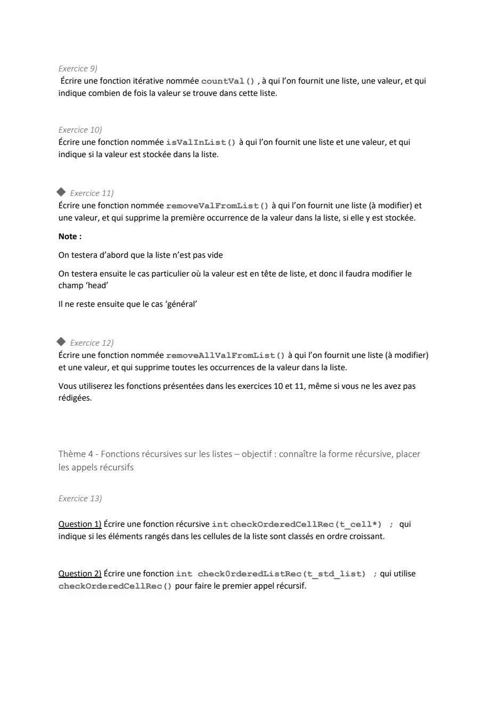

# TD 1 — Rappels sur les listes (lecteur de musique)

=== "Version simplifiée"

    Énoncé : `2627_FR_TD1_TI301.docx`. Rappels : [chapitre 1](../cours/chapitre-1-listes-simples.md).
    Fil rouge : la playlist d'un lecteur de musique, chaque cellule stocke l'ID
    entier d'un morceau.

    ```c
    typedef struct s_cell { int value; struct s_cell *next; } t_cell;
    typedef struct s_list { t_cell *head; } t_list;
    ```

    !!! tip "Consigne du TD"
        Les **schémas sont obligatoires** : variable `t_list`, son champ `head`,
        chaque cellule (`value` et `next`), les adresses (@) et `NULL`.

    ## Exercice 1 — Visualisation de listes

    **a)** `t_list playlist_1;` (déclaration sans initialisation).

    ??? success "Correction"
        `playlist_1.head` contient une **valeur indéterminée** (ce qui traînait en
        mémoire). C'est dangereux : la liste n'est pas « vide », elle pointe
        n'importe où. Un parcours lirait une zone mémoire au hasard (plantage ou
        données absurdes). Toujours initialiser avec `createList()`.

        ```text
         playlist_1
        ┌──────┐
        │ head │──▶ ???
        └──────┘
        ```

    **b)** `playlist_2 = createList();`

    ??? success "Correction"
        `playlist_2.head == NULL` : c'est la liste **vide**, bien initialisée.

    **c)** Trois `addCell(&playlist_3, …)` avec 104, puis 101, puis 108 (ajouts en
    tête). *L'énoncé écrit `&list_3` : c'est bien `&playlist_3`.*

    ??? success "Correction"
        ```text
         playlist_3
        ┌──────┐
        │ head │──▶ [ 108 | @ ]──▶ [ 101 | @ ]──▶ [ 104 | NULL ]
        └──────┘
        ```
        Ordre : **108, 101, 104** — l'inverse de l'ordre d'ajout. Chaque ajout en
        tête place la nouvelle cellule **devant** les précédentes. (108 = *bad guy*,
        101 = *If you don't get what you want*, 104 = *Lose Yourself*.)

    ## Exercice 2 — Recherche de valeur (complément de cours)

    **a)** `int searchList(t_list list, int valeur);` avec un pointeur `curr`.

    ??? success "Correction"
        - Arrêt « trouvé » : `curr->value == valeur`.
        - Arrêt « non trouvé » : `curr == NULL` (fin de liste).
        - La liste est passée **par valeur** car la recherche ne modifie pas `head`
          (règle de modification) : une copie suffit.

        ```c
        int searchList(t_list list, int valeur)
        {
            t_cell *curr = list.head;
            while (curr != NULL && curr->value != valeur)  /* NULL testé EN PREMIER */
            {
                curr = curr->next;
            }
            return (curr != NULL);   /* 1 si on s'est arrêté sur la valeur */
        }
        ```

    **b)** Retourner l'**adresse** de la cellule : `t_cell *searchListPtr(t_list list, int valeur);`

    ??? success "Correction"
        « Non trouvé » se symbolise par **`NULL`** pour un pointeur.

        ```c
        t_cell *searchListPtr(t_list list, int valeur)
        {
            t_cell *curr = list.head;
            while (curr != NULL && curr->value != valeur)
            {
                curr = curr->next;
            }
            return curr;             /* NULL si absent */
        }
        ```

        **Complexité** : $O(N)$ dans le pire cas (valeur absente ou en dernier).

        **Pourquoi le prof préfère cette version** : elle porte **plus
        d'information**. On sait si la valeur est présente (`!= NULL`, donc la
        version 1 se déduit de la version 2), **et** on obtient la cellule
        elle-même : on peut lire ou modifier ses champs sans reparcourir la liste.

    ## Exercice 3 — Recherche récursive

    | Situation | Résultat |
    |-----------|----------|
    | `ptr_cell == NULL` | 0 : fin de liste, pas trouvé (cas de base) |
    | `ptr_cell->value == valeur` | 1 : trouvé (cas de base) |
    | sinon | `searchCellRec(ptr_cell->next, valeur)` (cas récursif) |

    ??? success "Correction"
        ```c
        int searchCellRec(t_cell *ptr_cell, int valeur)
        {
            if (ptr_cell == NULL)
            {
                return 0;
            }
            if (ptr_cell->value == valeur)
            {
                return 1;
            }
            return searchCellRec(ptr_cell->next, valeur);
        }

        int searchListRec(t_list list, int valeur)
        {
            return searchCellRec(list.head, valeur);   /* démarre la récursivité */
        }
        ```

        **Pourquoi deux fonctions ?** L'appel récursif porte sur `ptr_cell->next`,
        de type `t_cell *`, alors que la liste est de type `t_list` : une fonction
        qui prend une `t_list` ne peut pas s'appeler sur `next`. On écrit la
        récursion pour `t_cell *`, et une fonction « lanceur » pour `t_list`.

        **Complexités** : les deux versions sont en $O(N)$ en temps. La récursive
        consomme en plus $O(N)$ en **mémoire** (un appel empilé par cellule), contre
        $O(1)$ pour l'itérative.

    ## Exercice 4 — Modification de liste : `swapParity`

    Règle : niveau **pair** → $+1$, niveau **impair** → $-1$.

    ??? success "Correction"
        `4 → 3 → 5 → 1 → 6` devient **`5 → 2 → 4 → 0 → 7`**.

        La liste n'est **pas modifiée** au sens du cours : `head` pointe toujours
        sur la même cellule, seules les **valeurs** changent. Passage **par
        valeur** : la copie de la `t_list` contient le même `head`, donc on
        atteint les mêmes cellules.

        ```c
        void swapParity(t_list list)
        {
            t_cell *curr = list.head;
            while (curr != NULL)
            {
                if (curr->value % 2 == 0)
                {
                    curr->value = curr->value + 1;
                }
                else
                {
                    curr->value = curr->value - 1;
                }
                curr = curr->next;
            }
        }
        ```

        !!! piege "Niveaux négatifs"
            En C, `-3 % 2` vaut `-1`, pas `1`. Le test `% 2 == 0` reste correct
            pour les négatifs ; un test `% 2 == 1` ne le serait pas.

    ## Exercice 5 — Suppression : `deleteVal`

    Playlist : `112 → 107 → 134 → 107 → 105`.

    ??? success "Correction — tableau des cas"
        | Cas | Exemple | Que doit-il se passer ? | Liste modifiée ? |
        |-----|---------|-------------------------|:----------------:|
        | En tête | `deleteVal(…, 112)` | `head` passe sur la 2ᵉ cellule (107), on libère 112 | **oui** |
        | Au milieu | `deleteVal(…, 134)` | la précédente (107) pointe sur la suivante (107), on libère 134 | non |
        | En fin | `deleteVal(…, 105)` | la précédente pointe sur `NULL`, on libère 105 | non |
        | Absent | `deleteVal(…, 117)` | rien | non |
        | En double | `deleteVal(…, 107)` | seule la **première** occurrence est supprimée | non (ici) |

        Comme le cas « en tête » modifie `head`, la fonction prend un **pointeur**
        sur la liste.

    **b)** Pourquoi deux pointeurs ?

    ??? success "Correction"
        Pour supprimer `curr`, il faut modifier le `next` de la cellule **d'avant**
        (`prev->next = curr->next`). Or une liste simplement chaînée ne permet pas
        de revenir en arrière : on mémorise la précédente dans `prev` pendant le
        parcours.

    **c)** Compléter la fonction.

    ??? success "Correction"
        ```c
        void deleteVal(t_list *ptr_list, int id)
        {
            t_cell *curr = ptr_list->head;
            t_cell *prev = NULL;

            /* Étape 1 : parcourir jusqu'à trouver l'ID ou atteindre la fin */
            while (curr != NULL && curr->value != id)
            {
                prev = curr;
                curr = curr->next;
            }
            /* Étape 2 : ID absent */
            if (curr == NULL)
                return;
            /* Étape 3 : suppression en tête */
            if (prev == NULL)
                ptr_list->head = curr->next;
            /* Étape 4 : suppression en milieu ou fin */
            else
                prev->next = curr->next;
            /* Étape 5 : libération mémoire */
            free(curr);
        }
        ```

        `prev` est initialisé à `NULL` : s'il vaut encore `NULL` après la boucle,
        c'est qu'on ne s'est pas déplacé, donc que l'ID est **en tête**. La liste
        vide est gérée par l'étape 2 (`curr` vaut `NULL` dès le départ).

    ## Exercice 7 — Réutilisation : `removeAllValFromList`

    Supprimer **toutes** les occurrences, en réutilisant les fonctions précédentes.

    ??? success "Correction"
        ```c
        void removeAllValFromList(t_list *ptr_list, int val)
        {
            while (searchList(*ptr_list, val))   /* searchList attend une t_list */
            {
                deleteVal(ptr_list, val);        /* deleteVal attend un t_list * */
            }
        }
        ```

        Attention aux types : `*ptr_list` pour `searchList`, `ptr_list` pour
        `deleteVal`. Complexité : $O(N^2)$ dans le pire cas (chaque recherche et
        chaque suppression repartent du début). Une version en un seul parcours
        avec `prev` / `curr` serait en $O(N)$, mais la consigne demande la
        réutilisation.

    ## Exercice 8 — La liste est-elle triée ? (récursif)

    ??? success "Correction"
        Cas de base : une liste vide ou d'une seule cellule est triée. Sinon, on
        compare la cellule à sa suivante, et on continue sur le reste.

        ```c
        int checkOrderedCellRec(t_cell *ptr_cell)
        {
            if (ptr_cell == NULL || ptr_cell->next == NULL)
            {
                return 1;
            }
            if (ptr_cell->value > ptr_cell->next->value)
            {
                return 0;
            }
            return checkOrderedCellRec(ptr_cell->next);
        }

        int checkOrderedListRec(t_list list)
        {
            return checkOrderedCellRec(list.head);
        }
        ```

        Le test `ptr_cell->next == NULL` est indispensable avant de lire
        `ptr_cell->next->value`. *(L'énoncé écrit `check0rderedListRec` avec un
        zéro : c'est une coquille.)*

=== "Version papier"

    L'énoncé papier du TD 1 (livret 2023-2024, pages 1 à 6). Sa numérotation des exercices ne suit pas forcément celle de la version simplifiée. Les diapos de cours sont dans la [version papier du chapitre 1](../cours/chapitre-1-listes-simples.md).

    [{ loading=lazy .papier }](papier/td1/td1-p01.jpg)
    <p class="papier-legende">Page de titre — TD1 : rappels sur les structures, les pointeurs et les listes · TD 1 — énoncé 2023-2024, p. 1</p>

    [{ loading=lazy .papier }](papier/td1/td1-p02.jpg)
    <p class="papier-legende">Thème 1 — Structures : exercice 1 · TD 1 — énoncé 2023-2024, p. 2</p>

    [{ loading=lazy .papier }](papier/td1/td1-p03.jpg)
    <p class="papier-legende">Thème 2 — Pointeurs : exercice 2 · TD 1 — énoncé 2023-2024, p. 3</p>

    [{ loading=lazy .papier }](papier/td1/td1-p04.jpg)
    <p class="papier-legende">Thème 3 — Listes simplement chaînées : exercices 3 à 5 · TD 1 — énoncé 2023-2024, p. 4</p>

    [{ loading=lazy .papier }](papier/td1/td1-p05.jpg)
    <p class="papier-legende">Exercices 6 et 7 ; Thème 4 — Fonctions standard sur les listes : exercice 8 · TD 1 — énoncé 2023-2024, p. 5</p>

    [{ loading=lazy .papier }](papier/td1/td1-p06.jpg)
    <p class="papier-legende">Exercices 9 à 12 ; fonctions récursives sur les listes : exercice 13 · TD 1 — énoncé 2023-2024, p. 6</p>
