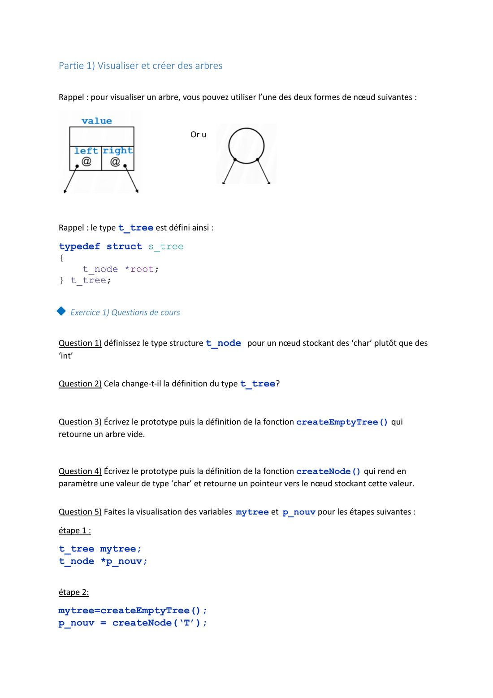
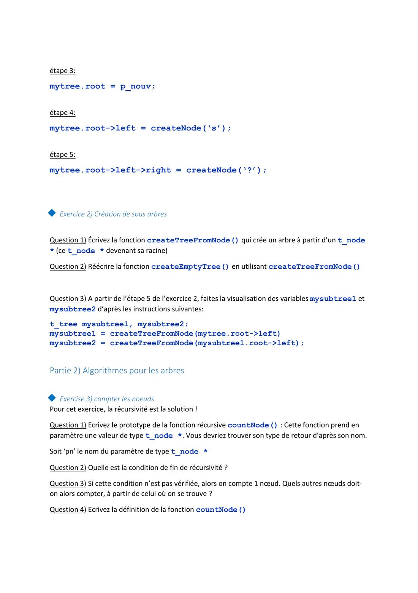
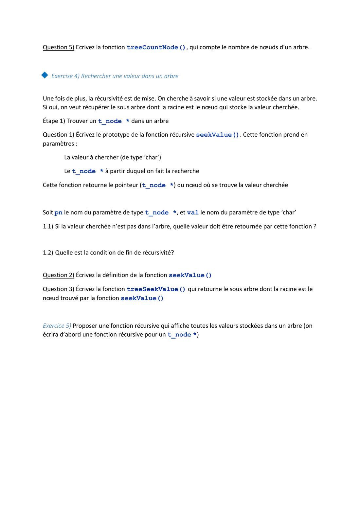

# TD 4 — Arbres binaires

=== "Version simplifiée"

    Énoncé : `FR_TD4_TI301.pdf` (version 2023-2024). Rappels :
    [chapitre 4](../cours/chapitre-4-arbres-binaires.md).

    ```c
    typedef struct s_tree { t_node *root; } t_tree;
    ```

    ## Partie 1 — Visualiser et créer des arbres

    ### Exercice 1 — Questions de cours

    ??? success "Correction"
        **Q1** — Nœud stockant des `char` :

        ```c
        typedef struct s_node
        {
            struct s_node *left;
            char value;
            struct s_node *right;
        } t_node;
        ```

        **Q2** — Non : `t_tree` ne contient qu'un `t_node *root`, il ne dépend pas
        du type stocké.

        **Q3** —

        ```c
        t_tree createEmptyTree(void);

        t_tree createEmptyTree(void)
        {
            t_tree t;
            t.root = NULL;
            return t;
        }
        ```

        **Q4** —

        ```c
        t_node *createNode(char val);

        t_node *createNode(char val)
        {
            t_node *pn = (t_node *)malloc(sizeof(t_node));
            pn->value = val;
            pn->left = NULL;
            pn->right = NULL;
            return pn;
        }
        ```

        **Q5** — Les cinq étapes :

        ```text
        1) t_tree mytree; t_node *p_nouv;     mytree.root ──▶ ?        p_nouv ──▶ ?

        2) mytree = createEmptyTree();        mytree.root ──▶ NULL
           p_nouv = createNode('T');          p_nouv ──▶ [NULL|'T'|NULL]

        3) mytree.root = p_nouv;              mytree.root ──┐
                                              p_nouv ───────┴─▶ [NULL|'T'|NULL]

        4) mytree.root->left = createNode('s');
                                                       'T'
                                                      /
                                                    's'

        5) mytree.root->left->right = createNode('?');
                                                       'T'
                                                      /
                                                    's'
                                                      \
                                                      '?'
        ```

    ### Exercice 2 — Créer des sous-arbres

    ??? success "Correction"
        **Q1–Q2** —

        ```c
        t_tree createTreeFromNode(t_node *pn)
        {
            t_tree t;
            t.root = pn;
            return t;
        }

        t_tree createEmptyTree(void)
        {
            return createTreeFromNode(NULL);
        }
        ```

        **Q3** — `mysubtree1.root` pointe sur le nœud `'s'` (le fils gauche de
        `'T'`) ; `mysubtree2.root` pointe sur le fils gauche de `'s'`, qui vaut
        **`NULL`** : `mysubtree2` est un arbre **vide**.

        Aucun nœud n'est copié : `mysubtree1` **partage** ses nœuds avec `mytree`.
        Modifier l'un modifie l'autre.

    ## Partie 2 — Algorithmes pour les arbres

    ### Exercice 3 — Compter les nœuds

    ??? success "Correction"
        **Q1** — `int countNode(t_node *pn);`

        **Q2** — Fin de récursivité : `pn == NULL` (on compte 0).

        **Q3** — On compte 1 (le nœud courant) **plus** les nœuds du sous-arbre
        gauche **plus** ceux du sous-arbre droit.

        **Q4–Q5** —

        ```c
        int countNode(t_node *pn)
        {
            if (pn == NULL)
            {
                return 0;
            }
            return 1 + countNode(pn->left) + countNode(pn->right);
        }

        int treeCountNode(t_tree t)
        {
            return countNode(t.root);
        }
        ```

    ### Exercice 4 — Rechercher une valeur

    ??? success "Correction"
        **Q1** — `t_node *seekValue(t_node *pn, char val);`

        - 1.1 — Valeur absente : on retourne **`NULL`**.
        - 1.2 — Deux cas d'arrêt : `pn == NULL` (pas trouvé dans ce sous-arbre) et
          `pn->value == val` (trouvé).

        **Q2** — L'arbre n'est pas un ABR : on ne sait pas de quel côté chercher, on
        essaie à gauche, puis à droite si on n'a rien trouvé.

        ```c
        t_node *seekValue(t_node *pn, char val)
        {
            t_node *res;
            if (pn == NULL)
            {
                return NULL;
            }
            if (pn->value == val)
            {
                return pn;
            }
            res = seekValue(pn->left, val);
            if (res == NULL)                     /* pas à gauche : on cherche à droite */
            {
                res = seekValue(pn->right, val);
            }
            return res;
        }
        ```

        **Q3** —

        ```c
        t_tree treeSeekValue(t_tree t, char val)
        {
            return createTreeFromNode(seekValue(t.root, val));   /* arbre vide si absent */
        }
        ```

        Complexité : $O(N)$ (on peut devoir visiter tous les nœuds). Dans un **ABR**,
        on choisirait le côté et on descendrait en $O(h)$.

    ### Exercice 5 — Afficher toutes les valeurs

    ??? success "Correction"
        N'importe quel parcours en profondeur convient, par exemple le préfixe :

        ```c
        void displayNode(t_node *pn)
        {
            if (pn != NULL)
            {
                printf("%c ", pn->value);
                displayNode(pn->left);
                displayNode(pn->right);
            }
        }

        void displayTree(t_tree t)
        {
            displayNode(t.root);
        }
        ```

        Déplacer le `printf` entre les deux appels donne l'infixe, après les deux
        appels le postfixe.

=== "Version papier"

    Énoncé du TD 4 (version 2023-2024, PDF).

    [{ loading=lazy .papier }](papier/td4/td4-p01.jpg)
    <p class="papier-legende">Consignes générales · TD 4, p. 1</p>

    [{ loading=lazy .papier }](papier/td4/td4-p02.jpg)
    <p class="papier-legende">Partie 1 — exercice 1 : questions de cours · TD 4, p. 2</p>

    [{ loading=lazy .papier }](papier/td4/td4-p03.jpg)
    <p class="papier-legende">Exercice 2 : sous-arbres ; partie 2 — exercice 3 : compter les nœuds · TD 4, p. 3</p>

    [{ loading=lazy .papier }](papier/td4/td4-p04.jpg)
    <p class="papier-legende">Exercice 4 : rechercher une valeur ; exercice 5 : afficher · TD 4, p. 4</p>
