# Chapitre 1 — Fonctions de plusieurs variables

=== "Version simplifiée"

    Jusqu'ici on étudiait $f(x)$ : une seule entrée. En pratique, une grandeur dépend
    souvent de plusieurs paramètres : la température $T(x, y)$ dépend de la longitude
    et de la latitude, le volume d'une boîte de ses trois dimensions. Dans ce cours,
    les fonctions vont de $\mathbb{R}^n$ dans $\mathbb{R}$, surtout avec $n = 2$.

    ## Définitions

    !!! definition "Fonction de deux variables"
        Une fonction de deux variables $f$ associe un réel $f(x, y)$ à chaque couple
        $(x, y)$ d'un ensemble $D_f \subset \mathbb{R}^2$.

        - $D_f$ est le **domaine de définition** : tous les points où l'on peut calculer $f$.
        - L'ensemble des valeurs prises par $f$ est l'**image** de $f$.

    Pour trois variables on note $(x, y, z)$, au-delà $(x_1, \dots, x_n)$.

    ## Domaine de définition

    Quand le domaine n'est pas imposé par l'énoncé, c'est l'ensemble de **toutes les
    valeurs autorisées**. On liste les contraintes :

    | Dans $f$ il y a… | Condition | Bord du domaine |
    |------------------|-----------|-----------------|
    | une fraction $\dfrac{A}{B}$ | $B \neq 0$ | exclu (pointillés) |
    | une racine $\sqrt{A}$ | $A \geq 0$ | inclus (trait plein) |
    | un logarithme $\ln A$ | $A > 0$ | exclu (pointillés) |
    | $\dfrac{1}{\sqrt{A}}$ | $A > 0$ | exclu |

    !!! methode "Trouver et dessiner $D_f$"
        1. Écrire toutes les conditions (dénominateur, racine, logarithme).
        2. Transformer chaque condition en une courbe connue : droite, parabole, cercle, ellipse, hyperbole.
        3. Pour savoir de quel côté de la courbe se trouve le domaine, **tester un point simple** comme $(0, 0)$.
        4. Tout dessiner sur le même graphique : la zone hachurée est l'intersection des conditions.

    ### Exemples du cours

    **(a)** $f(x, y) = \dfrac{\sqrt{x + y + 1}}{x - 1}$. On a $f(2, 3) = \dfrac{\sqrt{6}}{1} = \sqrt{6}$.

    Conditions : $x + y + 1 \geq 0$ et $x \neq 1$, donc

    $$
    D_f = \{(x, y) \in \mathbb{R}^2 \;/\; y \geq -x - 1,\; x \neq 1\}
    $$

    C'est le demi-plan **au-dessus** de la droite $y = -x - 1$ (droite incluse), privé de
    la droite verticale $x = 1$.

    **(b)** $g(x, y) = x \ln(y^2 - x)$. On a $g(2, 3) = 2 \ln 7$.

    Condition : $y^2 - x > 0 \iff x < y^2$. C'est la région **à gauche** de la parabole
    couchée $x = y^2$, parabole exclue.

    **(c)** Trois variables : $f(x, y, z) = \ln(z - y) + xy \sin z$. Seule condition :
    $z > y$. Le domaine est le demi-espace au-dessus du plan $z = y$.

    ## Courbes à reconnaître

    | Équation | Courbe |
    |----------|--------|
    | $(x - x_0)^2 + (y - y_0)^2 = R^2$ | cercle de centre $(x_0, y_0)$ et de rayon $R$ |
    | $y = a(x - x_0)^2 + y_0$ | parabole verticale de sommet $(x_0, y_0)$ ; minimum si $a > 0$ |
    | $x = a(y - y_0)^2 + x_0$ | parabole couchée de sommet $(x_0, y_0)$ ; ouverte vers la droite si $a > 0$ |
    | $\dfrac{(x - x_0)^2}{a^2} + \dfrac{(y - y_0)^2}{b^2} = 1$ | ellipse de centre $(x_0, y_0)$, demi-axes $a$ (en $x$) et $b$ (en $y$) |
    | $\dfrac{(x - x_0)^2}{a^2} - \dfrac{(y - y_0)^2}{b^2} = \pm 1$ | hyperbole (horizontale avec $+1$, verticale avec $-1$) |
    | $xy = k$, $k \neq 0$ | hyperbole dont les asymptotes sont les axes |

    !!! tip "Mettre sous forme d'ellipse"
        $9 - x^2 - 9y^2 > 0 \iff \dfrac{x^2}{9} + y^2 < 1$ : intérieur de l'ellipse de
        demi-axes 3 et 1. On divise tout par le terme constant pour faire apparaître le $= 1$.

    ## Graphe d'une fonction de deux variables

    !!! definition "Graphe"
        Le graphe de $f : D_f \subset \mathbb{R}^n \to \mathbb{R}$ est l'ensemble
        $\{(X, f(X)) \;/\; X \in D_f\} \subset \mathbb{R}^{n+1}$.

    Pour $n = 2$, c'est une **surface** de l'espace d'équation $z = f(x, y)$ : au-dessus
    de chaque point $(x, y)$ du domaine, on monte à la hauteur $f(x, y)$.

    Exemple : $f(x, y) = 8 - 2x - 4y$, soit $2x + 4y + z = 8$. C'est le **plan** qui passe
    par $(4, 0, 0)$, $(0, 2, 0)$ et $(0, 0, 8)$.

    ## Courbes de niveau

    !!! definition "Courbe de niveau $k$"
        $\{(x, y) \in D_f \;/\; f(x, y) = k\}$, avec $k \in \mathbb{R}$.

        C'est la coupe de la surface par le plan horizontal $z = k$, vue de dessus.
        Concrètement : le chemin à suivre pour rester à la même altitude, comme sur une
        carte IGN.

    !!! methode "Trouver les courbes de niveau"
        1. Écrire $f(x, y) = k$.
        2. Isoler pour reconnaître une équation connue.
        3. **Discuter selon $k$** : certaines valeurs donnent une courbe, d'autres un point, d'autres rien.

    **Exemple : l'hémisphère** $f(x, y) = 9 - x^2 - y^2$.

    $$
    f(x, y) = k \iff x^2 + y^2 = 9 - k
    $$

    - $k < 9$ : cercle de centre $O$ et de rayon $\sqrt{9 - k}$ (pour $k = 0$, rayon 3) ;
    - $k = 9$ : le seul point $(0, 0)$, le sommet ;
    - $k > 9$ : aucun point.

    **Exemple : un plan** $f(x, y) = 3 - x - \tfrac{2}{3}y$. Les courbes de niveau
    $x + \tfrac{2}{3}y = 3 - k$ sont des **droites parallèles**.

    ## Surfaces usuelles

    | Surface | Équation type | Courbes de niveau |
    |---------|---------------|-------------------|
    | Plan | $z = ax + by + c$ | droites parallèles |
    | Cylindre parabolique | $z = x^2$ | droites |
    | Paraboloïde | $z = x^2 + y^2$ | cercles |
    | Paraboloïde elliptique | $z = ax^2 + by^2$ ($a, b > 0$) | ellipses |
    | Paraboloïde hyperbolique (« selle ») | $z = x^2 - y^2$ | hyperboles |
    | Sphère | $(x - x_0)^2 + (y - y_0)^2 + (z - z_0)^2 = R^2$ | cercles |
    | Ellipsoïde | $\dfrac{(x - x_0)^2}{a^2} + \dfrac{(y - y_0)^2}{b^2} + \dfrac{(z - z_0)^2}{c^2} = 1$ | ellipses |

    ## Fonctions de trois variables ou plus

    Une fonction de trois variables ne se dessine pas : il faudrait 4 dimensions. On
    peut seulement représenter son **domaine** dans un repère 3D. Ses « courbes » de
    niveau $f(x, y, z) = k$ sont des **surfaces**.

=== "Version papier"

    Les pages du poly pour le chapitre 1 (cours d'Elie Chahine, 2022-2023). Les exercices sont dans la [version papier du TD 1](../td/td-1-fonctions.md).

    [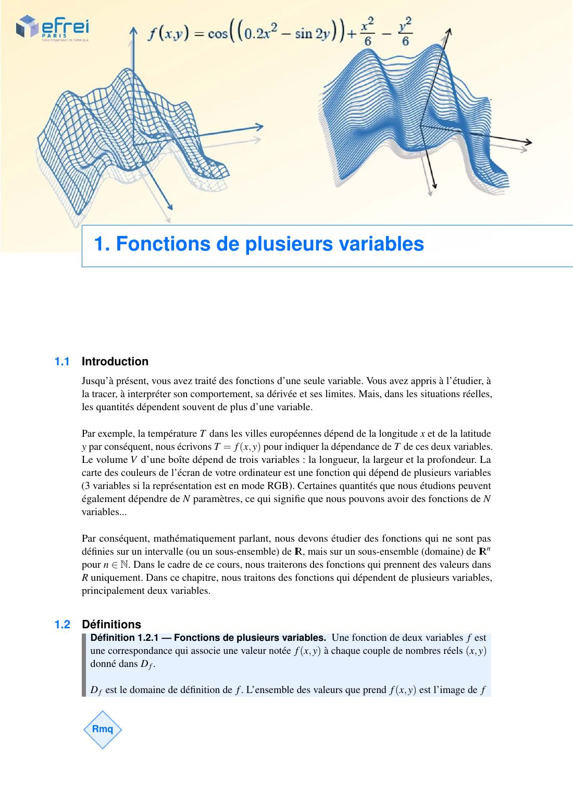{ loading=lazy .papier }](papier/ch1/p05.jpg)
    
Introduction · Définitions · Chapitre 1, p. 5

    [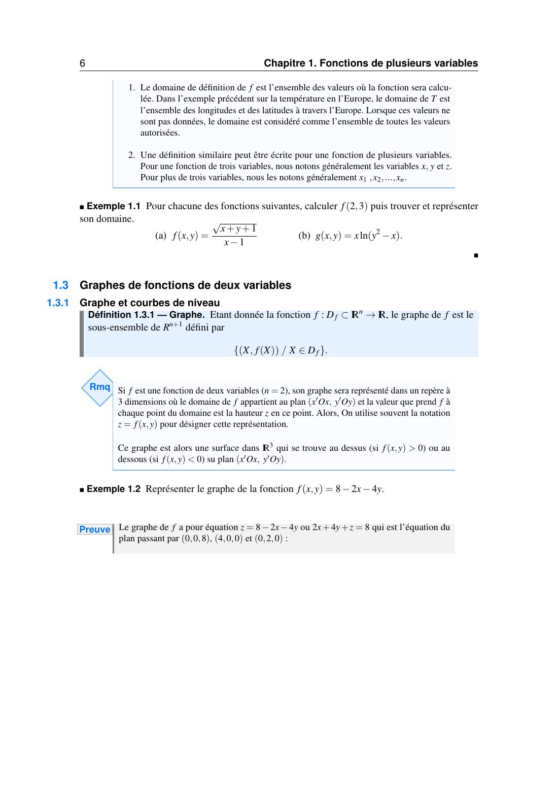{ loading=lazy .papier }](papier/ch1/p06.jpg)
    
Graphes de fonctions de deux variables · Graphe et courbes de niveau · Chapitre 1, p. 6

    [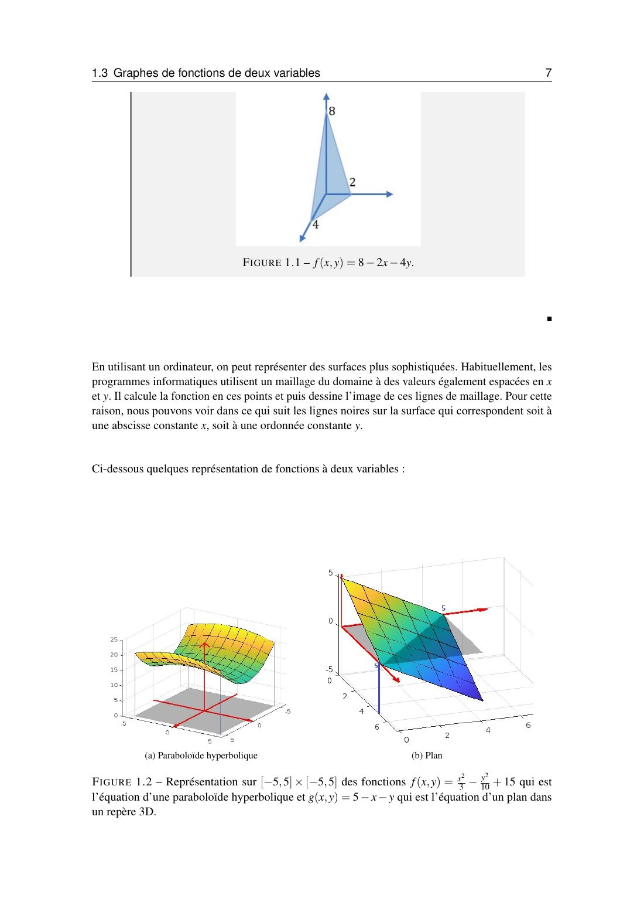{ loading=lazy .papier }](papier/ch1/p07.jpg)
    
Graphes de fonctions de deux variables · Chapitre 1, p. 7

    [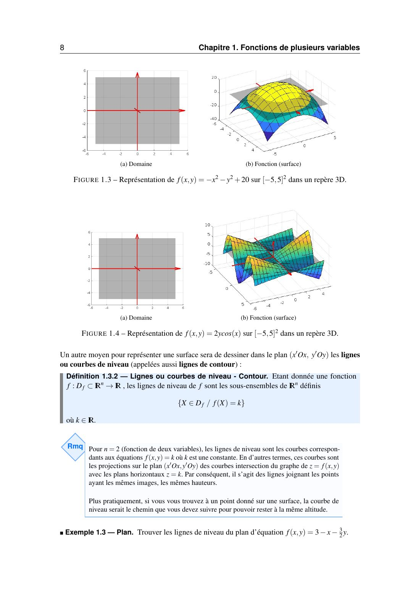{ loading=lazy .papier }](papier/ch1/p08.jpg)
    
Graphes de fonctions de deux variables (suite) · Chapitre 1, p. 8

    [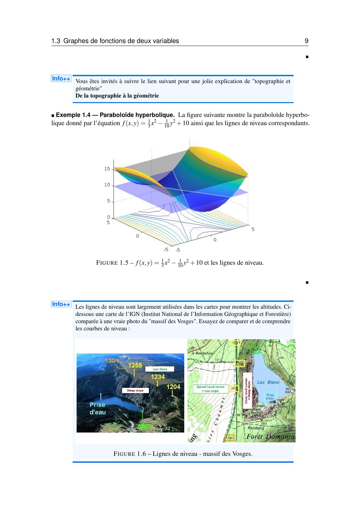{ loading=lazy .papier }](papier/ch1/p09.jpg)
    
Graphes de fonctions de deux variables · Chapitre 1, p. 9

    [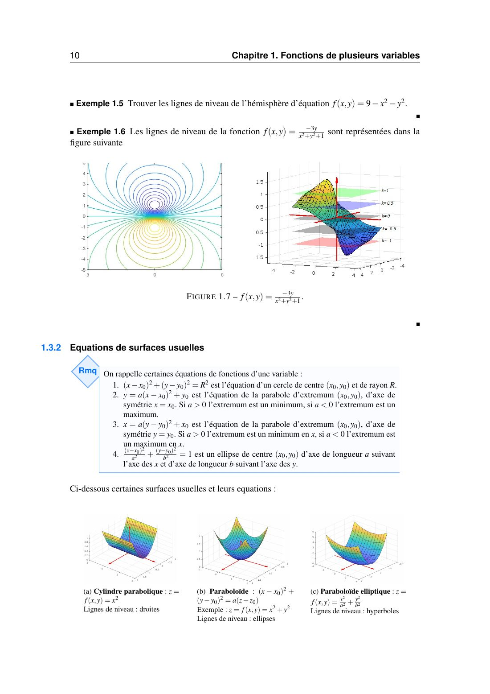{ loading=lazy .papier }](papier/ch1/p10.jpg)
    
Équations de surfaces usuelles · Chapitre 1, p. 10

    [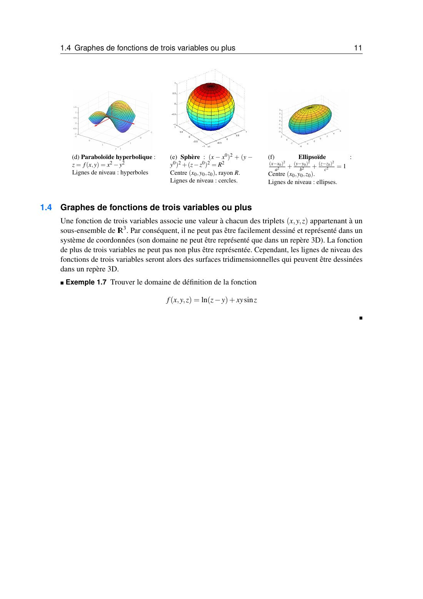{ loading=lazy .papier }](papier/ch1/p11.jpg)
    
Graphes de fonctions de trois variables ou plus · Chapitre 1, p. 11

    ### Corrigés des exemples du cours (en anglais)

    [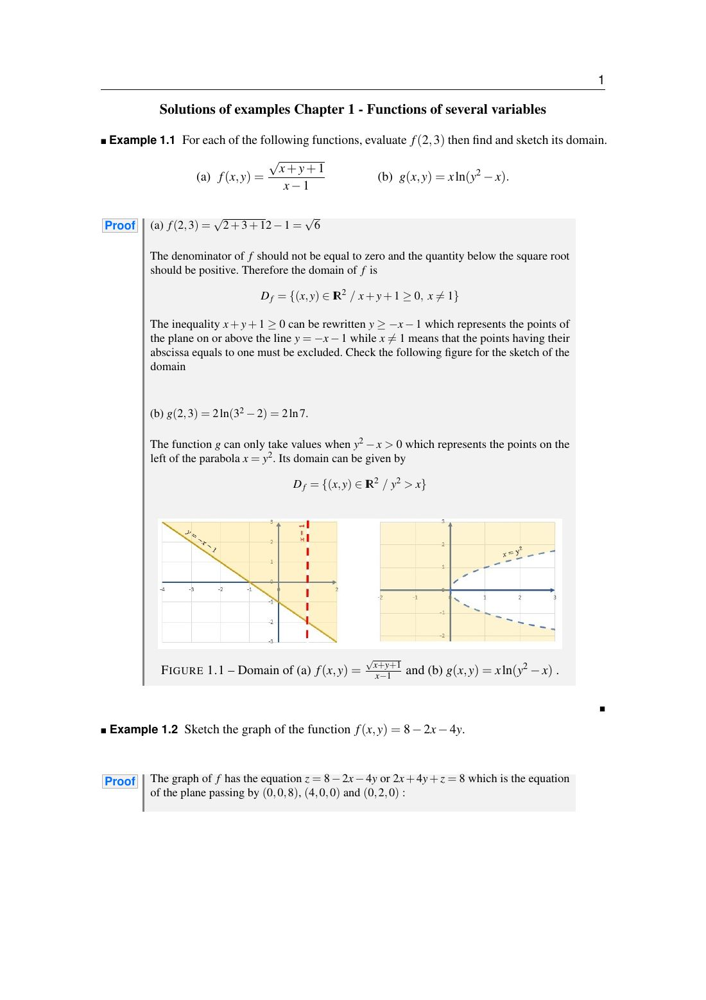{ loading=lazy .papier }](papier/ch1/corrige-01.jpg)
    
Corrigés des exemples du chapitre 1, page 1/4

    [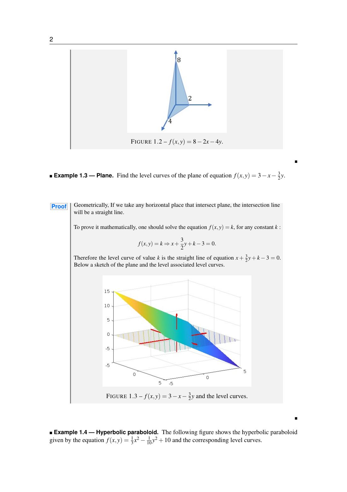{ loading=lazy .papier }](papier/ch1/corrige-02.jpg)
    
Corrigés des exemples du chapitre 1, page 2/4

    [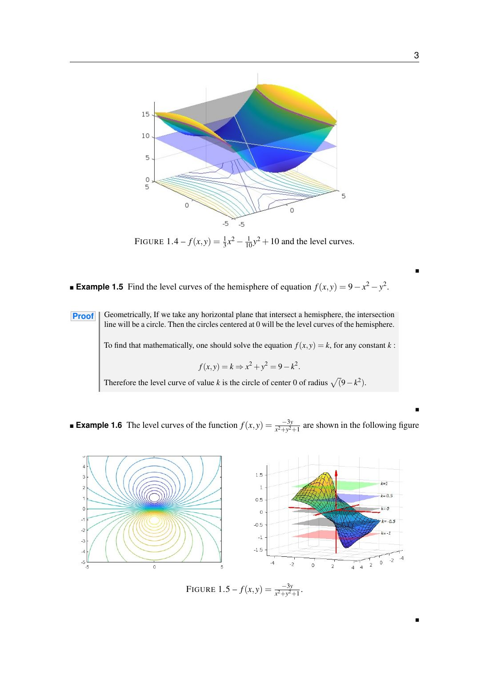{ loading=lazy .papier }](papier/ch1/corrige-03.jpg)
    
Corrigés des exemples du chapitre 1, page 3/4

    [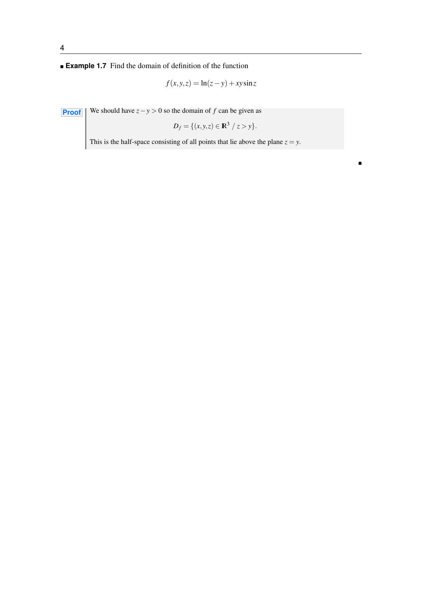{ loading=lazy .papier }](papier/ch1/corrige-04.jpg)
    
Corrigés des exemples du chapitre 1, page 4/4

