# Chapitre 4 — Intégrales multiples

=== "Version simplifiée"

    Une intégrale simple donne une aire sous une courbe. Une intégrale **double** donne le
    **volume** sous une surface $z = f(x, y)$ au-dessus d'un domaine $\Omega$ du plan :

    $$
    \iint_\Omega f(x, y)\, dx\, dy
    $$

    On le voit comme la somme de petites colonnes de base $dx \times dy$ et de hauteur
    $f(x, y)$. En pratique, on calcule **deux intégrales simples l'une après l'autre**
    (intégrales itérées).

    ## Domaine rectangulaire

    !!! theoreme "Théorème de Fubini (rectangle)"
        Si $f$ est continue sur $R = [a, b] \times [c, d]$ :

        $$
        \iint_R f(x, y)\,dx\,dy = \int_a^b \Big(\int_c^d f(x, y)\,dy\Big) dx = \int_c^d \Big(\int_a^b f(x, y)\,dx\Big) dy
        $$

        L'ordre d'intégration n'a pas d'importance. C'est encore vrai si $f$ est bornée,
        discontinue seulement sur un nombre fini de courbes, et que les intégrales existent.

    Dans l'intégrale intérieure, on intègre par rapport à une variable en **fixant l'autre**,
    exactement comme pour les dérivées partielles.

    - **Tranches verticales** : on fixe $x$, on intègre en $y$, puis on somme les tranches le long de $x$.
    - **Tranches horizontales** : on fixe $y$, on intègre en $x$, puis on somme le long de $y$.

    !!! tip "Deux cas particuliers"
        - $\iint_R dx\,dy = (b - a)(d - c)$ : l'aire du rectangle.
        - Variables séparées : $\displaystyle\iint_R g(x)h(y)\,dx\,dy = \Big(\int_a^b g(x)\,dx\Big)\Big(\int_c^d h(y)\,dy\Big)$.

    **Exemple 4.1** : $\displaystyle\int_0^3\!\!\int_1^2 x^2 y\,dy\,dx = \int_0^3 x^2 \Big[\frac{y^2}{2}\Big]_1^2 dx = \int_0^3 \frac{3}{2}x^2\,dx = \frac{27}{2}$, et on trouve pareil dans l'autre ordre.

    **Exemple 4.2** : $\iint_R y\sin(xy)$ sur $[1, 2] \times [0, \pi]$. Intégrer d'abord en $x$ est bien plus simple :
    $\int_1^2 y\sin(xy)\,dx = [-\cos(xy)]_1^2 = \cos y - \cos 2y$, puis $\int_0^\pi (\cos y - \cos 2y)\,dy = 0$.

    !!! piege "Choisir l'ordre"
        Les deux ordres donnent le même résultat, mais l'un peut être beaucoup plus long.
        Si une primitive est pénible dans un sens, essaie l'autre.

    **Exemple 4.3** : $\displaystyle\iint_{[0,\pi/2]^2} \cos y \sin x\,dx\,dy = \Big(\int_0^{\pi/2}\sin x\,dx\Big)\Big(\int_0^{\pi/2}\cos y\,dy\Big) = 1$.

    ## Domaine borné quelconque

    !!! theoreme "Théorème de Fubini (domaine borné)"
        **Tranches verticales.** Si $\Omega = \{a \leq x \leq b,\; \varphi_1(x) \leq y \leq \varphi_2(x)\}$ :

        $$
        \iint_\Omega f\,dx\,dy = \int_a^b \int_{\varphi_1(x)}^{\varphi_2(x)} f(x, y)\,dy\,dx
        $$

        **Tranches horizontales.** Si $\Omega = \{c \leq y \leq d,\; \psi_1(y) \leq x \leq \psi_2(y)\}$ :

        $$
        \iint_\Omega f\,dx\,dy = \int_c^d \int_{\psi_1(y)}^{\psi_2(y)} f(x, y)\,dx\,dy
        $$

    !!! methode "Mettre en place les bornes"
        1. **Dessiner le domaine** et trouver les points d'intersection des courbes.
        2. Choisir les tranches. Pour des tranches verticales : les bornes de $x$ sont des **nombres** (le $x$ min et le $x$ max du domaine), les bornes de $y$ sont des **fonctions de $x$** (la courbe du bas et celle du haut).
        3. Si la courbe du bas ou du haut change en cours de route, couper le domaine en deux (additivité).
        4. L'intégrale intérieure a des bornes variables, l'intégrale extérieure des bornes constantes. Jamais l'inverse.

    !!! theoreme "Propriétés"
        - Additivité : $\iint_{\Omega_1\cup\Omega_2} f = \iint_{\Omega_1} f + \iint_{\Omega_2} f$ (domaines disjoints).
        - Linéarité : $\iint (\alpha f + g) = \alpha\iint f + \iint g$.
        - Positivité et comparaison : $f \leq g \Rightarrow \iint f \leq \iint g$.
        - $\iint_\Omega dx\,dy$ est l'**aire** de $\Omega$.

    **Exemple 4.5** : $\iint_D (x + 2y)$ où $D$ est délimité par $y = 2x^2$ et $y = 1 + x^2$.
    Intersections : $2x^2 = 1 + x^2 \iff x = \pm 1$, et $2x^2 \leq y \leq 1 + x^2$ entre les deux.

    $$
    \int_{-1}^{1}\int_{2x^2}^{1+x^2} (x + 2y)\,dy\,dx = \int_{-1}^{1} \big(-3x^4 - x^3 + 2x^2 + x + 1\big)\,dx = \frac{32}{15}
    $$

    **Variante de l'exemple 4.7** (volume sous $x^2 + y^2$, entre $y = 2x$ et $y = x^2$) : intersections en
    $x = 0$ et $x = 2$, et sur $[0, 2]$ c'est la parabole qui est en dessous ($x^2 \leq 2x$) :

    $$
    \int_0^2\int_{x^2}^{2x} (x^2 + y^2)\,dy\,dx = \frac{216}{35}
    $$

    En tranches horizontales : $0 \leq y \leq 4$ et $\frac{y}{2} \leq x \leq \sqrt{y}$, même résultat.

    ## Changement de variables

    !!! theoreme "Changement de variables"
        Si $\phi : (u, v) \mapsto (x(u, v), y(u, v))$ est une bijection $C^1$ (de réciproque $C^1$) qui envoie $\Delta$ sur $\Omega$ :

        $$
        \iint_\Omega f(x, y)\,dx\,dy = \iint_\Delta f\big(x(u, v), y(u, v)\big)\, \lvert J_\phi(u, v)\rvert\, du\,dv,
        \qquad
        J_\phi = \begin{vmatrix} \dfrac{\partial x}{\partial u} & \dfrac{\partial x}{\partial v} \\[6pt] \dfrac{\partial y}{\partial u} & \dfrac{\partial y}{\partial v} \end{vmatrix}
        $$

        Le jacobien $J_\phi$ est le déterminant de la matrice des dérivées partielles. **Ne jamais l'oublier.**

    ### Coordonnées polaires

    $$
    x = r\cos\theta, \quad y = r\sin\theta, \quad dx\,dy = r\,dr\,d\theta
    $$

    Elles transforment les domaines circulaires en **rectangles** en $(r, \theta)$ :

    | Domaine | En polaires |
    |---------|-------------|
    | Disque $x^2 + y^2 \leq R^2$ | $0 \leq r \leq R$, $0 \leq \theta \leq 2\pi$ |
    | Couronne $1 \leq x^2 + y^2 \leq 4$, $y \geq 0$ | $1 \leq r \leq 2$, $0 \leq \theta \leq \pi$ |
    | Quart de disque $x, y \geq 0$, $x^2 + y^2 \leq 1$ | $0 \leq r \leq 1$, $0 \leq \theta \leq \frac{\pi}{2}$ |
    | $x \geq 0$, $y \geq -x$, $x^2 + y^2 \leq 4$ | $0 \leq r \leq 2$, $-\frac{\pi}{4} \leq \theta \leq \frac{\pi}{2}$ |

    !!! methode "Quand passer en polaires ?"
        Dès que le domaine est un disque, une couronne, un secteur, ou que $x^2 + y^2$ apparaît dans $f$.
        Pour trouver les bornes de $\theta$, regarde les droites qui limitent le secteur :
        $y = x$ correspond à $\theta = \frac{\pi}{4}$, $y = -x$ à $\theta = \frac{3\pi}{4}$ ou $-\frac{\pi}{4}$, l'axe $Oy$ à $\theta = \frac{\pi}{2}$.

    **Exemple 4.8** : $\iint_D (3x + 4y^2)$, $D$ = demi-couronne $1 \leq r \leq 2$, $y \geq 0$.

    $$
    \int_0^\pi\int_1^2 (3r\cos\theta + 4r^2\sin^2\theta)\,r\,dr\,d\theta
    = \underbrace{\int_0^\pi 3\cos\theta \cdot \frac{7}{3}\,d\theta}_{0} + \int_0^\pi 4\sin^2\theta\cdot\frac{15}{4}\,d\theta = \frac{15\pi}{2}
    $$

    **Exemple 4.9** : volume sous $z = 1 - x^2 - y^2$ et au-dessus de $z = 0$ (domaine $r \leq 1$) :

    $$
    \int_0^{2\pi}\int_0^1 (1 - r^2)\,r\,dr\,d\theta = 2\pi\Big[\frac{r^2}{2} - \frac{r^4}{4}\Big]_0^1 = \frac{\pi}{2}
    $$

    ## Intégrales triples

    Même principe en trois variables : on intègre une variable à la fois.

    !!! theoreme "Fubini en 3D"
        Sur un pavé $[a, b]\times[c, d]\times[e, f]$, l'ordre est libre.

        Sur un solide $\Omega = \{(x, y) \in D,\; \varphi_1(x, y) \leq z \leq \varphi_2(x, y)\}$ où $D$ est la projection de $\Omega$ sur le plan $(x, y)$ :

        $$
        \iiint_\Omega f\,dx\,dy\,dz = \iint_D \Big(\int_{\varphi_1(x,y)}^{\varphi_2(x,y)} f(x, y, z)\,dz\Big)\,dx\,dy
        $$

    **Exemple 4.10** : $\displaystyle\iiint_B xyz^2$ sur $[0, 1]\times[-1, 2]\times[0, 3]$ $= \frac12 \cdot \frac32 \cdot 9 = \frac{27}{4}$ (variables séparées).

    **Exemple 4.11** : $\iiint_\Omega z$ sur le tétraèdre $x, y, z \geq 0$, $x + y + z \leq 1$ :
    $0 \leq x \leq 1$, $0 \leq y \leq 1 - x$, $0 \leq z \leq 1 - x - y$, et le résultat vaut $\frac{1}{24}$.

    ### Coordonnées cylindriques et sphériques

    | | Formules | Élément de volume | Bornes pour tout l'espace |
    |-|----------|-------------------|---------------------------|
    | **Cylindriques** | $x = r\cos\theta$, $y = r\sin\theta$, $z = z$ | $r\,dr\,d\theta\,dz$ | $\theta \in [0, 2\pi]$ |
    | **Sphériques** | $x = r\sin\varphi\cos\theta$, $y = r\sin\varphi\sin\theta$, $z = r\cos\varphi$ | $r^2\sin\varphi\,dr\,d\varphi\,d\theta$ | $\theta \in [0, 2\pi]$, $\varphi \in [0, \pi]$ |

    - **Cylindriques** : pour les cylindres, les paraboloïdes $z = x^2 + y^2$, tout ce qui a un axe vertical.
    - **Sphériques** : pour les boules et les cônes. $\varphi$ est l'angle avec l'axe $Oz$ (0 en haut, $\pi$ en bas).

    **Exemple 4.12** : volume de la boule de rayon $R$.

    $$
    \int_0^{2\pi}\int_0^\pi\int_0^R r^2\sin\varphi\,dr\,d\varphi\,d\theta = 2\pi \cdot 2 \cdot \frac{R^3}{3} = \frac{4}{3}\pi R^3
    $$

    !!! piege "Erreurs fréquentes"
        - Oublier le $r$ (polaires, cylindriques) ou le $r^2\sin\varphi$ (sphériques).
        - Mettre $\varphi \in [0, 2\pi]$ : c'est $[0, \pi]$, sinon on compte l'espace deux fois.
        - Ne pas dessiner le domaine : la moitié des erreurs viennent des bornes.
        - Oublier les symétries : une fonction impaire en $y$ sur un domaine symétrique par rapport à $y = 0$ a une intégrale nulle.

=== "Version papier"

    Les pages du poly pour le chapitre 4 (cours d'Elie Chahine, 2022-2023). Les exercices sont dans la [version papier du TD 4](../td/td-4-integrales-multiples.md).

    [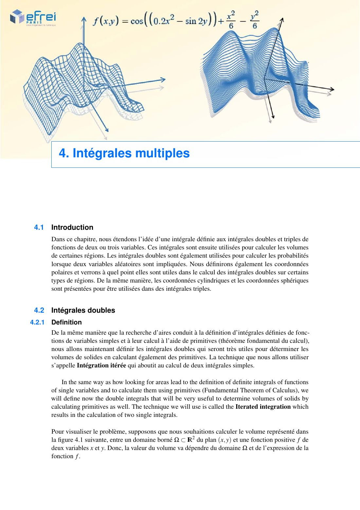{ loading=lazy .papier }](papier/ch4/p45.jpg)
    
Introduction · Intégrales doubles · Chapitre 4, p. 45

    [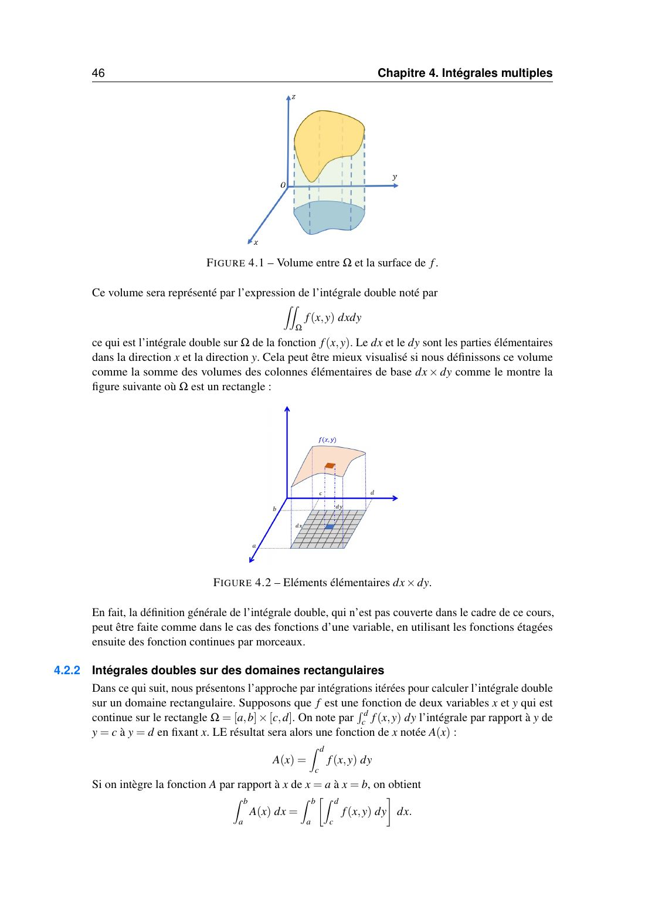{ loading=lazy .papier }](papier/ch4/p46.jpg)
    
Intégrales doubles sur des domaines rectangulaires · Chapitre 4, p. 46

    [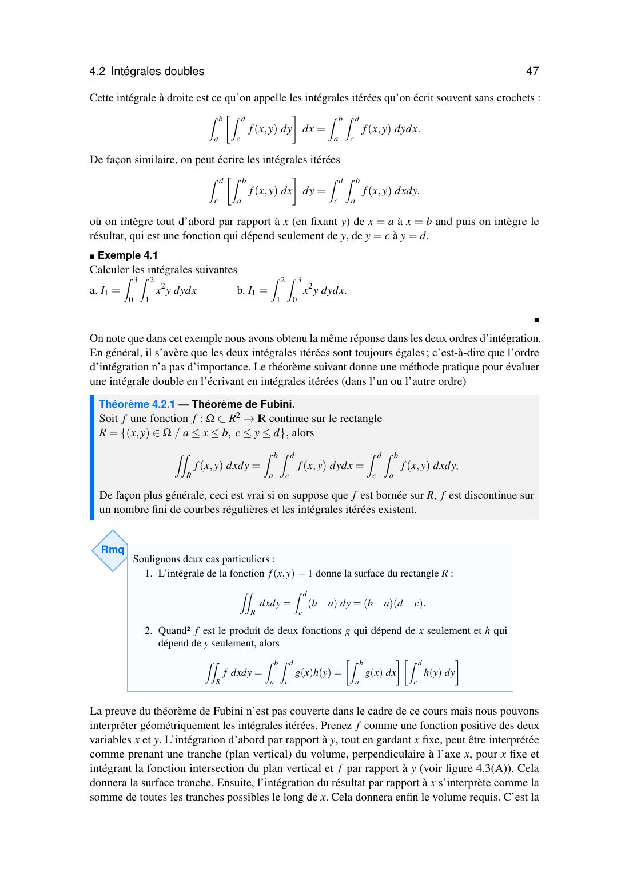{ loading=lazy .papier }](papier/ch4/p47.jpg)
    
Intégrales doubles · Chapitre 4, p. 47

    [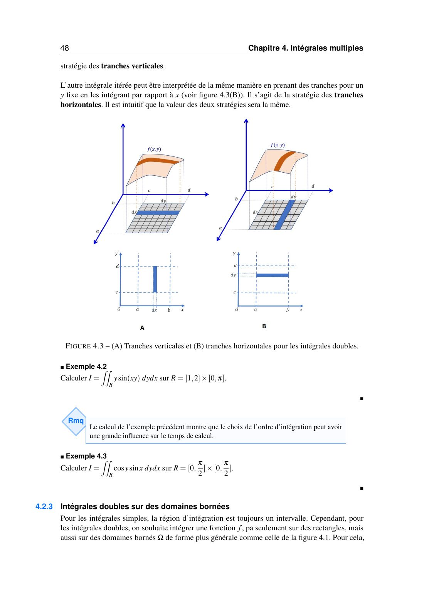{ loading=lazy .papier }](papier/ch4/p48.jpg)
    
Intégrales doubles sur des domaines bornés · Chapitre 4, p. 48

    [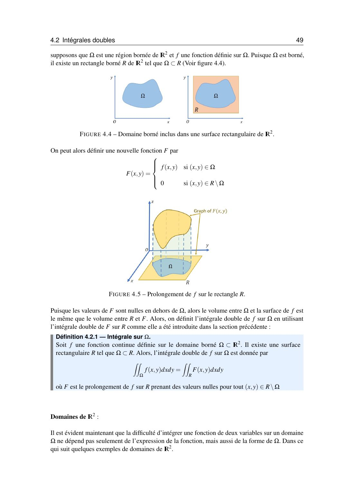{ loading=lazy .papier }](papier/ch4/p49.jpg)
    
Intégrales doubles · Chapitre 4, p. 49

    [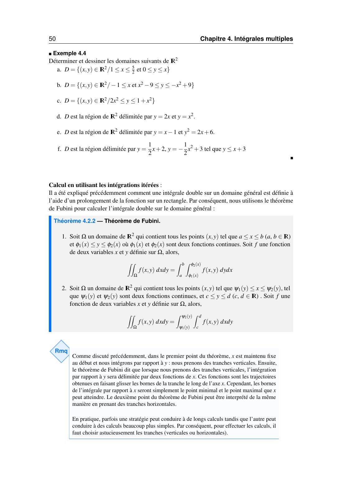{ loading=lazy .papier }](papier/ch4/p50.jpg)
    
Intégrales doubles (suite) · Chapitre 4, p. 50

    [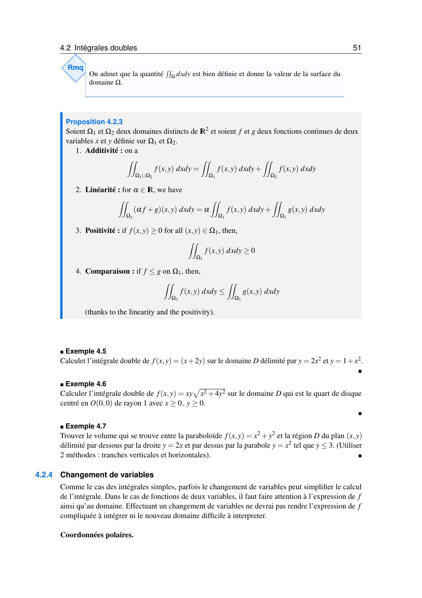{ loading=lazy .papier }](papier/ch4/p51.jpg)
    
Intégrales doubles · Changement de variables · Chapitre 4, p. 51

    [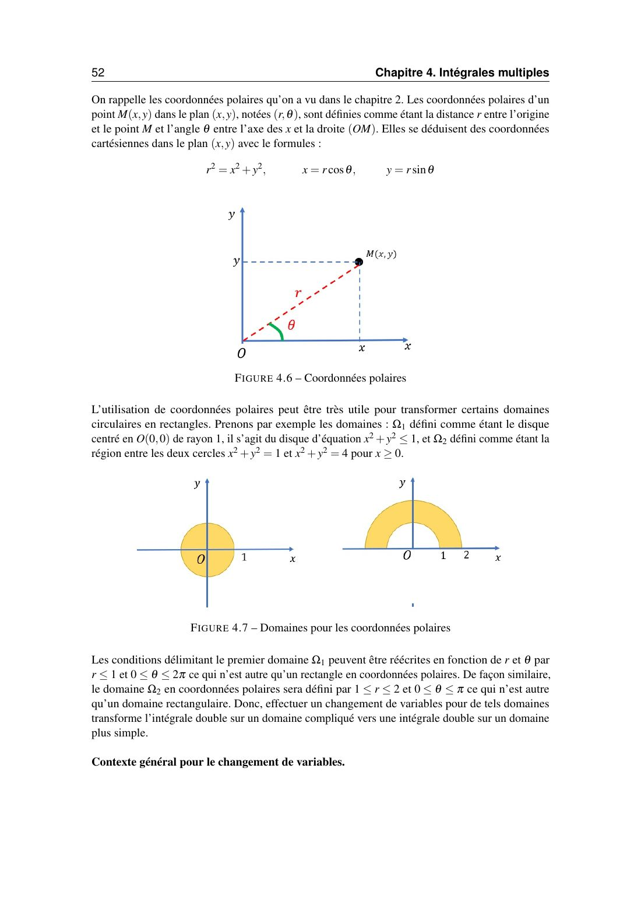{ loading=lazy .papier }](papier/ch4/p52.jpg)
    
Changement de variables (suite) · Chapitre 4, p. 52

    [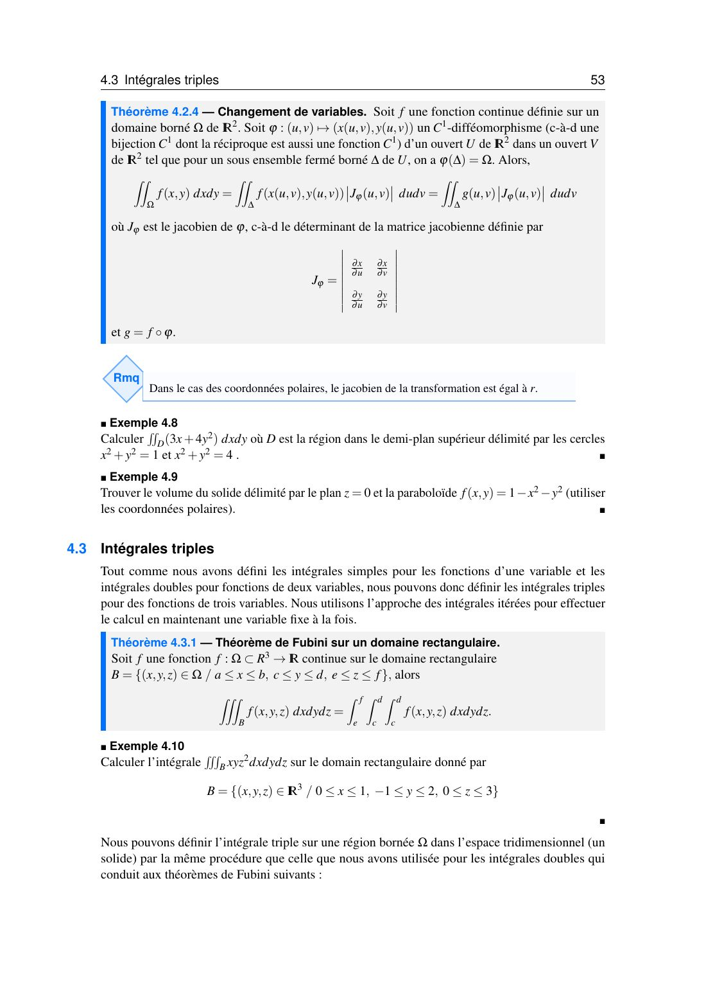{ loading=lazy .papier }](papier/ch4/p53.jpg)
    
Intégrales triples · Chapitre 4, p. 53

    [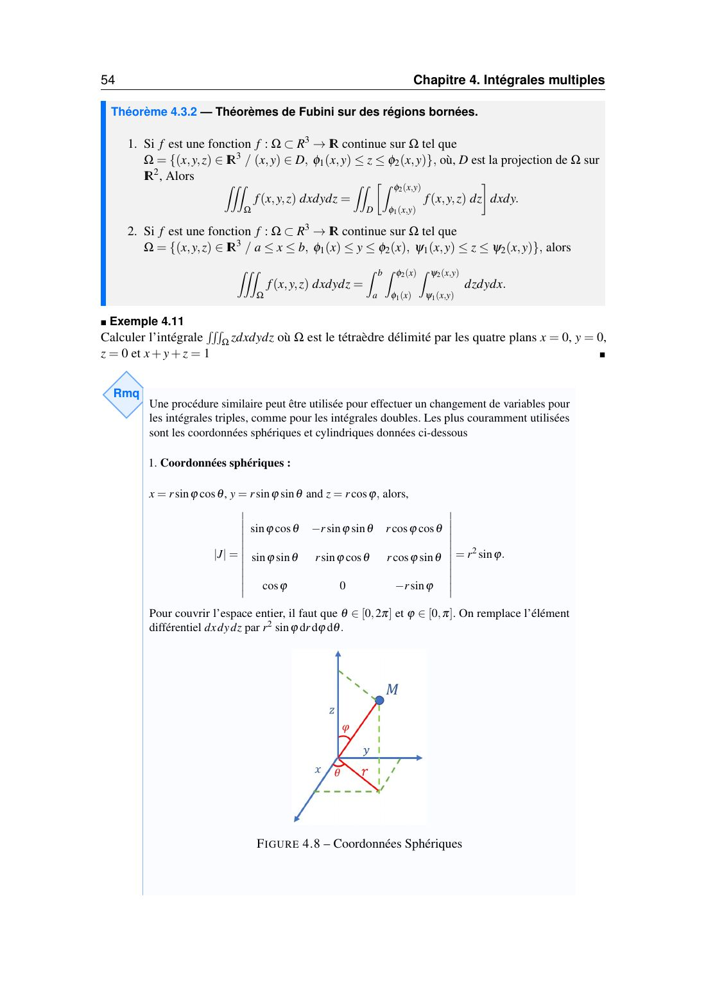{ loading=lazy .papier }](papier/ch4/p54.jpg)
    
Intégrales triples (suite) · Chapitre 4, p. 54

    [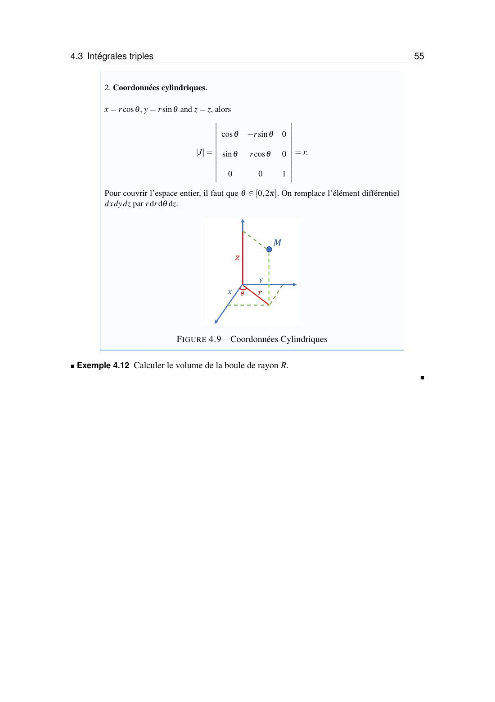{ loading=lazy .papier }](papier/ch4/p55.jpg)
    
Intégrales triples · Chapitre 4, p. 55

