# Chapitre 5 — Convexité

=== "Version simplifiée"

    ## Fonctions d'une variable

    Dans ce paragraphe, $I$ est un intervalle de $\mathbb{R}$.

    !!! definition "Fonction convexe"
        $f : I \to \mathbb{R}$ est **convexe** si

        $$
        \forall (x_1, x_2) \in I^2,\ \forall \lambda \in [0, 1],\quad
        f\big(\lambda x_1 + (1 - \lambda)x_2\big) \leq \lambda f(x_1) + (1 - \lambda) f(x_2)
        $$

        $f$ est **concave** si $-f$ est convexe.

    **Sens géométrique** : la courbe est **sous ses cordes**. Entre deux points
    $M_1(x_1, f(x_1))$ et $M_2(x_2, f(x_2))$, l'arc de courbe reste sous le segment $[M_1M_2]$.

    Exemples de fonctions convexes : $ax + b$, $x^2$, $e^x$, $\lvert x\rvert$. Les fonctions affines sont
    les seules à être à la fois convexes et concaves.

    !!! theoreme "Inégalité de Jensen"
        Si $f$ est convexe, pour des poids $\lambda_i \geq 0$ avec $\sum \lambda_i = 1$ :

        $$
        f\Big(\sum_{i=1}^n \lambda_i x_i\Big) \leq \sum_{i=1}^n \lambda_i f(x_i)
        $$

        Pour $f$ concave, l'inégalité est dans l'autre sens. Cas le plus utile : $\lambda_i = \frac1n$ (moyenne).

    !!! theoreme "Caractérisations équivalentes"
        - **Épigraphe** : $f$ est convexe si et seulement si $\{(x, y) \;/\; y \geq f(x)\}$ est un ensemble convexe.
        - **Pentes croissantes** : pour $x < y < z$, $\dfrac{f(x) - f(y)}{x - y} \leq \dfrac{f(x) - f(z)}{x - z} \leq \dfrac{f(y) - f(z)}{y - z}$.
        - $f$ dérivable : convexe $\iff$ $f'$ **croissante**.
        - $f$ deux fois dérivable : convexe $\iff$ $f'' \geq 0$ ; concave $\iff$ $f'' \leq 0$.
        - $f$ dérivable : convexe $\iff$ la courbe est **au-dessus de toutes ses tangentes** : $f(x) \geq f(a) + (x - a)f'(a)$.

    **Exemples**

    - $\ln$ est concave sur $]0, +\infty[$ : $(\ln x)'' = -\frac{1}{x^2} < 0$.
    - $e^x$, $x^2$, $x^4$ sont convexes : dérivée seconde positive.
    - $e^x \geq 1 + x$ : la tangente en 0 de $e^x$ (convexe) est $y = 1 + x$.
    - $\ln(1 + x) \leq x$ pour $x > -1$ : la tangente en 0 de $\ln(1 + x)$ (concave) est $y = x$, et la courbe est en dessous.

    !!! methode "Montrer une inégalité avec la convexité"
        1. Repérer une fonction convexe ou concave cachée ($\ln$, $e^x$, $x\ln x$, $\ln(1 + e^x)$…).
        2. Prouver sa convexité avec $f''$.
        3. Appliquer la définition (ou Jensen) aux bons points et avec les bons poids.
        4. Simplifier (souvent en passant à l'exponentielle).

        Exemple classique : $\ln$ concave donne $\ln\dfrac{a + b + c}{3} \geq \dfrac{\ln a + \ln b + \ln c}{3}$, donc $\dfrac{a + b + c}{3} \geq \sqrt[3]{abc}$ (moyenne arithmétique ≥ moyenne géométrique).

    ## Matrices (semi-)définies positives

    Une matrice symétrique $A$ est :

    - **semi-définie positive** (SDP) si $X^T A X \geq 0$ pour tout $X$ ;
    - **définie positive** si $X^T A X > 0$ pour tout $X \neq 0$ ;
    - **(semi-)définie négative** si $-A$ est (semi-)définie positive ;
    - **indéfinie** si elle n'est ni l'un ni l'autre.

    Pour $A = \begin{pmatrix} a & b \\ b & c\end{pmatrix}$ : $X^T A X = a x_1^2 + 2b x_1 x_2 + c x_2^2$.

    !!! theoreme "Critères pratiques"
        **Avec les valeurs propres** : SDP $\iff$ toutes $\geq 0$ ; définie positive $\iff$ toutes $> 0$.

        **Matrice $2\times2$** $\begin{pmatrix} a & b \\ b & c\end{pmatrix}$ :

        | Nature | Conditions |
        |--------|------------|
        | définie positive | $a > 0$ et $ac - b^2 > 0$ |
        | définie négative | $a < 0$ et $ac - b^2 > 0$ |
        | semi-définie positive | $a \geq 0$, $c \geq 0$, $ac - b^2 \geq 0$ |
        | semi-définie négative | $a \leq 0$, $c \leq 0$, $ac - b^2 \geq 0$ |
        | indéfinie | $ac - b^2 < 0$ |

        **Matrice $3\times3$** $\begin{pmatrix} a & b & c \\ b & d & e \\ c & e & f\end{pmatrix}$ :

        - **définie positive** $\iff$ les 3 mineurs principaux sont $> 0$ : $a > 0$, $\begin{vmatrix} a & b \\ b & d\end{vmatrix} > 0$, $\det A > 0$ ;
        - **SDP** $\iff$ $a, d, f \geq 0$, les trois déterminants $2\times2$ $\begin{vmatrix} a & b \\ b & d\end{vmatrix}$, $\begin{vmatrix} a & c \\ c & f\end{vmatrix}$, $\begin{vmatrix} d & e \\ e & f\end{vmatrix}$ sont $\geq 0$ et $\det A \geq 0$ ;
        - **semi-définie négative** : mêmes conditions avec $a, d, f \leq 0$, les déterminants $2\times2$ toujours $\geq 0$, et $\det A \leq 0$.

    !!! piege "Mineurs principaux et SDP"
        Pour **définie positive**, il suffit des mineurs « en coin » ($a$, puis le $2\times2$ en haut à gauche, puis $\det A$).
        Pour **semi-définie**, ça ne suffit pas : il faut tester **tous** les mineurs principaux (y compris $d$, $f$ et les $2\times2$ hors du coin).

    **Exemple 5.6** : $A = \begin{pmatrix} 2 & -6 & 0 \\ -6 & 18 & 0 \\ 0 & 0 & 2\end{pmatrix}$.
    $2, 18, 2 \geq 0$ ; $\begin{vmatrix} 2 & -6 \\ -6 & 18\end{vmatrix} = 0$, $\begin{vmatrix} 2 & 0 \\ 0 & 2\end{vmatrix} = 4$, $\begin{vmatrix} 18 & 0 \\ 0 & 2\end{vmatrix} = 36$ ; $\det A = 0$. Tout est $\geq 0$ : **SDP** (mais pas définie positive).

    ## Fonctions de plusieurs variables

    !!! definition "Ensemble convexe, fonction convexe"
        - $\Omega \subset \mathbb{R}^n$ est **convexe** si pour tous $M, N \in \Omega$, le segment $[MN]$ est dans $\Omega$. Disques, rectangles, demi-plans, boules sont convexes.
        - Sur un ouvert convexe $\Omega$, $f$ est **convexe** si $f(\lambda x + (1 - \lambda)y) \leq \lambda f(x) + (1 - \lambda) f(y)$ pour tous $x, y \in \Omega$ et $\lambda \in [0, 1]$.

    Géométriquement : toute corde entre deux points de la surface est au-dessus de la
    surface. De façon équivalente, la restriction de $f$ à **n'importe quel segment** est convexe.

    !!! definition "Matrice hessienne"
        Pour $f$ de classe $C^2$, la hessienne en $a$ est la matrice des dérivées secondes :

        $$
        H_f(a) = \begin{pmatrix} \dfrac{\partial^2 f}{\partial x^2} & \dfrac{\partial^2 f}{\partial x\,\partial y} \\[8pt] \dfrac{\partial^2 f}{\partial y\,\partial x} & \dfrac{\partial^2 f}{\partial y^2}\end{pmatrix}
        $$

        Grâce au théorème de Schwarz, elle est **symétrique**. Une matrice non symétrique ne peut donc pas être la hessienne d'une fonction $C^2$.

    !!! theoreme "Convexité et hessienne"
        $f$ de classe $C^2$ sur un ouvert convexe $\Omega$ :

        - $f$ convexe $\iff$ $H_f(x)$ est **semi-définie positive** pour tout $x \in \Omega$ ;
        - $f$ concave $\iff$ $H_f(x)$ est **semi-définie négative** pour tout $x \in \Omega$.

        Pour une fonction **polynomiale de degré 2**, la hessienne est constante : on n'étudie qu'une seule matrice.

    **Exemple 5.9** : $f(x, y, z) = x^2 + 9y^2 - 6xy + z^2$.
    $H_f = \begin{pmatrix} 2 & -6 & 0 \\ -6 & 18 & 0 \\ 0 & 0 & 2\end{pmatrix}$, qui est SDP (exemple 5.6), donc **$f$ est convexe**.
    En effet $f = (x - 3y)^2 + z^2 \geq 0$.

    !!! tip "Pourquoi la hessienne ?"
        Le développement de Taylor à l'ordre 2 donne
        $f(a + h) = f(a) + \nabla f(a)\cdot h + \tfrac12 h^T H_f(a)\,h + o(\lVert h\rVert^2)$.
        Le terme $\tfrac12 h^T H_f h$ mesure l'écart entre la surface et son plan tangent. Si la
        hessienne est SDP, cet écart est positif : la surface est au-dessus de ses plans
        tangents, comme une fonction convexe d'une variable est au-dessus de ses tangentes.

=== "Version papier"

    Les pages du poly pour le chapitre 5 (cours d'Elie Chahine, 2022-2023). Les exercices sont dans la [version papier du TD 5](../td/td-5-convexite.md).

    [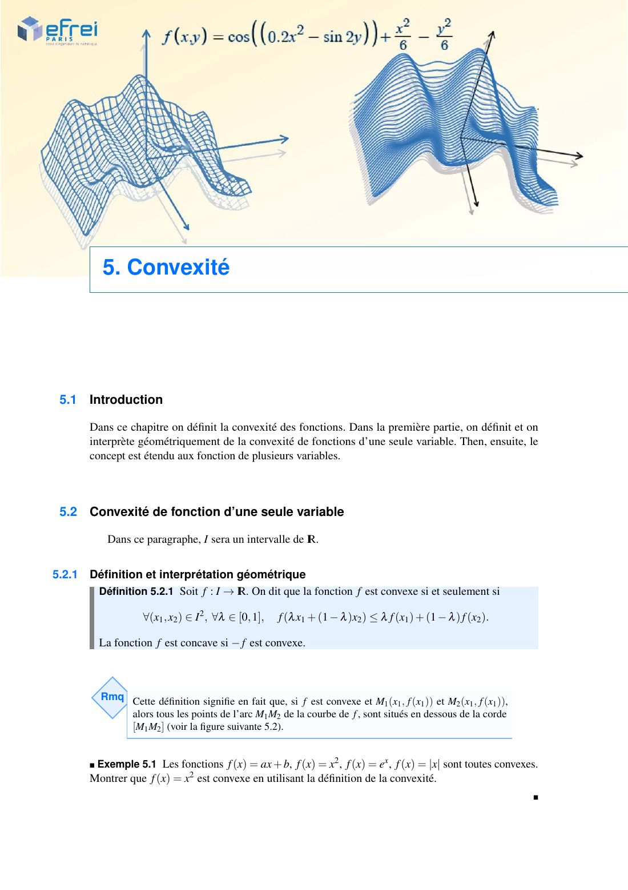{ loading=lazy .papier }](papier/ch5/p59.jpg)
    
Introduction · Convexité de fonction d’une seule variable · Définition et interprétation géométrique · Chapitre 5, p. 59

    [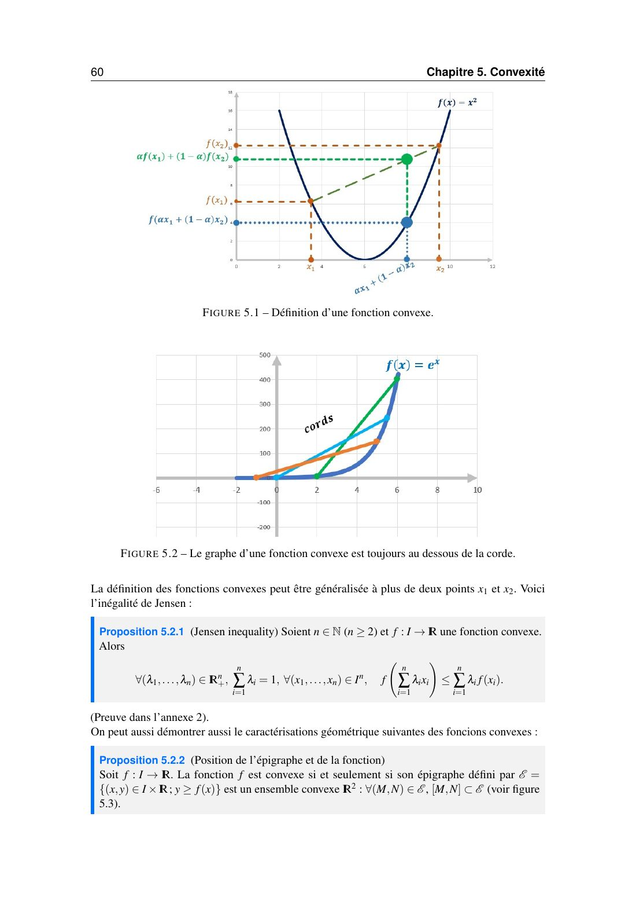{ loading=lazy .papier }](papier/ch5/p60.jpg)
    
Définition et interprétation géométrique (suite) · Chapitre 5, p. 60

    [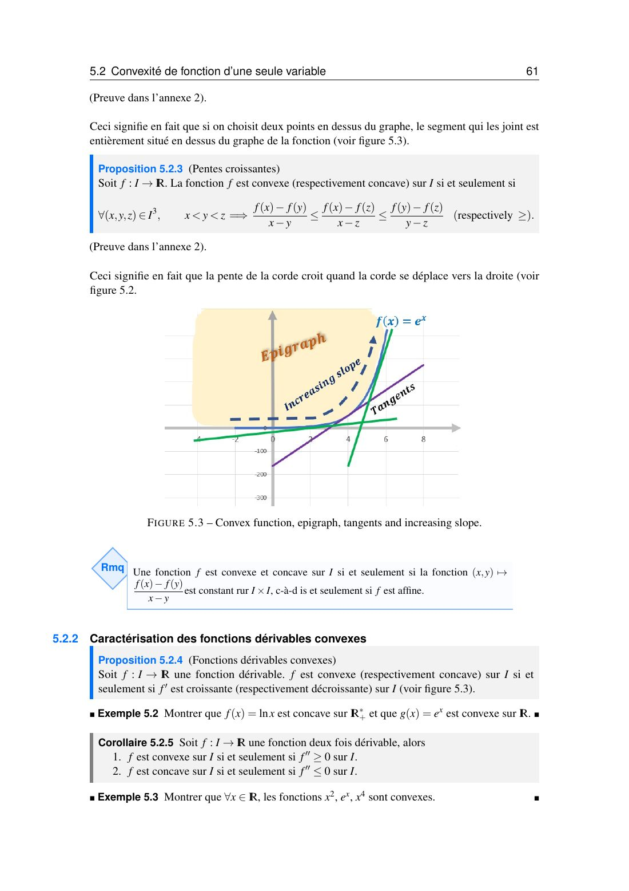{ loading=lazy .papier }](papier/ch5/p61.jpg)
    
Convexité de fonction d’une seule variable · Caractérisation des fonctions dérivables convexes · Chapitre 5, p. 61

    [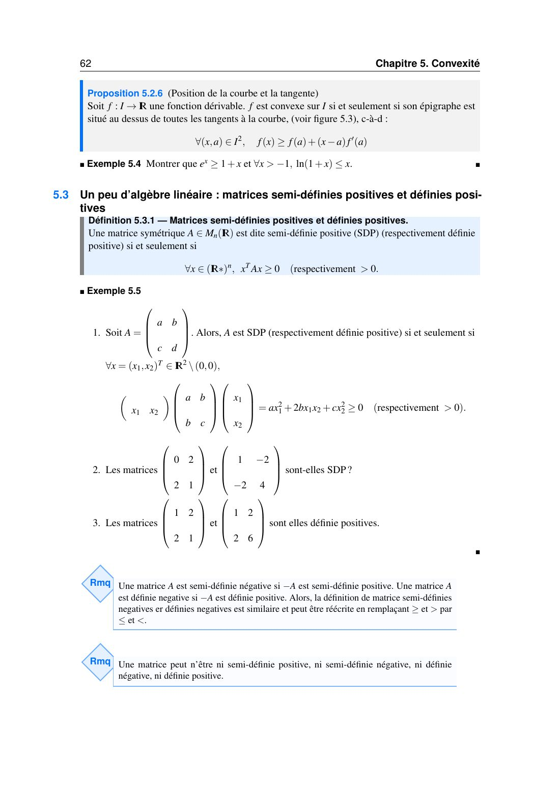{ loading=lazy .papier }](papier/ch5/p62.jpg)
    
Caractérisation des fonctions dérivables convexes (suite) · Chapitre 5, p. 62

    [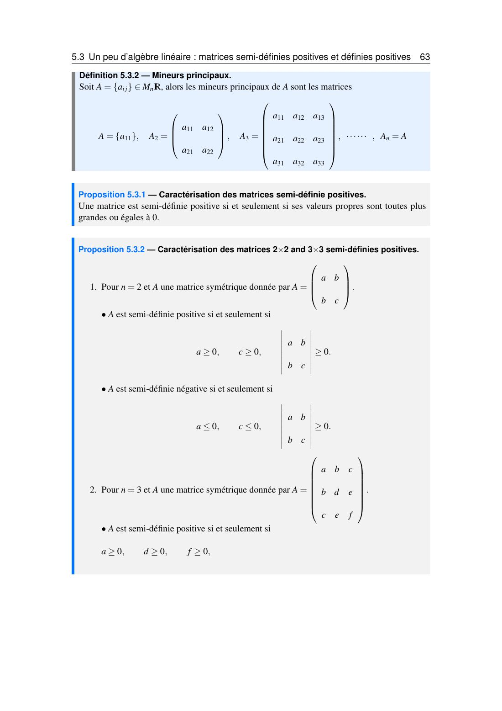{ loading=lazy .papier }](papier/ch5/p63.jpg)
    
Caractérisation des fonctions dérivables convexes (suite) · Chapitre 5, p. 63

    [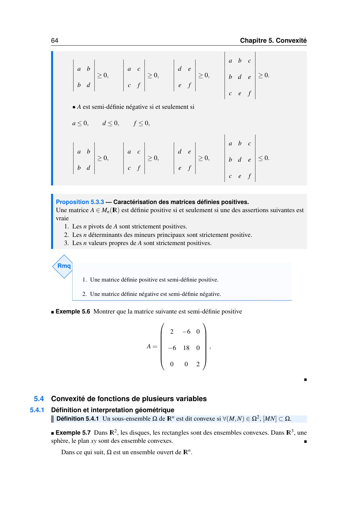{ loading=lazy .papier }](papier/ch5/p64.jpg)
    
Convexité de fonctions de plusieurs variables · Définition et interpretation géométrique · Chapitre 5, p. 64

    [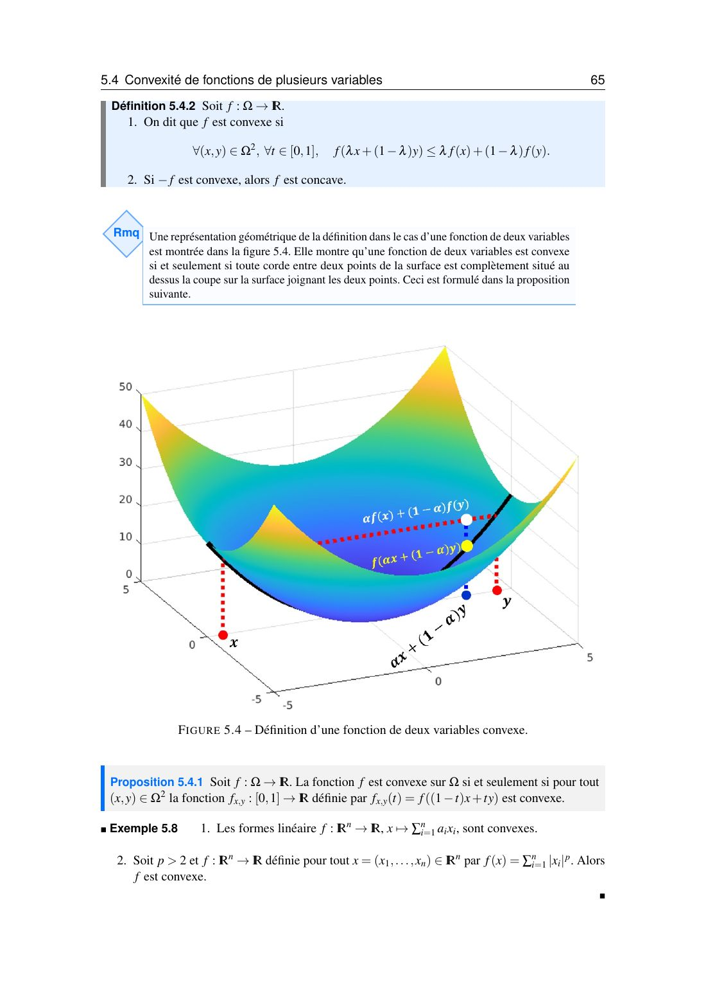{ loading=lazy .papier }](papier/ch5/p65.jpg)
    
Convexité de fonctions de plusieurs variables · Chapitre 5, p. 65

    [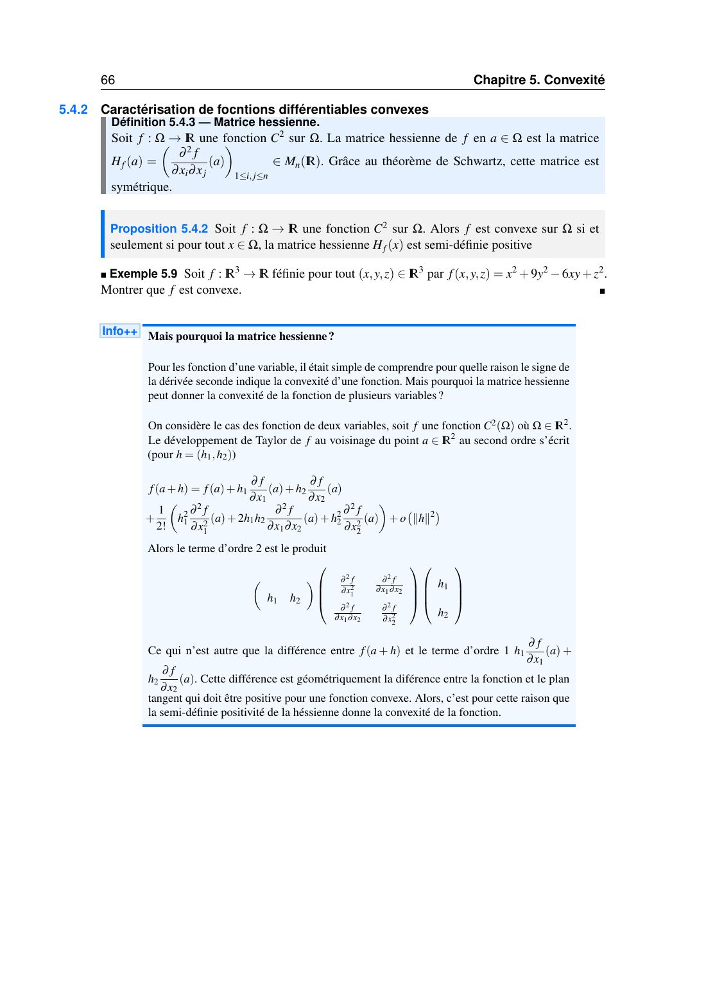{ loading=lazy .papier }](papier/ch5/p66.jpg)
    
Caractérisation de fonctions différentiables convexes · Chapitre 5, p. 66

    ### Annexe du chapitre 5

    [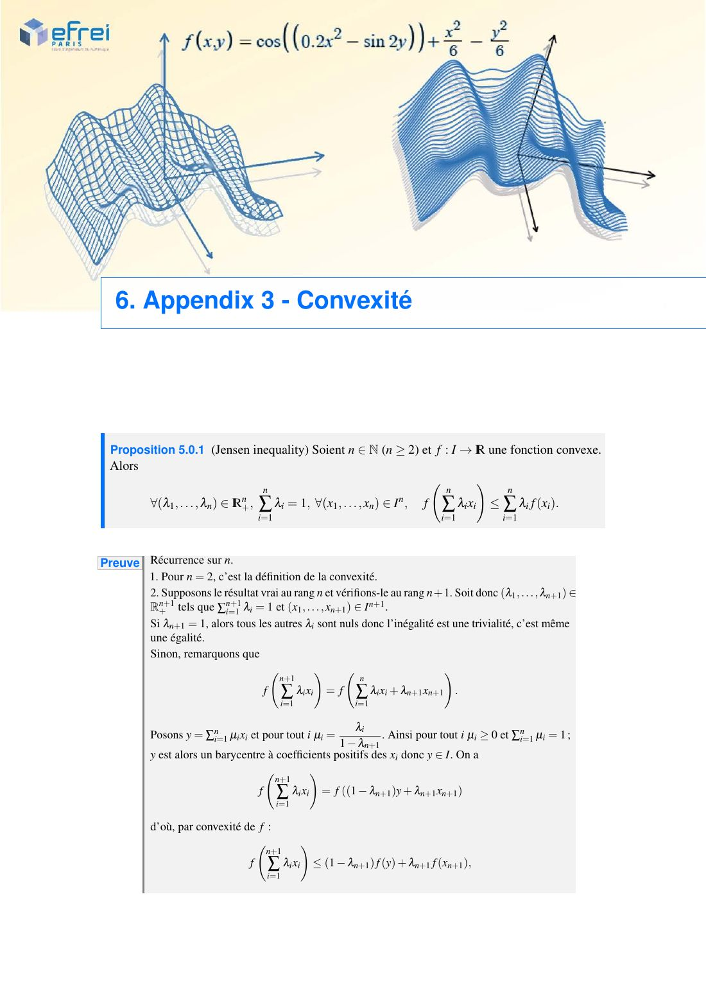{ loading=lazy .papier }](papier/ch5/annexe-01.jpg)
    
Annexe du chapitre 5, page 1/4

    [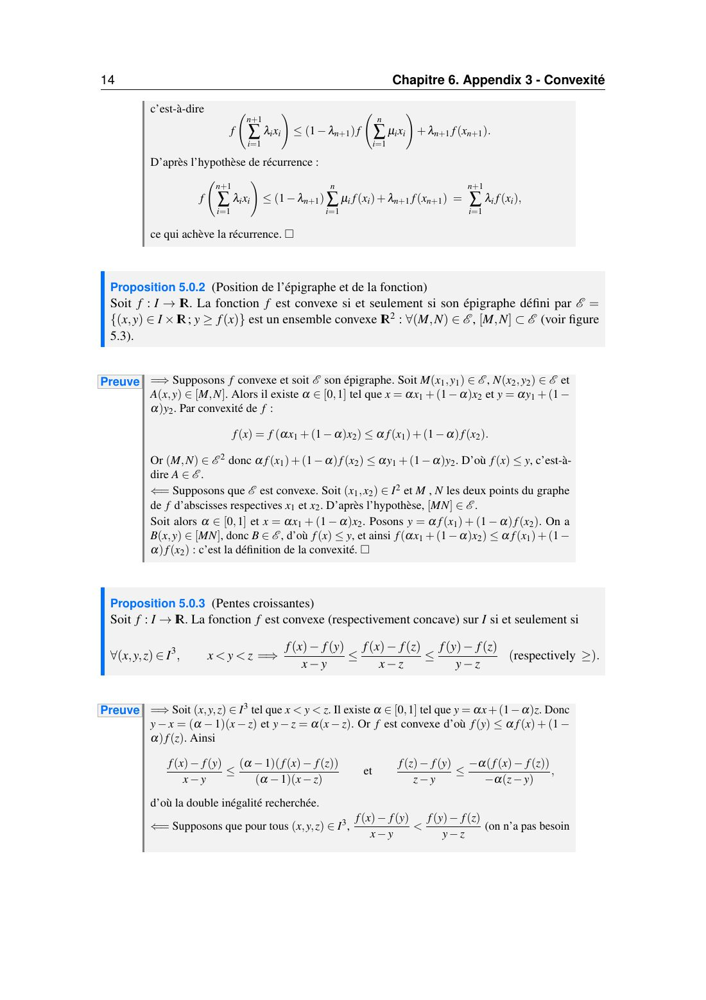{ loading=lazy .papier }](papier/ch5/annexe-02.jpg)
    
Annexe du chapitre 5, page 2/4

    [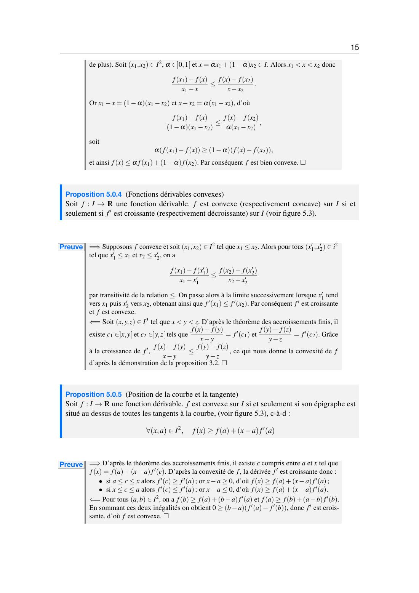{ loading=lazy .papier }](papier/ch5/annexe-03.jpg)
    
Annexe du chapitre 5, page 3/4

    [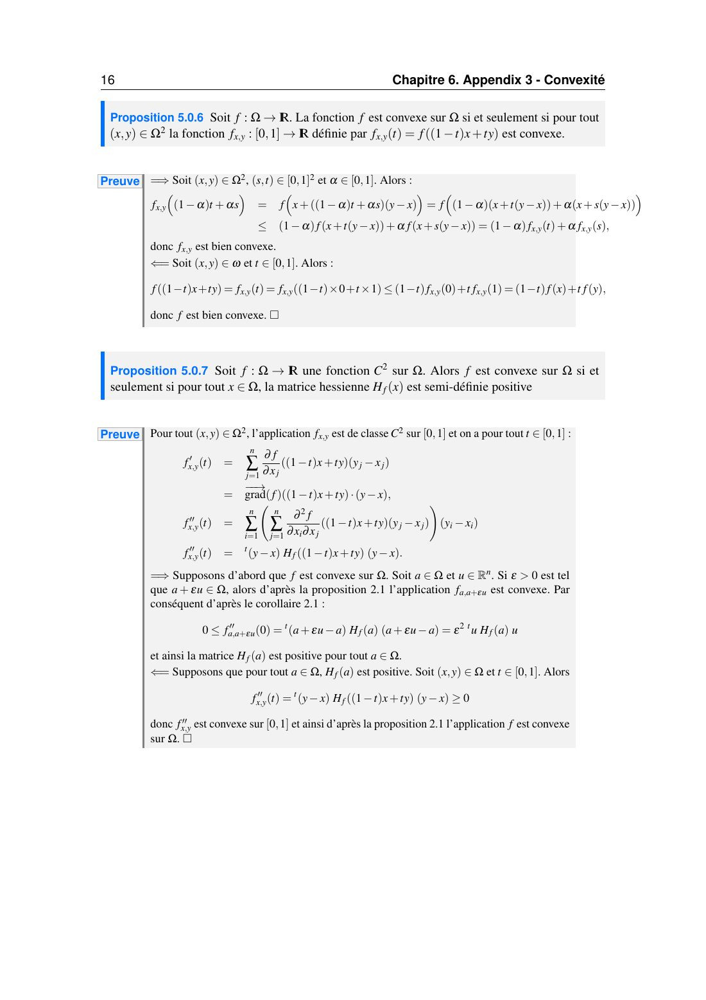{ loading=lazy .papier }](papier/ch5/annexe-04.jpg)
    
Annexe du chapitre 5, page 4/4

