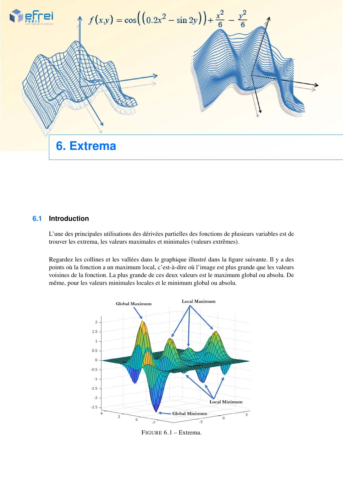
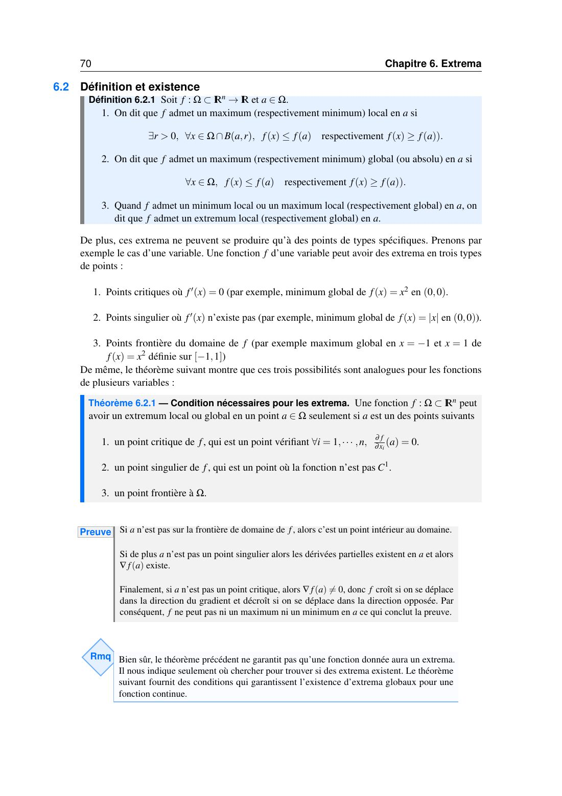
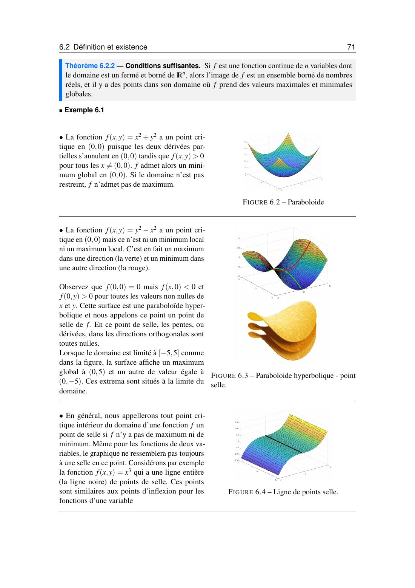
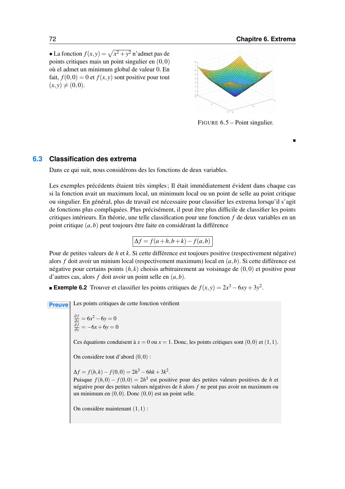
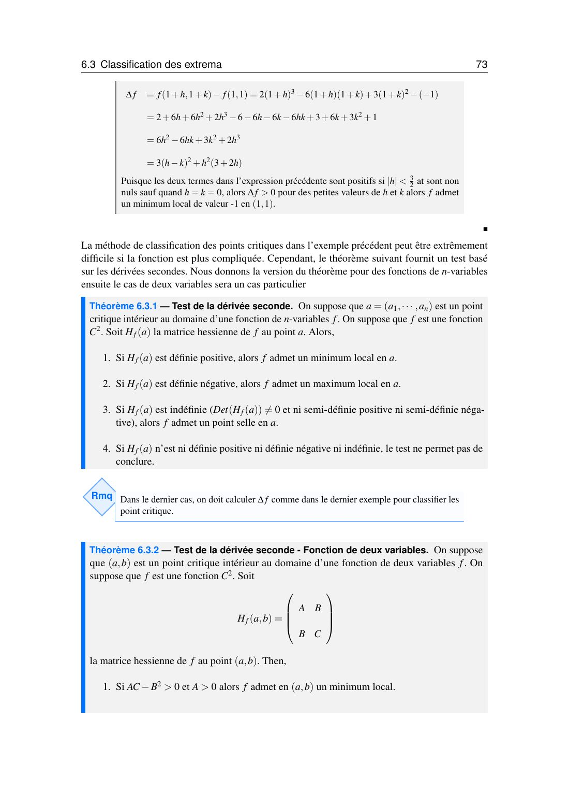
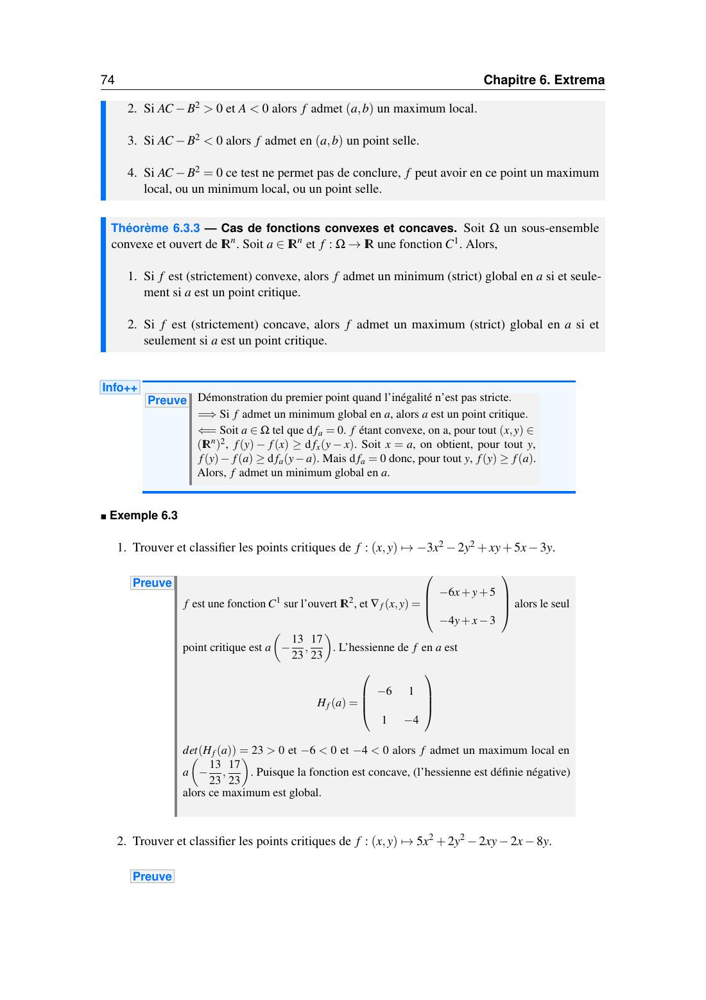
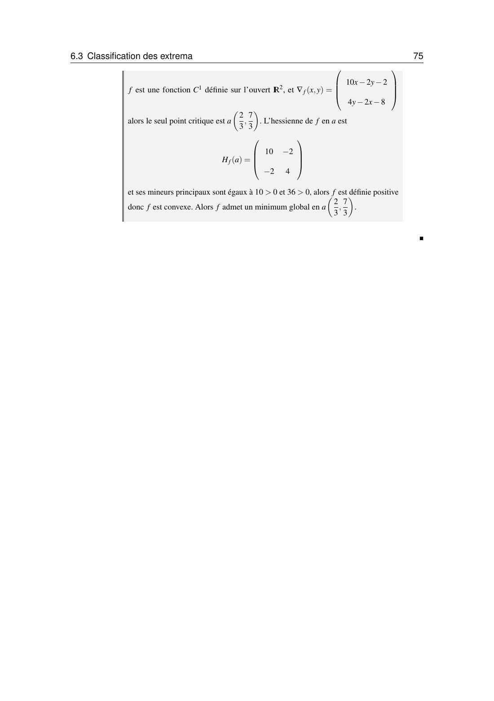

# Chapitre 6 — Extrema

=== "Version simplifiée"

    L'une des grandes utilités des dérivées partielles : trouver les **maxima** et **minima**
    d'une fonction de plusieurs variables (les sommets et les fonds de vallée de la surface).

    ## Définitions

    !!! definition "Extremum local, extremum global"
        Soit $f : \Omega \subset \mathbb{R}^n \to \mathbb{R}$ et $a \in \Omega$.

        - **Maximum local** en $a$ : il existe $r > 0$ tel que $f(x) \leq f(a)$ pour tout $x \in \Omega \cap B(a, r)$.
        - **Minimum local** : même chose avec $f(x) \geq f(a)$.
        - **Global** (ou absolu) : l'inégalité est vraie pour **tout** $x \in \Omega$.
        - **Extremum** = maximum ou minimum.

    ## Où chercher ?

    En une variable, un extremum se trouve en un point où $f' = 0$, en un point où $f'$
    n'existe pas ($\lvert x\rvert$ en 0), ou au bord du domaine ($x^2$ sur $[-1, 1]$). C'est pareil ici.

    !!! theoreme "Condition nécessaire"
        $f$ ne peut avoir un extremum en $a$ que si $a$ est :

        1. un **point critique** : $\nabla f(a) = 0$, c'est-à-dire toutes les dérivées partielles nulles ;
        2. un **point singulier** : $f$ n'est pas $C^1$ en $a$ ;
        3. un **point frontière** du domaine.

        Si $a$ est intérieur, régulier et non critique, alors $\nabla f(a) \neq 0$ : $f$ monte dans la direction du gradient et descend dans la direction opposée, donc pas d'extremum.

    !!! piege "Critique ne veut pas dire extremum"
        Ce théorème dit **où chercher**, pas qu'il y a un extremum. $f = y^2 - x^2$ a un point
        critique en $(0, 0)$ qui n'est ni un max ni un min : c'est un **point selle** (max dans une
        direction, min dans l'autre).

    !!! theoreme "Existence d'extrema globaux"
        Une fonction **continue** sur un domaine **fermé et borné** atteint un maximum et un minimum globaux.

    **Exemples**

    - $x^2 + y^2$ : point critique $(0, 0)$, minimum global 0. Pas de maximum sur $\mathbb{R}^2$.
    - $y^2 - x^2$ : point selle en $(0, 0)$. Sur $[-5, 5]^2$, les maxima globaux sont au bord, en $(0, \pm5)$.
    - $x^3$ (vue comme fonction de $x$ et $y$) : toute une droite $x = 0$ de points selle, comme un point d'inflexion.
    - $\sqrt{x^2 + y^2}$ : aucun point critique, mais un **point singulier** en $(0, 0)$ où se trouve le minimum global.

    ## Classer un point critique

    ### Méthode directe : le signe de $\Delta f$

    Au point critique $(a, b)$, on étudie $\Delta f = f(a + h, b + k) - f(a, b)$ pour $h, k$ petits.

    - $\Delta f \geq 0$ partout autour : **minimum local**.
    - $\Delta f \leq 0$ partout autour : **maximum local**.
    - $\Delta f$ change de signe : **point selle**.

    **Exemple 6.2** : $f = 2x^3 - 6xy + 3y^2$. $f_x = 6x^2 - 6y$, $f_y = -6x + 6y$ donnent $y = x$ et $x^2 = x$ : points $(0, 0)$ et $(1, 1)$.

    - En $(0, 0)$ : $f(h, 0) - f(0, 0) = 2h^3$ change de signe avec $h$, donc **point selle**.
    - En $(1, 1)$ : $\Delta f = 6h^2 - 6hk + 3k^2 + 2h^3 = 3(h - k)^2 + h^2(3 + 2h) > 0$ pour $h, k$ petits non tous deux nuls, donc **minimum local**, de valeur $f(1, 1) = -1$.

    ### Test de la hessienne

    !!! theoreme "Test de la dérivée seconde, deux variables"
        $(a, b)$ point critique intérieur, $f$ de classe $C^2$,
        $H_f(a, b) = \begin{pmatrix} A & B \\ B & C\end{pmatrix}$ avec $A = f_{xx}$, $B = f_{xy}$, $C = f_{yy}$ en $(a, b)$.

        | $AC - B^2$ | $A$ | Conclusion |
        |:----------:|:---:|------------|
        | $> 0$ | $> 0$ | **minimum local** |
        | $> 0$ | $< 0$ | **maximum local** |
        | $< 0$ | | **point selle** |
        | $= 0$ | | **on ne peut pas conclure** : revenir au signe de $\Delta f$ |

    !!! theoreme "Test de la dérivée seconde, $n$ variables"
        - $H_f(a)$ définie positive : minimum local.
        - $H_f(a)$ définie négative : maximum local.
        - $H_f(a)$ indéfinie ($\det \neq 0$, ni SDP ni SDN), ou valeurs propres de signes opposés : point selle.
        - Sinon (une valeur propre nulle) : on ne peut pas conclure.

    !!! methode "Trouver et classer les extrema"
        1. Calculer $f_x$ et $f_y$ (et $f_z$…).
        2. Résoudre le système $\nabla f = 0$. **Factoriser** au maximum et traiter tous les cas ($x = 0$ **ou** …). C'est là qu'on perd des points critiques.
        3. Calculer la hessienne en chaque point critique et appliquer le test.
        4. Si $AC - B^2 = 0$ : étudier le signe de $f(a + h, b + k) - f(a, b)$ le long de chemins bien choisis (axes, droites $y = \pm x$, paraboles).
        5. Pour dire « global » : invoquer la convexité, ou trouver un chemin qui part vers $\pm\infty$ pour dire « pas global ».

    ### Lien avec la convexité

    !!! theoreme "Fonctions convexes et concaves"
        $\Omega$ ouvert convexe, $f$ de classe $C^1$ :

        - $f$ **convexe** : $a$ est un **minimum global** $\iff$ $a$ est un point critique ;
        - $f$ **concave** : $a$ est un **maximum global** $\iff$ $a$ est un point critique.

        Pour une fonction polynomiale de degré 2, la hessienne est constante : si elle est définie positive, le point critique est un minimum **global**.

    **Exemple 6.3 (1)** : $f = -3x^2 - 2y^2 + xy + 5x - 3y$.
    $\nabla f = (-6x + y + 5,\; x - 4y - 3) = 0$ donne $a = \big(\frac{17}{23}, -\frac{13}{23}\big)$.
    $H_f = \begin{pmatrix} -6 & 1 \\ 1 & -4\end{pmatrix}$ : $\det = 23 > 0$ et $-6 < 0$, donc définie négative, $f$ concave : **maximum global** en $a$.

    **Exemple 6.3 (2)** : $f = 5x^2 + 2y^2 - 2xy - 2x - 8y$.
    $\nabla f = (10x - 2y - 2,\; 4y - 2x - 8) = 0$ donne $a = \big(\frac23, \frac73\big)$.
    $H_f = \begin{pmatrix} 10 & -2 \\ -2 & 4\end{pmatrix}$ : mineurs $10 > 0$ et $36 > 0$, définie positive, $f$ convexe : **minimum global** en $a$.

    ## Extrema sur un domaine fermé borné

    !!! methode "Domaine avec bord (triangle, disque…)"
        1. Points critiques **à l'intérieur** du domaine (on ignore ceux qui sont dehors).
        2. Étude sur **chaque morceau du bord** : on paramètre le bord (ex. $x = 0$, ou $y = -3 - x$) et on étudie une fonction d'une variable, sans oublier les **coins**.
        3. On compare toutes les valeurs obtenues : la plus grande est le maximum global, la plus petite le minimum global.

    ## Extrema sous contrainte

    Pour optimiser $f(x, y)$ avec une contrainte $g(x, y) = c$ (sujet de DE 2024-2025) :

    - **Par substitution** : si on peut isoler une variable dans la contrainte ($y = 2x + 4$), on la remplace dans $f$ et on étudie une fonction d'une seule variable.
    - **Par le lagrangien** : $L(x, y, \lambda) = f(x, y) - \lambda\big(g(x, y) - c\big)$. On résout $L_x = L_y = 0$ et $g = c$.

    Exemple : $f = xy$ sous $y - 2x = 4$. Substitution : $f = x(2x + 4) = 2x^2 + 4x$, minimale en $x = -1$, donc **minimum $-2$ en $(-1, 2)$**.
    Lagrangien : $y + 2\lambda = 0$, $x - \lambda = 0$, $y = 2x + 4$, d'où $\lambda = -1$ et le même point.

    ## Problèmes d'optimisation

    !!! methode "Mettre en équations"
        1. Nommer les variables (dimensions, quantités) et la grandeur à optimiser.
        2. Utiliser la contrainte (volume fixé, somme fixée…) pour **éliminer une variable**.
        3. Chercher les points critiques de la fonction restante, puis vérifier qu'il s'agit bien d'un min ou d'un max.

    Exemple du DE blanc : la durée d'infection $D(x, y) = x^2 + 2y^2 - 18x - 24y + 2xy + 120$ est
    minimale pour $\nabla D = 0$ : $x = 6$, $y = 3$. Hessienne $\begin{pmatrix} 2 & 2 \\ 2 & 4\end{pmatrix}$ définie positive, donc minimum (global, $D$ est convexe) : $D(6, 3) = 30$.

=== "Version papier"

    Les pages du poly pour le chapitre 6 (cours d'Elie Chahine, 2022-2023). Les exercices sont dans la [version papier du TD 6](../td/td-6-extrema.md).

    [{ loading=lazy .papier }](papier/ch6/p69.jpg)
    
Introduction · Chapitre 6, p. 69

    [{ loading=lazy .papier }](papier/ch6/p70.jpg)
    
Définition et existence · Chapitre 6, p. 70

    [{ loading=lazy .papier }](papier/ch6/p71.jpg)
    
Définition et existence · Chapitre 6, p. 71

    [{ loading=lazy .papier }](papier/ch6/p72.jpg)
    
Classification des extrema · Chapitre 6, p. 72

    [{ loading=lazy .papier }](papier/ch6/p73.jpg)
    
Classification des extrema · Chapitre 6, p. 73

    [{ loading=lazy .papier }](papier/ch6/p74.jpg)
    
Classification des extrema (suite) · Chapitre 6, p. 74

    [{ loading=lazy .papier }](papier/ch6/p75.jpg)
    
Classification des extrema · Chapitre 6, p. 75

