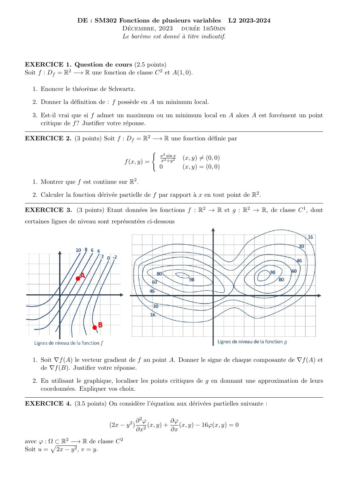
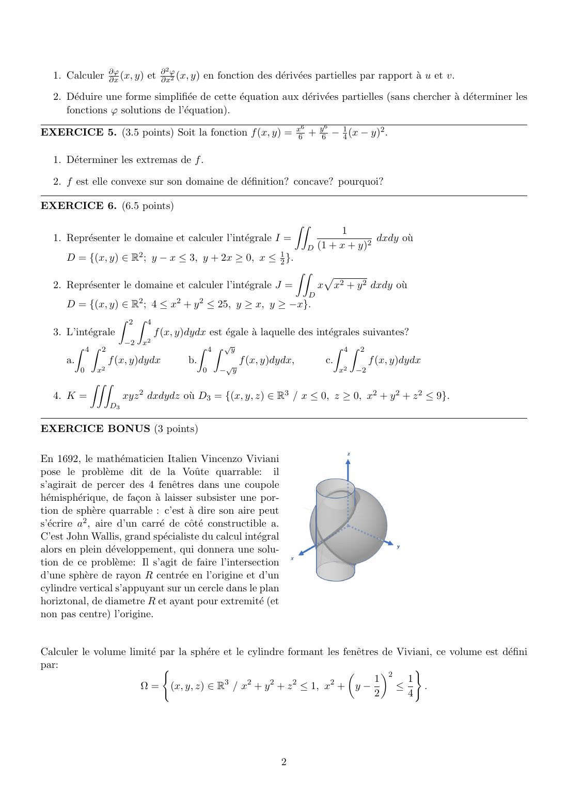
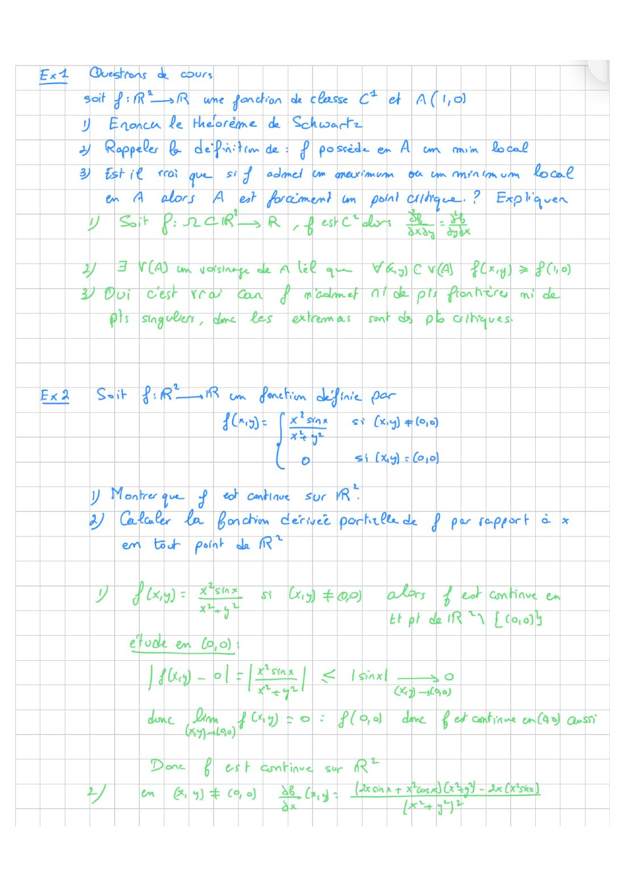
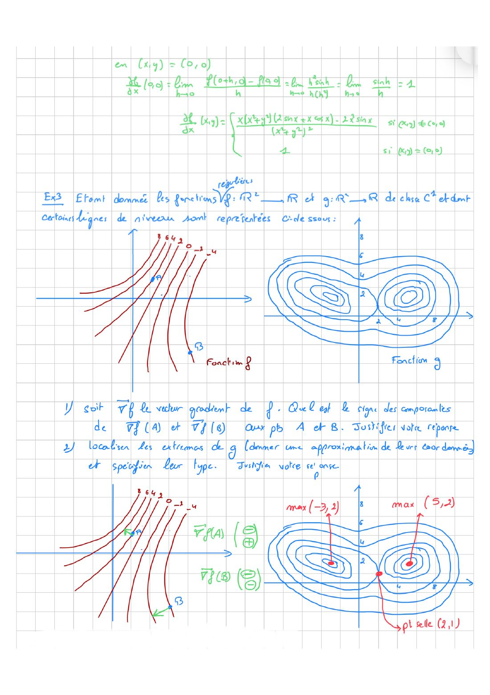
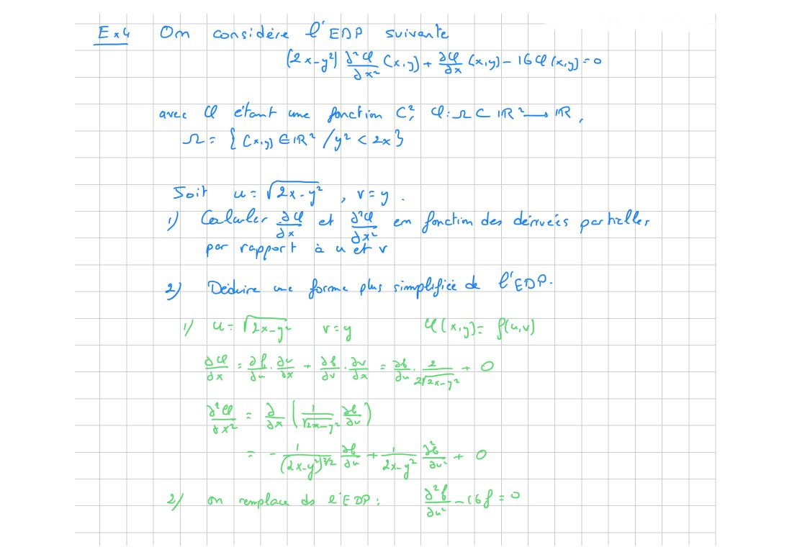
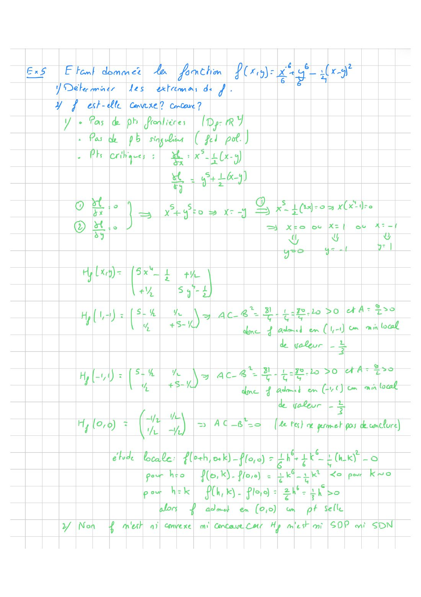
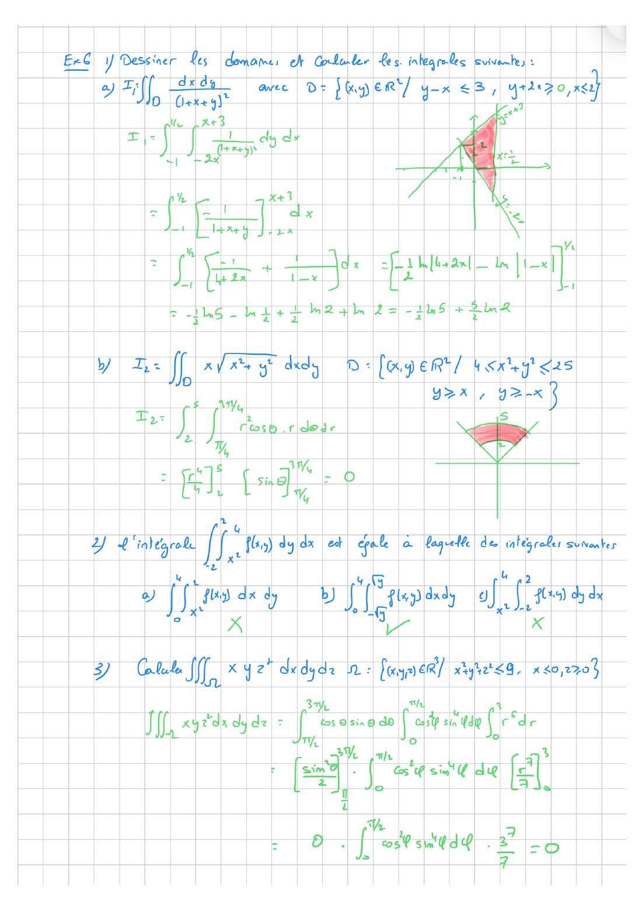
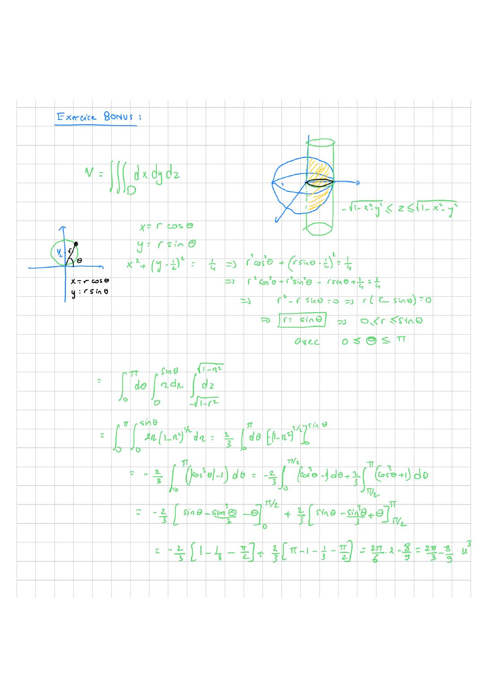

# Annale — DE décembre 2023

=== "Version simplifiée"

    Sujet et corrigé manuscrit du prof : onglet **Version papier** (1 h 50). Le corrigé ci-dessous est rédigé à partir du cours.

    ## Exercice 1 — Questions de cours (2,5 pts)

    $f : \mathbb{R}^2 \to \mathbb{R}$ de classe $C^2$, $A(1, 0)$.

    1. **Schwarz** : si $f$ et ses dérivées partielles secondes sont continues sur un ouvert, alors $\dfrac{\partial^2 f}{\partial x\,\partial y} = \dfrac{\partial^2 f}{\partial y\,\partial x}$.
    2. $f$ a un **minimum local** en $A$ s'il existe $r > 0$ tel que $f(x, y) \geq f(A)$ pour tout $(x, y) \in B(A, r)$.
    3. **Oui, ici.** Un extremum ne peut se trouver qu'en un point critique, un point singulier ou un point frontière. Comme $D_f = \mathbb{R}^2$ est ouvert (pas de frontière) et $f$ est $C^2$ (pas de point singulier), $A$ est forcément un point critique : $\nabla f(A) = 0$. (Sans ces hypothèses, c'est faux : $\lvert x\rvert$ a un minimum en 0 sans y être dérivable.)

    ## Exercice 2 (3 pts)

    $f(x, y) = \dfrac{x^2\sin x}{x^2 + y^2}$, $f(0, 0) = 0$.

    1. Hors de l'origine : quotient de fonctions continues, dénominateur non nul. En $(0, 0)$ :
       $\lvert f\rvert = \dfrac{x^2}{x^2 + y^2}\lvert\sin x\rvert \leq \lvert\sin x\rvert \to 0 = f(0, 0)$. **$f$ est continue sur $\mathbb{R}^2$.**

    2. Hors de $(0, 0)$ :

        $$
        \frac{\partial f}{\partial x} = \frac{(2x\sin x + x^2\cos x)(x^2 + y^2) - 2x^3\sin x}{(x^2 + y^2)^2} = \frac{x\big(x(x^2 + y^2)\cos x + 2y^2\sin x\big)}{(x^2 + y^2)^2}
        $$

        En $(0, 0)$ : $f(h, 0) = \sin h$, donc $\dfrac{\partial f}{\partial x}(0, 0) = \lim\limits_{h\to0}\dfrac{\sin h}{h} = 1$.

    ## Exercice 3 — Lignes de niveau (3 pts)

    Le graphique est dans le sujet. Ce qu'il faut savoir utiliser :

    1. Le gradient est **perpendiculaire** aux lignes de niveau et pointe vers les **valeurs croissantes**. Pour le signe de $\frac{\partial f}{\partial x}(A)$ : en partant de $A$ vers la droite, est-ce qu'on croise des niveaux plus élevés ($> 0$) ou plus bas ($< 0$) ? Même chose vers le haut pour $\frac{\partial f}{\partial y}$.
    2. Les points critiques se repèrent au **centre de lignes de niveau fermées et emboîtées** (max ou min) ou au **croisement de deux lignes de même niveau** (point selle).

    ## Exercice 4 — EDP (3,5 pts)

    $(2x - y^2)\varphi_{xx} + \varphi_x - 16\varphi = 0$ avec $u = 2x - y^2$, $v = y$.

    1. Chaîne : $u_x = 2$, $v_x = 0$, donc $\varphi_x = 2\varphi_u$, puis $\varphi_{xx} = 2\cdot 2\varphi_{uu} = 4\varphi_{uu}$.
    2. Comme $2x - y^2 = u$ : $4u\,\varphi_{uu} + 2\varphi_u - 16\varphi = 0$, soit

    $$
    \boxed{2u\,\frac{\partial^2\varphi}{\partial u^2} + \frac{\partial\varphi}{\partial u} - 8\varphi = 0}
    $$

    ## Exercice 5 (3,5 pts)

    Le sujet est lu comme $f(x, y) = \dfrac{x^6}{6} + \dfrac{y^6}{6} - \dfrac14(x - y)^2$.

    1. $f_x = x^5 - \frac12(x - y)$ et $f_y = y^5 + \frac12(x - y)$. En sommant : $x^5 + y^5 = 0$, donc $y = -x$. Puis $x^5 - x = 0$ : $x \in \{0, 1, -1\}$.
       Points critiques : $(0, 0)$, $(1, -1)$, $(-1, 1)$. $H = \begin{pmatrix} 5x^4 - \frac12 & \frac12 \\ \frac12 & 5y^4 - \frac12\end{pmatrix}$.

        - $(\pm1, \mp1)$ : $H = \begin{pmatrix} \frac92 & \frac12 \\ \frac12 & \frac92\end{pmatrix}$, $\det = 20 > 0$ : **minimum**, $f = \frac13 - 1 = -\frac23$.
        - $(0, 0)$ : $\det = 0$. Sur $y = x$, $f = \frac{x^6}{3} > 0$ ; sur $y = -x$, $f = \frac{x^6}{3} - x^2 < 0$ près de 0. **Point selle.**

    2. $H(0, 0)$ a des termes diagonaux négatifs : pas SDP, donc **pas convexe**. $H(1, -1)$ est définie positive : pas SDN, donc **pas concave**.

    ## Exercice 6 — Intégrales (6,5 pts)

    **1.** $D = \{y - x \leq 3,\; y + 2x \geq 0,\; x \leq \frac12\}$. Les droites $y = x + 3$ et $y = -2x$ se coupent en $(-1, 2)$. Donc $-1 \leq x \leq \frac12$ et $-2x \leq y \leq x + 3$.

    $$
    I = \int_{-1}^{1/2}\Big[-\frac{1}{1 + x + y}\Big]_{-2x}^{x+3}dx = \int_{-1}^{1/2}\Big(\frac{1}{1 - x} - \frac{1}{2x + 4}\Big)dx
    = \boxed{\frac52\ln 2 - \frac12\ln 5}
    $$

    **2.** $4 \leq x^2 + y^2 \leq 25$, $y \geq x$, $y \geq -x$ : $2 \leq r \leq 5$, $\frac\pi4 \leq \theta \leq \frac{3\pi}{4}$.

    $$
    J = \int_{\pi/4}^{3\pi/4}\cos\theta\,d\theta\int_2^5 r^3\,dr = 0
    $$

    car $\int_{\pi/4}^{3\pi/4}\cos\theta\,d\theta = \frac{\sqrt2}{2} - \frac{\sqrt2}{2} = 0$ (le domaine est symétrique par rapport à l'axe $Oy$ et $x$ est impair).

    **3.** $-2 \leq x \leq 2$, $x^2 \leq y \leq 4$ : c'est la région entre la parabole et la droite $y = 4$. En tranches horizontales, $0 \leq y \leq 4$ et $-\sqrt y \leq x \leq \sqrt y$ : **réponse b**.

    **4.** $K = \iiint xyz^2$ sur $x \leq 0$, $z \geq 0$, $x^2 + y^2 + z^2 \leq 9$. Le domaine est symétrique par rapport au plan $y = 0$ et l'intégrande est impaire en $y$ : $\boxed{K = 0}$.

    ## Bonus — Fenêtres de Viviani (3 pts)

    $\Omega$ : dans la boule unité, à l'intérieur du cylindre $x^2 + \big(y - \frac12\big)^2 \leq \frac14$. En polaires, ce cylindre s'écrit $r \leq \sin\theta$, $0 \leq \theta \leq \pi$. Pour chaque $(r, \theta)$, $z$ va de $-\sqrt{1 - r^2}$ à $\sqrt{1 - r^2}$ :

    $$
    V = \int_0^\pi\int_0^{\sin\theta}2\sqrt{1 - r^2}\,r\,dr\,d\theta = \frac23\int_0^\pi\big(1 - \lvert\cos\theta\rvert^3\big)d\theta = \frac23\Big(\pi - \frac43\Big) = \boxed{\frac{2\pi}{3} - \frac89}
    $$

=== "Version papier"

    Le sujet du DE de décembre 2023 et son corrigé manuscrit.

    ### Sujet

    [{ loading=lazy .papier }](papier/de-2023/sujet-01.jpg)
    
Sujet · page 1/2

    [{ loading=lazy .papier }](papier/de-2023/sujet-02.jpg)
    
Sujet · page 2/2

    ### Corrigé officiel (scanné)

    [{ loading=lazy .papier }](papier/de-2023/corrige-01.jpg)
    
Corrigé officiel (scanné) · page 1/6

    [{ loading=lazy .papier }](papier/de-2023/corrige-02.jpg)
    
Corrigé officiel (scanné) · page 2/6

    [{ loading=lazy .papier }](papier/de-2023/corrige-03.jpg)
    
Corrigé officiel (scanné) · page 3/6

    [{ loading=lazy .papier }](papier/de-2023/corrige-04.jpg)
    
Corrigé officiel (scanné) · page 4/6

    [{ loading=lazy .papier }](papier/de-2023/corrige-05.jpg)
    
Corrigé officiel (scanné) · page 5/6

    [{ loading=lazy .papier }](papier/de-2023/corrige-06.jpg)
    
Corrigé officiel (scanné) · page 6/6

