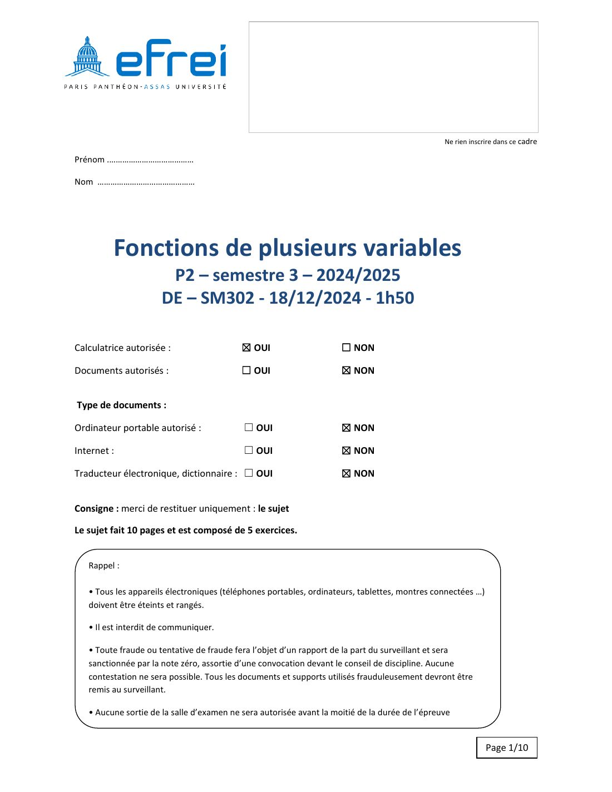
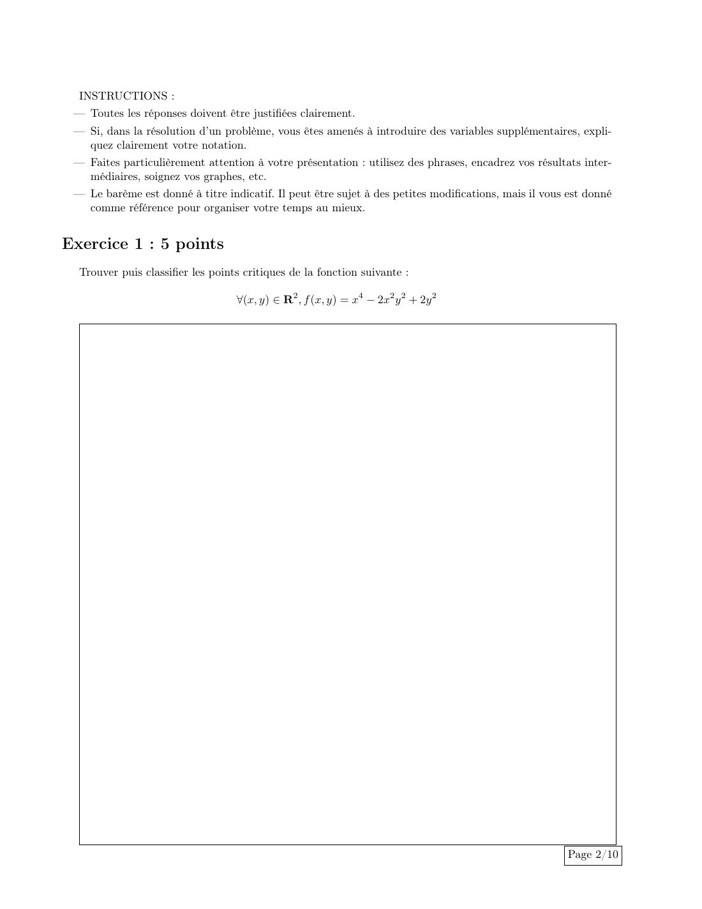
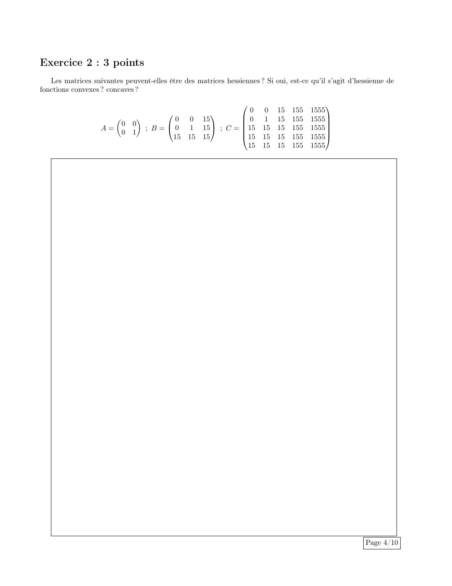
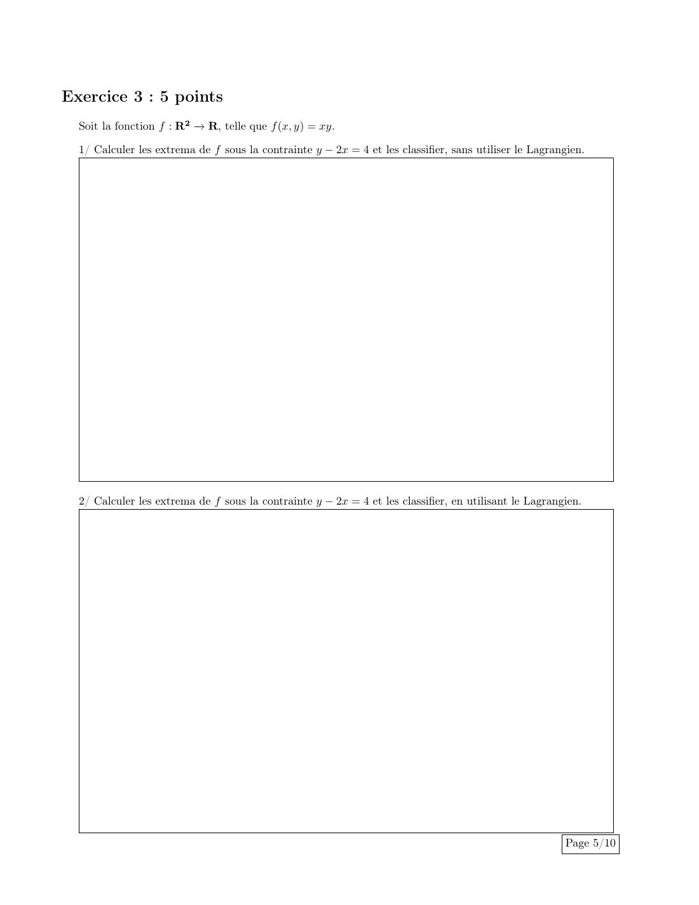
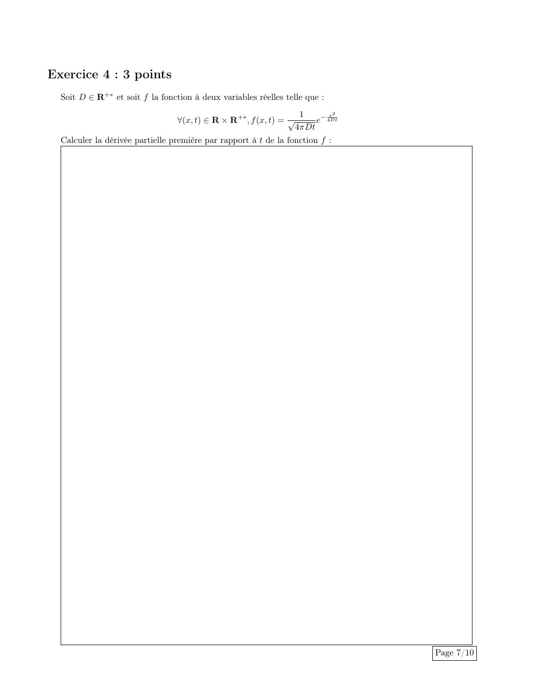
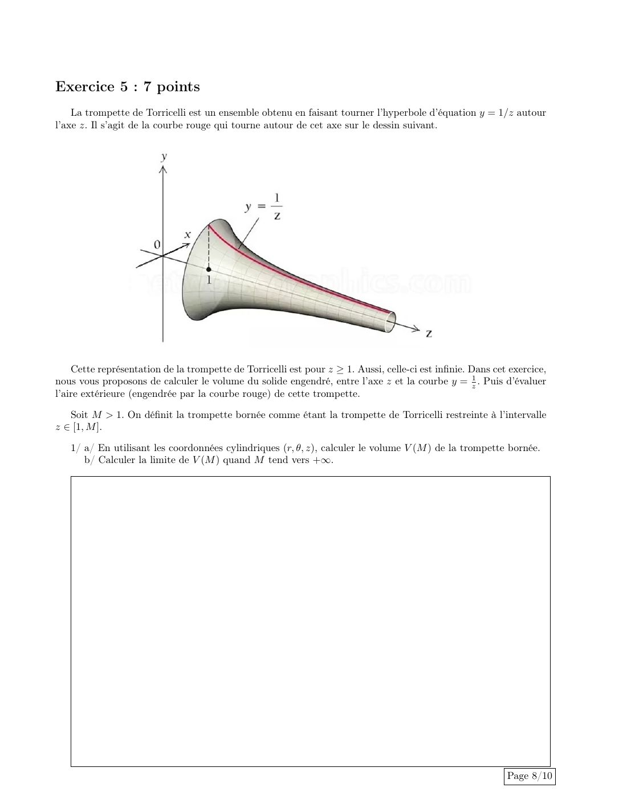
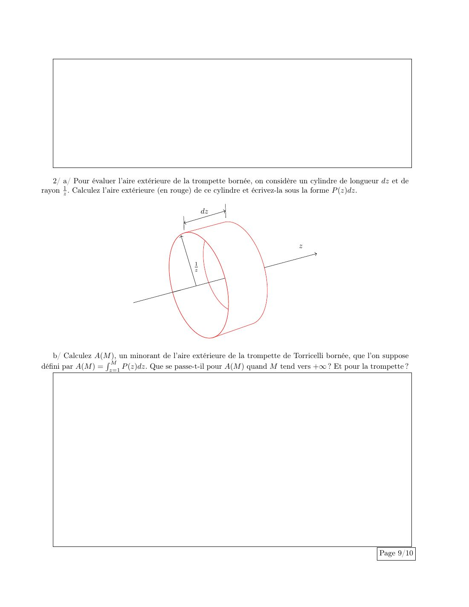
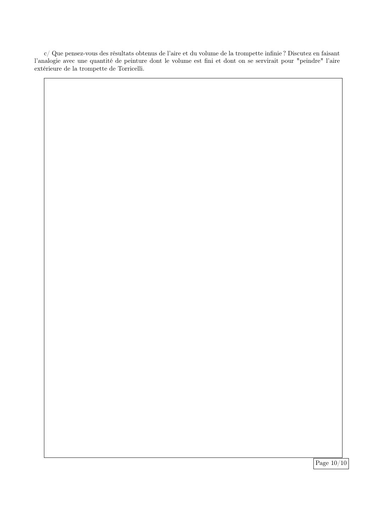

# Annale — DE du 18 décembre 2024

=== "Version simplifiée"

    Sujet dans l'onglet **Version papier** (1 h 50, calculatrice autorisée, 5 exercices).

    ## Exercice 1 — Points critiques (5 pts)

    $f(x, y) = x^4 - 2x^2y^2 + 2y^2$.

    $f_x = 4x(x^2 - y^2)$ et $f_y = 4y(1 - x^2)$.

    - $y = 0$ : alors $4x^3 = 0$, d'où $(0, 0)$.
    - $x = \pm1$ : alors $x^2 = y^2$, d'où $y = \pm1$.

    Points critiques : $(0, 0)$ et $(\pm1, \pm1)$ (quatre points).

    $H_f = \begin{pmatrix} 12x^2 - 4y^2 & -8xy \\ -8xy & 4 - 4x^2\end{pmatrix}$.

    - **$(\pm1, \pm1)$** : $H = \begin{pmatrix} 8 & \mp8 \\ \mp8 & 0\end{pmatrix}$, $\det = -64 < 0$ : **points selle** ($f = 1$).
    - **$(0, 0)$** : $H = \begin{pmatrix} 0 & 0 \\ 0 & 4\end{pmatrix}$, $\det = 0$ : on étudie le signe directement.
      $f = x^4 + 2y^2(1 - x^2) \geq 0$ dès que $\lvert x\rvert < 1$, avec égalité seulement en $(0, 0)$ : **minimum local strict**, $f = 0$.
      Pas global : $f(2, y) = 16 - 6y^2 \to -\infty$.

    ## Exercice 2 — Hessiennes (3 pts)

    - $A = \begin{pmatrix} 0 & 0 \\ 0 & 1\end{pmatrix}$ : symétrique, $0 \geq 0$, $1 \geq 0$, $\det = 0 \geq 0$. **SDP** : hessienne d'une fonction **convexe** (par exemple $\frac{y^2}{2}$).
    - $B = \begin{pmatrix} 0 & 0 & 15 \\ 0 & 1 & 15 \\ 15 & 15 & 15\end{pmatrix}$ : symétrique, mais le mineur $\begin{vmatrix} 0 & 15 \\ 15 & 15\end{vmatrix} = -225 < 0$. Ni SDP ni SDN : hessienne possible d'une fonction **ni convexe ni concave**.
    - $C$ ($5\times5$) : le coefficient ligne 1, colonne 4 vaut 155 alors que celui ligne 4, colonne 1 vaut 15. $C$ n'est **pas symétrique** : ce n'est **pas une hessienne** (théorème de Schwarz).

    ## Exercice 3 — Extrema sous contrainte (5 pts)

    $f(x, y) = xy$ avec $y - 2x = 4$.

    **1. Sans lagrangien.** $y = 2x + 4$, donc $g(x) = f(x, 2x + 4) = 2x^2 + 4x$.
    $g'(x) = 4x + 4 = 0 \iff x = -1$, et $g'' = 4 > 0$. **Minimum** en $(-1, 2)$, de valeur $f = -2$. Pas de maximum ($g \to +\infty$).

    **2. Avec le lagrangien.** $L(x, y, \lambda) = xy - \lambda(y - 2x - 4)$.

    $$
    L_x = y + 2\lambda = 0, \qquad L_y = x - \lambda = 0, \qquad y - 2x = 4
    $$

    Donc $\lambda = x$, $y = -2x$, puis $-2x - 2x = 4$ : $x = -1$, $y = 2$, $\lambda = -1$. Même point, et la restriction $g$ étudiée en 1 montre que c'est un **minimum** ($-2$).

    ## Exercice 4 — Dérivée partielle (3 pts)

    $f(x, t) = \dfrac{1}{\sqrt{4\pi Dt}}\,e^{-\frac{x^2}{4Dt}}$. Produit de $u = (4\pi D)^{-1/2}t^{-1/2}$ et $v = e^{-x^2/(4Dt)}$ :
    $u_t = -\frac{1}{2t}u$ et $v_t = \frac{x^2}{4Dt^2}v$. Donc

    $$
    \frac{\partial f}{\partial t} = f(x, t)\Big(\frac{x^2}{4Dt^2} - \frac{1}{2t}\Big) = \frac{x^2 - 2Dt}{4Dt^2}\cdot\frac{1}{\sqrt{4\pi Dt}}\,e^{-\frac{x^2}{4Dt}}
    $$

    (C'est la solution fondamentale de l'équation de la chaleur $f_t = D f_{xx}$.)

    ## Exercice 5 — Trompette de Torricelli (7 pts)

    Le solide est obtenu en faisant tourner $y = \frac1z$ autour de l'axe $Oz$, pour $1 \leq z \leq M$.

    **1. a.** Cylindriques : $0 \leq r \leq \frac1z$, $0 \leq \theta \leq 2\pi$, $1 \leq z \leq M$.

    $$
    V(M) = \int_1^M\int_0^{2\pi}\int_0^{1/z}r\,dr\,d\theta\,dz = \int_1^M\frac{\pi}{z^2}dz = \pi\Big(1 - \frac1M\Big)
    $$

    **b.** $V(M) \to \pi$ : le volume de la trompette infinie est **fini**.

    **2. a.** Le petit cylindre de rayon $\frac1z$ et de longueur $dz$ a une aire latérale $2\pi\cdot\frac1z\,dz$, donc $P(z) = \dfrac{2\pi}{z}$.

    **b.** $A(M) = \displaystyle\int_1^M\frac{2\pi}{z}dz = 2\pi\ln M \to +\infty$. $A(M)$ minore l'aire de la trompette bornée, donc l'aire de la trompette infinie est **infinie**.

    **c.** Le paradoxe du peintre : on peut **remplir** la trompette avec un volume fini $\pi$ de peinture, mais on ne pourrait pas **peindre** sa surface, qui est infinie. Le paradoxe vient de l'idéalisation mathématique : une couche de peinture a une épaisseur, ce qui n'a plus de sens quand le rayon $\frac1z$ devient plus petit que cette épaisseur.

    !!! note "Hors programme du cours écrit"
        Les extrema sous contrainte (lagrangien) ne figurent pas dans le poly. Ils sont résumés à la fin du [chapitre 6](../cours/chapitre-6-extrema.md#extrema-sous-contrainte).

=== "Version papier"

    Le sujet du DE du 18/12/2024 (les pages laissées vides pour répondre sont retirées).

    ### Sujet

    [{ loading=lazy .papier }](papier/de-2024/sujet-01.jpg)
    
Sujet · page 1/8

    [{ loading=lazy .papier }](papier/de-2024/sujet-02.jpg)
    
Sujet · page 2/8

    [{ loading=lazy .papier }](papier/de-2024/sujet-04.jpg)
    
Sujet · page 3/8

    [{ loading=lazy .papier }](papier/de-2024/sujet-05.jpg)
    
Sujet · page 4/8

    [{ loading=lazy .papier }](papier/de-2024/sujet-07.jpg)
    
Sujet · page 5/8

    [{ loading=lazy .papier }](papier/de-2024/sujet-08.jpg)
    
Sujet · page 6/8

    [{ loading=lazy .papier }](papier/de-2024/sujet-09.jpg)
    
Sujet · page 7/8

    [{ loading=lazy .papier }](papier/de-2024/sujet-10.jpg)
    
Sujet · page 8/8

