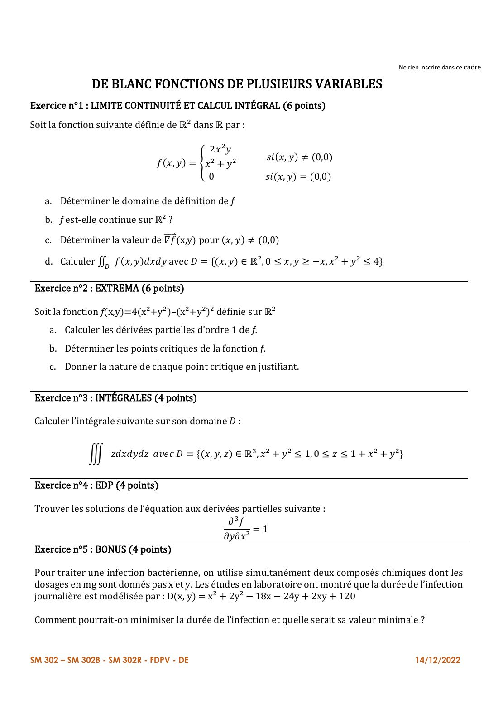
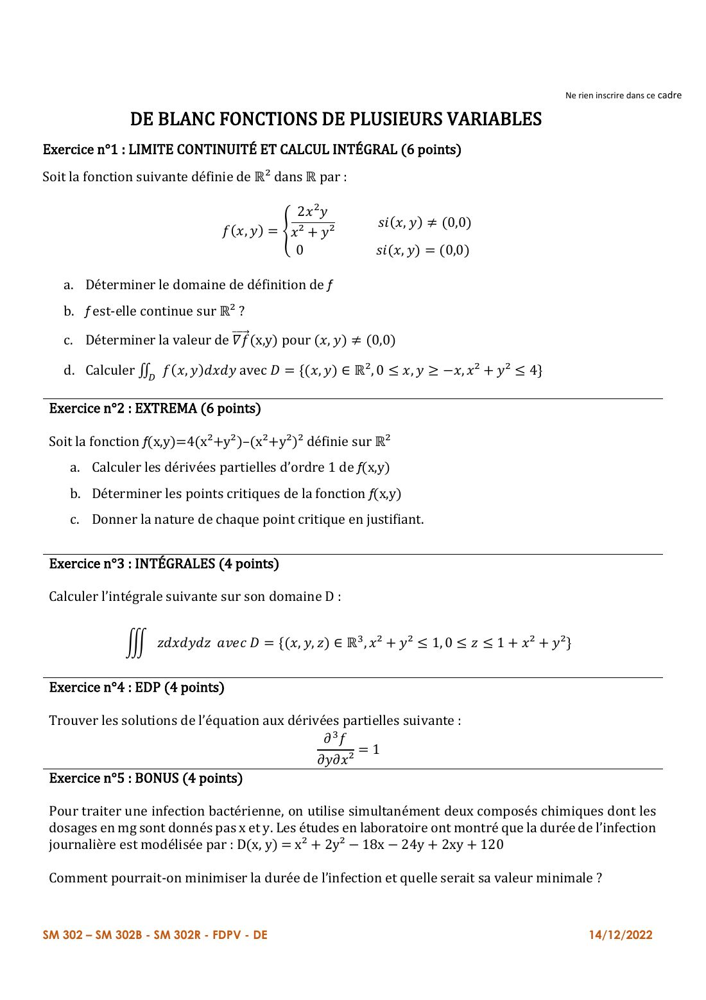
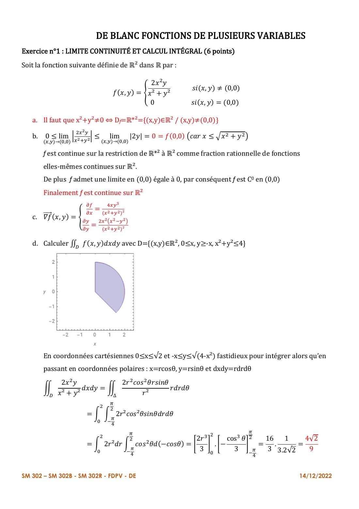
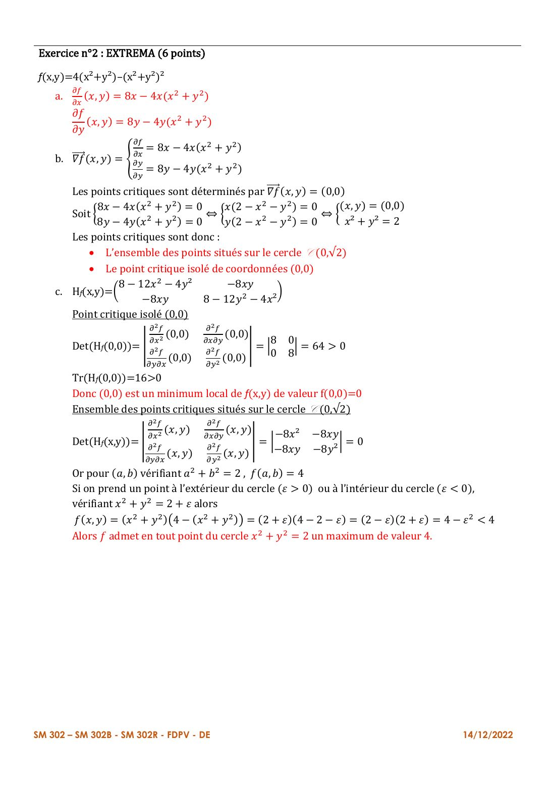
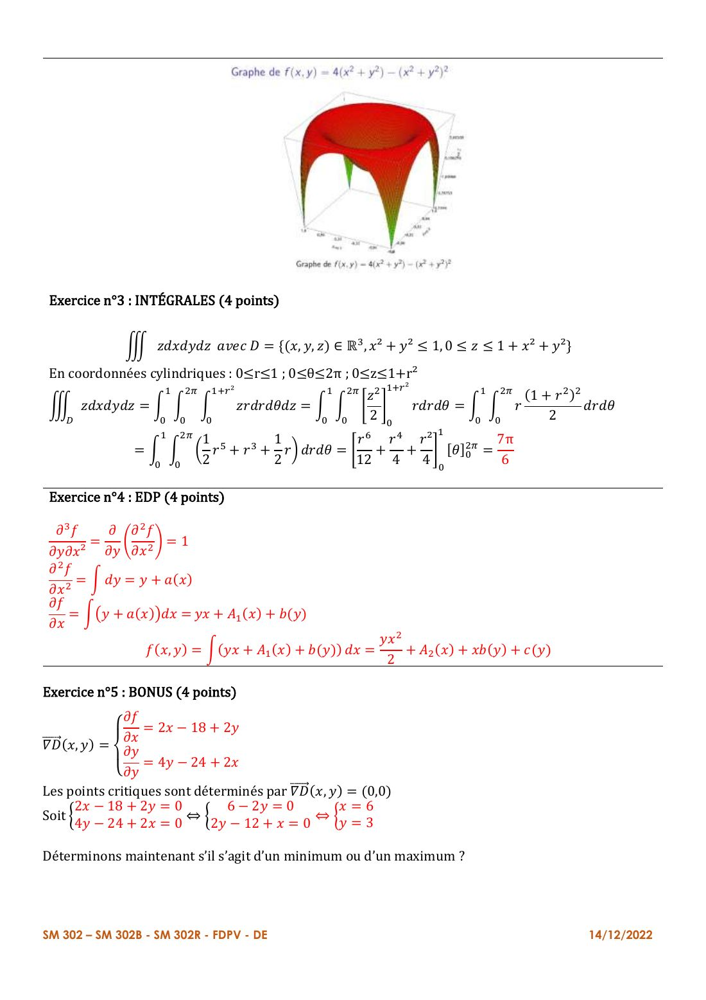
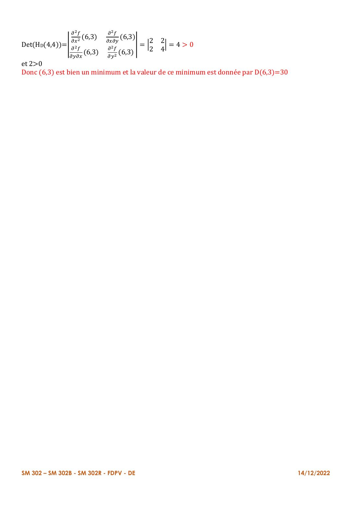

# Annale — DE blanc

=== "Version simplifiée"

    Sujet et corrigé officiels : onglet **Version papier**.
    Le corrigé ci-dessous suit celui du prof, avec les étapes détaillées.

    ## Exercice 1 — Limite, continuité, intégrale (6 pts)

    $f(x, y) = \dfrac{2x^2 y}{x^2 + y^2}$ si $(x, y) \neq (0, 0)$, $f(0, 0) = 0$.

    **a. Domaine.** L'expression est définie dès que $x^2 + y^2 \neq 0$, et $f(0, 0)$ est donnée : $D_f = \mathbb{R}^2$.

    **b. Continuité.** Hors de $(0, 0)$ : fraction rationnelle de dénominateur non nul, donc continue. En $(0, 0)$ :

    $$
    \lvert f(x, y)\rvert = \frac{x^2}{x^2 + y^2}\cdot 2\lvert y\rvert \leq 2\lvert y\rvert \to 0 = f(0, 0)
    $$

    $f$ est **continue sur $\mathbb{R}^2$**.

    **c. Gradient** (règle du quotient) :

    $$
    \nabla f(x, y) = \left(\frac{4xy^3}{(x^2 + y^2)^2},\; \frac{2x^2(x^2 - y^2)}{(x^2 + y^2)^2}\right)
    $$

    **d.** $D = \{x \geq 0,\; y \geq -x,\; x^2 + y^2 \leq 4\}$. En cartésien c'est pénible ; en polaires :
    $0 \leq r \leq 2$ et $-\frac\pi4 \leq \theta \leq \frac\pi2$ (de la droite $y = -x$ jusqu'à l'axe $Oy$).

    $$
    \iint_D \frac{2x^2 y}{x^2 + y^2}\,dx\,dy = \int_{-\pi/4}^{\pi/2}\int_0^2 2r\cos^2\theta\sin\theta\cdot r\,dr\,d\theta
    = \Big[\frac{2r^3}{3}\Big]_0^2\Big[-\frac{\cos^3\theta}{3}\Big]_{-\pi/4}^{\pi/2} = \frac{16}{3}\cdot\frac{\sqrt2}{12} = \boxed{\frac{4\sqrt2}{9}}
    $$

    ## Exercice 2 — Extrema (6 pts)

    $f(x, y) = 4(x^2 + y^2) - (x^2 + y^2)^2$.

    **a.** $f_x = 8x - 4x(x^2 + y^2)$, $f_y = 8y - 4y(x^2 + y^2)$.

    **b.** $f_x = 4x(2 - x^2 - y^2) = 0$ et $f_y = 4y(2 - x^2 - y^2) = 0$. Soit $x^2 + y^2 = 2$, soit $x = y = 0$.
    Points critiques : **l'origine** et **tout le cercle** de centre $O$ et de rayon $\sqrt2$.

    **c.** $H_f = \begin{pmatrix} 8 - 12x^2 - 4y^2 & -8xy \\ -8xy & 8 - 12y^2 - 4x^2\end{pmatrix}$.

    - En $(0, 0)$ : $H = \begin{pmatrix} 8 & 0 \\ 0 & 8\end{pmatrix}$, $\det = 64 > 0$, $A = 8 > 0$ : **minimum local**, $f(0, 0) = 0$.
    - Sur le cercle : $H = \begin{pmatrix} -8x^2 & -8xy \\ -8xy & -8y^2\end{pmatrix}$, $\det = 0$, le test ne conclut pas.
      On pose $x^2 + y^2 = 2 + \varepsilon$ : $f = (2 + \varepsilon)(2 - \varepsilon) = 4 - \varepsilon^2 \leq 4$.
      **Maximum (global) de valeur 4** en tout point du cercle.

    ## Exercice 3 — Intégrale triple (4 pts)

    $\iiint_D z$ avec $D = \{x^2 + y^2 \leq 1,\; 0 \leq z \leq 1 + x^2 + y^2\}$. Cylindriques : $0 \leq r \leq 1$, $0 \leq \theta \leq 2\pi$, $0 \leq z \leq 1 + r^2$.

    $$
    \int_0^{2\pi}\int_0^1\int_0^{1+r^2} z\,r\,dz\,dr\,d\theta = 2\pi\int_0^1\frac{(1 + r^2)^2}{2}r\,dr = 2\pi\Big[\frac{r^6}{12} + \frac{r^4}{4} + \frac{r^2}{4}\Big]_0^1 = \boxed{\frac{7\pi}{6}}
    $$

    ## Exercice 4 — EDP (4 pts)

    $\dfrac{\partial^3 f}{\partial y\,\partial x^2} = 1$, c'est-à-dire $\dfrac{\partial}{\partial y}\Big(\dfrac{\partial^2 f}{\partial x^2}\Big) = 1$. On primitive trois fois :

    $$
    \frac{\partial^2 f}{\partial x^2} = y + a(x), \qquad \frac{\partial f}{\partial x} = xy + A_1(x) + b(y)
    $$

    $$
    \boxed{f(x, y) = \frac{x^2 y}{2} + A_2(x) + x\,b(y) + c(y)}
    $$

    avec $A_2$, $b$, $c$ des fonctions quelconques (suffisamment dérivables).

    ## Exercice 5 — Bonus (4 pts)

    $D(x, y) = x^2 + 2y^2 - 18x - 24y + 2xy + 120$.

    $\nabla D = (2x + 2y - 18,\; 4y + 2x - 24) = 0$ : en soustrayant, $2y = 6$, donc $y = 3$ et $x = 6$.
    $H_D = \begin{pmatrix} 2 & 2 \\ 2 & 4\end{pmatrix}$ : $\det = 4 > 0$ et $2 > 0$, définie positive, donc $D$ est convexe et $(6, 3)$ est un **minimum global**.

    Il faut **6 mg** du premier composé et **3 mg** du second, pour une durée minimale $D(6, 3) = \boxed{30}$.

=== "Version papier"

    Le sujet et le corrigé officiel du DE blanc (14/12/2022).

    ### Sujet

    [{ loading=lazy .papier }](papier/de-blanc/sujet-01.jpg)
    
Sujet · page 1/1

    ### Corrigé officiel

    [{ loading=lazy .papier }](papier/de-blanc/corrige-01.jpg)
    
Corrigé officiel · page 1/5

    [{ loading=lazy .papier }](papier/de-blanc/corrige-02.jpg)
    
Corrigé officiel · page 2/5

    [{ loading=lazy .papier }](papier/de-blanc/corrige-03.jpg)
    
Corrigé officiel · page 3/5

    [{ loading=lazy .papier }](papier/de-blanc/corrige-04.jpg)
    
Corrigé officiel · page 4/5

    [{ loading=lazy .papier }](papier/de-blanc/corrige-05.jpg)
    
Corrigé officiel · page 5/5

