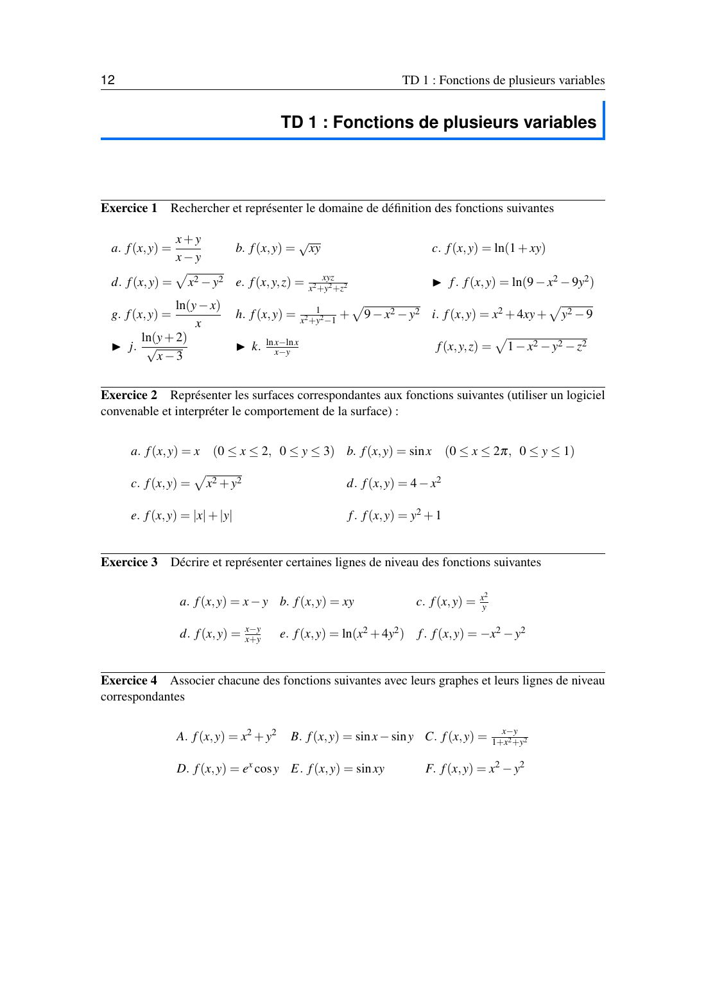
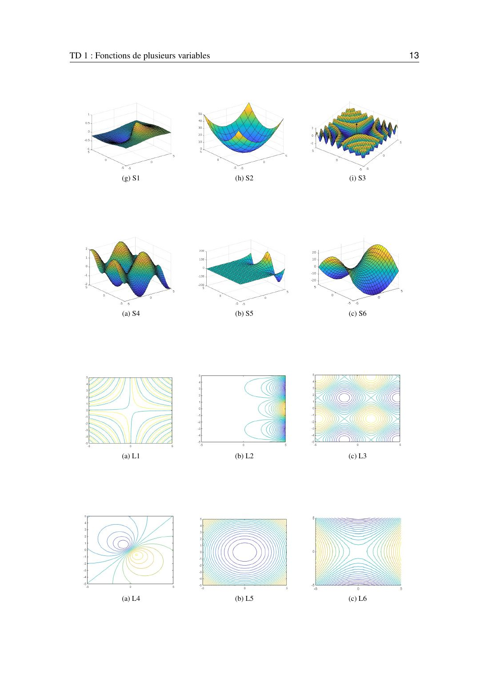

# TD 1 — Fonctions de plusieurs variables

=== "Version simplifiée"

    Énoncés complets : onglet **Version papier**. Rappels : [chapitre 1](../cours/chapitre-1-fonctions.md).

    ## Exercice 1 — Domaines de définition

    !!! methode "Rappel"
        Dénominateur $\neq 0$ (bord exclu), racine $\geq 0$ (bord inclus), $\ln > 0$ (bord exclu).
        On teste un point simple pour savoir de quel côté de la courbe on est.

    | | Fonction | Conditions | Domaine |
    |-|----------|------------|---------|
    | a | $\dfrac{x + y}{x - y}$ | $x \neq y$ | le plan privé de la droite $y = x$ |
    | b | $\sqrt{xy}$ | $xy \geq 0$ | quarts de plan $x, y \geq 0$ et $x, y \leq 0$, axes inclus |
    | c | $\ln(1 + xy)$ | $xy > -1$ | région entre les deux branches de l'hyperbole $xy = -1$ (qui contient l'origine), hyperbole exclue |
    | d | $\sqrt{x^2 - y^2}$ | $x^2 \geq y^2$ | $\lvert y\rvert \leq \lvert x\rvert$ : entre les droites $y = x$ et $y = -x$, côtés gauche et droit, droites incluses |
    | e | $\dfrac{xyz}{x^2 + y^2 + z^2}$ | $(x, y, z) \neq (0, 0, 0)$ | $\mathbb{R}^3$ privé de l'origine |
    | f | $\ln(9 - x^2 - 9y^2)$ | $\dfrac{x^2}{9} + y^2 < 1$ | intérieur de l'ellipse de demi-axes 3 et 1, bord exclu |
    | g | $\dfrac{\ln(y - x)}{x}$ | $y > x$ et $x \neq 0$ | au-dessus de la droite $y = x$ (exclue), privé de l'axe $Oy$ |
    | h | $\dfrac{1}{\sqrt{x^2 + y^2 - 1}} + \sqrt{9 - x^2 - y^2}$ | $x^2 + y^2 > 1$ et $x^2 + y^2 \leq 9$ | couronne entre les cercles de rayons 1 (exclu) et 3 (inclus) |
    | j | $\dfrac{\ln(y + 2)}{\sqrt{x - 3}}$ | $y > -2$ et $x > 3$ | quart de plan $x > 3$, $y > -2$, bords exclus |
    | | $\sqrt{1 - x^2 - y^2 - z^2}$ | $x^2 + y^2 + z^2 \leq 1$ | boule fermée de centre $O$ et de rayon 1 |

    !!! piege "Le c"
        $xy > -1$ n'est pas un demi-plan. Pour $x > 0$ cela donne $y > -\frac{1}{x}$, pour $x < 0$ cela donne $y < -\frac{1}{x}$.
        Le point $(0, 0)$ vérifie la condition : c'est la région « du milieu ».

    ## Exercice 2 — Surfaces

    | Fonction | Surface |
    |----------|---------|
    | $f = x$ sur $[0, 2]\times[0, 3]$ | morceau de plan incliné, qui monte dans la direction des $x$ |
    | $f = \sin x$ sur $[0, 2\pi]\times[0, 1]$ | une « tôle ondulée » : la sinusoïde recopiée le long de $y$ |
    | $f = \sqrt{x^2 + y^2}$ | cône de sommet $O$, ouvert vers le haut |
    | $f = 4 - x^2$ | cylindre parabolique (parabole renversée recopiée le long de $y$) |
    | $f = \lvert x\rvert + \lvert y\rvert$ | pyramide renversée à base carrée (niveaux = losanges) |
    | $f = y^2 + 1$ | cylindre parabolique de sommet $z = 1$, recopié le long de $x$ |

    ## Exercice 3 — Courbes de niveau

    **a.** $x - y = k$ : droites parallèles $y = x - k$.

    **b.** $xy = k$ : pour $k \neq 0$, hyperboles $y = \frac{k}{x}$ (quarts 1 et 3 si $k > 0$, quarts 2 et 4 si $k < 0$) ; pour $k = 0$, les deux axes.

    **d.** $\dfrac{x - y}{x + y} = k$ (avec $x + y \neq 0$) : $x - y = k(x + y) \iff (1 + k)y = (1 - k)x$.
    Ce sont des **droites passant par l'origine** (origine exclue) : $y = \dfrac{1 - k}{1 + k}x$ si $k \neq -1$, et l'axe $x = 0$ si $k = -1$.

    **e.** $\ln(x^2 + 4y^2) = k \iff x^2 + 4y^2 = e^k \iff \dfrac{x^2}{e^k} + \dfrac{y^2}{e^k/4} = 1$ : ellipses de demi-axes $e^{k/2}$ et $\frac{e^{k/2}}{2}$, pour tout $k$.

    **f.** $-x^2 - y^2 = k \iff x^2 + y^2 = -k$ : cercles de rayon $\sqrt{-k}$ pour $k < 0$, le point $O$ pour $k = 0$, rien pour $k > 0$.

    ## Exercice 4 — Associer fonctions, surfaces et courbes de niveau

    Les graphes sont dans le PDF. Indices pour reconnaître chaque fonction :

    | Fonction | Ce qui la trahit |
    |----------|------------------|
    | A. $x^2 + y^2$ | bol ; niveaux = cercles concentriques |
    | B. $\sin x - \sin y$ | relief périodique dans les deux directions (« boîte à œufs ») ; niveaux en damier |
    | C. $\dfrac{x - y}{1 + x^2 + y^2}$ | une bosse et un creux symétriques, $f \to 0$ loin de l'origine |
    | D. $e^x \cos y$ | ondulations en $y$ dont l'amplitude explose quand $x$ augmente |
    | E. $\sin(xy)$ | niveaux = hyperboles $xy = $ cte ; oscillations de plus en plus serrées loin des axes |
    | F. $x^2 - y^2$ | selle ; niveaux = hyperboles d'asymptotes $y = \pm x$ |

=== "Version papier"

    L'énoncé officiel du TD 1, tel qu'il est dans le poly. Les exercices marqués ▶ sont à faire en autonomie.

    [{ loading=lazy .papier }](papier/td1/p12.jpg)
    
TD 1 · page 1/2 · poly p. 12

    [{ loading=lazy .papier }](papier/td1/p13.jpg)
    
TD 1 · page 2/2 · poly p. 13

