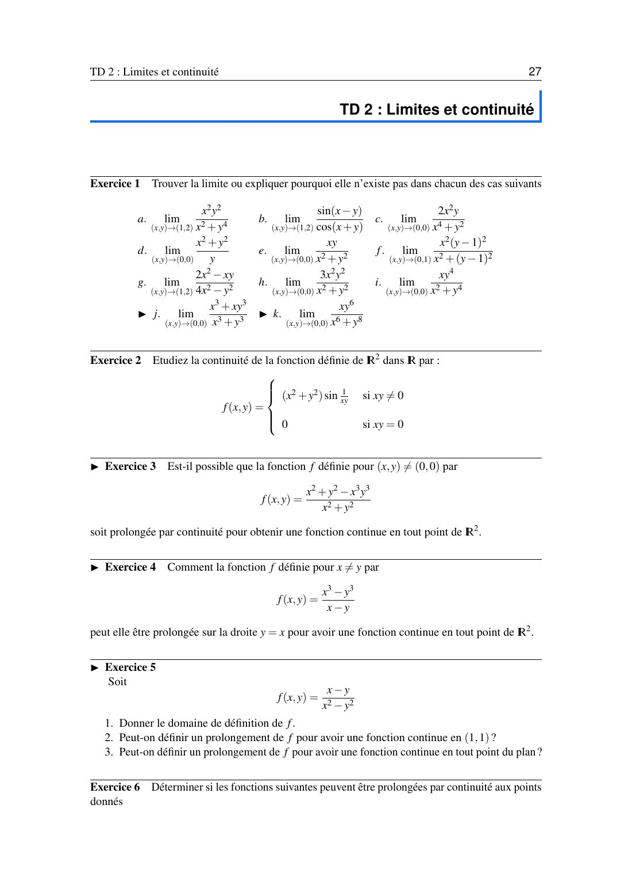
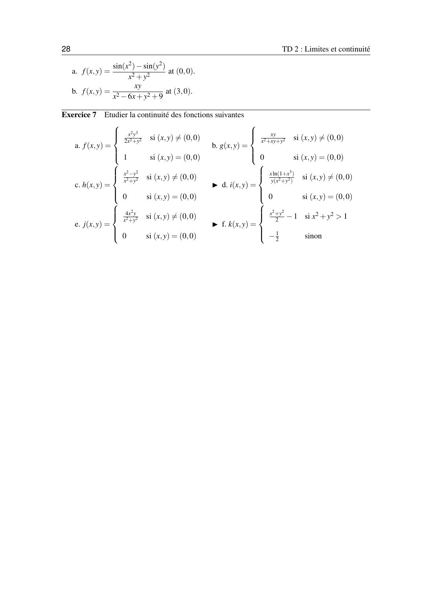

# TD 2 — Limites et continuité

=== "Version simplifiée"

    Énoncés complets : onglet **Version papier**. Rappels : [chapitre 2](../cours/chapitre-2-limites-continuite.md).

    !!! methode "La méthode, en résumé"
        1. Remplacer directement. Un nombre : fini.
        2. $\frac00$ : chemins $y = mx$, $x = 0$, parabole. Deux valeurs différentes : pas de limite.
        3. Toujours $\ell$ : prouver par majoration ($\frac{x^2}{x^2 + y^2} \leq 1$) ou en polaires.

    ## Exercice 1 — Limites

    **a.** $\lim\limits_{(1,2)} \dfrac{x^2 y^2}{x^2 + y^4}$ : remplacement direct, $\dfrac{4}{1 + 16} = \boxed{\dfrac{4}{17}}$.

    **b.** $\lim\limits_{(1,2)} \dfrac{\sin(x - y)}{\cos(x + y)}$ : $\cos 3 \neq 0$, donc $\boxed{\dfrac{\sin(-1)}{\cos 3} = -\dfrac{\sin 1}{\cos 3}}$ (environ 0,85).

    **c.** $\dfrac{2x^2 y}{x^4 + y^2}$ en $(0, 0)$. Le bas mélange $x^4$ et $y^2$ : on prend $y = x^2$.
    Sur $y = x^2$ : $\dfrac{2x^4}{2x^4} = 1$. Sur $y = 0$ : 0. **Pas de limite.**

    **d.** $\dfrac{x^2 + y^2}{y}$ en $(0, 0)$. Sur $y = mx$ ($m \neq 0$) : $\dfrac{x(1 + m^2)}{m} \to 0$. Sur $y = x^2$ : $\dfrac{x^2 + x^4}{x^2} = 1 + x^2 \to 1$. **Pas de limite.**

    **e.** $\dfrac{xy}{x^2 + y^2}$ : sur $y = mx$, $\dfrac{m}{1 + m^2}$ dépend de $m$. **Pas de limite.**

    **f.** $\dfrac{x^2 (y - 1)^2}{x^2 + (y - 1)^2}$ en $(0, 1)$. On pose $Y = y - 1$ :

    $$
    \Big\lvert \frac{x^2 Y^2}{x^2 + Y^2}\Big\rvert = \underbrace{\frac{x^2}{x^2 + Y^2}}_{\leq 1} Y^2 \leq Y^2 \to 0
    $$

    **Limite 0.** (En polaires : $r^2\cos^2\theta\sin^2\theta \to 0$.)

    **g.** $\dfrac{2x^2 - xy}{4x^2 - y^2}$ en $(1, 2)$ : remplacement direct $\frac{0}{0}$. On factorise :

    $$
    \frac{x(2x - y)}{(2x - y)(2x + y)} = \frac{x}{2x + y} \to \boxed{\frac{1}{4}}
    $$

    **h.** $\dfrac{3x^2 y^2}{x^2 + y^2}$ : $\lvert f\rvert \leq 3y^2 \to 0$. **Limite 0.**

    **i.** $\dfrac{xy^4}{x^2 + y^4}$ : $\lvert f\rvert = \dfrac{y^4}{x^2 + y^4}\lvert x\rvert \leq \lvert x\rvert \to 0$. **Limite 0.**

    **j.** $\dfrac{x^3 + xy^3}{x^3 + y^3}$ : sur $y = 0$ : 1. Sur $x = 0$ : 0. **Pas de limite.**

    **k.** $\dfrac{xy^6}{x^6 + y^8}$ : sur $x = 0$ : 0. Sur $x = y^2$ : $\dfrac{y^8}{y^{12} + y^8} = \dfrac{1}{1 + y^4} \to 1$. **Pas de limite.**

    !!! tip "Comment on trouve le chemin du k"
        On cherche à rendre le haut et le bas du même ordre. Avec $x = y^a$ : haut en $y^{a + 6}$, bas avec $y^{6a}$ et $y^8$.
        $a = 2$ donne un haut en $y^8$, comme le terme $y^8$ du bas.

    ## Exercice 2 — Continuité avec un sinus

    $f(x, y) = (x^2 + y^2)\sin\frac{1}{xy}$ si $xy \neq 0$, et $f = 0$ sur les axes.

    - Sur $\{xy \neq 0\}$ : composée et produit de fonctions continues, donc **continue**.
    - En $(0, 0)$ : $\lvert f\rvert \leq x^2 + y^2 \to 0 = f(0, 0)$, donc **continue**.
    - En un point $(a, 0)$ avec $a \neq 0$ : sur le chemin $(a, t)$, $f = (a^2 + t^2)\sin\frac{1}{at}$ oscille entre environ $-a^2$ et $a^2$ quand $t \to 0$. Pas de limite, donc **pas continue**. Même chose sur l'axe des $y$ privé de l'origine.

    **Conclusion** : $f$ est continue sur $\{xy \neq 0\} \cup \{(0, 0)\}$, pas sur le reste des axes.

    ## Exercice 3 — Prolongement en $(0, 0)$

    $f(x, y) = \dfrac{x^2 + y^2 - x^3 y^3}{x^2 + y^2}$ pour $(x, y) \neq (0, 0)$.

    $f = 1 - \dfrac{x^3 y^3}{x^2 + y^2}$ et $\Big\lvert\dfrac{x^3 y^3}{x^2 + y^2}\Big\rvert = \dfrac{x^2}{x^2 + y^2}\lvert x\rvert\lvert y\rvert^3 \leq \lvert x\rvert\lvert y\rvert^3 \to 0$.

    La limite vaut 1 : **oui**, on prolonge en posant $f(0, 0) = 1$.

    ## Exercice 4 — Prolongement sur la droite $y = x$

    $f(x, y) = \dfrac{x^3 - y^3}{x - y}$ pour $x \neq y$.

    $x^3 - y^3 = (x - y)(x^2 + xy + y^2)$, donc $f = x^2 + xy + y^2$ hors de la droite.
    Cette expression est un polynôme, continu partout : on pose $f(x, x) = 3x^2$.

    ## Exercice 5 — Prolongement en $(1, 1)$

    $f(x, y) = \dfrac{x - y}{x^2 - y^2}$.

    1. $D_f = \{(x, y) \;/\; x \neq y \text{ et } x \neq -y\}$.
    2. Sur $D_f$, $f = \dfrac{1}{x + y}$, qui tend vers $\frac12$ en $(1, 1)$. **Oui**, on pose $f(1, 1) = \frac12$.
    3. On peut prolonger sur toute la droite $y = x$ sauf l'origine, avec $f(a, a) = \frac{1}{2a}$. Mais près de la droite $y = -x$, $\frac{1}{x + y}$ n'est pas bornée : **impossible** de prolonger à tout le plan (ni en $(0, 0)$, ni sur $y = -x$).

    ## Exercice 6 — Prolongements

    **a.** $\dfrac{\sin(x^2) - \sin(y^2)}{x^2 + y^2}$ en $(0, 0)$. En polaires, $\sin(r^2\cos^2\theta) \sim r^2\cos^2\theta$, donc

    $$
    f \to \cos^2\theta - \sin^2\theta = \cos 2\theta
    $$

    qui dépend de $\theta$ (1 sur $y = 0$, $-1$ sur $x = 0$). **Pas prolongeable.**

    **b.** $\dfrac{xy}{x^2 - 6x + y^2 + 9} = \dfrac{xy}{(x - 3)^2 + y^2}$ en $(3, 0)$. Avec $X = x - 3$ : $\dfrac{(X + 3)y}{X^2 + y^2}$.
    Sur $y = X$ : $\dfrac{X + 3}{2X}$, qui n'est pas bornée. Sur $y = 0$ : 0. **Pas prolongeable.**

    ## Exercice 7 — Continuité

    **a.** $\dfrac{x^2 y^3}{2x^2 + y^2}$, $f(0, 0) = 1$. $\dfrac{x^2}{2x^2 + y^2} \leq \dfrac12$, donc $\lvert f\rvert \leq \dfrac{\lvert y\rvert^3}{2} \to 0 \neq 1$. **Pas continue en $(0, 0)$**, continue ailleurs.

    **b.** $\dfrac{xy}{x^2 + xy + y^2}$, $g(0, 0) = 0$. Sur $y = mx$ : $\dfrac{m}{1 + m + m^2}$ ($0$ pour $m = 0$, $\frac13$ pour $m = 1$). **Pas continue en $(0, 0)$.**

    **c.** $\dfrac{x^2 - y^2}{x^2 + y^2}$, $h(0, 0) = 0$ : 1 sur $y = 0$, $-1$ sur $x = 0$. **Pas continue en $(0, 0)$.**

    **e.** $\dfrac{4x^2 y}{x^2 + y^2}$, $j(0, 0) = 0$ : $\lvert j\rvert \leq 4\lvert y\rvert \to 0$. **Continue sur $\mathbb{R}^2$.**

=== "Version papier"

    L'énoncé officiel du TD 2, tel qu'il est dans le poly. Les exercices marqués ▶ sont à faire en autonomie.

    [{ loading=lazy .papier }](papier/td2/p27.jpg)
    
TD 2 · page 1/2 · poly p. 27

    [{ loading=lazy .papier }](papier/td2/p28.jpg)
    
TD 2 · page 2/2 · poly p. 28

