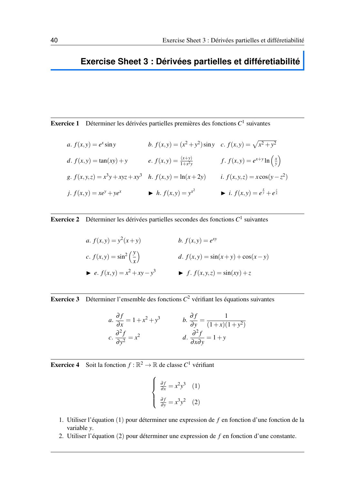
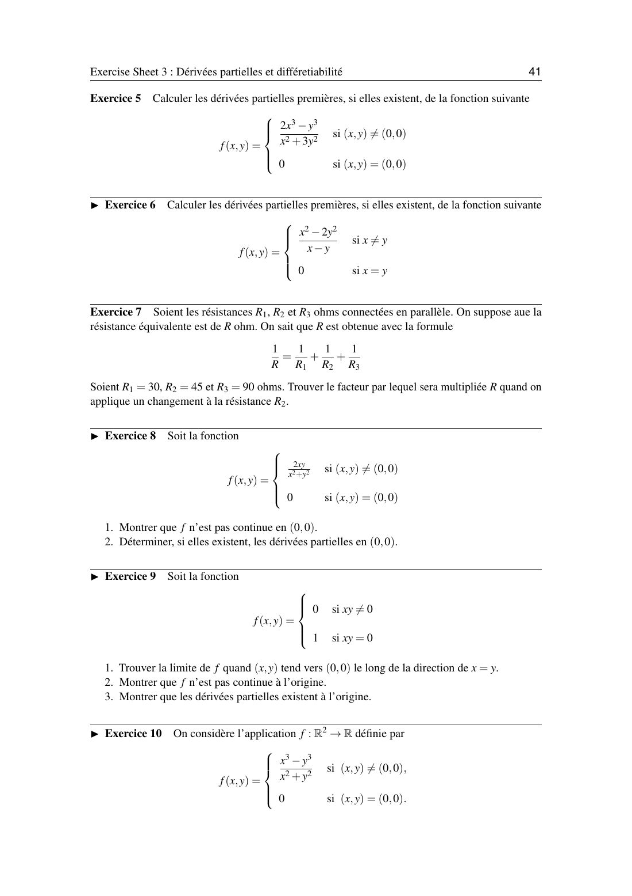
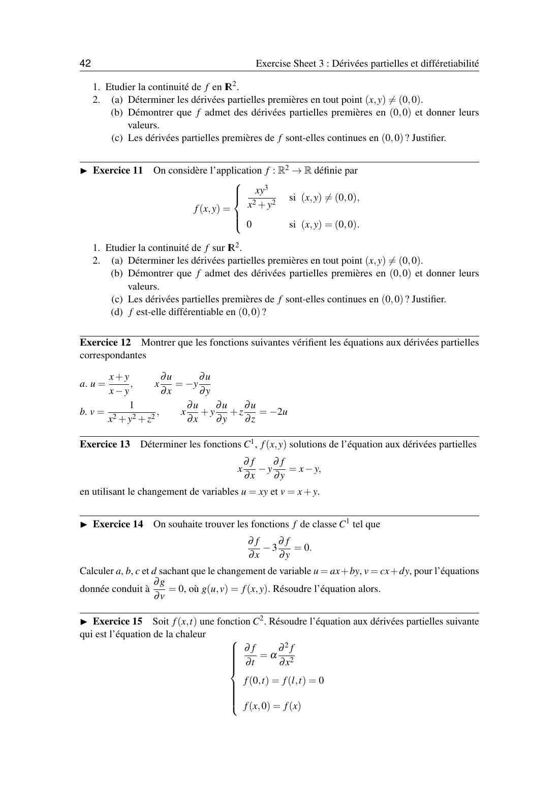
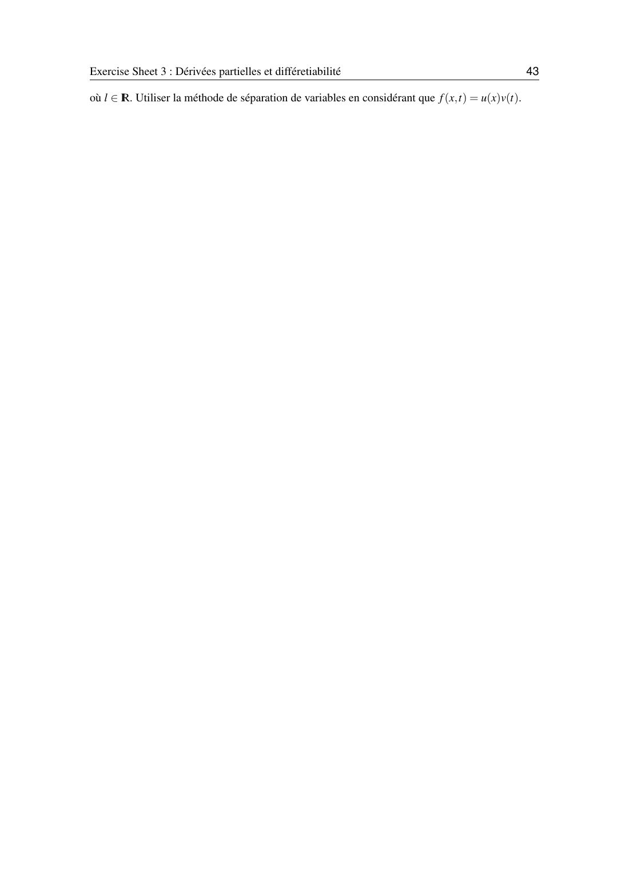

# TD 3 — Dérivées partielles et différentiabilité

=== "Version simplifiée"

    Énoncés complets : onglet **Version papier**. Rappels : [chapitre 3](../cours/chapitre-3-derivees-partielles.md).

    ## Exercice 1 — Dérivées partielles premières

    !!! methode "Rappel"
        Pour $f_x$, $y$ est une constante. Pour $f_y$, $x$ est une constante.

    | | $f$ | $\dfrac{\partial f}{\partial x}$ | $\dfrac{\partial f}{\partial y}$ |
    |-|-----|-----------------|-----------------|
    | a | $e^x \sin y$ | $e^x \sin y$ | $e^x \cos y$ |
    | b | $(x^2 + y^2)\sin y$ | $2x\sin y$ | $2y\sin y + (x^2 + y^2)\cos y$ |
    | c | $\sqrt{x^2 + y^2}$ | $\dfrac{x}{\sqrt{x^2 + y^2}}$ | $\dfrac{y}{\sqrt{x^2 + y^2}}$ |
    | d | $\tan(xy) + y$ | $y\,(1 + \tan^2(xy))$ | $x\,(1 + \tan^2(xy)) + 1$ |
    | e | $\dfrac{x + y}{1 + x^2 y}$ | $\dfrac{1 - x^2 y - 2xy^2}{(1 + x^2 y)^2}$ | $\dfrac{1 - x^3}{(1 + x^2 y)^2}$ |
    | f | $e^{x + y}\ln(xy)$ | $e^{x + y}\Big(\ln(xy) + \dfrac{1}{x}\Big)$ | $e^{x + y}\Big(\ln(xy) + \dfrac{1}{y}\Big)$ |
    | h | $\ln(x + 2y)$ | $\dfrac{1}{x + 2y}$ | $\dfrac{2}{x + 2y}$ |
    | j | $xe^y + ye^x$ | $e^y + ye^x$ | $xe^y + e^x$ |

    Trois variables :

    - **g.** $f = x^3 y + xyz + xy^3$ : $f_x = 3x^2 y + yz + y^3$, $f_y = x^3 + xz + 3xy^2$, $f_z = xy$.
    - **i.** $f = x\cos(y - z^2)$ : $f_x = \cos(y - z^2)$, $f_y = -x\sin(y - z^2)$, $f_z = 2xz\sin(y - z^2)$.

    !!! piege "Le e"
        Règle du quotient $\big(\frac{u}{v}\big)' = \frac{u'v - uv'}{v^2}$, avec ici $v_x = 2xy$ et $v_y = x^2$.
        Pour $f_y$ : $(1 + x^2 y) - (x + y)x^2 = 1 - x^3$, les $x^2 y$ se simplifient.

    ## Exercice 2 — Dérivées secondes

    **a.** $f = y^2(x + y) = xy^2 + y^3$ : $f_x = y^2$, $f_y = 2xy + 3y^2$, $f_{xx} = 0$, $f_{yy} = 2x + 6y$, $f_{xy} = 2y$.

    **b.** $f = e^{xy}$ : $f_x = ye^{xy}$, $f_y = xe^{xy}$, $f_{xx} = y^2 e^{xy}$, $f_{yy} = x^2 e^{xy}$, $f_{xy} = (1 + xy)e^{xy}$.

    **c.** $f = \sin^2\frac{y}{x}$. Avec $2\sin u\cos u = \sin 2u$ :

    $$
    f_x = -\frac{y}{x^2}\sin\frac{2y}{x}, \qquad f_y = \frac{1}{x}\sin\frac{2y}{x}
    $$

    $$
    f_{xx} = \frac{2y}{x^3}\sin\frac{2y}{x} + \frac{2y^2}{x^4}\cos\frac{2y}{x}, \quad
    f_{yy} = \frac{2}{x^2}\cos\frac{2y}{x}, \quad
    f_{xy} = -\frac{1}{x^2}\sin\frac{2y}{x} - \frac{2y}{x^3}\cos\frac{2y}{x}
    $$

    **d.** $f = \sin(x + y) + \cos(x - y)$ : $f_x = \cos(x + y) - \sin(x - y)$, $f_y = \cos(x + y) + \sin(x - y)$,
    $f_{xx} = f_{yy} = -\sin(x + y) - \cos(x - y)$, $f_{xy} = -\sin(x + y) + \cos(x - y)$.

    **e.** $f = x^2 + xy - y^3$ : $f_{xx} = 2$, $f_{yy} = -6y$, $f_{xy} = 1$.

    **f.** $f = \sin(xy) + z$ : $f_{xx} = -y^2\sin(xy)$, $f_{yy} = -x^2\sin(xy)$, $f_{xy} = \cos(xy) - xy\sin(xy)$, toutes les dérivées faisant intervenir $z$ sont nulles.

    ## Exercice 3 — Retrouver $f$

    On primitive par rapport à une variable ; la constante devient une fonction de l'autre.

    | Équation | Solutions |
    |----------|-----------|
    | a. $f_x = 1 + x^2 + y^3$ | $f = x + \dfrac{x^3}{3} + xy^3 + g(y)$ |
    | b. $f_y = \dfrac{1}{(1 + x)(1 + y^2)}$ | $f = \dfrac{\arctan y}{1 + x} + g(x)$ |
    | c. $f_{yy} = x^2$ | $f_y = x^2 y + g(x)$, puis $f = \dfrac{x^2 y^2}{2} + y\,g(x) + h(x)$ |
    | d. $f_{xy} = 1 + y$ | $f_y = x(1 + y) + g(y)$, puis $f = x\Big(y + \dfrac{y^2}{2}\Big) + G(y) + h(x)$ |

    ## Exercice 4 — $f_x = x^2 y^3$ et $f_y = x^3 y^2$

    1. De (1) : $f = \dfrac{x^3 y^3}{3} + g(y)$.
    2. On dérive en $y$ : $f_y = x^3 y^2 + g'(y)$. Avec (2) : $g'(y) = 0$, donc $g = C$ et $\boxed{f = \dfrac{x^3 y^3}{3} + C}$.

    ## Exercice 5 — Dérivées partielles en $(0, 0)$

    $f(x, y) = \dfrac{2x^3 - y^3}{x^2 + 3y^2}$ si $(x, y) \neq (0, 0)$, $f(0, 0) = 0$.

    **Hors de $(0, 0)$** (règle du quotient) :

    $$
    f_x = \frac{2x\,(x^3 + 9xy^2 + y^3)}{(x^2 + 3y^2)^2}, \qquad
    f_y = \frac{-3y\,(4x^3 + x^2 y + y^3)}{(x^2 + 3y^2)^2}
    $$

    **En $(0, 0)$**, par la définition :

    $$
    f_x(0, 0) = \lim_{h\to 0}\frac{f(h, 0) - 0}{h} = \lim_{h\to0}\frac{2h^3/h^2}{h} = 2,
    \qquad
    f_y(0, 0) = \lim_{h\to0}\frac{-h^3/(3h^2)}{h} = -\frac13
    $$

    ## Exercice 6 — Fonction définie hors de $y = x$

    $f(x, y) = \dfrac{x^2 - 2y^2}{x - y}$ si $x \neq y$, $f = 0$ sinon.

    En $(0, 0)$ : $f(h, 0) = h$ donc $f_x(0, 0) = \lim \frac{h}{h} = 1$ ; $f(0, h) = \frac{-2h^2}{-h} = 2h$ donc $f_y(0, 0) = 2$.

    ## Exercice 7 — Résistances en parallèle

    $\frac1R = \frac{1}{R_1} + \frac{1}{R_2} + \frac{1}{R_3}$. Avec 30, 45 et 90 Ω : $\frac1R = \frac{3 + 2 + 1}{90}$, donc $R = 15$ Ω.
    En dérivant par rapport à $R_2$ : $-\frac{1}{R^2}\frac{\partial R}{\partial R_2} = -\frac{1}{R_2^2}$, d'où

    $$
    \frac{\partial R}{\partial R_2} = \frac{R^2}{R_2^2} = \frac{225}{2025} = \frac19
    $$

    Une variation de $R_2$ se répercute sur $R$ multipliée par $\frac19$.

    ## Exercice 8 — Dérivées partielles sans continuité

    $f(x, y) = \dfrac{2xy}{x^2 + y^2}$, $f(0, 0) = 0$.

    1. Sur $y = mx$ : $\dfrac{2m}{1 + m^2}$ dépend de $m$, pas de limite : **pas continue** en $(0, 0)$.
    2. $f(h, 0) = 0$ et $f(0, h) = 0$, donc $f_x(0, 0) = f_y(0, 0) = 0$. Les dérivées partielles **existent** quand même.

    ## Exercice 9 — Fonction qui vaut 1 sur les axes

    $f = 0$ si $xy \neq 0$, $f = 1$ si $xy = 0$.

    1. Sur $y = x$ (privé de 0), $f = 0$ : la limite le long de ce chemin vaut 0.
    2. $0 \neq f(0, 0) = 1$ : **pas continue**.
    3. $f(h, 0) = f(0, 0) = 1$, donc $\frac{f(h,0) - f(0,0)}{h} = 0$ : $f_x(0, 0) = 0$, et de même $f_y(0, 0) = 0$.

    ## Exercice 10 — Continue, mais pas $C^1$

    $f(x, y) = \dfrac{x^3 - y^3}{x^2 + y^2}$, $f(0, 0) = 0$.

    1. **Continuité** : $\lvert x^3 - y^3\rvert \leq \lvert x\rvert^3 + \lvert y\rvert^3 \leq (\lvert x\rvert + \lvert y\rvert)(x^2 + y^2)$, donc $\lvert f\rvert \leq \lvert x\rvert + \lvert y\rvert \to 0$. Continue sur $\mathbb{R}^2$.
    2. (a) Hors de $(0, 0)$ :
       $f_x = \dfrac{x(x^3 + 3xy^2 + 2y^3)}{(x^2 + y^2)^2}$, $f_y = -\dfrac{y(2x^3 + 3x^2 y + y^3)}{(x^2 + y^2)^2}$.

        (b) $f(h, 0) = h$ donne $f_x(0, 0) = 1$ ; $f(0, h) = -h$ donne $f_y(0, 0) = -1$.

        (c) Haut et bas de $f_x$ sont de degré 4 : en polaires, $f_x = \cos^4\theta + 3\cos^2\theta\sin^2\theta + 2\cos\theta\sin^3\theta$, qui dépend de $\theta$ (1 pour $\theta = 0$, 0 pour $\theta = \frac\pi2$). $f_x$ n'a pas de limite en $(0, 0)$ : **pas continue**. Même chose pour $f_y$.

    ## Exercice 11 — Différentiable en $(0, 0)$

    $f(x, y) = \dfrac{xy^3}{x^2 + y^2}$, $f(0, 0) = 0$.

    1. $\lvert f\rvert \leq \lvert x\rvert\,\lvert y\rvert \cdot \dfrac{y^2}{x^2 + y^2} \leq \lvert xy\rvert \to 0$ : continue sur $\mathbb{R}^2$.
    2. (a) $f_x = \dfrac{y^3(y^2 - x^2)}{(x^2 + y^2)^2}$, $f_y = \dfrac{xy^2(3x^2 + y^2)}{(x^2 + y^2)^2}$.

        (b) $f(h, 0) = 0$ et $f(0, h) = 0$ : $f_x(0, 0) = f_y(0, 0) = 0$.

        (c) En polaires, $f_x = r\sin^3\theta(\sin^2\theta - \cos^2\theta)$ donc $\lvert f_x\rvert \leq 2r \to 0$ ; $f_y = r\cos\theta\sin^2\theta(3\cos^2\theta + \sin^2\theta)$ donc $\lvert f_y\rvert \leq 4r \to 0$. Les deux sont **continues** en $(0, 0)$.

        (d) Dérivées partielles continues : $f$ est $C^1$, donc **différentiable** en $(0, 0)$.

    ## Exercice 12 — Vérifier une EDP

    **a.** $u = \dfrac{x + y}{x - y}$ : $u_x = \dfrac{-2y}{(x - y)^2}$ et $u_y = \dfrac{2x}{(x - y)^2}$, donc $xu_x = \dfrac{-2xy}{(x - y)^2} = -yu_y$.

    **b.** $v = \dfrac{1}{x^2 + y^2 + z^2}$ : $v_x = \dfrac{-2x}{(x^2 + y^2 + z^2)^2}$, etc. Donc

    $$
    xv_x + yv_y + zv_z = \frac{-2(x^2 + y^2 + z^2)}{(x^2 + y^2 + z^2)^2} = -2v
    $$

    ## Exercice 13 — $xf_x - yf_y = x - y$ avec $u = xy$, $v = x + y$

    On pose $f(x, y) = g(u, v)$. Chaîne : $f_x = y\,g_u + g_v$ et $f_y = x\,g_u + g_v$.

    $$
    xf_x - yf_y = xy\,g_u + x\,g_v - xy\,g_u - y\,g_v = (x - y)\,g_v
    $$

    L'équation devient $(x - y)g_v = x - y$, soit $g_v = 1$ (là où $x \neq y$). Donc $g = v + h(u)$ et

    $$
    \boxed{f(x, y) = x + y + h(xy)}, \quad h \text{ de classe } C^1
    $$

    ## Exercice 14 — $f_x - 3f_y = 0$

    On cherche $u = ax + by$, $v = cx + dy$ qui transforme l'équation en $g_v = 0$.
    $f_x = a\,g_u + c\,g_v$, $f_y = b\,g_u + d\,g_v$, donc $f_x - 3f_y = (a - 3b)g_u + (c - 3d)g_v$.
    Il faut $a - 3b = 0$ (par exemple $a = 3$, $b = 1$) et $c - 3d \neq 0$ (par exemple $c = 0$, $d = 1$).
    Alors $g_v = 0$, $g = \varphi(u)$, et $\boxed{f(x, y) = \varphi(3x + y)}$.

    ## Exercice 15 — Équation de la chaleur (séparation des variables)

    $f_t = \alpha f_{xx}$ avec $f(0, t) = f(l, t) = 0$. On cherche $f = u(x)v(t)$ :
    $u v' = \alpha u'' v$, donc $\dfrac{v'}{\alpha v} = \dfrac{u''}{u} = -\lambda$ (constante, car le membre de gauche ne dépend que de $t$ et celui de droite que de $x$).

    - $u'' + \lambda u = 0$ avec $u(0) = u(l) = 0$ : solutions non nulles pour $\lambda_n = \big(\frac{n\pi}{l}\big)^2$, $u_n = \sin\frac{n\pi x}{l}$.
    - $v' = -\alpha\lambda_n v$ : $v_n = e^{-\alpha\lambda_n t}$.

    $$
    f(x, t) = \sum_{n\geq1} b_n \sin\Big(\frac{n\pi x}{l}\Big)e^{-\alpha(n\pi/l)^2 t}
    $$

    les $b_n$ étant fixés par la condition initiale $f(x, 0)$.

=== "Version papier"

    L'énoncé officiel du TD 3, tel qu'il est dans le poly. Les exercices marqués ▶ sont à faire en autonomie.

    [{ loading=lazy .papier }](papier/td3/p40.jpg)
    
TD 3 · page 1/4 · poly p. 40

    [{ loading=lazy .papier }](papier/td3/p41.jpg)
    
TD 3 · page 2/4 · poly p. 41

    [{ loading=lazy .papier }](papier/td3/p42.jpg)
    
TD 3 · page 3/4 · poly p. 42

    [{ loading=lazy .papier }](papier/td3/p43.jpg)
    
TD 3 · page 4/4 · poly p. 43

