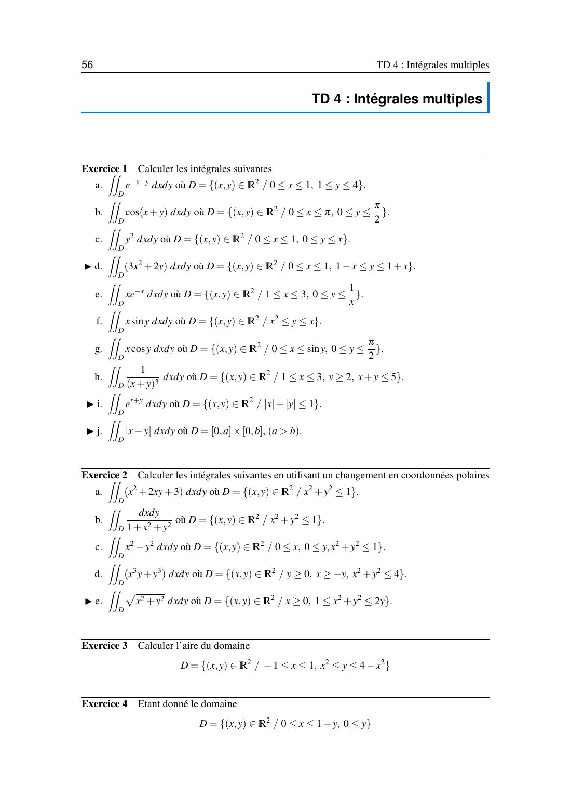
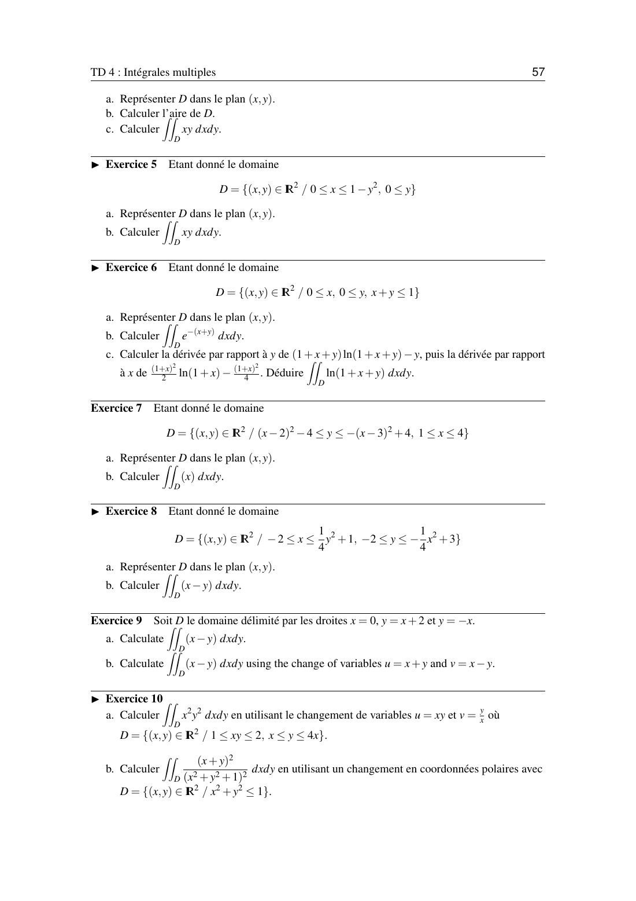
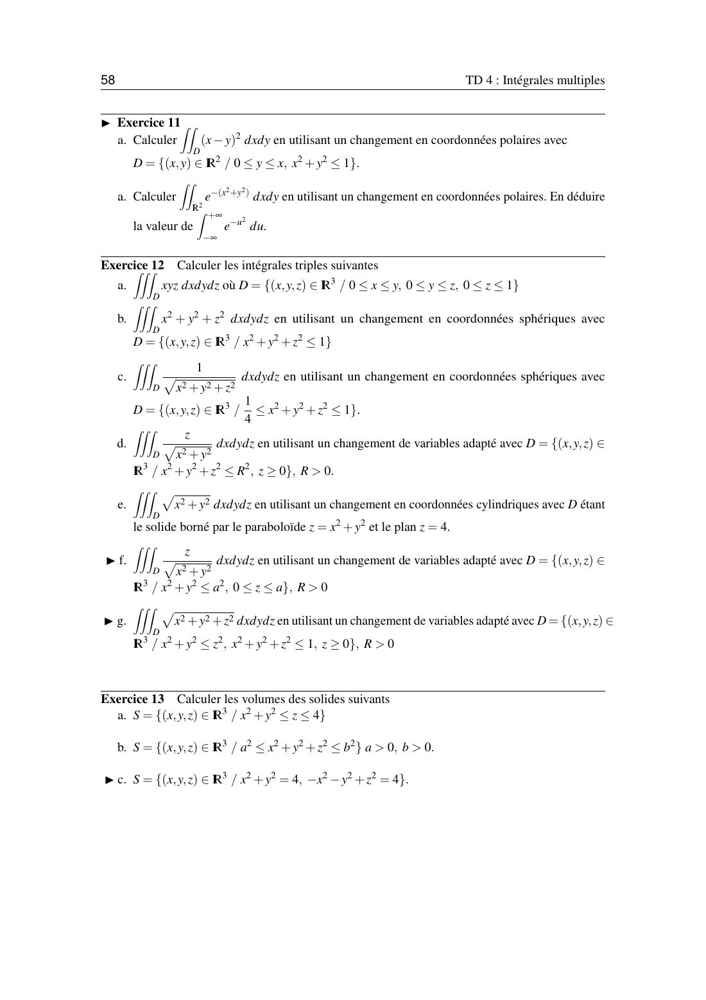

# TD 4 — Intégrales multiples

=== "Version simplifiée"

    Énoncés complets : onglet **Version papier**. Rappels : [chapitre 4](../cours/chapitre-4-integrales-multiples.md).

    !!! methode "Avant chaque calcul"
        1. **Dessiner** le domaine et calculer les intersections.
        2. Choisir les tranches (verticales : $x$ entre deux nombres, $y$ entre deux courbes) ou un changement de variables.
        3. Polaires : $dx\,dy = r\,dr\,d\theta$. Cylindriques : $r\,dr\,d\theta\,dz$. Sphériques : $r^2\sin\varphi\,dr\,d\varphi\,d\theta$.

    ## Exercice 1 — Intégrales doubles

    **a.** $\displaystyle\iint e^{-x-y}$ sur $[0, 1]\times[1, 4]$ : variables séparées.

    $$
    \int_0^1 e^{-x}dx \int_1^4 e^{-y}dy = (1 - e^{-1})(e^{-1} - e^{-4})
    $$

    **b.** $\displaystyle\int_0^\pi\int_0^{\pi/2}\cos(x + y)\,dy\,dx = \int_0^\pi \big[\sin(x + y)\big]_0^{\pi/2}dx = \int_0^\pi(\cos x - \sin x)\,dx = \boxed{-2}$.

    **c.** $\displaystyle\int_0^1\int_0^x y^2\,dy\,dx = \int_0^1 \frac{x^3}{3}dx = \boxed{\frac{1}{12}}$.

    **d.** $\displaystyle\int_0^1\int_{1-x}^{1+x}(3x^2 + 2y)\,dy\,dx = \int_0^1 \big(6x^3 + (1 + x)^2 - (1 - x)^2\big)dx = \int_0^1 (6x^3 + 4x)\,dx = \boxed{\frac72}$.

    **e.** $\displaystyle\int_1^3\int_0^{1/x} xe^{-x}\,dy\,dx = \int_1^3 e^{-x}\,dx = \boxed{e^{-1} - e^{-3}}$.

    **f.** $x^2 \leq y \leq x$ impose $x^2 \leq x$, soit $0 \leq x \leq 1$.

    $$
    \int_0^1\int_{x^2}^{x} x\sin y\,dy\,dx = \int_0^1 x(\cos x^2 - \cos x)\,dx = \Big[\frac{\sin x^2}{2}\Big]_0^1 - \big[x\sin x + \cos x\big]_0^1 = \boxed{1 - \cos 1 - \frac{\sin 1}{2}}
    $$

    (Intégration par parties pour $\int x\cos x$.)

    **g.** $\displaystyle\int_0^{\pi/2}\int_0^{\sin y} x\cos y\,dx\,dy = \int_0^{\pi/2}\frac{\sin^2 y}{2}\cos y\,dy = \Big[\frac{\sin^3 y}{6}\Big]_0^{\pi/2} = \boxed{\frac16}$.

    **h.** $1 \leq x \leq 3$ et $2 \leq y \leq 5 - x$ :

    $$
    \int_1^3\int_2^{5-x}\frac{dy}{(x + y)^3} = \int_1^3\Big(\frac{1}{2(x + 2)^2} - \frac{1}{50}\Big)dx = \Big[-\frac{1}{2(x + 2)}\Big]_1^3 - \frac{2}{50} = \boxed{\frac{2}{75}}
    $$

    **i.** $\lvert x\rvert + \lvert y\rvert \leq 1$ est un carré tourné. Avec $u = x + y$, $v = x - y$ : le domaine devient $[-1, 1]^2$ et $\lvert J\rvert = \frac12$.

    $$
    \iint e^{x + y} = \frac12\int_{-1}^1 e^u\,du\int_{-1}^1 dv = \boxed{e - e^{-1}}
    $$

    **j.** $\lvert x - y\rvert$ sur $[0, a]\times[0, b]$, $a > b$. Pour $y$ fixé : $\int_0^a\lvert x - y\rvert dx = \frac{y^2}{2} + \frac{(a - y)^2}{2}$.

    $$
    \int_0^b\Big(\frac{y^2}{2} + \frac{(a - y)^2}{2}\Big)dy = \boxed{\frac{a^2 b}{2} - \frac{ab^2}{2} + \frac{b^3}{3}}
    $$

    ## Exercice 2 — Polaires

    **a.** Disque unité, $\iint (x^2 + 2xy + 3)$ : $\int_0^{2\pi}\!\int_0^1 (r^2\cos^2\theta + r^2\sin 2\theta + 3)\,r\,dr\,d\theta = \frac{\pi}{4} + 0 + 3\pi = \boxed{\frac{13\pi}{4}}$.

    **b.** $\displaystyle\iint\frac{dx\,dy}{1 + x^2 + y^2} = \int_0^{2\pi}\int_0^1\frac{r\,dr}{1 + r^2}d\theta = 2\pi\cdot\frac{\ln 2}{2} = \boxed{\pi\ln 2}$.

    **c.** Quart de disque, $\iint (x^2 - y^2) = \int_0^{\pi/2}\cos 2\theta\,d\theta\int_0^1 r^3 dr = 0 \times \frac14 = \boxed{0}$ (symétrie par rapport à $y = x$).

    **d.** $y \geq 0$, $x \geq -y$, $r \leq 2$ : $0 \leq \theta \leq \frac{3\pi}{4}$. Attention, $x^3 y$ et $y^3$ n'ont pas le même degré.

    $$
    \int_0^{3\pi/4}\!\!\cos^3\theta\sin\theta\,d\theta\int_0^2 r^5 dr + \int_0^{3\pi/4}\!\!\sin^3\theta\,d\theta\int_0^2 r^4 dr
    = \frac{3}{16}\cdot\frac{32}{3} + \Big(\frac23 + \frac{5\sqrt2}{12}\Big)\frac{32}{5} = \boxed{\frac{94}{15} + \frac{8\sqrt2}{3}}
    $$

    ## Exercice 3 — Aire

    $$
    \int_{-1}^1\int_{x^2}^{4 - x^2} dy\,dx = \int_{-1}^1 (4 - 2x^2)\,dx = 8 - \frac43 = \boxed{\frac{20}{3}}
    $$

    ## Exercice 4 — $D = \{0 \leq x \leq 1 - y,\; y \geq 0\}$

    a. Triangle de sommets $(0, 0)$, $(1, 0)$, $(0, 1)$. b. Aire $\frac12$.
    c. $\displaystyle\int_0^1\int_0^{1-y} xy\,dx\,dy = \int_0^1 y\frac{(1 - y)^2}{2}dy = \boxed{\frac{1}{24}}$.

    ## Exercice 5 — $D = \{0 \leq x \leq 1 - y^2,\; y \geq 0\}$

    a. Région entre l'axe $Oy$ et la parabole couchée $x = 1 - y^2$, pour $0 \leq y \leq 1$.
    b. $\displaystyle\int_0^1\int_0^{1-y^2} xy\,dx\,dy = \int_0^1 y\frac{(1 - y^2)^2}{2}dy = \Big[-\frac{(1 - y^2)^3}{12}\Big]_0^1 = \boxed{\frac{1}{12}}$.

    ## Exercice 6 — Triangle $x, y \geq 0$, $x + y \leq 1$

    b. $\displaystyle\int_0^1 e^{-x}\int_0^{1-x}e^{-y}dy\,dx = \int_0^1 (e^{-x} - e^{-1})\,dx = \boxed{1 - \frac{2}{e}}$.

    c. Les deux dérivées données servent de primitives : $\frac{\partial}{\partial y}\big[(1 + x + y)\ln(1 + x + y) - y\big] = \ln(1 + x + y)$. Donc
    $\int_0^{1-x}\ln(1 + x + y)\,dy = 2\ln 2 - (1 - x) - (1 + x)\ln(1 + x)$, puis on intègre en $x$ grâce à la seconde dérivée donnée :

    $$
    \iint_D \ln(1 + x + y)\,dx\,dy = \boxed{\frac14}
    $$

    ## Exercice 7 — Entre deux paraboles, $1 \leq x \leq 4$

    $$
    \int_1^4 x\Big[\big(4 - (x - 3)^2\big) - \big((x - 2)^2 - 4\big)\Big]dx = \boxed{45}
    $$

    ## Exercice 9 — Triangle $x = 0$, $y = x + 2$, $y = -x$

    Les droites se coupent en $(-1, 1)$, $(0, 0)$ et $(0, 2)$. Donc $-1 \leq x \leq 0$ et $-x \leq y \leq x + 2$.

    a. $\displaystyle\int_{-1}^0\int_{-x}^{x+2}(x - y)\,dy\,dx = \boxed{-\frac43}$.

    b. Avec $u = x + y$, $v = x - y$ : $x = \frac{u + v}{2}$, $y = \frac{u - v}{2}$, $\lvert J\rvert = \frac12$. Les côtés deviennent $u = 0$ (pour $y = -x$), $v = -2$ (pour $y = x + 2$) et $u = -v$ (pour $x = 0$). Le domaine est $-2 \leq v \leq 0$, $0 \leq u \leq -v$ :

    $$
    \int_{-2}^0\int_0^{-v} v\cdot\frac12\,du\,dv = \frac12\int_{-2}^0 -v^2\,dv = -\frac43
    $$

    ## Exercice 10

    **a.** Changement $u = xy$, $v = \frac{y}{x}$ (le $v$ de l'énoncé). Alors $x = \sqrt{u/v}$, $y = \sqrt{uv}$ et $\lvert J\rvert = \frac{1}{2v}$. Le domaine devient $1 \leq u \leq 2$, $1 \leq v \leq 4$ :

    $$
    \iint x^2 y^2 = \int_1^2\int_1^4 \frac{u^2}{2v}\,dv\,du = \frac{7}{3}\cdot\frac{\ln 4}{2} = \boxed{\frac{7\ln 2}{3}}
    $$

    **b.** $(x + y)^2 = r^2(1 + \sin 2\theta)$ et $\int_0^{2\pi}(1 + \sin 2\theta)\,d\theta = 2\pi$. Avec $t = r^2$ :
    $\int_0^1\frac{r^3}{(1 + r^2)^2}dr = \frac12\big(\ln 2 - \frac12\big)$, donc l'intégrale vaut $\boxed{\pi\big(\ln 2 - \frac12\big)}$.

    ## Exercice 11

    **a.** $0 \leq y \leq x$, $r \leq 1$ : $0 \leq \theta \leq \frac\pi4$, et $(x - y)^2 = r^2(1 - \sin 2\theta)$.
    $\int_0^1 r^3 dr\int_0^{\pi/4}(1 - \sin 2\theta)\,d\theta = \frac14\big(\frac\pi4 - \frac12\big) = \boxed{\frac{\pi}{16} - \frac18}$.

    **b.** $\displaystyle\iint_{\mathbb{R}^2}e^{-(x^2 + y^2)} = \int_0^{2\pi}\int_0^{+\infty}e^{-r^2}r\,dr\,d\theta = 2\pi\cdot\frac12 = \pi$.
    Comme cette intégrale vaut aussi $\big(\int_{\mathbb{R}}e^{-u^2}du\big)^2$ (variables séparées), on obtient $\boxed{\int_{-\infty}^{+\infty}e^{-u^2}du = \sqrt\pi}$.

    ## Exercice 12 — Intégrales triples

    **a.** $\displaystyle\int_0^1\int_0^z\int_0^y xyz\,dx\,dy\,dz = \int_0^1 z\int_0^z\frac{y^3}{2}dy\,dz = \int_0^1\frac{z^5}{8}dz = \boxed{\frac{1}{48}}$.

    **b.** Boule unité, sphériques : $\displaystyle\int_0^{2\pi}\int_0^\pi\int_0^1 r^2\cdot r^2\sin\varphi\,dr\,d\varphi\,d\theta = 2\pi\cdot2\cdot\frac15 = \boxed{\frac{4\pi}{5}}$.

    **c.** Coquille $\frac12 \leq r \leq 1$ : $\displaystyle 4\pi\int_{1/2}^1\frac{1}{r}r^2\,dr = 4\pi\cdot\frac12\Big(1 - \frac14\Big) = \boxed{\frac{3\pi}{2}}$.

    **d.** Demi-boule $z \geq 0$, cylindriques : $\dfrac{z}{r}\cdot r = z$, et $0 \leq z \leq \sqrt{R^2 - r^2}$ :
    $\displaystyle 2\pi\int_0^R\frac{R^2 - r^2}{2}dr = \boxed{\frac{2\pi R^3}{3}}$.

    **e.** Sous $z = 4$, au-dessus de $z = r^2$, cylindriques ($0 \leq r \leq 2$) :
    $\displaystyle 2\pi\int_0^2 r\cdot r\,(4 - r^2)\,dr = 2\pi\Big(\frac{32}{3} - \frac{32}{5}\Big) = \boxed{\frac{128\pi}{15}}$.

    **f.** Cylindre $r \leq a$, $0 \leq z \leq a$ : $\displaystyle 2\pi\int_0^a dr\int_0^a z\,dz = \boxed{\pi a^3}$.

    **g.** Cône $z \geq \sqrt{x^2 + y^2}$ dans la boule unité : en sphériques, $0 \leq \varphi \leq \frac\pi4$.
    $\displaystyle 2\pi\int_0^{\pi/4}\sin\varphi\,d\varphi\int_0^1 r^3dr = 2\pi\Big(1 - \frac{\sqrt2}{2}\Big)\frac14 = \boxed{\frac{\pi(2 - \sqrt2)}{4}}$.

    ## Exercice 13 — Volumes

    **a.** $x^2 + y^2 \leq z \leq 4$ : $\displaystyle\int_0^{2\pi}\int_0^2 (4 - r^2)\,r\,dr\,d\theta = 2\pi(8 - 4) = \boxed{8\pi}$.

    **b.** Coquille entre les sphères de rayons $a$ et $b$ ($a < b$) : $\boxed{\frac43\pi(b^3 - a^3)}$.

=== "Version papier"

    L'énoncé officiel du TD 4, tel qu'il est dans le poly. Les exercices marqués ▶ sont à faire en autonomie.

    [{ loading=lazy .papier }](papier/td4/p56.jpg)
    
TD 4 · page 1/3 · poly p. 56

    [{ loading=lazy .papier }](papier/td4/p57.jpg)
    
TD 4 · page 2/3 · poly p. 57

    [{ loading=lazy .papier }](papier/td4/p58.jpg)
    
TD 4 · page 3/3 · poly p. 58

