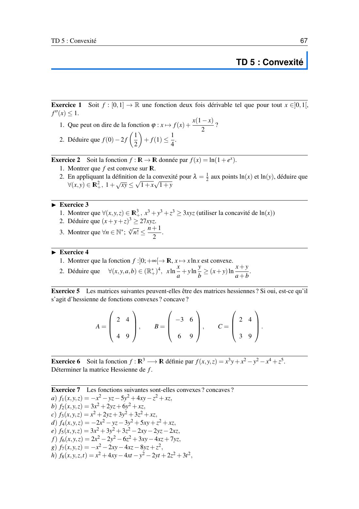
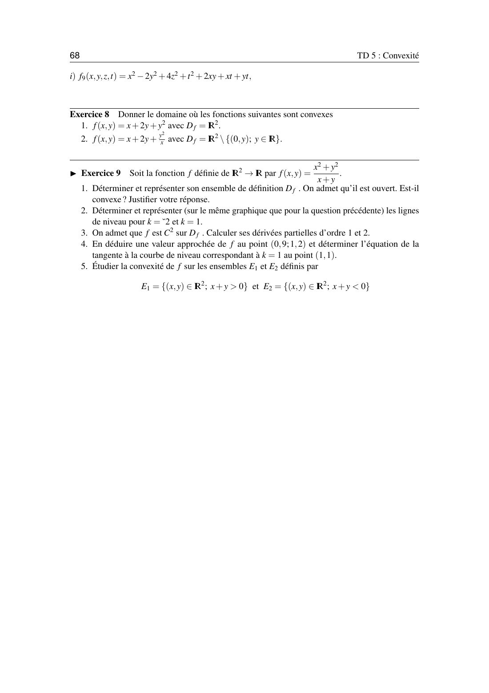

# TD 5 — Convexité

=== "Version simplifiée"

    Énoncés complets : onglet **Version papier**. Rappels : [chapitre 5](../cours/chapitre-5-convexite.md).

    ## Exercice 1 — $f'' \leq 1$ sur $]0, 1[$

    1. $\varphi(x) = f(x) + \dfrac{x(1 - x)}{2}$ : $\varphi'' = f'' - 1 \leq 0$, donc **$\varphi$ est concave**.
    2. Concavité entre 0 et 1 avec $\lambda = \frac12$ : $\varphi\big(\frac12\big) \geq \frac{\varphi(0) + \varphi(1)}{2}$.
       Or $\varphi(0) = f(0)$, $\varphi(1) = f(1)$ et $\varphi\big(\frac12\big) = f\big(\frac12\big) + \frac18$. Donc
       $f\big(\frac12\big) + \frac18 \geq \frac{f(0) + f(1)}{2}$, c'est-à-dire $\boxed{f(0) - 2f\big(\tfrac12\big) + f(1) \leq \tfrac14}$.

    ## Exercice 2 — $f(x) = \ln(1 + e^x)$

    1. $f' = \dfrac{e^x}{1 + e^x}$, $f'' = \dfrac{e^x}{(1 + e^x)^2} > 0$ : **convexe** sur $\mathbb{R}$.
    2. Convexité avec $\lambda = \frac12$ en $a = \ln x$ et $b = \ln y$ : $f\big(\frac{a + b}{2}\big) \leq \frac{f(a) + f(b)}{2}$.
       Comme $e^{(a + b)/2} = \sqrt{xy}$ :
       $\ln(1 + \sqrt{xy}) \leq \frac12\big(\ln(1 + x) + \ln(1 + y)\big) = \ln\sqrt{(1 + x)(1 + y)}$.
       En passant à l'exponentielle : $\boxed{1 + \sqrt{xy} \leq \sqrt{1 + x}\,\sqrt{1 + y}}$.

    ## Exercice 3 — Inégalités avec $\ln$ concave

    1. Jensen pour $\ln$ (concave), poids $\frac13$, en $x^3, y^3, z^3$ :
       $\ln\dfrac{x^3 + y^3 + z^3}{3} \geq \dfrac{\ln x^3 + \ln y^3 + \ln z^3}{3} = \ln(xyz)$, donc $x^3 + y^3 + z^3 \geq 3xyz$.
    2. Même chose en $x, y, z$ : $\dfrac{x + y + z}{3} \geq \sqrt[3]{xyz}$, puis on élève au cube : $(x + y + z)^3 \geq 27xyz$.
    3. Jensen en $1, 2, \dots, n$ : $\dfrac{1}{n}\sum\ln k \leq \ln\Big(\dfrac{1}{n}\sum k\Big) = \ln\dfrac{n + 1}{2}$, et $\sum \ln k = \ln n!$. Donc $\sqrt[n]{n!} \leq \dfrac{n + 1}{2}$.

    ## Exercice 4 — $x\ln x$

    1. $(x\ln x)' = \ln x + 1$, $(x\ln x)'' = \frac1x > 0$ : **convexe** sur $]0, +\infty[$.
    2. On applique la convexité de $\varphi(t) = t\ln t$ en $\frac{x}{a}$ et $\frac{y}{b}$ avec les poids $\frac{a}{a + b}$ et $\frac{b}{a + b}$ :

    $$
    \varphi\Big(\frac{x + y}{a + b}\Big) \leq \frac{a}{a + b}\varphi\Big(\frac xa\Big) + \frac{b}{a + b}\varphi\Big(\frac yb\Big)
    $$

    En multipliant par $a + b$ : $(x + y)\ln\dfrac{x + y}{a + b} \leq x\ln\dfrac{x}{a} + y\ln\dfrac{y}{b}$.

    ## Exercice 5 — Hessiennes possibles ?

    | Matrice | Symétrique ? | Mineurs | Conclusion |
    |---------|:------------:|---------|------------|
    | $A = \begin{pmatrix} 2 & 4 \\ 4 & 9\end{pmatrix}$ | oui | $2 > 0$, $\det = 2 > 0$ | définie positive : hessienne d'une fonction **convexe** |
    | $B = \begin{pmatrix} -3 & 6 \\ 6 & 9\end{pmatrix}$ | oui | $\det = -63 < 0$ | indéfinie : ni convexe ni concave |
    | $C = \begin{pmatrix} 2 & 4 \\ 3 & 9\end{pmatrix}$ | **non** | | **pas une hessienne** (Schwarz impose la symétrie) |

    ## Exercice 6 — Une hessienne $3\times3$

    $f(x, y, z) = x^3 y + x^2 - y^2 - x^4 + z^5$.

    $f_x = 3x^2 y + 2x - 4x^3$, $f_y = x^3 - 2y$, $f_z = 5z^4$, donc

    $$
    H_f = \begin{pmatrix} 6xy + 2 - 12x^2 & 3x^2 & 0 \\ 3x^2 & -2 & 0 \\ 0 & 0 & 20z^3\end{pmatrix}
    $$

    ## Exercice 7 — Formes quadratiques

    Ce sont des polynômes de degré 2 : la hessienne est constante. On regarde ses mineurs (ou ses valeurs propres).

    | | Hessienne | Signes des valeurs propres | Conclusion |
    |-|-----------|----------------------------|------------|
    | $f_1$ | $\begin{pmatrix} -2 & 4 & 1 \\ 4 & -10 & -1 \\ 1 & -1 & -2\end{pmatrix}$ | $-, -, -$ | **concave** |
    | $f_2$ | $\begin{pmatrix} 6 & 0 & 1 \\ 0 & 12 & 2 \\ 1 & 2 & 0\end{pmatrix}$ | $+, +, -$ | ni l'un ni l'autre |
    | $f_3$ | $\begin{pmatrix} 2 & 0 & 1 \\ 0 & 6 & 2 \\ 1 & 2 & 6\end{pmatrix}$ | $+, +, +$ | **convexe** |
    | $f_4$ | $\begin{pmatrix} -4 & 5 & 1 \\ 5 & -6 & -1 \\ 1 & -1 & 2\end{pmatrix}$ | $-, +, +$ | ni l'un ni l'autre |
    | $f_5$ | $\begin{pmatrix} 6 & -2 & -2 \\ -2 & 6 & -2 \\ -2 & -2 & 6\end{pmatrix}$ | $+, +, +$ (2 et 8) | **convexe** |
    | $f_6$ | $\begin{pmatrix} 4 & 3 & -4 \\ 3 & -4 & 7 \\ -4 & 7 & -12\end{pmatrix}$ | $+, -, 0$ | ni l'un ni l'autre |
    | $f_7$ | $\begin{pmatrix} -2 & -2 & -4 \\ -2 & 0 & -8 \\ -4 & -8 & 2\end{pmatrix}$ | $-, +, +$ | ni l'un ni l'autre |
    | $f_8$ | $4\times4$ | $+, +, +, -$ | ni l'un ni l'autre |
    | $f_9$ | $4\times4$ | $+, +, +, -$ | ni l'un ni l'autre |

    !!! tip "Repérer vite un « ni l'un ni l'autre »"
        Deux coefficients diagonaux de signes opposés suffisent : par exemple $f_6$ a $4 > 0$ et $-4 < 0$ sur la diagonale.
        Pour $f_1$ (diagonale toute négative), il faut vérifier : $-2 < 0$, $\begin{vmatrix} -2 & 4 \\ 4 & -10\end{vmatrix} = 4 > 0$, $\det H = -4 < 0$. Les signes alternent ($-, +, -$) : **définie négative**.

    ## Exercice 8 — Domaines de convexité

    1. $f = x + 2y + y^2$ : $H = \begin{pmatrix} 0 & 0 \\ 0 & 2\end{pmatrix}$ est SDP, **convexe sur $\mathbb{R}^2$**.
    2. $f = x + 2y + \dfrac{y^2}{x}$ ($x \neq 0$) : $H = \begin{pmatrix} \frac{2y^2}{x^3} & -\frac{2y}{x^2} \\ -\frac{2y}{x^2} & \frac2x\end{pmatrix}$, $\det H = 0$.
       Pour $x > 0$ les deux termes diagonaux sont $\geq 0$ : **convexe sur $\{x > 0\}$**. Pour $x < 0$ ils sont $\leq 0$ : **concave sur $\{x < 0\}$**.

    ## Exercice 9 — Étude complète

    $f(x, y) = \dfrac{x^2 + y^2}{x + y}$.

    1. $D_f = \{x + y \neq 0\}$ : deux demi-plans ouverts. **Pas convexe** : le segment entre $(1, 0)$ et $(-2, 0)$ coupe la droite $x + y = 0$ en $(0, 0)$.
    2. $f = k \iff x^2 + y^2 = k(x + y) \iff \big(x - \frac k2\big)^2 + \big(y - \frac k2\big)^2 = \frac{k^2}{2}$ : cercle de centre $\big(\frac k2, \frac k2\big)$ et de rayon $\frac{\lvert k\rvert}{\sqrt2}$, privé de l'origine.
       $k = 2$ : centre $(1, 1)$, rayon $\sqrt2$. $k = 1$ : centre $\big(\frac12, \frac12\big)$, rayon $\frac{1}{\sqrt2}$.
    3. $f_x = \dfrac{x^2 + 2xy - y^2}{(x + y)^2}$, $f_y = \dfrac{y^2 + 2xy - x^2}{(x + y)^2}$,
       $f_{xx} = \dfrac{4y^2}{(x + y)^3}$, $f_{yy} = \dfrac{4x^2}{(x + y)^3}$, $f_{xy} = \dfrac{-4xy}{(x + y)^3}$.
    4. En $(1, 1)$ : $f = 1$, $f_x = f_y = \frac12$. Approximation : $f(0{,}9 ; 1{,}2) \approx 1 + \frac12(-0{,}1) + \frac12(0{,}2) = 1{,}05$ (valeur exacte $\approx 1{,}071$).
       Le gradient $(\frac12, \frac12)$ est perpendiculaire à la courbe de niveau : la tangente en $(1, 1)$ est $\frac12(x - 1) + \frac12(y - 1) = 0$, soit $\boxed{x + y = 2}$.
    5. $\det H = \dfrac{16x^2y^2 - 16x^2y^2}{(x + y)^6} = 0$. Sur $E_1$ ($x + y > 0$), $f_{xx}, f_{yy} \geq 0$ : SDP, **$f$ convexe sur $E_1$**. Sur $E_2$, ils sont $\leq 0$ : **$f$ concave sur $E_2$**.

=== "Version papier"

    L'énoncé officiel du TD 5, tel qu'il est dans le poly. Les exercices marqués ▶ sont à faire en autonomie.

    [{ loading=lazy .papier }](papier/td5/p67.jpg)
    
TD 5 · page 1/2 · poly p. 67

    [{ loading=lazy .papier }](papier/td5/p68.jpg)
    
TD 5 · page 2/2 · poly p. 68

