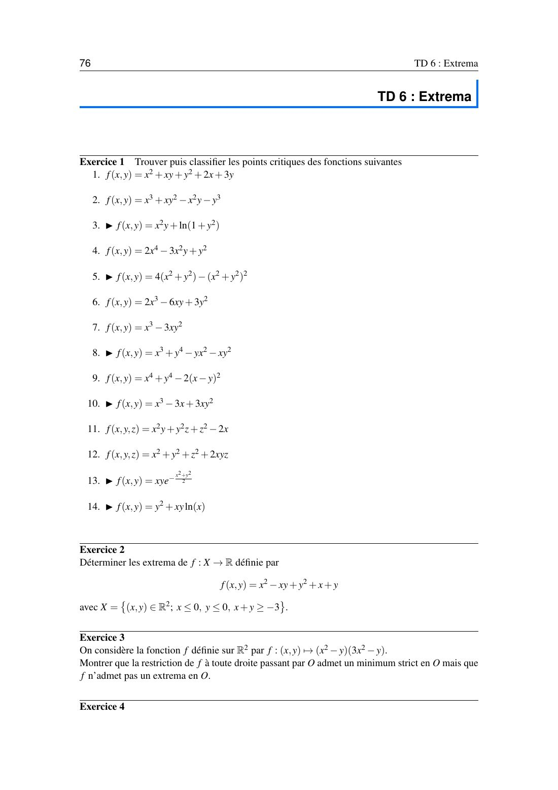
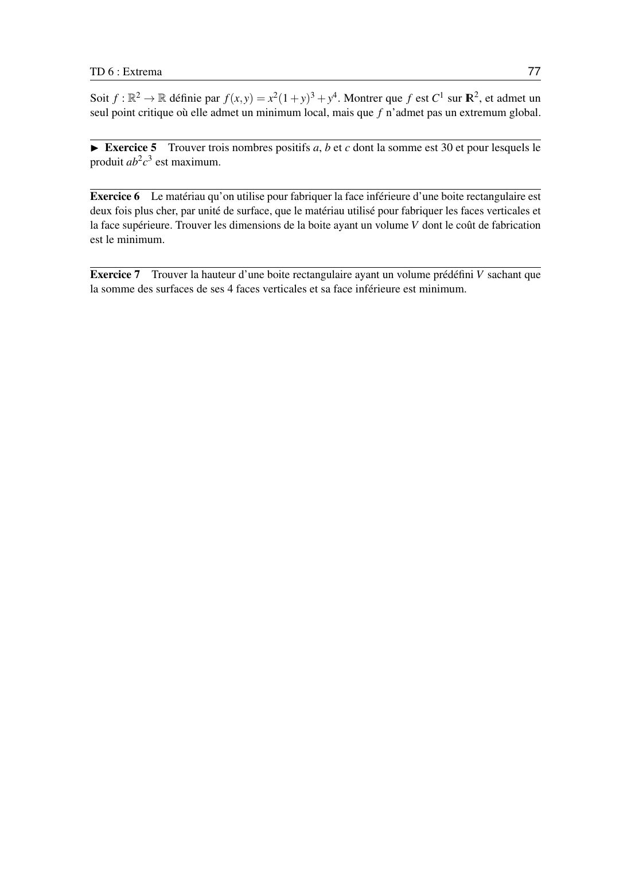

# TD 6 — Extrema

=== "Version simplifiée"

    Énoncés complets : onglet **Version papier**. Rappels : [chapitre 6](../cours/chapitre-6-extrema.md).

    !!! methode "Rappel du test"
        En un point critique, $A = f_{xx}$, $B = f_{xy}$, $C = f_{yy}$.
        $AC - B^2 > 0$ et $A > 0$ : min. $AC - B^2 > 0$ et $A < 0$ : max. $AC - B^2 < 0$ : selle. $AC - B^2 = 0$ : étudier le signe de $f(a + h, b + k) - f(a, b)$.

    ## Exercice 1 — Points critiques

    ### 1. $f = x^2 + xy + y^2 + 2x + 3y$

    $\nabla f = (2x + y + 2,\; x + 2y + 3) = 0 \Rightarrow \big(-\frac13, -\frac43\big)$.
    $H = \begin{pmatrix} 2 & 1 \\ 1 & 2\end{pmatrix}$, $\det = 3 > 0$, $A > 0$ : **minimum**, et même **global** car $f$ est convexe (hessienne constante définie positive). Valeur $-\frac73$.

    ### 2. $f = x^3 + xy^2 - x^2 y - y^3$

    $f = (x - y)(x^2 + y^2)$. Seul point critique : $(0, 0)$, où $H = 0$ (test inconclusif).
    $f$ est du signe de $x - y$ : positive d'un côté de la droite $y = x$, négative de l'autre. **Point selle.**

    ### 3. $f = x^2 y + \ln(1 + y^2)$

    $f_x = 2xy = 0$ et $f_y = x^2 + \frac{2y}{1 + y^2} = 0$ donnent seulement $(0, 0)$. $H = \begin{pmatrix} 0 & 0 \\ 0 & 2\end{pmatrix}$ : $\det = 0$.
    Sur $x = 0$, $f = \ln(1 + y^2) \geq 0$. Mais avec $y = -\varepsilon$ et $x^2 = 2\varepsilon$ : $f \approx -2\varepsilon^2 + \varepsilon^2 < 0$. **Point selle.**

    ### 4. $f = 2x^4 - 3x^2 y + y^2$

    Seul point critique : $(0, 0)$, $\det H = 0$. On factorise : $f = (2x^2 - y)(x^2 - y)$.
    Sur $y = \frac32 x^2$ (entre les deux paraboles) : $f = \frac12x^2\cdot\big(-\frac12x^2\big) < 0$. Sur $x = 0$ : $f = y^2 > 0$. **Point selle.**

    !!! piege "Le contre-exemple de Peano"
        Pour le 4, la restriction de $f$ à **chaque droite** passant par $O$ a un minimum en $O$, et pourtant $O$ n'est pas un minimum : il faut un chemin courbe pour le voir. Même idée dans l'exercice 3.

    ### 5. $f = 4(x^2 + y^2) - (x^2 + y^2)^2$

    $f_x = -4x(x^2 + y^2 - 2)$, $f_y = -4y(x^2 + y^2 - 2)$. Points critiques : $(0, 0)$ et **tout le cercle** $x^2 + y^2 = 2$.

    - $(0, 0)$ : $H = \begin{pmatrix} 8 & 0 \\ 0 & 8\end{pmatrix}$ : **minimum local**, $f = 0$.
    - Cercle : $\det H = 0$. Avec $t = x^2 + y^2$, $f = 4t - t^2 = 4 - (t - 2)^2 \leq 4$ : **maximum global** 4 en tout point du cercle.

    ### 6. $f = 2x^3 - 6xy + 3y^2$

    Voir le cours : $(0, 0)$ **point selle** ($\det H = -36$) et $(1, 1)$ **minimum local** ($\det H = 36$, $A = 12$), $f = -1$.

    ### 7. $f = x^3 - 3xy^2$

    Seul point critique $(0, 0)$, $H = 0$. $f(x, 0) = x^3$ change de signe : **point selle** (la « selle de singe »).

    ### 8. $f = x^3 + y^4 - yx^2 - xy^2$

    $f_x = (x - y)(3x + y)$ et $f_y = 4y^3 - x^2 - 2xy$.

    - $y = x$ : $4x^3 - 3x^2 = 0$, donc $(0, 0)$ ou $\big(\frac34, \frac34\big)$.
    - $y = -3x$ : $-108x^3 + 5x^2 = 0$, donc $(0, 0)$ ou $\big(\frac{5}{108}, -\frac{5}{36}\big)$.

    | Point | $AC - B^2$ | $A$ | Nature | $f$ |
    |-------|:----------:|:---:|--------|-----|
    | $(0, 0)$ | 0 | | $f(x, 0) = x^3$ change de signe : **selle** | 0 |
    | $\big(\frac34, \frac34\big)$ | $\frac{27}{4}$ | 3 | **minimum local** | $-\frac{27}{256}$ |
    | $\big(\frac{5}{108}, -\frac{5}{36}\big)$ | $\frac{125}{2916}$ | $\frac59$ | **minimum local** | $\approx -1{,}2\times10^{-4}$ |

    ### 9. $f = x^4 + y^4 - 2(x - y)^2$

    $f_x = 4(x^3 - x + y)$, $f_y = 4(y^3 + x - y)$. En sommant : $x^3 + y^3 = 0$, donc $y = -x$, puis $x^3 - 2x = 0$.
    Points : $(0, 0)$, $(\sqrt2, -\sqrt2)$, $(-\sqrt2, \sqrt2)$.

    - $(\pm\sqrt2, \mp\sqrt2)$ : $H = \begin{pmatrix} 20 & 4 \\ 4 & 20\end{pmatrix}$, $\det = 384 > 0$ : **minimum**, $f = -8$.
    - $(0, 0)$ : $\det = 0$. Sur $y = x$ : $f = 2x^4 > 0$. Sur $y = -x$ : $f = 2x^4 - 8x^2 < 0$ près de 0. **Point selle.**

    ### 10. $f = x^3 - 3x + 3xy^2$

    $f_x = 3(x^2 + y^2 - 1)$, $f_y = 6xy$. Si $x = 0$ : $y = \pm1$. Si $y = 0$ : $x = \pm1$.

    | Point | $H$ | Nature | $f$ |
    |-------|-----|--------|-----|
    | $(1, 0)$ | $\begin{pmatrix} 6 & 0 \\ 0 & 6\end{pmatrix}$ | **minimum local** | $-2$ |
    | $(-1, 0)$ | $\begin{pmatrix} -6 & 0 \\ 0 & -6\end{pmatrix}$ | **maximum local** | 2 |
    | $(0, \pm1)$ | $\begin{pmatrix} 0 & \pm6 \\ \pm6 & 0\end{pmatrix}$ | **selle** ($\det = -36$) | 0 |

    ### 11. $f = x^2 y + y^2 z + z^2 - 2x$ (trois variables)

    $\nabla f = (2xy - 2,\; x^2 + 2yz,\; y^2 + 2z) = 0$ donne $\big(1, 1, -\frac12\big)$.
    $H = \begin{pmatrix} 2 & 2 & 0 \\ 2 & -1 & 2 \\ 0 & 2 & 2\end{pmatrix}$ : $\begin{vmatrix} 2 & 2 \\ 2 & -1\end{vmatrix} = -6 < 0$, valeurs propres de signes différents. **Point selle.**

    ### 12. $f = x^2 + y^2 + z^2 + 2xyz$

    Points critiques : $(0, 0, 0)$ et les quatre points $(\pm1, \pm1, \pm1)$ avec un produit $xyz = -1$.

    - $(0, 0, 0)$ : $H = 2I$, définie positive : **minimum local**.
    - Les quatre autres : valeurs propres $-2$ et $4$ : **points selle**.

    ### 13. $f = xye^{-(x^2 + y^2)/2}$

    $f_x = y(1 - x^2)e^{-(x^2+y^2)/2}$, $f_y = x(1 - y^2)e^{-(x^2+y^2)/2}$.
    Points : $(0, 0)$ et $(\pm1, \pm1)$.

    - $(0, 0)$ : $H = \begin{pmatrix} 0 & 1 \\ 1 & 0\end{pmatrix}$, $\det = -1$ : **selle**.
    - $(1, 1)$ et $(-1, -1)$ : $H = -\frac2e I$ : **maximum**, $f = \frac1e$.
    - $(1, -1)$ et $(-1, 1)$ : $H = \frac2e I$ : **minimum**, $f = -\frac1e$.

    ### 14. $f = y^2 + xy\ln x$ ($x > 0$)

    $f_x = y(\ln x + 1)$, $f_y = 2y + x\ln x$.

    - $y = 0$ : alors $x\ln x = 0$, donc $x = 1$. Point $(1, 0)$ : $H = \begin{pmatrix} 0 & 1 \\ 1 & 2\end{pmatrix}$, $\det = -1$ : **selle**.
    - $\ln x = -1$ : $x = \frac1e$, $y = \frac{1}{2e}$. $H = \begin{pmatrix} \frac12 & 0 \\ 0 & 2\end{pmatrix}$ : **minimum local**, $f = -\frac{1}{4e^2}$.

    ## Exercice 2 — Extrema sur le triangle $x \leq 0$, $y \leq 0$, $x + y \geq -3$

    $f = x^2 - xy + y^2 + x + y$. Fermé borné et $f$ continue : max et min globaux existent.

    1. **Intérieur** : $\nabla f = (2x - y + 1,\; -x + 2y + 1) = 0 \Rightarrow (-1, -1)$, qui est bien dans le triangle. $f(-1, -1) = -1$.
    2. **Côté $x = 0$**, $y \in [-3, 0]$ : $f = y^2 + y$, min $-\frac14$ en $y = -\frac12$, valeurs 0 et 6 aux bouts.
    3. **Côté $y = 0$** : idem par symétrie.
    4. **Côté $x + y = -3$** : $y = -3 - x$, $f = 3x^2 + 9x + 6$, min $-\frac34$ en $x = -\frac32$, valeur 6 aux bouts.

    **Minimum global** $-1$ en $(-1, -1)$. **Maximum global** 6 en $(0, -3)$ et $(-3, 0)$.

    ## Exercice 3 — $f = (x^2 - y)(3x^2 - y)$

    - Sur une droite $y = mx$, $m \neq 0$ : $f = x^2(x - m)(3x - m) \approx m^2 x^2 > 0$ près de 0. Sur $y = 0$ : $3x^4$. Sur $x = 0$ : $y^2$. Minimum strict en $O$ sur **chaque droite**.
    - Mais sur la parabole $y = 2x^2$, entre les deux paraboles $y = x^2$ et $y = 3x^2$ : $f = (-x^2)(x^2) = -x^4 < 0$.

    $f$ prend des valeurs positives et négatives près de $O$ : **pas d'extremum en $O$**.

    ## Exercice 4 — $f = x^2(1 + y)^3 + y^4$

    $f$ est polynomiale donc $C^1$. $f_x = 2x(1 + y)^3$, $f_y = 3x^2(1 + y)^2 + 4y^3$.
    $f_x = 0$ donne $x = 0$ (alors $4y^3 = 0$, $y = 0$) ou $y = -1$ (alors $f_y = -4 \neq 0$). **Seul point critique : $(0, 0)$.**

    - Pour $y > -1$, $f \geq 0 = f(0, 0)$ : **minimum local**.
    - Pas global : $f(x, -2) = -x^2 + 16 \to -\infty$ quand $x \to +\infty$.

    ## Exercice 5 — $a + b + c = 30$, maximiser $ab^2c^3$

    Avec $a = 30 - b - c$, on maximise $g(b, c) = (30 - b - c)\,b^2c^3$. En annulant les dérivées partielles (après division par $bc^2$ et $b^2c^2$) :
    $2(30 - b - c) = b$ et $3(30 - b - c) = c$. D'où $b = 2a$, $c = 3a$ et $6a = 30$ :

    $$
    \boxed{a = 5,\ b = 10,\ c = 15}
    $$

    ## Exercice 6 — Boîte dont le fond coûte deux fois plus cher

    Dimensions $x, y$ (fond) et $z$ (hauteur), volume $xyz = V$. Coût (prix unitaire 1 pour les côtés et le dessus) :
    $C = 2xy + xy + 2xz + 2yz = 3xy + 2z(x + y)$.
    On remplace $z = \frac{V}{xy}$ : $C = 3xy + \frac{2V}{y} + \frac{2V}{x}$.
    $C_x = 3y - \frac{2V}{x^2} = 0$ et $C_y = 3x - \frac{2V}{y^2} = 0$ donnent $x = y$ et $x^3 = \frac{2V}{3}$.

    $$
    x = y = \sqrt[3]{\frac{2V}{3}}, \qquad z = \frac{V}{x^2} = \frac32\,x
    $$

    ## Exercice 7 — Boîte sans couvercle de surface minimale

    $S = xy + 2xz + 2yz$ avec $xyz = V$, soit $S = xy + \frac{2V}{y} + \frac{2V}{x}$.
    $S_x = y - \frac{2V}{x^2} = 0$, $S_y = x - \frac{2V}{y^2} = 0$ : $x = y = \sqrt[3]{2V}$, et la hauteur vaut

    $$
    z = \frac{V}{x^2} = \frac{\sqrt[3]{2V}}{2} = \sqrt[3]{\frac{V}{4}}
    $$

=== "Version papier"

    L'énoncé officiel du TD 6, tel qu'il est dans le poly. Les exercices marqués ▶ sont à faire en autonomie.

    [{ loading=lazy .papier }](papier/td6/p76.jpg)
    
TD 6 · page 1/2 · poly p. 76

    [{ loading=lazy .papier }](papier/td6/p77.jpg)
    
TD 6 · page 2/2 · poly p. 77

