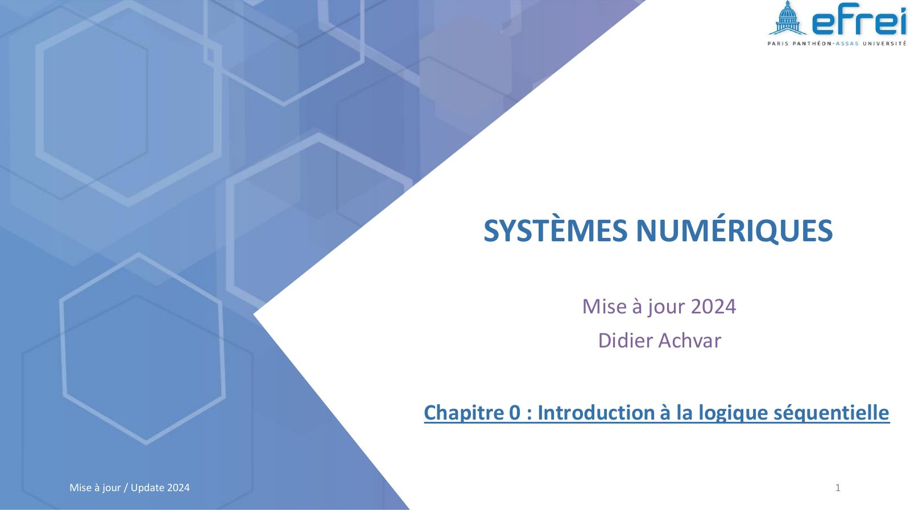
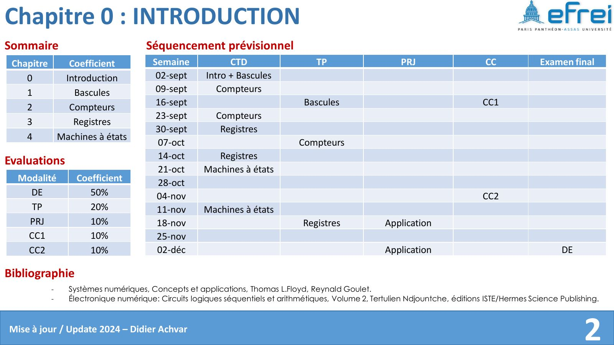
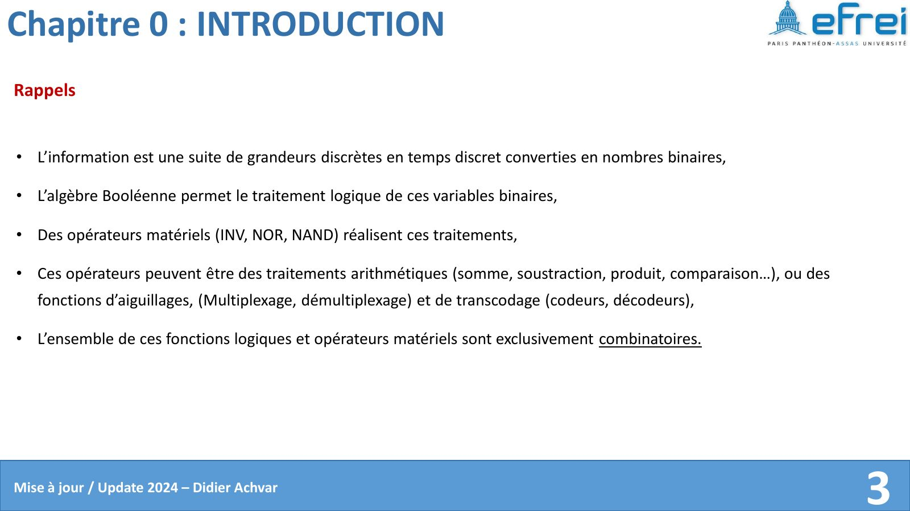
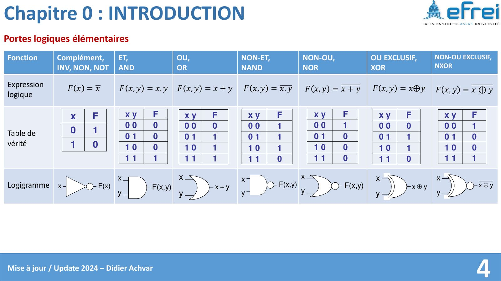
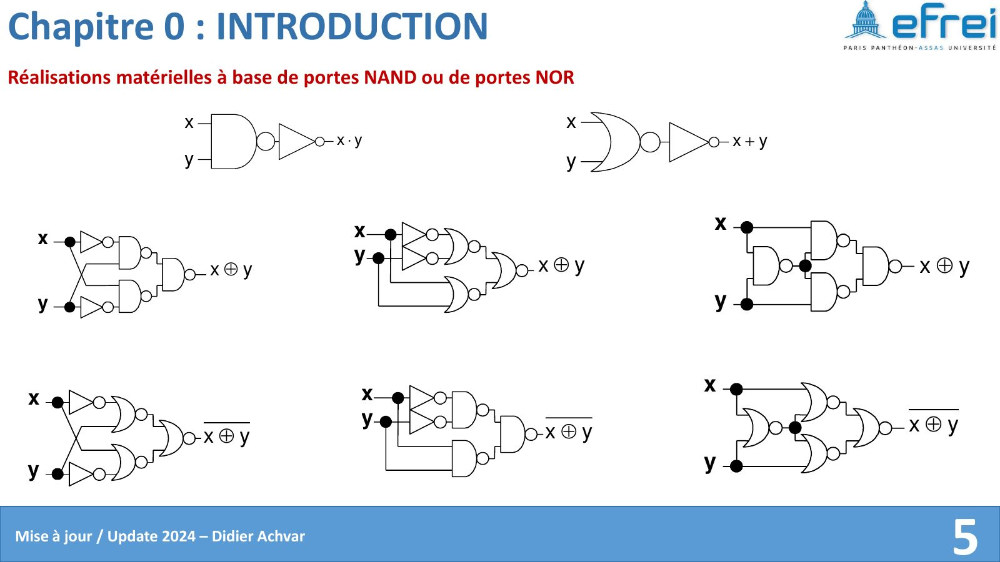
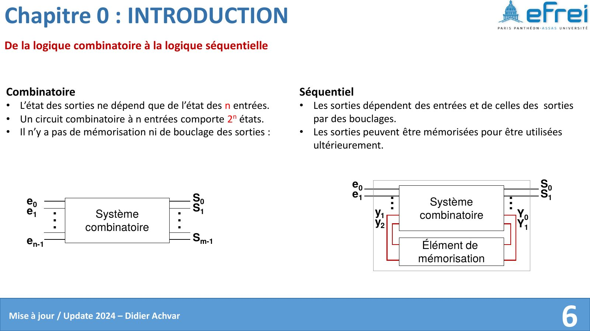
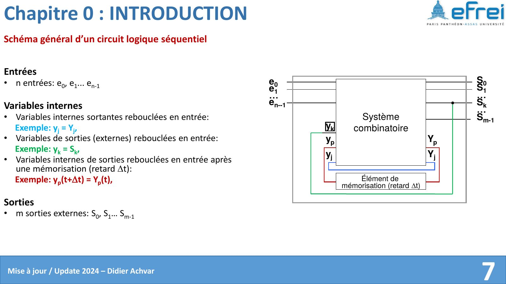

# Chapitre 0 — De la logique combinatoire à la logique séquentielle

=== "Version simplifiée"

    ## Rappels de logique combinatoire

    L'information numérique est une suite de valeurs binaires. L'algèbre de Boole
    permet de la traiter, et des portes logiques réalisent ces traitements
    (opérations arithmétiques, multiplexage, codage/décodage…).

    | Porte | Expression | Sortie à 1 quand… |
    |-------|------------|-------------------|
    | NON (INV) | $\overline{x}$ | $x = 0$ |
    | ET (AND) | $x \cdot y$ | les deux entrées valent 1 |
    | OU (OR) | $x + y$ | au moins une entrée vaut 1 |
    | NON-ET (NAND) | $\overline{x \cdot y}$ | au moins une entrée vaut 0 |
    | NON-OU (NOR) | $\overline{x + y}$ | les deux entrées valent 0 |
    | OU exclusif (XOR) | $x \oplus y$ | les entrées sont différentes |
    | NON-OU exclusif (XNOR) | $\overline{x \oplus y}$ | les entrées sont égales |

    !!! theoreme "NAND et NOR sont universelles"
        Toute fonction logique peut être réalisée **uniquement avec des NAND** (ou
        uniquement avec des NOR). Par exemple, avec des NAND :

        - $\overline{x} = \overline{x \cdot x}$
        - $x \cdot y = \overline{\overline{x \cdot y}}$
        - $x + y = \overline{\overline{x} \cdot \overline{y}}$ (De Morgan)

    ## Combinatoire vs séquentiel

    !!! definition "Circuit combinatoire"
        Les sorties ne dépendent **que des entrées à l'instant présent**. Pas de
        bouclage, pas de mémoire. Avec $n$ entrées, il y a $2^n$ combinaisons
        d'entrée possibles.

    !!! definition "Circuit séquentiel"
        Les sorties dépendent des entrées **et de l'état précédent**, grâce à des
        sorties **rebouclées** sur les entrées. Le circuit peut donc **mémoriser**
        une information pour l'utiliser plus tard.

    ```mermaid
    flowchart LR
        E[Entrées e0 … en-1] --> C[Bloc combinatoire]
        C --> S[Sorties S0 … Sm-1]
        C -- "Y (état futur)" --> M[Mémoire<br/>retard Δt]
        M -- "y (état présent)" --> C
    ```

    Structure générale d'un circuit séquentiel : un bloc combinatoire calcule les
    sorties et l'état futur $Y$ ; un élément de mémorisation le renvoie en entrée
    avec un retard $\Delta t$, soit $y(t + \Delta t) = Y(t)$.

    L'élément de mémorisation de base, c'est la **bascule** → [chapitre 1](chapitre-1-bascules.md).

=== "Version papier"

    Les diapos du chapitre 0 telles que le prof les projette (support 2024 de D. Achvar).

    [{ loading=lazy .papier }](papier/ch0/p01.jpg)
    <p class="papier-legende">Page de titre · Chapitre 0 — support 2024, diapo 1</p>

    [{ loading=lazy .papier }](papier/ch0/p02.jpg)
    <p class="papier-legende">Sommaire · Chapitre 0 — support 2024, diapo 2</p>

    [{ loading=lazy .papier }](papier/ch0/p03.jpg)
    <p class="papier-legende">Rappels · Chapitre 0 — support 2024, diapo 3</p>

    [{ loading=lazy .papier }](papier/ch0/p04.jpg)
    <p class="papier-legende">Portes logiques élémentaires · Chapitre 0 — support 2024, diapo 4</p>

    [{ loading=lazy .papier }](papier/ch0/p05.jpg)
    <p class="papier-legende">Réalisations matérielles à base de portes NAND ou de portes NOR · Chapitre 0 — support 2024, diapo 5</p>

    [{ loading=lazy .papier }](papier/ch0/p06.jpg)
    <p class="papier-legende">De la logique combinatoire à la logique séquentielle · Chapitre 0 — support 2024, diapo 6</p>

    [{ loading=lazy .papier }](papier/ch0/p07.jpg)
    <p class="papier-legende">Schéma général d’un circuit logique séquentiel · Chapitre 0 — support 2024, diapo 7</p>
