# Chapitre 1 — Les bascules

=== "Version simplifiée"

    !!! definition "Bascule"
        Composant élémentaire de la logique séquentielle : un circuit capable de
        **maintenir ses sorties** malgré les changements des entrées. Il possède un
        **état mémoire**. Les deux sorties sont complémentaires : $Q$ et $\overline{Q}$.

    ## Les familles de bascules

    | Type | Quand la sortie peut-elle changer ? | Exemples |
    |------|-------------------------------------|----------|
    | **Asynchrone** | À tout moment, dès qu'une entrée change | RS (latch) |
    | **Synchrone sur niveau** (*level-triggered*) | Tant que l'horloge est au niveau actif (1 ou 0) | RSH, D-latch |
    | **Synchrone sur front** (*edge-triggered*, *flip-flop*) | Uniquement sur le front actif de l'horloge (↑ ou ↓) | D, JK |
    | **Synchrone sur impulsion** (*pulse-triggered*) | 1er front : capture des entrées, 2e front : mise à jour des sorties | maître-esclave |

    ## Bascule RS asynchrone

    $S$ (*Set*) met la sortie à 1, $R$ (*Reset*) la remet à 0.

    === "Avec des NOR (entrées actives à 1)"

        | $R$ | $S$ | $Q$ | $\overline{Q}$ | Fonction |
        |:---:|:---:|:---:|:---:|----------|
        | 0 | 0 | $Q_{t-1}$ | $\overline{Q}_{t-1}$ | Mémoire |
        | 0 | 1 | 1 | 0 | Set |
        | 1 | 0 | 0 | 1 | Reset |
        | 1 | 1 | 0 | 0 | **Interdit** |

    === "Avec des NAND (entrées actives à 0)"

        | $\overline{R}$ | $\overline{S}$ | $Q$ | $\overline{Q}$ | Fonction |
        |:---:|:---:|:---:|:---:|----------|
        | 0 | 0 | 1 | 1 | **Interdit** |
        | 0 | 1 | 0 | 1 | Reset |
        | 1 | 0 | 1 | 0 | Set |
        | 1 | 1 | $Q_{t-1}$ | $\overline{Q}_{t-1}$ | Mémoire |

    !!! piege "Pourquoi l'état « interdit » ?"
        Les deux sorties prennent la même valeur : $Q$ et $\overline{Q}$ ne sont plus
        complémentaires. En plus, si on relâche les deux entrées en même temps,
        l'état final dépend de la porte la plus rapide : il est **imprévisible**.

    ## Bascules synchrones sur niveau

    ### RSH (ou RST)

    Une RS dont les entrées sont validées par une horloge $H$ :

    - $H = 0$ : mémoire, $Q_t = Q_{t-1}$ quelles que soient $R$ et $S$ ;
    - $H = 1$ : fonctionne comme une RS (et $R = S = 1$ reste interdit).

    ### D-latch

    | $clk$ | $D$ | $Q_t$ | Fonction |
    |:-----:|:---:|:-----:|----------|
    | 0 | X | $Q_{t-1}$ | Mémoire |
    | 1 | 0 | 0 | Copie |
    | 1 | 1 | 1 | Copie |

    La D-latch est **transparente** pendant tout le niveau haut : $Q$ suit $D$ en
    continu, puis se fige quand l'horloge repasse à 0.

    ## Bascules synchrones sur front

    La sortie ne peut changer **qu'au front actif** de l'horloge : front montant (↑)
    ou front descendant (↓, représenté par un rond sur l'entrée d'horloge).

    ### Entrées prioritaires de forçage asynchrone : $\overline{PRE}$ et $\overline{CLR}$

    !!! definition "PRESET et CLEAR"
        - $\overline{PRE}$ (mise à 1, MAU, *preset*) force $Q = 1$ ;
        - $\overline{CLR}$ (remise à 0, RAZ, *clear*) force $Q = 0$.

        Elles sont **actives au niveau bas**, **indépendantes de l'horloge et des
        entrées** de donnée, et **prioritaires** sur tout le reste. Pour un
        fonctionnement normal, on les laisse à 1 (inhibées).

    ### Bascule D sur front

    | $clk$ | $D$ | $Q(t+\Delta t)$ | Fonction |
    |:-----:|:---:|:---------------:|----------|
    | autre qu'↑ | X | $Q(t)$ | Mémoire |
    | ↑ | 0 | 0 | Copie |
    | ↑ | 1 | 1 | Copie |

    Au front actif, la bascule recopie $D$ : $Q(t + \Delta t) = D(t)$, avec
    $\Delta t = t_p$ le temps de propagation.

    ### Les contraintes temporelles

    !!! definition "Les trois temps d'une bascule"
        - **Temps de pré-positionnement** $t_{pp}$ (*setup time*) : durée minimale
          pendant laquelle $D$ doit être stable **avant** le front actif.
        - **Temps de maintien** $t_m$ (*hold time*) : durée minimale pendant laquelle
          $D$ doit rester stable **après** le front actif.
        - **Temps de propagation** $t_p$ : délai entre le front actif et le moment
          où $Q$ est valide.

    Conséquence : la période d'horloge doit laisser le temps à la sortie de se
    stabiliser et à la donnée suivante d'arriver, donc
    $f_{max} \approx \dfrac{1}{t_p + t_{pp}}$ (ordre de grandeur, mesuré en TP).

    ### Application : le diviseur de fréquence par 2

    On câble $D = \overline{Q}$ : à chaque front actif, $Q$ s'inverse. C'est le
    **mode basculement** (*toggle*).

    | Front n° | 0 (CI) | 1 | 2 | 3 | 4 | 5 |
    |----------|:------:|:-:|:-:|:-:|:-:|:-:|
    | $Q$      | 1 | 0 | 1 | 0 | 1 | 0 |

    La sortie a une période $2T$ : sa fréquence vaut $f_H / 2$.

    ### Bascule JK sur front

    | $clk$ | $J$ | $K$ | $Q(t+\Delta t)$ | Fonction |
    |:-----:|:---:|:---:|:---------------:|----------|
    | non actif | X | X | $Q(t)$ | Mémoire |
    | actif | 0 | 0 | $Q(t)$ | Mémoire |
    | actif | 0 | 1 | 0 | Reset |
    | actif | 1 | 0 | 1 | Set |
    | actif | 1 | 1 | $\overline{Q}(t)$ | **Toggle** |

    La JK corrige le défaut de la RS : $J = K = 1$ n'est plus interdit, il inverse
    la sortie. Avec $J = K = 1$ en permanence, la JK est un diviseur de fréquence par 2.

    !!! theoreme "Table de transitions de la JK"
        Pour la **synthèse** (compteurs, machines à états), on lit la table à
        l'envers : quelles valeurs de $J$ et $K$ donnent la transition voulue ?

        | $Q(t)$ | $Q(t+1)$ | $J$ | $K$ |
        |:------:|:--------:|:---:|:---:|
        | 0 | 0 | 0 | X |
        | 0 | 1 | 1 | X |
        | 1 | 0 | X | 1 |
        | 1 | 1 | X | 0 |

        X = indifférent (0 ou 1), ce qui simplifie les tableaux de Karnaugh.

    !!! methode "Tracer le chronogramme d'une bascule sur front"
        1. Repérer le **front actif** (montant ou descendant) et numéroter les fronts.
        2. Partir des **conditions initiales** (CI).
        3. À chaque front actif, lire les entrées **juste avant** le front, puis appliquer la table.
        4. Entre deux fronts actifs, la sortie ne bouge pas (sauf $\overline{PRE}$ / $\overline{CLR}$, à appliquer immédiatement).
        5. Si demandé, décaler chaque changement de $t_p$ après le front.
        6. Annoter chaque front : M (mémoire), S (set), R (reset), T (toggle), C (copie).

=== "Version papier"

    Les diapos du chapitre 1 telles que le prof les projette (support 2024 de D. Achvar).

    [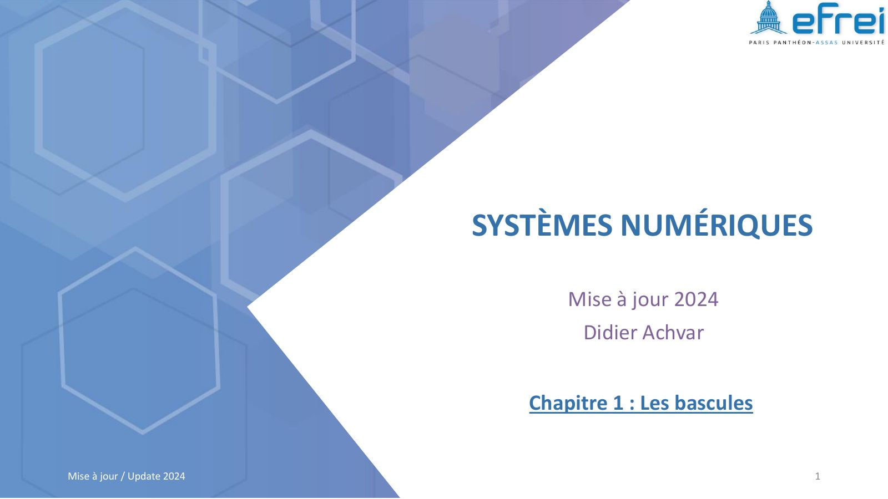{ loading=lazy .papier }](papier/ch1/p01.jpg)
    
Page de titre · Chapitre 1 — support 2024, diapo 1

    [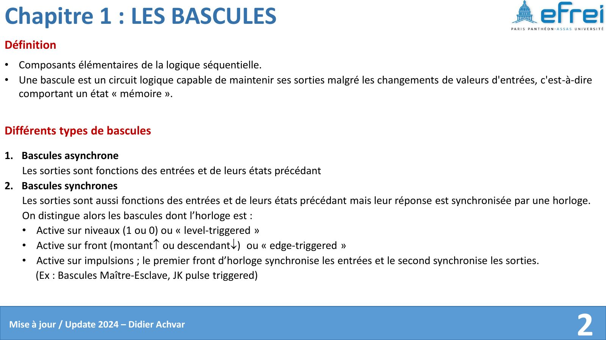{ loading=lazy .papier }](papier/ch1/p02.jpg)
    
Définition · Chapitre 1 — support 2024, diapo 2

    [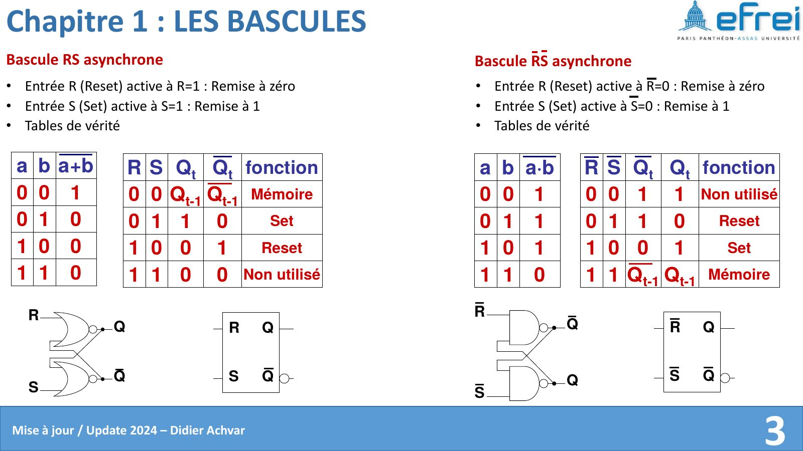{ loading=lazy .papier }](papier/ch1/p03.jpg)
    
Bascule RS asynchrone · Chapitre 1 — support 2024, diapo 3

    [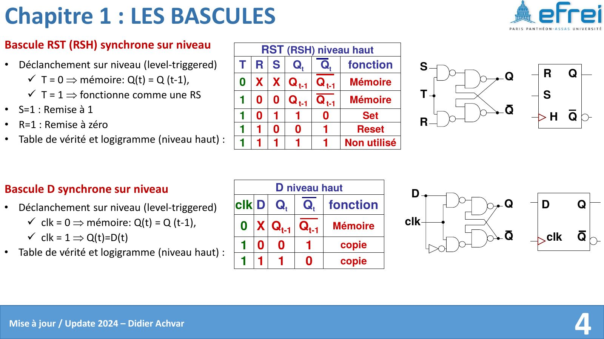{ loading=lazy .papier }](papier/ch1/p04.jpg)
    
Bascule RST (RSH) synchrone sur niveau · Chapitre 1 — support 2024, diapo 4

    [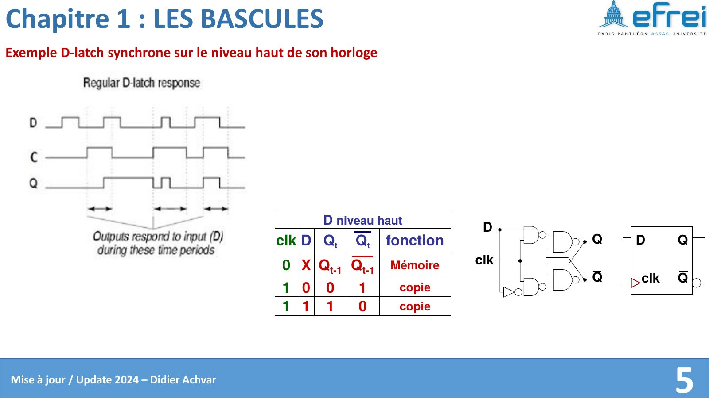{ loading=lazy .papier }](papier/ch1/p05.jpg)
    
Exemple D-latch synchrone sur le niveau haut de son horloge · Chapitre 1 — support 2024, diapo 5

    [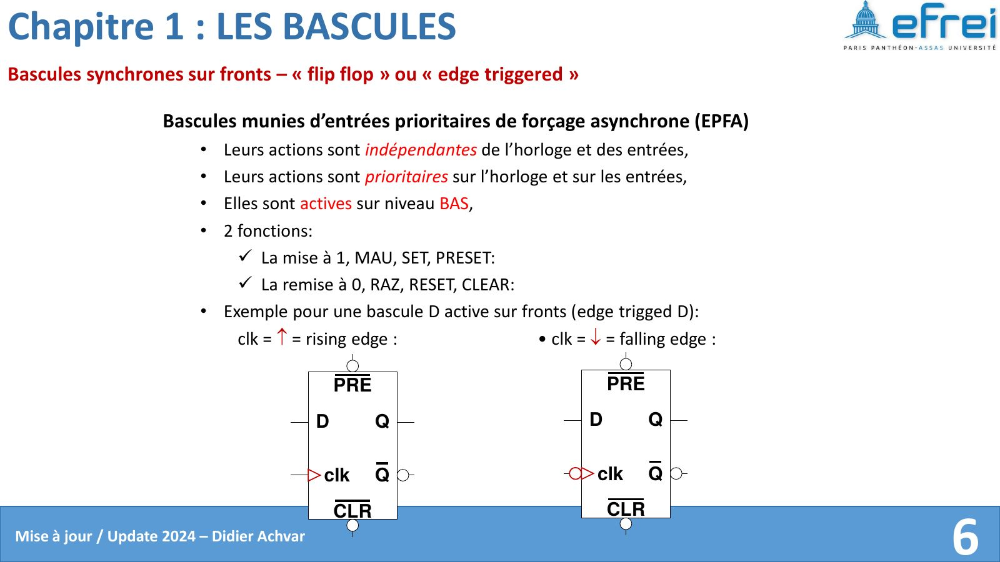{ loading=lazy .papier }](papier/ch1/p06.jpg)
    
Bascules synchrones sur fronts – « flip flop » ou « edge triggered » · Chapitre 1 — support 2024, diapo 6

    [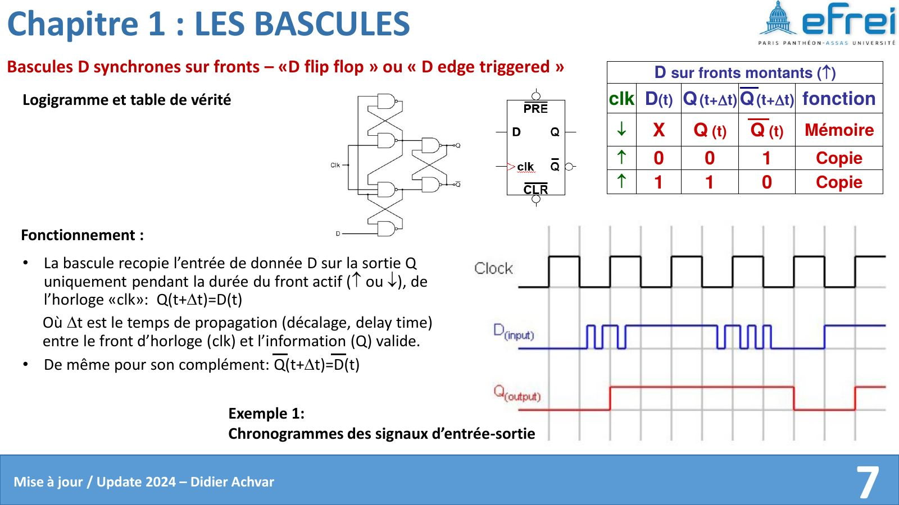{ loading=lazy .papier }](papier/ch1/p07.jpg)
    
Bascules D synchrones sur fronts – «D flip flop » ou « D edge triggered » · Chapitre 1 — support 2024, diapo 7

    [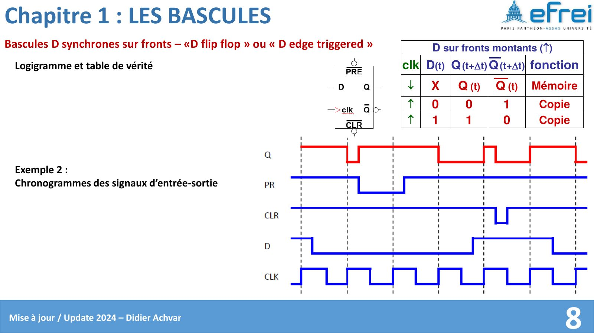{ loading=lazy .papier }](papier/ch1/p08.jpg)
    
Bascules D synchrones sur fronts – «D flip flop » ou « D edge triggered » · Chapitre 1 — support 2024, diapo 8

    [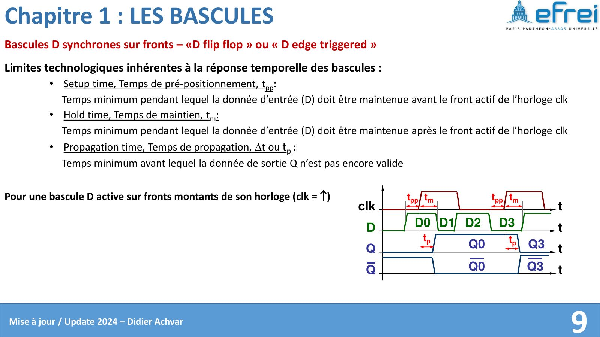{ loading=lazy .papier }](papier/ch1/p09.jpg)
    
Bascules D synchrones sur fronts – «D flip flop » ou « D edge triggered » · Chapitre 1 — support 2024, diapo 9

    [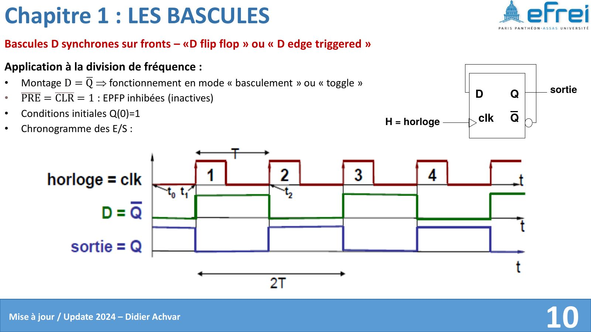{ loading=lazy .papier }](papier/ch1/p10.jpg)
    
Bascules D synchrones sur fronts – «D flip flop » ou « D edge triggered » · Chapitre 1 — support 2024, diapo 10

    [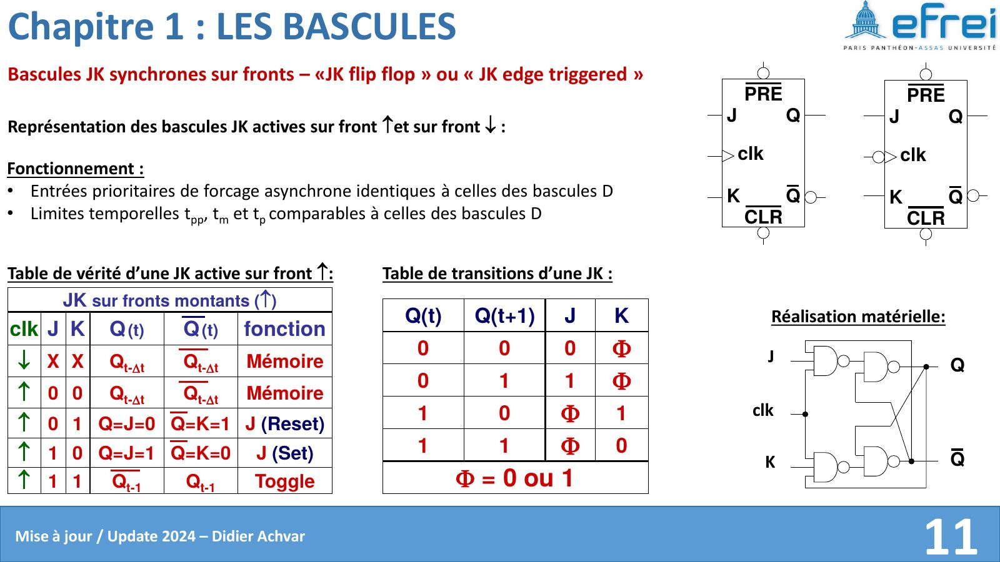{ loading=lazy .papier }](papier/ch1/p11.jpg)
    
Bascules JK synchrones sur fronts – «JK flip flop » ou « JK edge triggered » · Chapitre 1 — support 2024, diapo 11

    [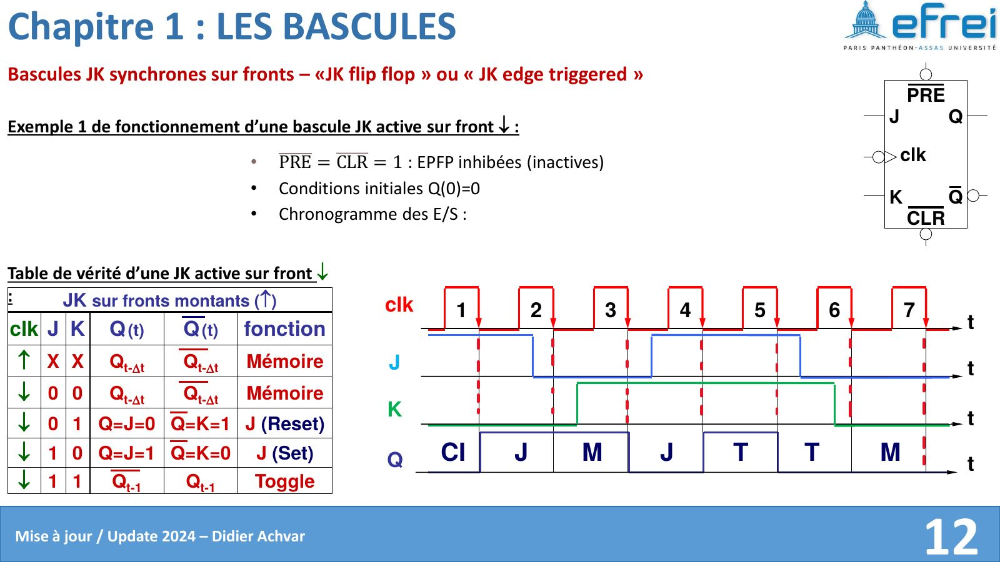{ loading=lazy .papier }](papier/ch1/p12.jpg)
    
Bascules JK synchrones sur fronts – «JK flip flop » ou « JK edge triggered » · Chapitre 1 — support 2024, diapo 12

    [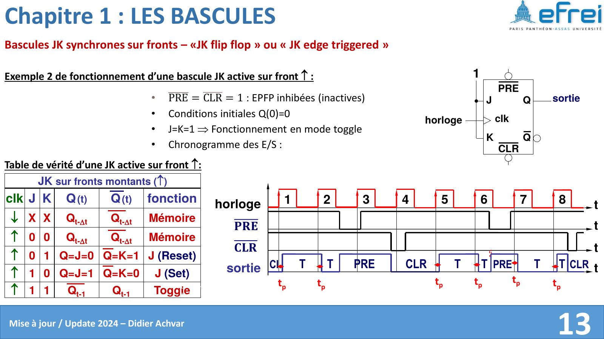{ loading=lazy .papier }](papier/ch1/p13.jpg)
    
Bascules JK synchrones sur fronts – «JK flip flop » ou « JK edge triggered » · Chapitre 1 — support 2024, diapo 13

