# Chapitre 2 — Les registres

=== "Version simplifiée"

    !!! definition "Registre"
        Un registre de longueur $N$ est formé de **$N$ bascules D synchronisées sur
        la même horloge**. Il mémorise temporairement un mot de $N$ bits.

    Exemple concret : l'ATmega328P (Arduino Uno) possède un banc de **32 registres de
    8 bits** (R0 à R31), la mémoire de travail de l'unité arithmétique et logique.

    ## Les fonctions d'un registre

    - **Mémorisation** d'un mot de $N$ bits pour des calculs intermédiaires ;
    - **Transfert parallèle** : les $N$ bits sont disponibles en même temps sur $N$ sorties ;
    - **Transfert série** : les bits sortent un par un sur une seule ligne (décalage à droite ou à gauche) ;
    - **Rotation** : la sortie série est rebouclée sur l'entrée série.

    ## Décalages et rotations

    On numérote les bascules de gauche ($Q_0$) à droite ($Q_{N-1}$).

    | Fonction | Câblage | Entrée série | Sortie série |
    |----------|---------|--------------|--------------|
    | Décalage à droite | $D_i = Q_{i-1}$ | $D_0$ | $Q_{N-1}$ |
    | Rotation à droite | idem, et $D_0 = Q_{N-1}$ | — | — |
    | Décalage à gauche | $D_i = Q_{i+1}$ | $D_{N-1}$ | $Q_0$ |
    | Rotation à gauche | idem, et $D_{N-1} = Q_0$ | — | — |

    !!! example "Décalage à droite sur 4 bits, entrée série $E$"
        | Front | $Q_0$ | $Q_1$ | $Q_2$ | $Q_3$ = sortie |
        |:-----:|:-----:|:-----:|:-----:|:--------------:|
        | état initial | $d_0$ | $d_1$ | $d_2$ | $d_3$ |
        | 1 | $E$ | $d_0$ | $d_1$ | $d_2$ |
        | 2 | $E$ | $E$ | $d_0$ | $d_1$ |
        | 3 | $E$ | $E$ | $E$ | $d_0$ |
        | 4 | $E$ | $E$ | $E$ | $E$ |

        Il faut $N$ fronts pour vider (ou remplir) complètement le registre.

    ## Les architectures

    !!! definition "Entrée série / sorties parallèles"
        Les $N$ bits qui arrivent un par un sur l'entrée série sont disponibles **en
        parallèle après $N$ fronts d'horloge**. $\overline{PRE}$ et $\overline{CLR}$
        servent à l'initialisation (MAU / RAZ).

    !!! definition "Entrées parallèles / sorties parallèles"
        Les $N$ données $D_i$ (qui respectent $t_{pp}$ et $t_m$) sont copiées sur les
        sorties **sur un seul front** actif, après $t_p$.

    !!! methode "Registre à chargement série/parallèle"
        On place un **multiplexeur 2→1** devant chaque bascule, commandé par
        $\text{Serial}/\overline{\text{Parallel}}$ :

        - mode parallèle : la bascule $i$ reçoit la donnée externe $D_i$ ;
        - mode série : la bascule $i$ reçoit $Q_{i-1}$ (décalage à droite), et la bascule 0 reçoit l'entrée série.

        Avec une sélection $S$ : $D_i = S \cdot Q_{i-1} + \overline{S} \cdot D_i^{ext}$.
        Même principe pour un registre **bidirectionnel** : le mux choisit entre
        $Q_{i-1}$ (droite) et $Q_{i+1}$ (gauche).

    ### Un registre universel intégré : le 74HC194

    | Broche | Rôle |
    |--------|------|
    | CP | Horloge (*clock pulse*) |
    | $\overline{MR}$ | Remise à zéro générale, active à 0 |
    | DSR | Entrée série pour le décalage à droite |
    | DSL | Entrée série pour le décalage à gauche |
    | S1, S0 | Mode : 00 mémoire, 01 décalage à droite, 10 décalage à gauche, 11 chargement parallèle |
    | Q3 / Q0 | Sortie série à droite / à gauche |

    ## Applications

    ### Retard logique

    Dans un registre à décalage, une donnée prélevée sur la bascule de rang $n$
    (en comptant à partir de 1) a été retardée de $n$ périodes d'horloge :

    $$
    \Delta t = n \cdot T_{CLK}
    $$

    ### Liaison série (UART)

    Pour transmettre $N$ bits sur **un seul fil**, on convertit parallèle → série à
    l'émission (registre à chargement parallèle, sortie série) puis série →
    parallèle à la réception (registre à entrée série, sorties parallèles).

    Une trame est encadrée par un bit **START = 0** et un bit **STOP = 1**. La ligne
    est à 1 au repos, donc le premier front descendant signale le début de trame au
    récepteur.

    ### En assembleur AVR

    Les instructions `LSL` / `LSR` (décalage logique à gauche / à droite), `ASR`
    (décalage arithmétique) et `ROL` / `ROR` (rotation via la retenue C) réalisent
    en logiciel les mêmes opérations. Exemples chiffrés dans le [TD 3](../td/td-3-registres.md).

=== "Version papier"

    Les diapos de cours du chapitre 2 (support 2026-2027 de D. Achvar). Les diapos d'exercices de ce support sont dans la [version papier du TD 3](../td/td-3-registres.md).

    [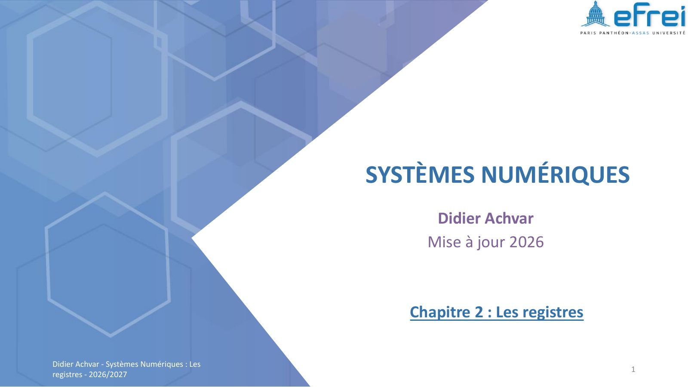{ loading=lazy .papier }](papier/ch2/p01.jpg)
    
Page de titre · Chapitre 2 — support 2026-2027, diapo 1

    [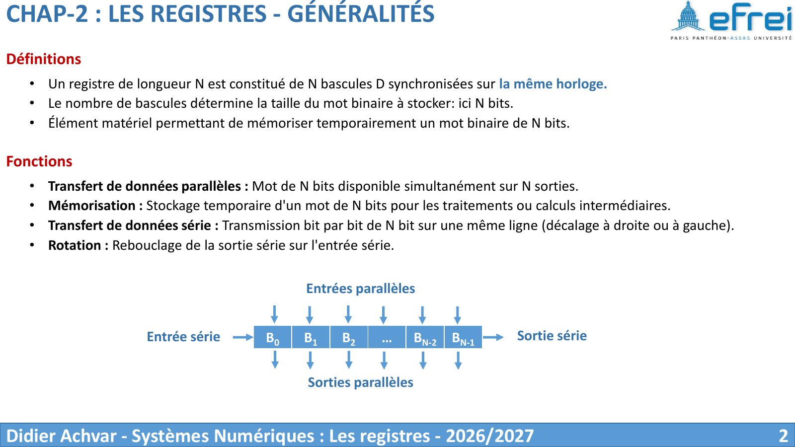{ loading=lazy .papier }](papier/ch2/p02.jpg)
    
Définitions · Chapitre 2 — support 2026-2027, diapo 2

    [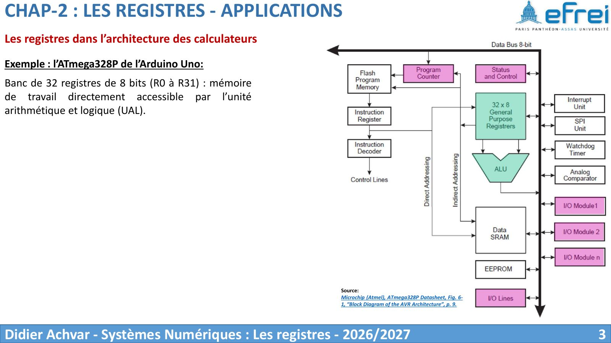{ loading=lazy .papier }](papier/ch2/p03.jpg)
    
Les registres dans l’architecture des calculateurs · Chapitre 2 — support 2026-2027, diapo 3

    [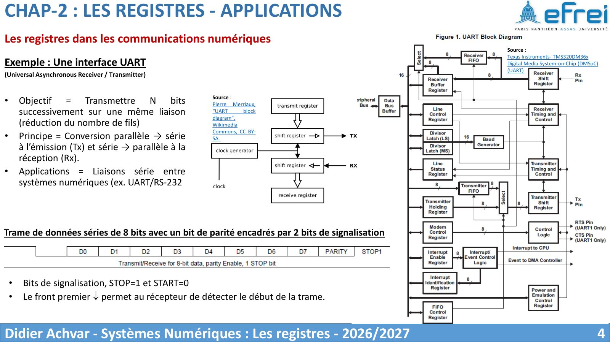{ loading=lazy .papier }](papier/ch2/p04.jpg)
    
Les registres dans les communications numériques · Chapitre 2 — support 2026-2027, diapo 4

    [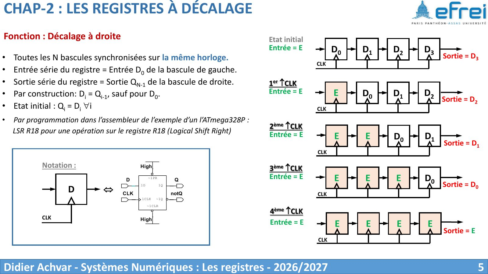{ loading=lazy .papier }](papier/ch2/p05.jpg)
    
Fonction : Décalage à droite · Chapitre 2 — support 2026-2027, diapo 5

    [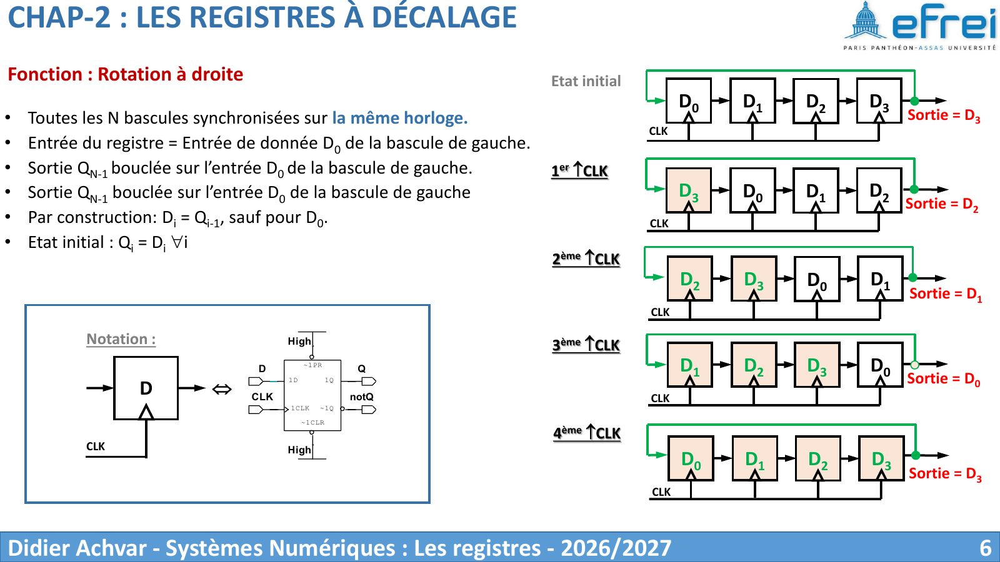{ loading=lazy .papier }](papier/ch2/p06.jpg)
    
Fonction : Rotation à droite · Chapitre 2 — support 2026-2027, diapo 6

    [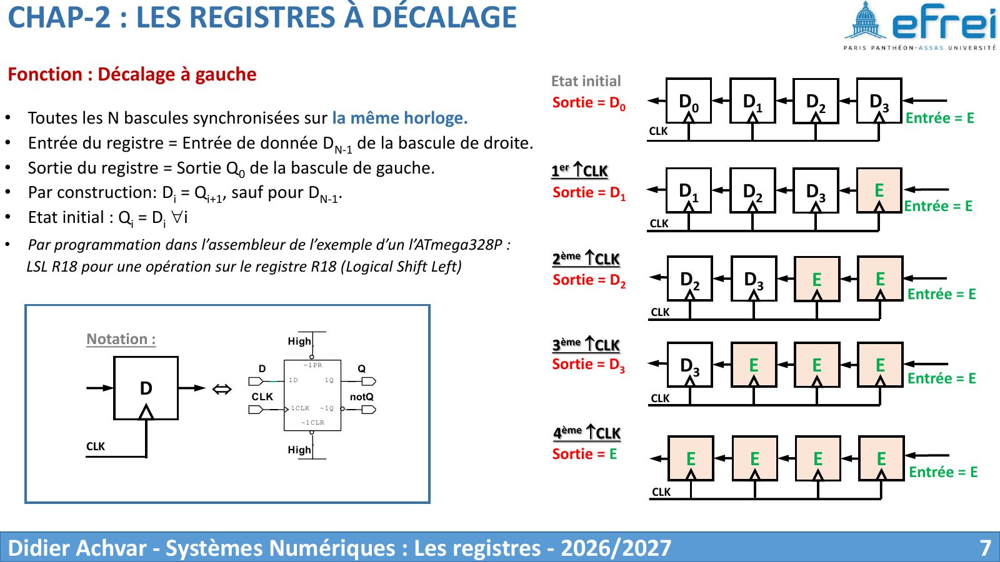{ loading=lazy .papier }](papier/ch2/p07.jpg)
    
Fonction : Décalage à gauche · Chapitre 2 — support 2026-2027, diapo 7

    [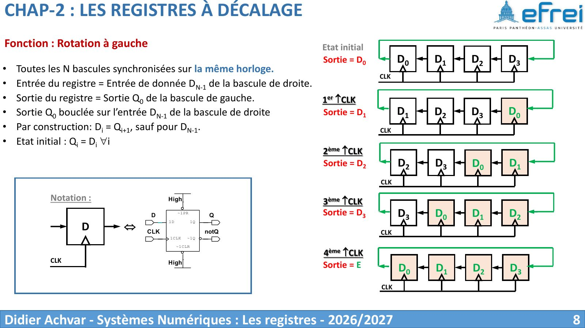{ loading=lazy .papier }](papier/ch2/p08.jpg)
    
Fonction : Rotation à gauche · Chapitre 2 — support 2026-2027, diapo 8

    [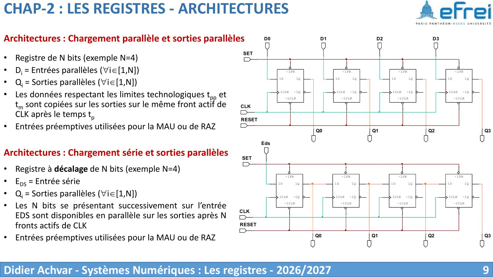{ loading=lazy .papier }](papier/ch2/p09.jpg)
    
Architectures : Chargement parallèle et sorties parallèles · Chapitre 2 — support 2026-2027, diapo 9

    [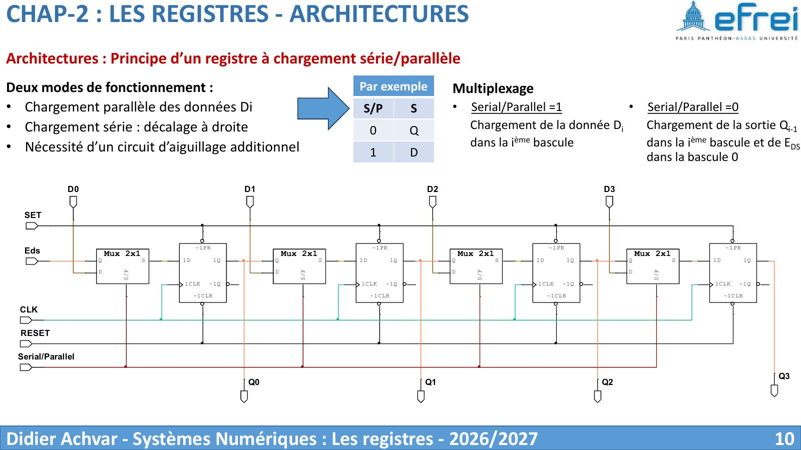{ loading=lazy .papier }](papier/ch2/p10.jpg)
    
Architectures : Principe d’un registre à chargement série/parallèle · Chapitre 2 — support 2026-2027, diapo 10

    [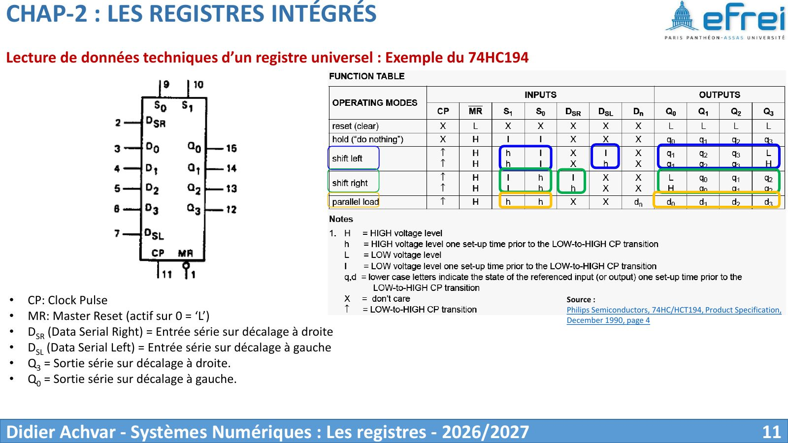{ loading=lazy .papier }](papier/ch2/p11.jpg)
    
Lecture de données techniques d’un registre universel : Exemple du 74HC194 · Chapitre 2 — support 2026-2027, diapo 11

