# Chapitre 3 — Les compteurs

=== "Version simplifiée"

    !!! definition "Compteur"
        Circuit séquentiel dont l'état de sortie correspond de façon unique au
        **nombre d'impulsions** reçues sur son horloge. On le construit avec des
        bascules sur front, dont les sorties $Q_i$ forment l'état du comptage.

    Avec $N$ bascules, on a au plus $2^N$ états, soit un comptage de $0$ à $2^N - 1$.

    | | Cycle complet | Cycle incomplet |
    |-|---------------|-----------------|
    | États parcourus | les $2^N$, dans l'ordre | $M < 2^N$ états, dans un ordre quelconque |
    | Nom | compteur modulo $2^N$ (noté $\#2^N$) | compteur modulo $M$ ($\#M$) |

    !!! methode "Nombre de bascules nécessaires"
        Il faut assez de bits pour écrire **la plus grande valeur de la séquence**
        (et pas le nombre d'états !) :

        $$
        N = \lceil \log_2(\text{valeur max} + 1) \rceil
        $$

        Séquence $\{3, 4, 5, 9\}$ : max = 9 = `1001`, donc **4 bascules**, même s'il
        n'y a que 4 états.

    ## Synchrone ou asynchrone ?

    !!! definition "Compteur synchrone"
        **Toutes les bascules** reçoivent la même horloge et changent d'état sur le
        même front.

    !!! definition "Compteur asynchrone (série, à propagation)"
        Seule la première bascule (poids faible) reçoit l'horloge. Chaque bascule
        suivante est déclenchée par la **sortie de la précédente**.

    ## Compteurs asynchrones

    Chaque bascule est montée en **toggle** ($D_i = \overline{Q_i}$ ou $J_i = K_i = 1$)
    et divise par 2 la fréquence de son horloge.

    !!! theoreme "Comptage ou décomptage ?"
        | Bascules actives sur | $CLK_i = \overline{Q_{i-1}}$ | $CLK_i = Q_{i-1}$ |
        |----------------------|:----------------------------:|:-----------------:|
        | front montant ↑      | **compteur** | décompteur |
        | front descendant ↓   | décompteur | **compteur** |

        Pour compter, la bascule $i$ doit basculer quand $Q_{i-1}$ passe de 1 à 0
        (c'est la retenue).

    !!! example "Compteur asynchrone modulo 16 (4 JK en toggle, front descendant)"
        $CLK_0 = H$, $CLK_i = Q_{i-1}$, CI : $Q_i = 0$. On lit $Q_3Q_2Q_1Q_0$ :
        `0000`, `0001`, `0010`, … , `1111`, `0000`… $Q_0$ a la fréquence $f_H/2$, $Q_1$
        la fréquence $f_H/4$, etc.

    ### Modulo $M$ quelconque par remise à zéro

    Pour un compteur asynchrone modulo $M$, on détecte l'état $M$ et on l'utilise
    pour activer immédiatement les $\overline{CLR}$ :

    $$
    \overline{CLR} = \overline{\prod_{\text{bits à 1 de } M} Q_i}
    $$

    Modulo 5 : $5 = 101_2$, donc $\overline{CLR} = \overline{Q_2 \cdot Q_0}$ (une NAND).

    !!! piege "Les limites des compteurs asynchrones"
        - Les temps de propagation **s'additionnent** d'une bascule à l'autre : la
          dernière sortie n'est valide qu'après $N \cdot t_p$. Il faut donc
          $T_H > N \cdot t_p$.
        - Pendant cette propagation apparaissent des **états transitoires**
          (*glitches*) : de `0111` à `1000`, on passe brièvement par `0110`, `0100`, `0000`.
        - Avec la RAZ, l'état $M$ existe pendant un court instant (le temps que CLR agisse).

    ## Synthèse d'un compteur synchrone

    !!! methode "Protocole de synthèse (à connaître par cœur)"
        1. Tracer le **graphe des états** (la séquence en boucle).
        2. Déterminer le **nombre de bascules** (valeur max de la séquence).
        3. Rappeler la **table de transitions** de la bascule utilisée.
        4. Dresser la **table états présents → états suivants**, puis les entrées des bascules pour chaque transition.
        5. **Simplifier** chaque entrée par Karnaugh (les états inutilisés sont des X).
        6. Tracer le **logigramme** (toutes les horloges reliées ensemble).
        7. *Bonus* : vérifier où vont les **états inutilisés** (voir le piège ci-dessous).

    ### Les tables de transitions

    | $Q(t) \to Q(t+1)$ | JK : $J$ | JK : $K$ | D : $D$ | T ($J = K$) : $T$ |
    |:-----------------:|:--------:|:--------:|:-------:|:-----------------:|
    | 0 → 0 | 0 | X | 0 | 0 |
    | 0 → 1 | 1 | X | 1 | 1 |
    | 1 → 0 | X | 1 | 0 | 1 |
    | 1 → 1 | X | 0 | 1 | 0 |

    À retenir : $D = Q(t+1)$ et $T = Q(t) \oplus Q(t+1)$ (on met 1 quand le bit **change**).

    ### Exemple : compteur 2 bits $\{0, 1, 2, 3\}$ avec des JK

    ```mermaid
    stateDiagram-v2
        direction LR
        E0: 0 (00)
        E1: 1 (01)
        E2: 2 (10)
        E3: 3 (11)
        E0 --> E1
        E1 --> E2
        E2 --> E3
        E3 --> E0
    ```

    | Présent $Q_1Q_0$ | Suivant $Q_1Q_0$ | $J_1$ | $K_1$ | $J_0$ | $K_0$ |
    |:----------------:|:----------------:|:-----:|:-----:|:-----:|:-----:|
    | 00 | 01 | 0 | X | 1 | X |
    | 01 | 10 | 1 | X | X | 1 |
    | 10 | 11 | X | 0 | 1 | X |
    | 11 | 00 | X | 1 | X | 1 |

    $$
    J_0 = K_0 = 1, \qquad J_1 = K_1 = Q_0
    $$

    $Q_0$ bascule à chaque front, $Q_1$ bascule quand $Q_0 = 1$ : c'est la retenue.

    !!! piege "Les états inutilisés"
        Dans un cycle incomplet, les états absents de la séquence sont traités comme
        des X. Mais à la mise sous tension, le compteur peut démarrer dans l'un
        d'eux. Selon les équations obtenues, il peut alors **rester bloqué** (par
        exemple 0 → 0) ou tourner dans un **cycle parasite**. On le vérifie en
        injectant chaque état inutilisé dans les équations. Remède : initialiser
        avec $\overline{PRE}$ / $\overline{CLR}$ sur un état de la séquence.

    ## Compteurs intégrés

    Un compteur 4 bits intégré (type 74163) dispose en général de :

    - $\overline{RAZ}$ (*clear*) : remise à 0, active au niveau bas ;
    - $\overline{LOAD}$ : **chargement parallèle** des entrées $D_3 \dots D_0$, actif au niveau bas ;
    - une sortie de retenue pour la mise en cascade.

    !!! methode "Réaliser une séquence avec sauts grâce à LOAD"
        Le compteur compte normalement (+1). Aux états après lesquels la séquence
        **saute**, on active $\overline{LOAD}$ et on présente sur $D_3 \dots D_0$ la
        valeur suivante. Exemple détaillé : [TD 2, exercice 3](../td/td-2-compteurs.md#exercice-3-sequence-avec-sauts-par-chargement-parallele).

=== "Version papier"

    Les diapos de cours du chapitre 3 (support 2026-2027 de D. Achvar). Les diapos d'exercices de ce support sont dans la [version papier du TD 2](../td/td-2-compteurs.md).

    [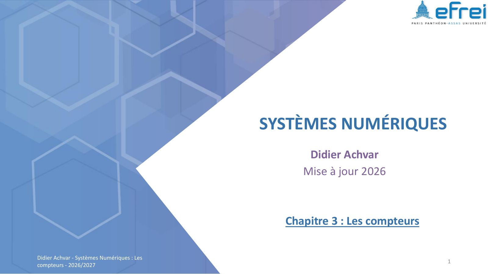{ loading=lazy .papier }](papier/ch3/p01.jpg)
    <p class="papier-legende">Page de titre · Chapitre 3 — support 2026-2027, diapo 1</p>

    [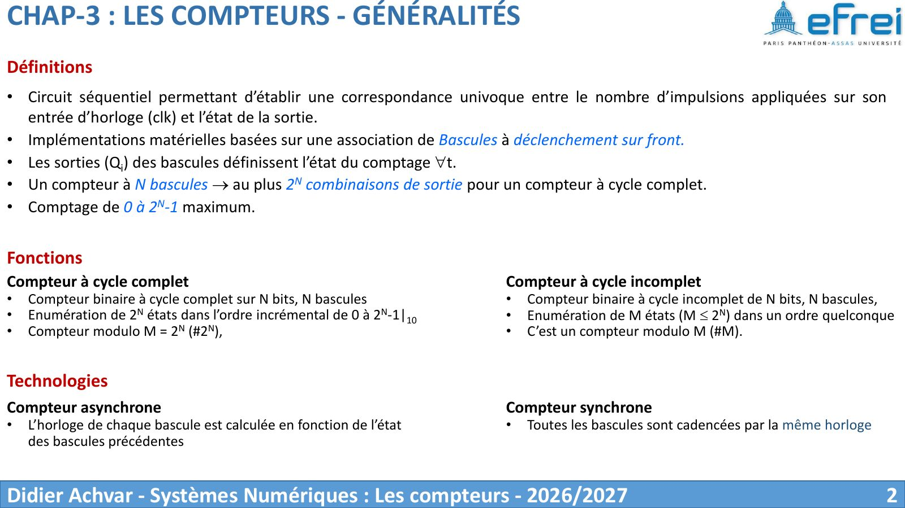{ loading=lazy .papier }](papier/ch3/p02.jpg)
    <p class="papier-legende">Définitions · Chapitre 3 — support 2026-2027, diapo 2</p>

    [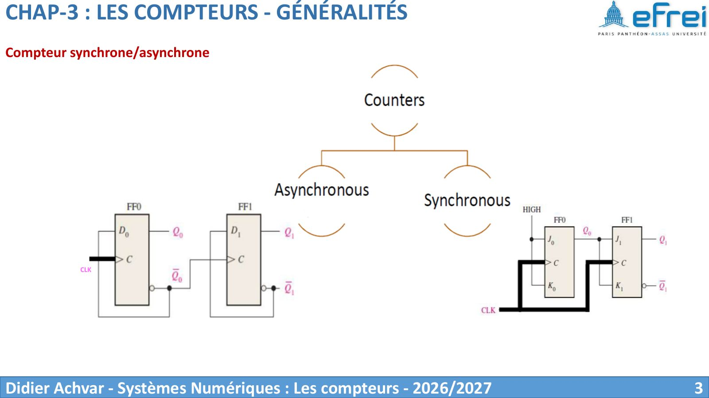{ loading=lazy .papier }](papier/ch3/p03.jpg)
    <p class="papier-legende">Compteur synchrone/asynchrone · Chapitre 3 — support 2026-2027, diapo 3</p>

    [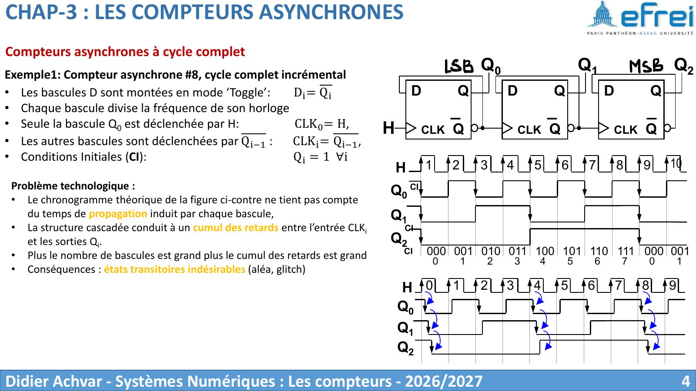{ loading=lazy .papier }](papier/ch3/p04.jpg)
    <p class="papier-legende">Compteurs asynchrones à cycle complet · Chapitre 3 — support 2026-2027, diapo 4</p>

    [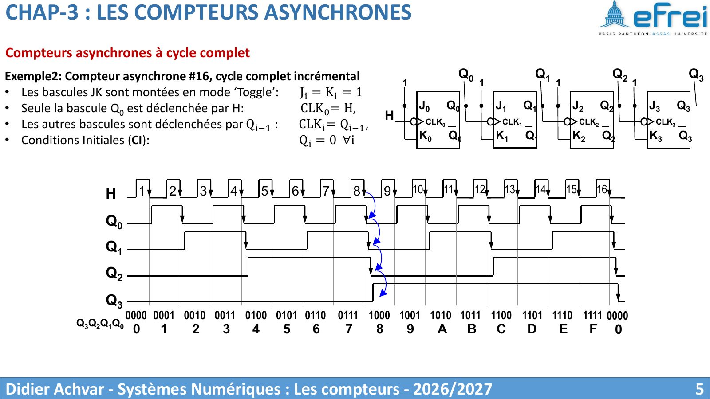{ loading=lazy .papier }](papier/ch3/p05.jpg)
    <p class="papier-legende">Compteurs asynchrones à cycle complet · Chapitre 3 — support 2026-2027, diapo 5</p>

    [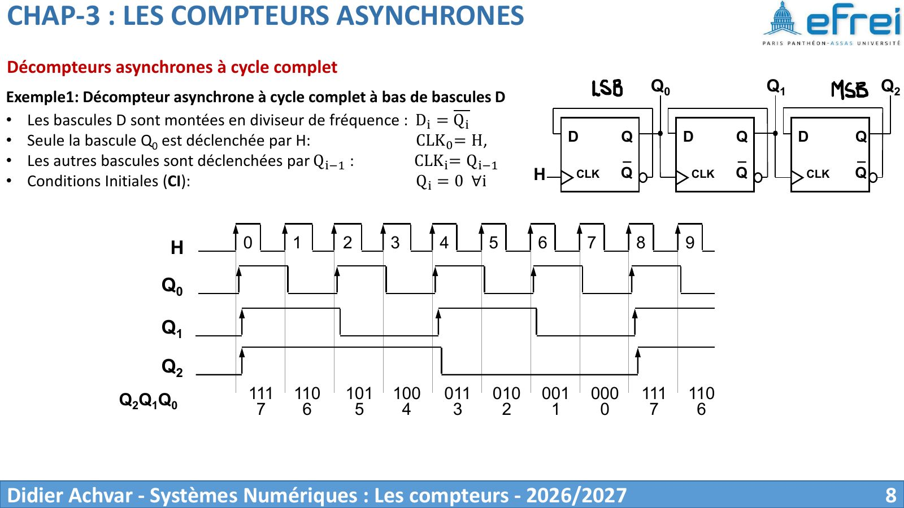{ loading=lazy .papier }](papier/ch3/p08.jpg)
    <p class="papier-legende">Décompteurs asynchrones à cycle complet · Chapitre 3 — support 2026-2027, diapo 8</p>

    [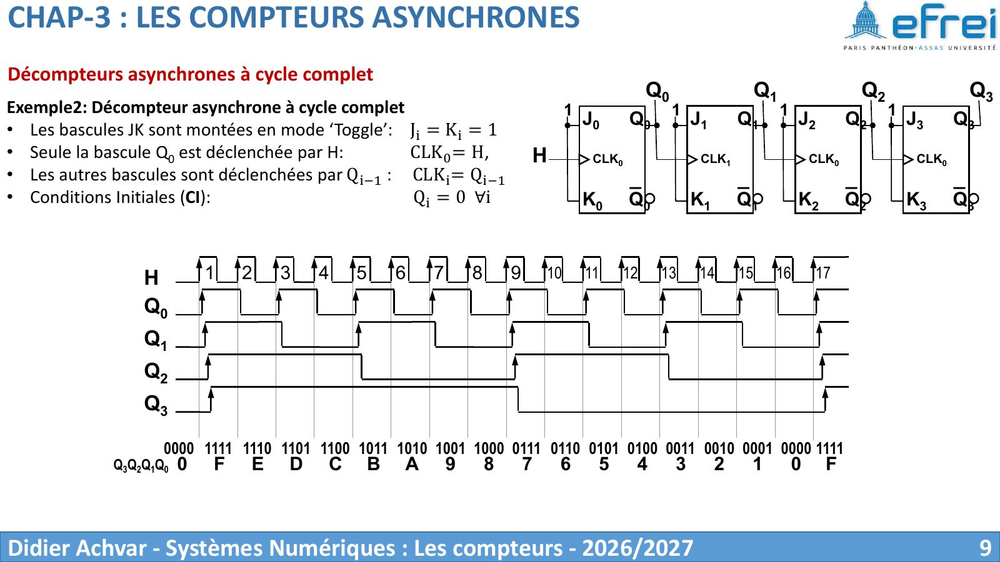{ loading=lazy .papier }](papier/ch3/p09.jpg)
    <p class="papier-legende">Décompteurs asynchrones à cycle complet · Chapitre 3 — support 2026-2027, diapo 9</p>

    [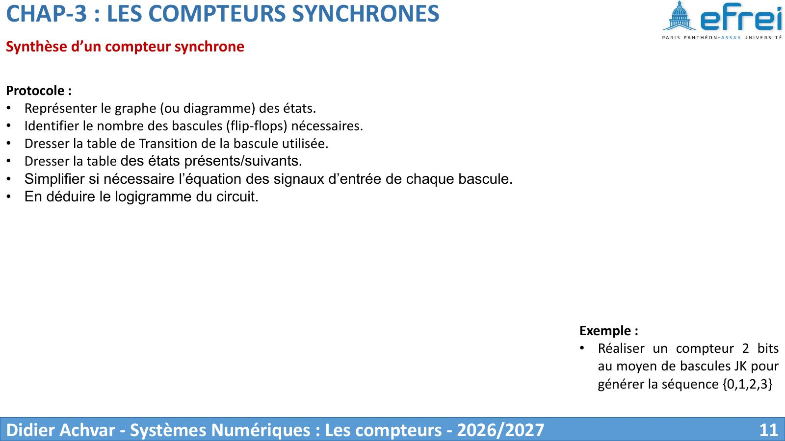{ loading=lazy .papier }](papier/ch3/p11.jpg)
    <p class="papier-legende">Synthèse d’un compteur synchrone · Chapitre 3 — support 2026-2027, diapo 11</p>

    [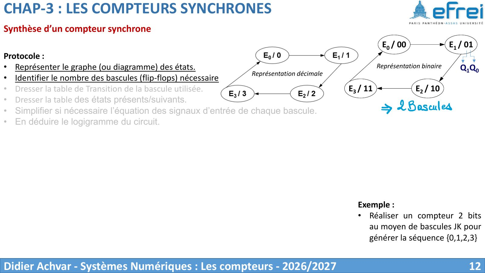{ loading=lazy .papier }](papier/ch3/p12.jpg)
    <p class="papier-legende">Synthèse d’un compteur synchrone · Chapitre 3 — support 2026-2027, diapo 12</p>

    [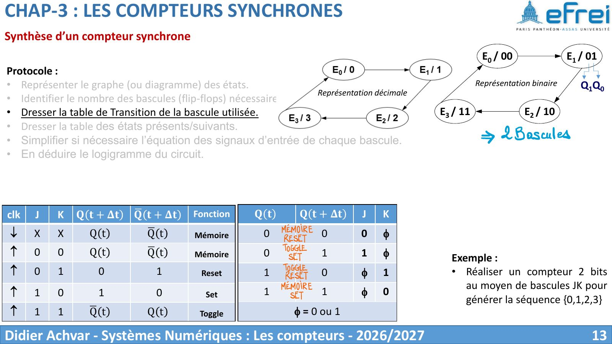{ loading=lazy .papier }](papier/ch3/p13.jpg)
    <p class="papier-legende">Synthèse d’un compteur synchrone · Chapitre 3 — support 2026-2027, diapo 13</p>

    [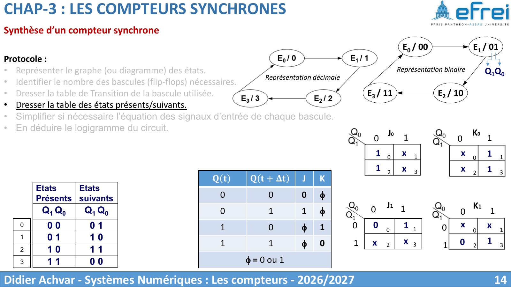{ loading=lazy .papier }](papier/ch3/p14.jpg)
    <p class="papier-legende">Synthèse d’un compteur synchrone · Chapitre 3 — support 2026-2027, diapo 14</p>

    [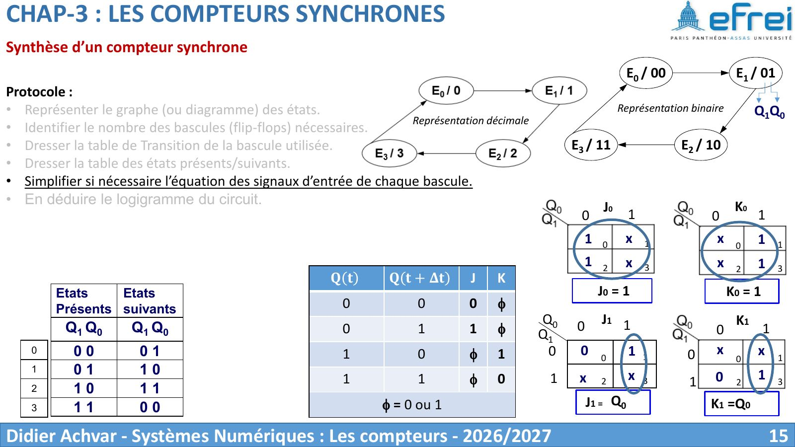{ loading=lazy .papier }](papier/ch3/p15.jpg)
    <p class="papier-legende">Synthèse d’un compteur synchrone · Chapitre 3 — support 2026-2027, diapo 15</p>

    [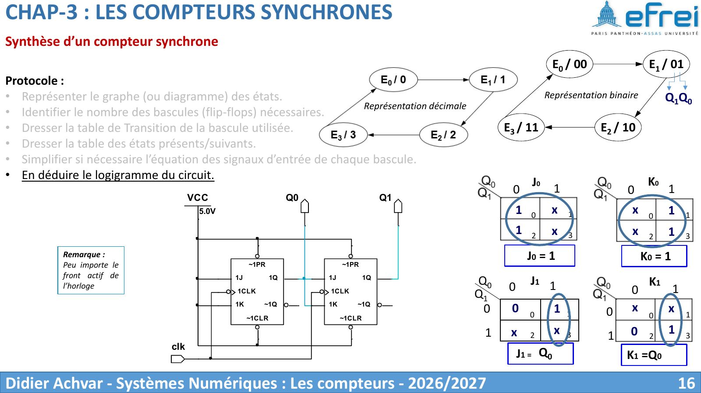{ loading=lazy .papier }](papier/ch3/p16.jpg)
    <p class="papier-legende">Synthèse d’un compteur synchrone · Chapitre 3 — support 2026-2027, diapo 16</p>
