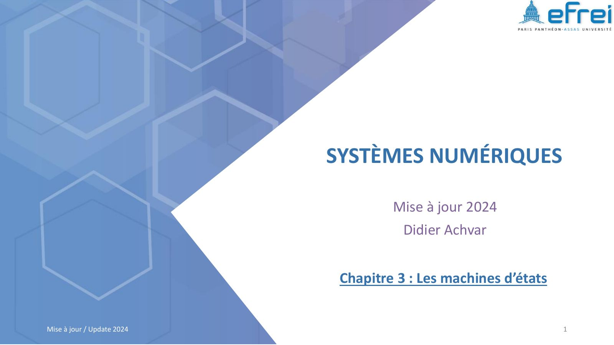
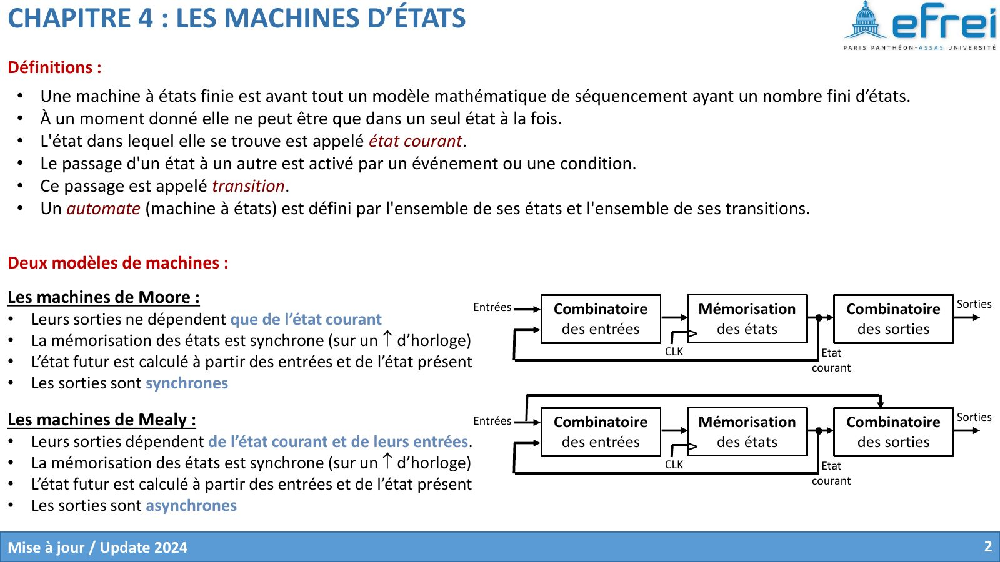
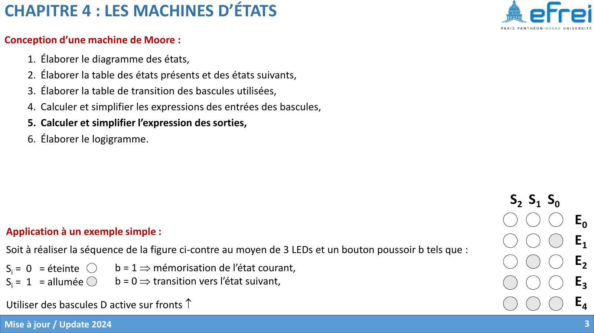
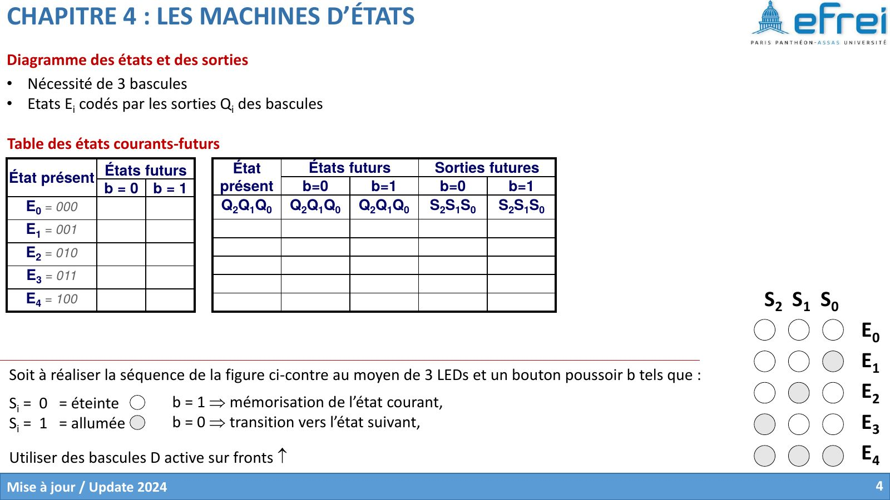
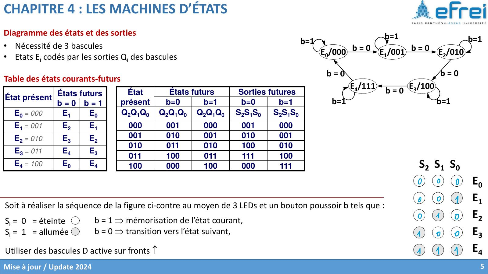
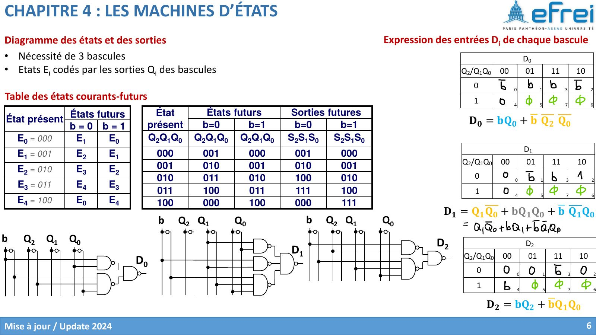
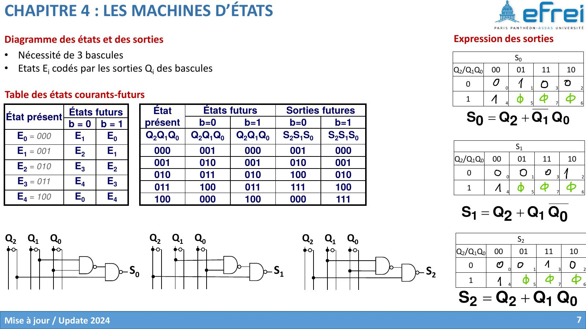

# Chapitre 4 — Les machines à états

=== "Version simplifiée"

    !!! definition "Machine à états finie (automate)"
        Modèle de séquencement qui possède un **nombre fini d'états**. À chaque
        instant, elle est dans un seul état, l'**état courant**. Le passage d'un état
        à un autre, la **transition**, est déclenché par une condition sur les
        entrées. Un automate est défini par ses états et ses transitions.

    ```mermaid
    flowchart LR
        E[Entrées] --> F[Combinatoire<br/>état futur]
        F --> M[Mémoire des états<br/>bascules]
        M -- état courant --> F
        M --> G[Combinatoire<br/>des sorties]
        E -. Mealy uniquement .-> G
        G --> S[Sorties]
    ```

    ## Moore ou Mealy ?

    | | **Moore** | **Mealy** |
    |-|-----------|-----------|
    | Les sorties dépendent de… | l'état courant **seulement** | l'état courant **et les entrées** |
    | Sorties | synchrones (changent au front d'horloge) | asynchrones (réagissent tout de suite à une entrée) |
    | Sur le graphe | la sortie est écrite **dans l'état** : `E3 / 1` | la sortie est écrite **sur la transition** : `x = 0 / 1` |
    | Nombre d'états | souvent un de plus | souvent moins d'états |

    !!! methode "Conception d'une machine de Moore"
        1. Élaborer le **diagramme des états** (avec les sorties dans chaque état).
        2. **Coder les états** sur $N$ bascules ($2^N \geq$ nombre d'états).
        3. Dresser la table **état présent → état futur** pour chaque valeur des entrées.
        4. Utiliser la **table de transitions** de la bascule (pour des D : $D_i = Q_i(t+1)$).
        5. Calculer et simplifier les **entrées des bascules** (Karnaugh ; états inutilisés = X).
        6. Calculer et simplifier les **sorties** en fonction de l'état.
        7. Tracer le **logigramme**.

    ## Exemple : séquence de LEDs commandée par un bouton

    Trois LEDs $S_2S_1S_0$ affichent une séquence de 5 motifs. Le bouton $b$
    commande l'avancement : $b = 1$ → on reste dans l'état courant, $b = 0$ → on passe
    à l'état suivant. On utilise des bascules D.

    5 états → **3 bascules**, états codés $E_k = k$ en binaire ($Q_2Q_1Q_0$).

    ```mermaid
    stateDiagram-v2
        direction LR
        E0: E0 = 000 / LEDs 000
        E1: E1 = 001 / LEDs 001
        E2: E2 = 010 / LEDs 010
        E3: E3 = 011 / LEDs 100
        E4: E4 = 100 / LEDs 111
        E0 --> E1: b = 0
        E1 --> E2: b = 0
        E2 --> E3: b = 0
        E3 --> E4: b = 0
        E4 --> E0: b = 0
    ```

    (Chaque état boucle sur lui-même quand $b = 1$.)

    | État présent $Q_2Q_1Q_0$ | Futur si $b = 0$ | Futur si $b = 1$ | Sorties $S_2S_1S_0$ |
    |:------------------------:|:----------------:|:----------------:|:-------------------:|
    | 000 | 001 | 000 | 000 |
    | 001 | 010 | 001 | 001 |
    | 010 | 011 | 010 | 010 |
    | 011 | 100 | 011 | 100 |
    | 100 | 000 | 100 | 111 |

    Après Karnaugh (états 101, 110, 111 en X) :

    $$
    \begin{aligned}
    D_2 &= b\,Q_2 + \overline{b}\,Q_1 Q_0 \\
    D_1 &= b\,Q_1 + Q_1\overline{Q_0} + \overline{b}\,\overline{Q_1}\,Q_0 \\
    D_0 &= b\,Q_0 + \overline{b}\,\overline{Q_2}\,\overline{Q_0}
    \end{aligned}
    $$

    Sorties (Moore : fonction de l'état seulement) :

    $$
    S_2 = Q_2 + Q_1 Q_0, \qquad S_1 = Q_2 + Q_1\overline{Q_0}, \qquad S_0 = Q_2 + \overline{Q_1}\,Q_0
    $$

    !!! methode "Lire une équation d'entrée D"
        Chaque équation se lit comme « quand est-ce que ce bit vaut 1 à l'état
        suivant ? ». Pour $D_2$ : soit on reste ($b = 1$) et $Q_2$ valait déjà 1, soit
        on avance ($b = 0$) depuis $E_3 = 011$, le seul état qui mène à un état avec $Q_2 = 1$.

    Autre exemple complet (détecteur de séquence, en Moore **et** en Mealy) :
    [TD 4](../td/td-4-machines-etats.md).

=== "Version papier"

    Les diapos du chapitre 4 telles que le prof les projette (support 2024 de D. Achvar).

    [{ loading=lazy .papier }](papier/ch4/p01.jpg)
    <p class="papier-legende">Page de titre · Chapitre 4 — support 2024, diapo 1</p>

    [{ loading=lazy .papier }](papier/ch4/p02.jpg)
    <p class="papier-legende">Définitions · Chapitre 4 — support 2024, diapo 2</p>

    [{ loading=lazy .papier }](papier/ch4/p03.jpg)
    <p class="papier-legende">Conception d’une machine de Moore · Chapitre 4 — support 2024, diapo 3</p>

    [{ loading=lazy .papier }](papier/ch4/p04.jpg)
    <p class="papier-legende">Diagramme des états et des sorties · Chapitre 4 — support 2024, diapo 4</p>

    [{ loading=lazy .papier }](papier/ch4/p05.jpg)
    <p class="papier-legende">Diagramme des états et des sorties · Chapitre 4 — support 2024, diapo 5</p>

    [{ loading=lazy .papier }](papier/ch4/p06.jpg)
    <p class="papier-legende">Expression des entrées Di de chaque bascule · Chapitre 4 — support 2024, diapo 6</p>

    [{ loading=lazy .papier }](papier/ch4/p07.jpg)
    <p class="papier-legende">Expression des sorties · Chapitre 4 — support 2024, diapo 7</p>
