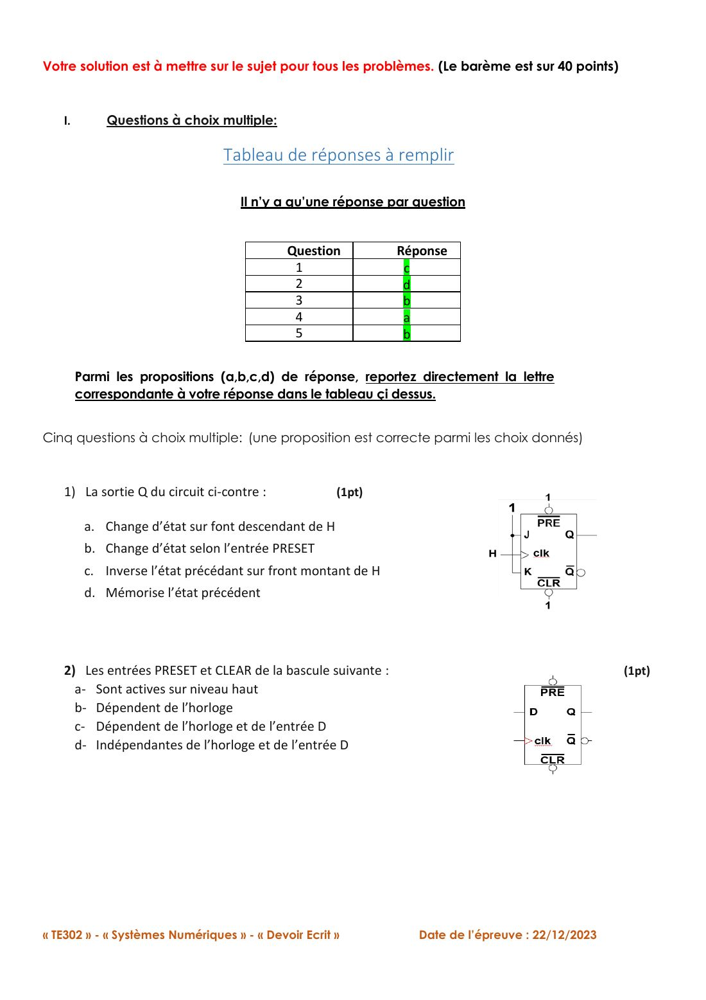
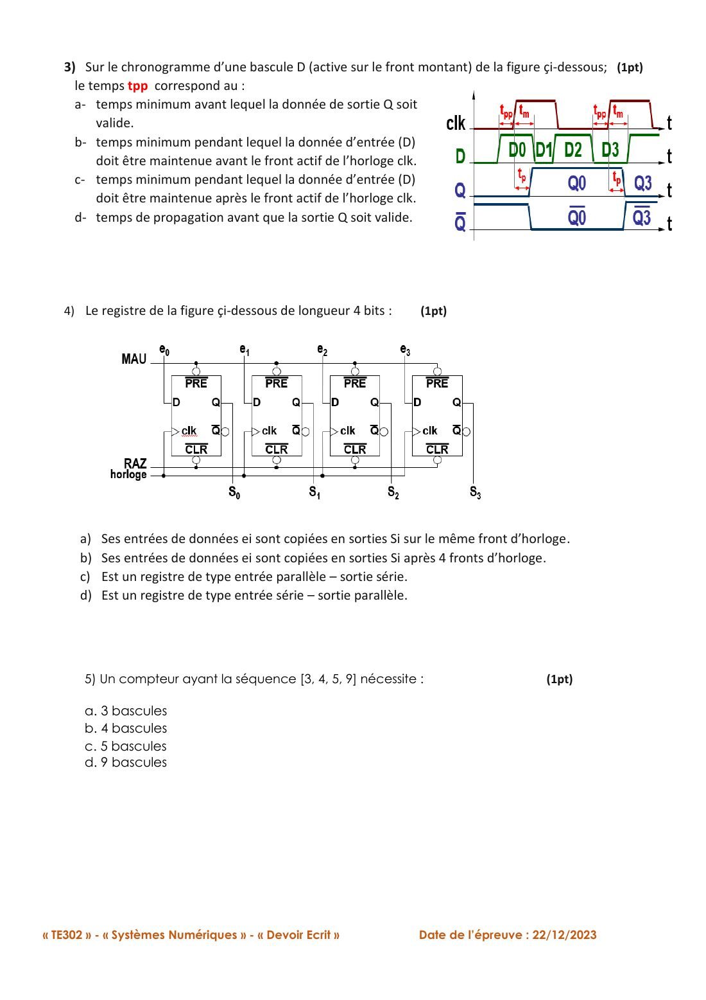
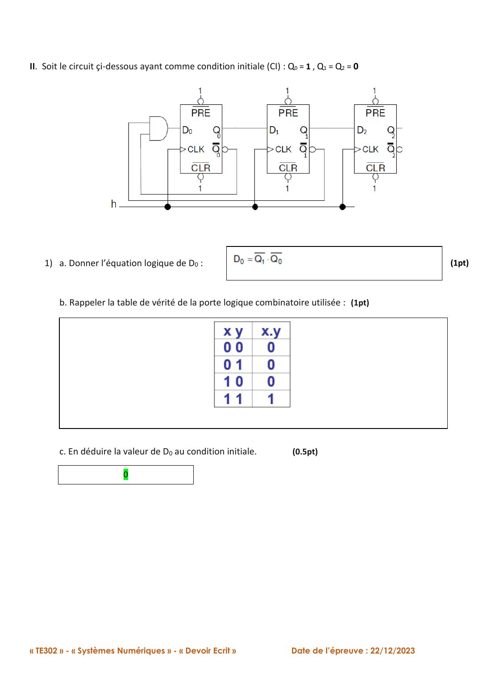
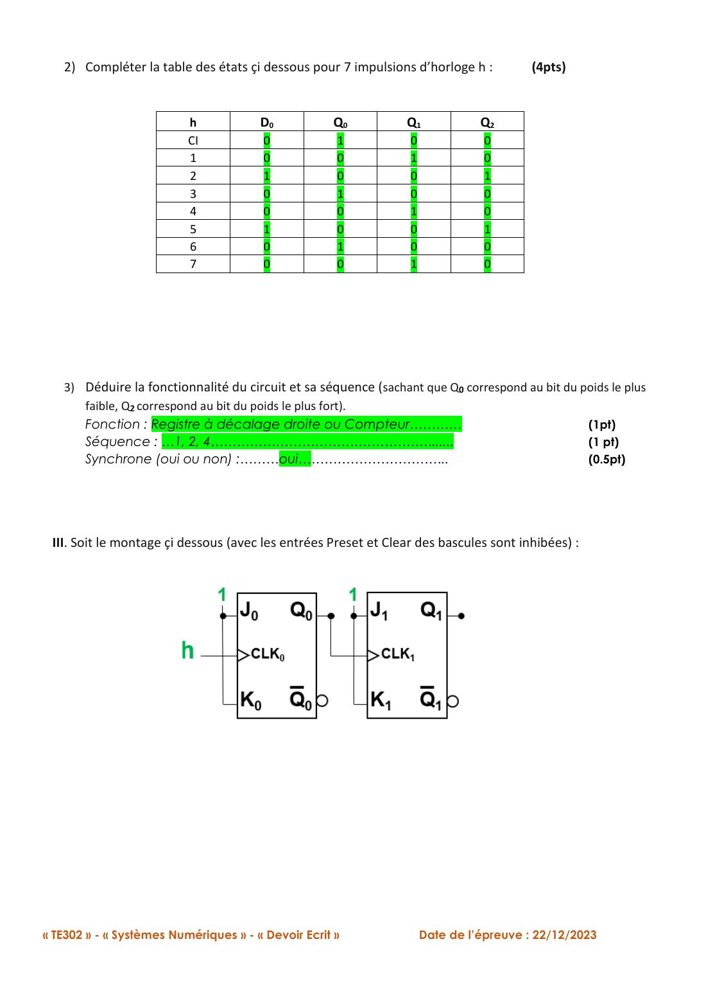
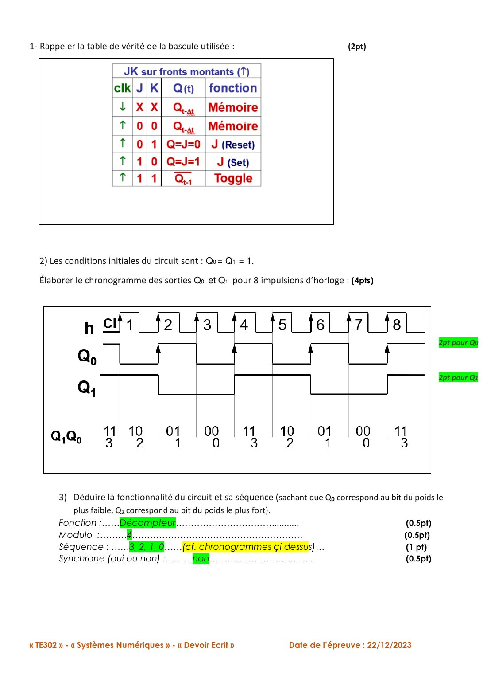
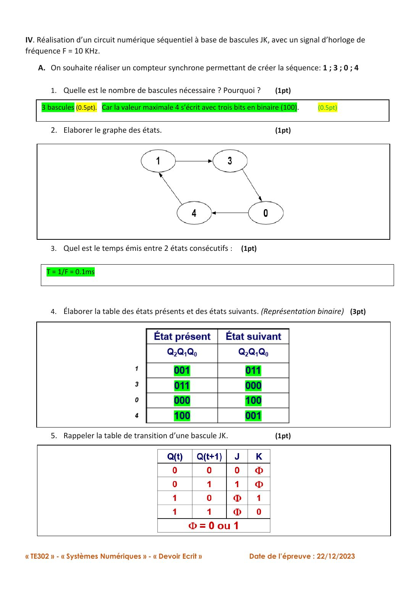
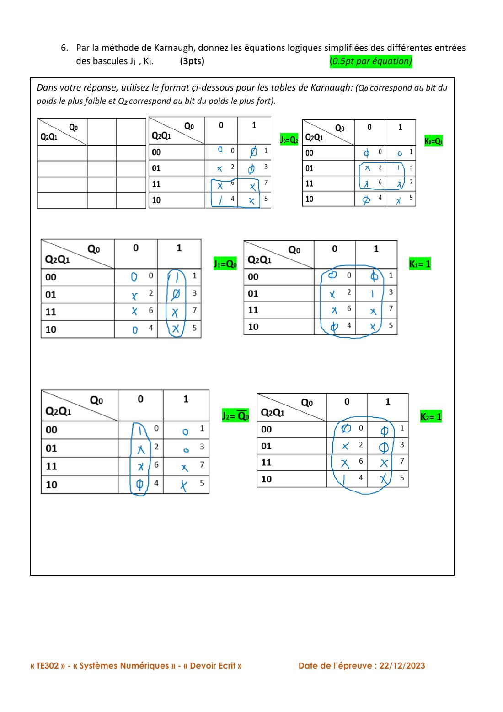
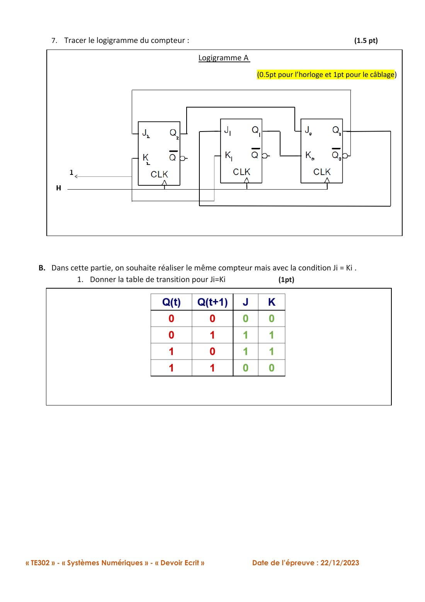
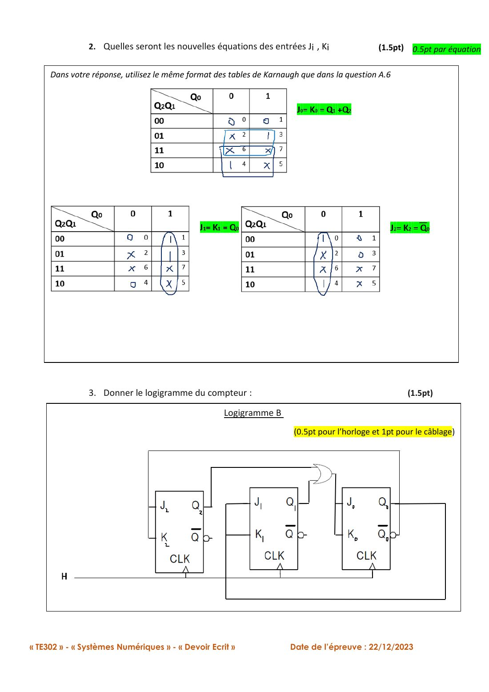
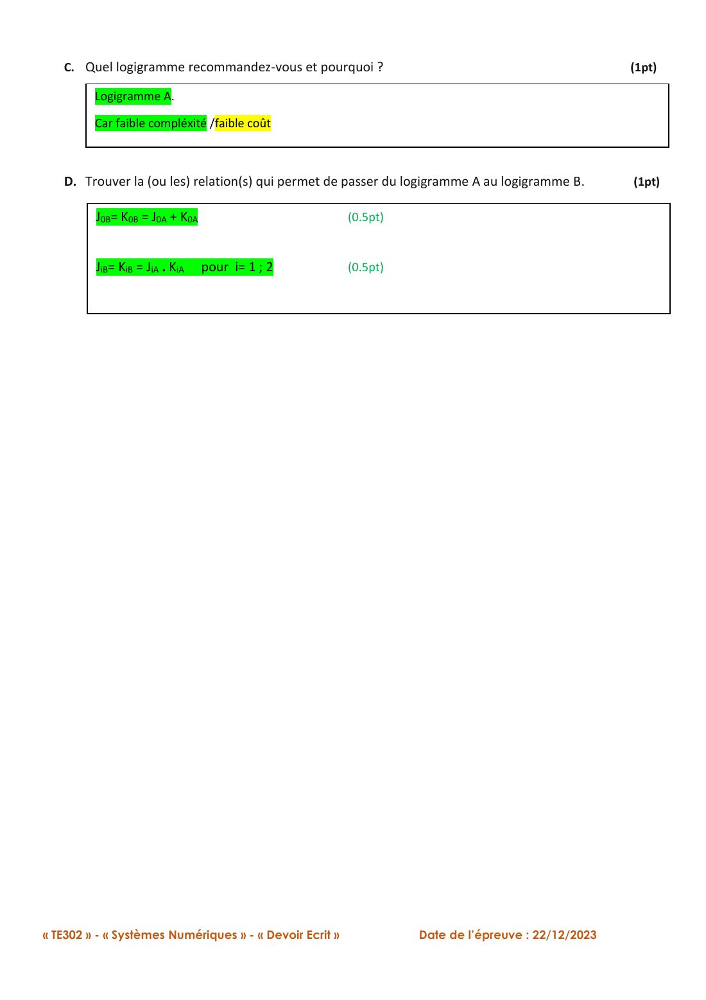

# Annale — DE du 22/12/2023

=== "Version simplifiée"

    Épreuve de **1 h 50, sans calculatrice ni documents**, notée sur 40. Sujet
    et corrigé officiel : onglet **Version papier**. Ci-dessous, mes
    explications ; les questions qui dépendent d'un schéma renvoient au sujet.

    ## I. QCM

    | Question | Réponse | Pourquoi |
    |----------|:-------:|----------|
    | 2. $\overline{PRE}$ et $\overline{CLR}$ sont… | **d** | Entrées de forçage asynchrones : indépendantes de l'horloge et de $D$ (et actives au niveau **bas**, donc pas **a**) |
    | 3. $t_{pp}$ correspond au… | **b** | Temps de **pré-positionnement** : $D$ stable **avant** le front. (**c** = temps de maintien, **a**/**d** = propagation) |
    | 5. Séquence $[3, 4, 5, 9]$ : combien de bascules ? | **b** | 9 = `1001` s'écrit sur **4 bits** |

    Les questions 1 et 4 se lisent sur le schéma (bascule en toggle / type de registre).

    !!! piege "Question 5"
        On ne compte pas les états (4 états → 2 bascules : **faux**), on regarde la
        **plus grande valeur**.

    ## II. Registre rebouclé (CI : $Q_0 = 1$, $Q_1 = Q_2 = 0$)

    Le 1 initial se décale d'une bascule à chaque front : $Q_2Q_1Q_0$ = `001` → `010` →
    `100` → `001`…

    - **Fonction** : registre à décalage rebouclé, qui se comporte comme un compteur (compteur en anneau)
    - **Séquence** : 1, 2, 4
    - **Synchrone** : oui (une seule horloge pour toutes les bascules)

    ## III. Montage à deux bascules (CI : $Q_0 = Q_1 = 1$)

    - **Fonction** : décompteur **modulo 4**
    - **Séquence** : 3, 2, 1, 0
    - **Synchrone** : non. La deuxième bascule est cadencée par la sortie de la première.

    ## IV. Synthèse d'un compteur synchrone {1, 3, 0, 4}, $F = 10$ kHz

    **A.1** — Max = 4 = `100` → **3 bascules**.

    **A.3** — Temps entre deux états = une période d'horloge : $T = 1/F = 0{,}1$ ms.

    ```mermaid
    stateDiagram-v2
        direction LR
        s1: 1 (001)
        s3: 3 (011)
        s0: 0 (000)
        s4: 4 (100)
        s1 --> s3
        s3 --> s0
        s0 --> s4
        s4 --> s1
    ```

    **A.4 à A.6 — Avec des JK**

    | Présent ($Q_2Q_1Q_0$) | Suivant | $J_2$ | $K_2$ | $J_1$ | $K_1$ | $J_0$ | $K_0$ |
    |:-:|:-:|:-:|:-:|:-:|:-:|:-:|:-:|
    | 1 = `001` | 3 = `011` | 0 | X | 1 | X | X | 0 |
    | 3 = `011` | 0 = `000` | 0 | X | X | 1 | X | 1 |
    | 0 = `000` | 4 = `100` | 1 | X | 0 | X | 0 | X |
    | 4 = `100` | 1 = `001` | X | 1 | 0 | X | 1 | X |

    Karnaugh (états 2, 5, 6, 7 en X) :

    $$
    \textbf{Logigramme A :}\quad
    J_2 = \overline{Q_0},\ K_2 = 1 \qquad
    J_1 = Q_0,\ K_1 = 1 \qquad
    J_0 = Q_2,\ K_0 = Q_1
    $$

    **B — Avec $J_i = K_i$** (bascules T, $T = 1$ si le bit change)

    | Présent ($Q_2Q_1Q_0$) | Suivant | $T_2$ | $T_1$ | $T_0$ |
    |:-:|:-:|:-:|:-:|:-:|
    | 1 = `001` | 3 = `011` | 0 | 1 | 0 |
    | 3 = `011` | 0 = `000` | 0 | 1 | 1 |
    | 0 = `000` | 4 = `100` | 1 | 0 | 0 |
    | 4 = `100` | 1 = `001` | 1 | 0 | 1 |

    $$
    \textbf{Logigramme B :}\quad
    T_2 = \overline{Q_0} \qquad T_1 = Q_0 \qquad T_0 = Q_1 + Q_2
    $$

    **C — Lequel recommander ?** Le **logigramme A** : aucune porte logique
    supplémentaire (que des fils et $\overline{Q_0}$, déjà disponible), donc une
    complexité et un coût plus faibles. B a besoin d'une porte OU.

    **D — Passage de A à B** (relations du corrigé) :

    $$
    J_0^B = K_0^B = J_0^A + K_0^A, \qquad J_i^B = K_i^B = J_i^A \cdot K_i^A \ \ (i = 1, 2)
    $$

    On le vérifie : $Q_2 + Q_1 = T_0$ ✓, $Q_0 \cdot 1 = T_1$ ✓, $\overline{Q_0} \cdot 1 = T_2$ ✓.

    !!! methode "Réflexe de fin d'exercice"
        États inutilisés avec le logigramme A : 2 → 4, 5 → 3, 6 → 1, 7 → 0. Ils
        retombent tous dans la séquence, donc pas de blocage. Le mentionner rapporte
        rarement des points au barème, mais montre que tu as compris.

=== "Version papier"

    Le sujet du DE 2023 avec le corrigé officiel (la page de garde n'est pas reprise).

    [{ loading=lazy .papier }](papier/annale/de2023-p02.jpg)
    <p class="papier-legende">DE du 22/12/2023, sujet corrigé, p. 2</p>

    [{ loading=lazy .papier }](papier/annale/de2023-p03.jpg)
    <p class="papier-legende">DE du 22/12/2023, sujet corrigé, p. 3</p>

    [{ loading=lazy .papier }](papier/annale/de2023-p04.jpg)
    <p class="papier-legende">DE du 22/12/2023, sujet corrigé, p. 4</p>

    [{ loading=lazy .papier }](papier/annale/de2023-p05.jpg)
    <p class="papier-legende">DE du 22/12/2023, sujet corrigé, p. 5</p>

    [{ loading=lazy .papier }](papier/annale/de2023-p06.jpg)
    <p class="papier-legende">DE du 22/12/2023, sujet corrigé, p. 6</p>

    [{ loading=lazy .papier }](papier/annale/de2023-p07.jpg)
    <p class="papier-legende">DE du 22/12/2023, sujet corrigé, p. 7</p>

    [{ loading=lazy .papier }](papier/annale/de2023-p08.jpg)
    <p class="papier-legende">DE du 22/12/2023, sujet corrigé, p. 8</p>

    [{ loading=lazy .papier }](papier/annale/de2023-p09.jpg)
    <p class="papier-legende">DE du 22/12/2023, sujet corrigé, p. 9</p>

    [{ loading=lazy .papier }](papier/annale/de2023-p10.jpg)
    <p class="papier-legende">DE du 22/12/2023, sujet corrigé, p. 10</p>

    [{ loading=lazy .papier }](papier/annale/de2023-p11.jpg)
    <p class="papier-legende">DE du 22/12/2023, sujet corrigé, p. 11</p>
