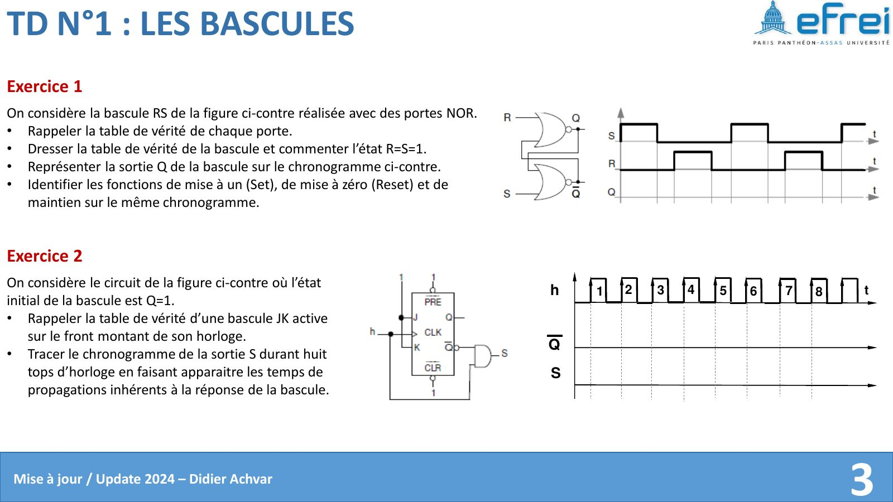
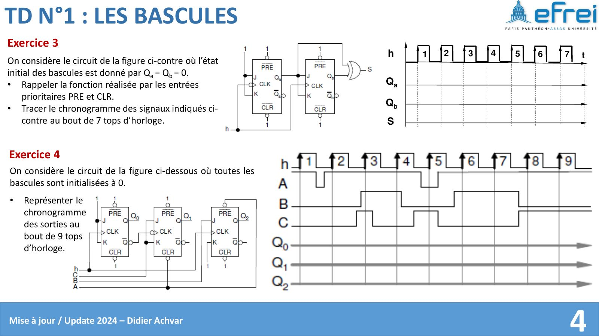
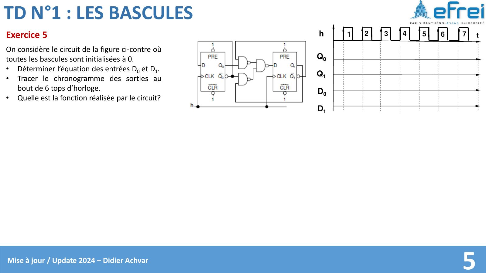
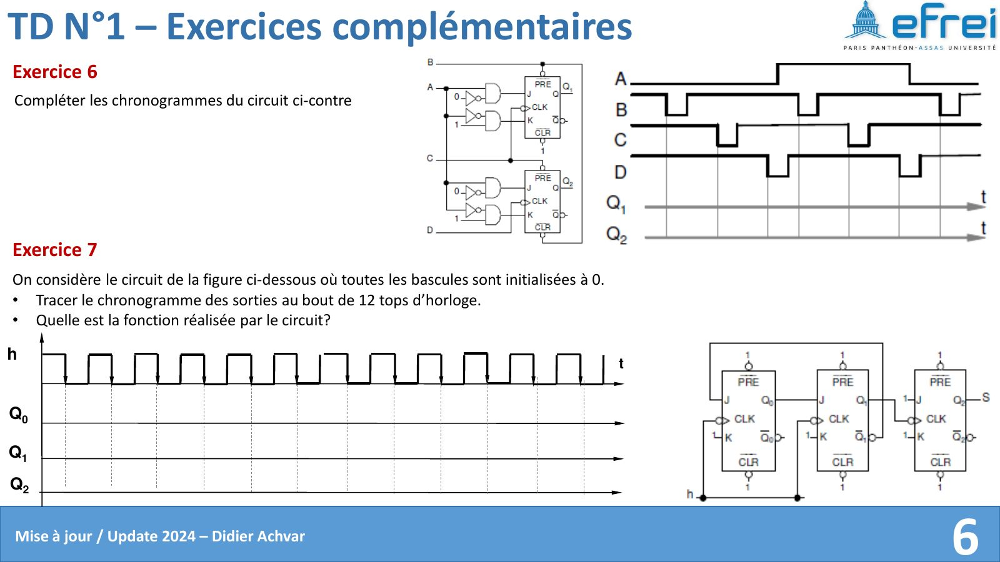

# TD 1 — Les bascules

=== "Version simplifiée"

    Les exercices reposent sur des schémas et des chronogrammes à compléter :
    énoncés dans l'onglet **Version papier**. Ici : les réponses « de
    cours » et la méthode pour chaque type d'exercice. Rappels : [chapitre 1](../cours/chapitre-1-bascules.md).

    ## Exercice 1 — Bascule RS à portes NOR

    **Table de la NOR** : la sortie vaut 1 seulement si les deux entrées valent 0.

    **Table de la bascule** (chaque NOR reçoit une entrée et la sortie de l'autre porte) :

    | $R$ | $S$ | $Q$ | $\overline{Q}$ | Fonction |
    |:---:|:---:|:---:|:---:|----------|
    | 0 | 0 | $Q_{t-1}$ | $\overline{Q}_{t-1}$ | Maintien |
    | 0 | 1 | 1 | 0 | Set |
    | 1 | 0 | 0 | 1 | Reset |
    | 1 | 1 | 0 | 0 | Interdit |

    **Commentaire sur $R = S = 1$** : $Q = \overline{Q} = 0$, les sorties ne sont plus
    complémentaires. Et si $R$ et $S$ repassent à 0 en même temps, l'état final
    dépend de la porte la plus rapide : il est imprévisible.

    **Chronogramme** : la RS est **asynchrone**. On lit $R$ et $S$ à chaque instant (pas
    de front à attendre) et on annote S, R ou M sur chaque intervalle.

    ## Exercice 2 — JK sur front montant, CI : $Q = 1$

    !!! methode "Chronogramme avec temps de propagation"
        1. Numéroter les fronts montants de l'horloge.
        2. Pour chaque front, lire $J$ et $K$ **juste avant** le front.
        3. Appliquer la table : 00 = M, 01 = R, 10 = S, 11 = T.
        4. Dessiner le changement de $S = Q$ **décalé de $t_p$** après le front.
        5. Si $J$ et $K$ viennent du circuit (par exemple de $\overline{Q}$), recalculer leur valeur après chaque changement de $Q$.

    ## Exercice 3 — Rôle de $\overline{PRE}$ et $\overline{CLR}$

    Ce sont des entrées de **forçage asynchrone**, actives au niveau bas et
    prioritaires :

    - $\overline{PRE} = 0$ force immédiatement $Q = 1$ ;
    - $\overline{CLR} = 0$ force immédiatement $Q = 0$ ;

    sans attendre l'horloge, quelles que soient les entrées de donnée.

    !!! piege "Sur le chronogramme"
        L'effet de $\overline{PRE}$ / $\overline{CLR}$ est **immédiat** (au temps
        $t_p$ près). Tant qu'elles sont actives, les fronts d'horloge n'ont aucun effet.

    ## Exercices 4 à 7 — Circuits à plusieurs bascules

    !!! methode "Analyser un circuit de bascules"
        1. Écrire l'**équation de chaque entrée** ($D_i$, $J_i$, $K_i$) en fonction des sorties.
        2. Repérer les **horloges** : toutes identiques (synchrone) ou en cascade (asynchrone) ?
        3. Faire un **tableau d'états** : une ligne par front, colonnes $Q_i$ puis entrées calculées.
        4. Remplir ligne par ligne à partir des CI, puis reporter sur le chronogramme.
        5. **Conclure** : lire $Q_{n-1}\dots Q_0$ comme un nombre. Il compte ou décompte ? Il décale ? On donne le modulo ou la séquence.

        Exemple de tableau pour deux bascules D :

        | Front | $Q_1$ | $Q_0$ | $D_1 = \dots$ | $D_0 = \dots$ |
        |:-----:|:-----:|:-----:|:-------------:|:-------------:|
        | CI | 0 | 0 | | |
        | 1 | | | | |
        | … | | | | |

    ## TP 1 — Ce qu'il faut en retenir

    - **RS en NAND** : table de vérité, fonctions S / R / M, état interdit.
    - **D (7474)** : $\overline{PRE}$ et $\overline{CLR}$ actives au niveau bas ; M (maintien) et C (copie) sur les chronogrammes.
    - **Mesure de $t_{pLH}$ et $t_{pHL}$** à haute fréquence, pour estimer la fréquence d'horloge maximale.
    - **Au-delà de $f_{max}$** (générateur à 50 MHz), la bascule ne suit plus : la sortie devient fausse.
    - **JK (74107)** : $\overline{CLR}$ active au niveau bas, fonctions M / S / R / T à chaque front descendant.

=== "Version papier"

    Énoncés du TD 1 tels qu'ils sont distribués (livret de TD de D. Achvar).

    [{ loading=lazy .papier }](papier/td1/livret-p03.jpg)
    
Exercices 1 et 2 · Livret de TD 2024, p. 3

    [{ loading=lazy .papier }](papier/td1/livret-p04.jpg)
    
Exercices 3 et 4 · Livret de TD 2024, p. 4

    [{ loading=lazy .papier }](papier/td1/livret-p05.jpg)
    
Exercice 5 · Livret de TD 2024, p. 5

    [{ loading=lazy .papier }](papier/td1/livret-p06.jpg)
    
Exercices complémentaires 6 et 7 · Livret de TD 2024, p. 6

