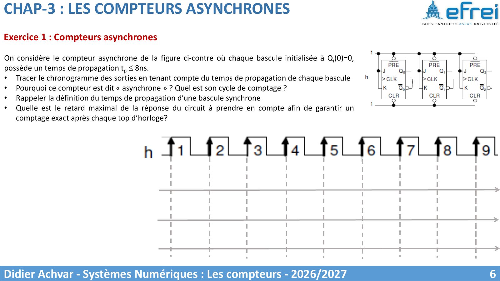
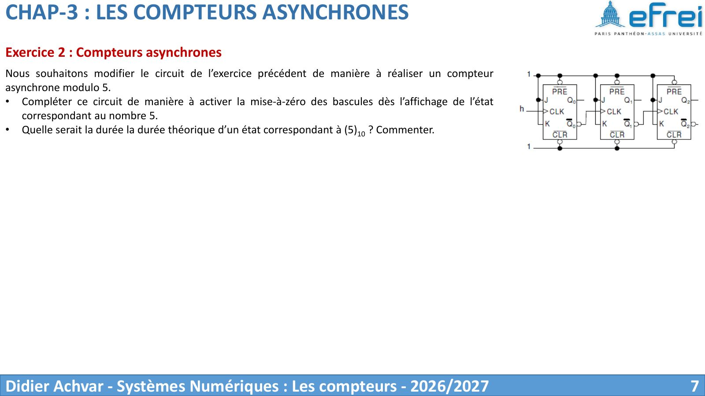
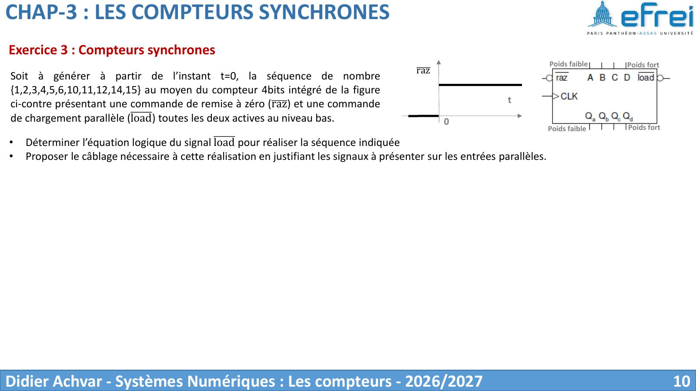
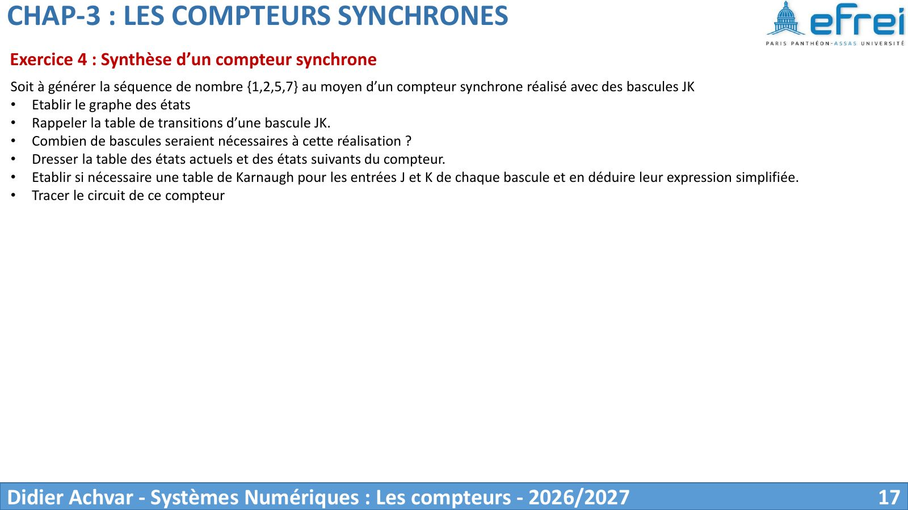
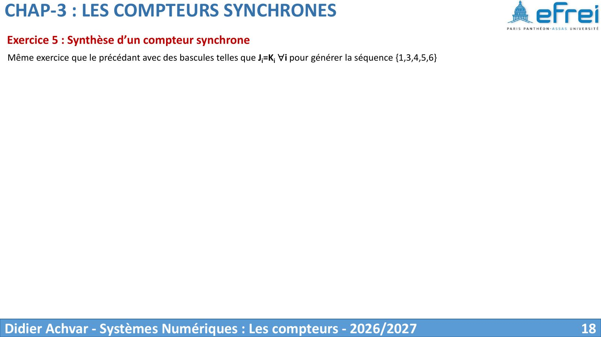
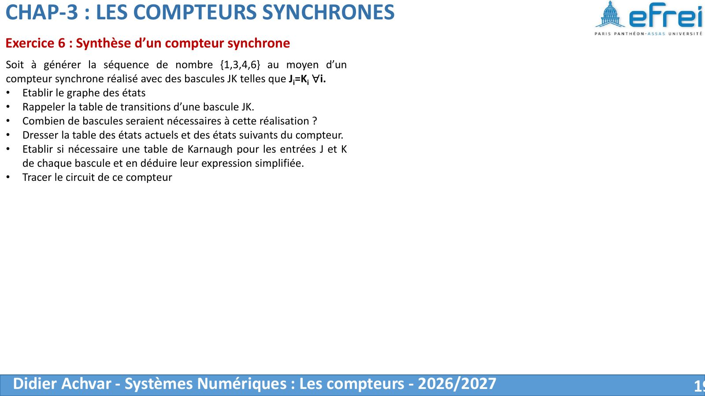
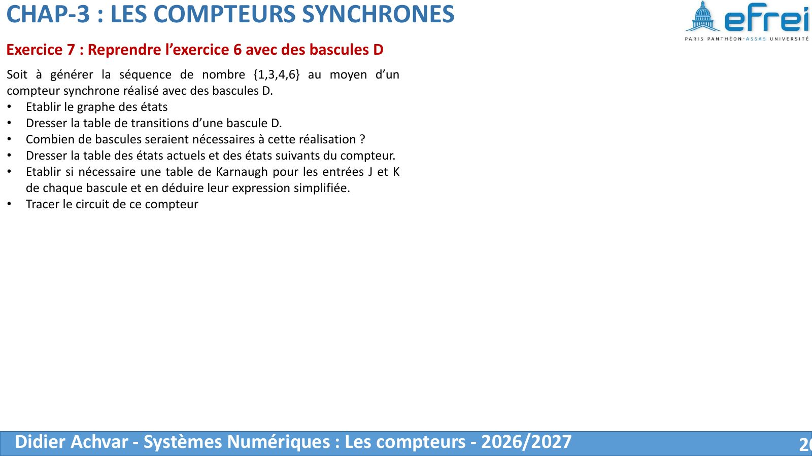

# TD 2 — Les compteurs

=== "Version simplifiée"

    Énoncés complets et schémas : onglet **Version papier**. Rappels : [chapitre 3](../cours/chapitre-3-compteurs.md).

    ## Exercice 1 — Compteur asynchrone et temps de propagation

    - **Pourquoi « asynchrone » ?** Seule la première bascule reçoit l'horloge ;
      chaque bascule suivante est cadencée par la sortie de la précédente. Les
      bascules ne changent donc pas toutes au même instant.
    - **Temps de propagation** : délai entre le front actif d'horloge et le moment
      où la sortie $Q$ est valide.
    - **Chronogramme** : chaque sortie $Q_i$ est décalée de $t_p$ par rapport au
      front qui la déclenche, donc de $(i+1)\,t_p$ par rapport au front de $H$.
    - **Retard maximal** : le pire cas est une retenue qui traverse toutes les
      bascules (`0111` → `1000` sur 4 bits). Il faut attendre
      $N \cdot t_p$ ; avec 4 bascules et $t_p = 8$ ns, cela donne **32 ns**. On en
      déduit $T_H > 32$ ns, soit $f_H < 31{,}25$ MHz.

    ## Exercice 2 — Modulo 5 en asynchrone

    On laisse compter le compteur binaire et on force la remise à zéro dès qu'il
    atteint 5 = `101` :

    $$
    \overline{CLR} = \overline{Q_2 \cdot Q_0}
    $$

    Une NAND à 2 entrées suffit : $Q_1$ n'est pas nécessaire, car l'état 5 est le
    premier où $Q_2 = Q_0 = 1$. Séquence : 0, 1, 2, 3, 4, (5 fugitif), 0…

    !!! piege "L'état 5 existe brièvement"
        La RAZ est asynchrone : le compteur passe réellement par `101` pendant
        quelques nanosecondes avant d'être remis à 0. C'est un *glitch* visible à
        l'oscilloscope.

    ## Exercice 3 — Séquence avec sauts par chargement parallèle

    Séquence voulue : $\{1, 2, 3, 4, 5, 6, 10, 11, 12, 14, 15\}$ avec un compteur 4 bits
    intégré, à RAZ et LOAD actifs au niveau bas. On suppose un **chargement
    synchrone** (type 74163 : le chargement a lieu au front d'horloge suivant).

    Le compteur fait +1 par défaut. Il faut **charger** à chaque saut :

    | État présent | Suivant normal | Suivant voulu | Charger ? | $D_3D_2D_1D_0$ |
    |:------------:|:--------------:|:-------------:|:---------:|:--------------:|
    | 6 = `0110` | 7 | 10 | oui | `1010` |
    | 12 = `1100` | 13 | 14 | oui | `1110` |
    | 15 = `1111` | 0 | 1 | oui | `0001` |

    **Équation de LOAD.** On veut $L = 1$ (charger) pour 6, 12 et 15. Les états
    jamais atteints (7, 8, 9, 13) sont des X :

    $$
    L = Q_3\overline{Q_1} + Q_2 Q_1 Q_0 + \overline{Q_3} Q_2 Q_1
    \qquad\Rightarrow\qquad
    \overline{LOAD} = \overline{L}
    $$

    **Entrées parallèles.** Elles ne comptent que lorsqu'on charge, donc on ne
    regarde que les trois lignes du tableau :

    $$
    D_3 = \overline{Q_0}, \quad D_2 = Q_3\overline{Q_0}, \quad D_1 = \overline{Q_0}, \quad D_0 = Q_0
    $$

    Vérification : pour 6 = `0110` on obtient $D = 1010$ ✓, pour 12 = `1100` $D = 1110$ ✓,
    pour 15 = `1111` $D = 0001$ ✓.

    **Démarrage** : une impulsion sur $\overline{RAZ}$ met le compteur à 0, puis le
    premier front donne 1 et la séquence commence.

    ## Exercice 4 — Séquence {1, 2, 5, 7} avec des JK

    **Nombre de bascules** : max = 7 = `111`, donc **3 bascules**.

    ```mermaid
    stateDiagram-v2
        direction LR
        s1: 1 (001)
        s2: 2 (010)
        s5: 5 (101)
        s7: 7 (111)
        s1 --> s2
        s2 --> s5
        s5 --> s7
        s7 --> s1
    ```

    | Présent ($Q_2Q_1Q_0$) | Suivant | $J_2$ | $K_2$ | $J_1$ | $K_1$ | $J_0$ | $K_0$ |
    |:-:|:-:|:-:|:-:|:-:|:-:|:-:|:-:|
    | 1 = `001` | 2 = `010` | 0 | X | 1 | X | X | 1 |
    | 2 = `010` | 5 = `101` | 1 | X | X | 1 | 1 | X |
    | 5 = `101` | 7 = `111` | X | 0 | 1 | X | X | 0 |
    | 7 = `111` | 1 = `001` | X | 1 | X | 1 | X | 0 |

    Karnaugh (états 0, 3, 4, 6 en X) :

    $$
    J_2 = \overline{Q_0}, \quad K_2 = Q_1, \qquad
    J_1 = K_1 = 1, \qquad
    J_0 = 1, \quad K_0 = \overline{Q_2}
    $$

    États inutilisés : 0 → 7, 3 → 0 → 7, 4 → 7, 6 → 1. Tous finissent par rejoindre
    la séquence : **pas de blocage**.

    ## Exercice 5 — Séquence {1, 3, 4, 5, 6} avec $J_i = K_i$

    Avec $J = K$, la bascule est une bascule T : $T = 1$ quand le bit **change**.

    | Présent ($Q_2Q_1Q_0$) | Suivant | $T_2$ | $T_1$ | $T_0$ |
    |:-:|:-:|:-:|:-:|:-:|
    | 1 = `001` | 3 = `011` | 0 | 1 | 0 |
    | 3 = `011` | 4 = `100` | 1 | 1 | 1 |
    | 4 = `100` | 5 = `101` | 0 | 0 | 1 |
    | 5 = `101` | 6 = `110` | 0 | 1 | 1 |
    | 6 = `110` | 1 = `001` | 1 | 1 | 1 |

    $$
    T_2 = Q_1, \qquad T_1 = Q_1 + Q_0, \qquad T_0 = Q_2 + Q_1
    $$

    !!! piege "Blocage en 0"
        Si le compteur démarre en 0, alors $T_2 = T_1 = T_0 = 0$ et il **reste
        bloqué en 0** (et 7 mène à 0). Il faut l'initialiser à 1 avec les entrées
        prioritaires ($\overline{PRE}$ sur $Q_0$, $\overline{CLR}$ sur $Q_1$ et $Q_2$).

    ## Exercice 6 — Séquence {1, 3, 4, 6} avec $J_i = K_i$

    | Présent ($Q_2Q_1Q_0$) | Suivant | $T_2$ | $T_1$ | $T_0$ |
    |:-:|:-:|:-:|:-:|:-:|
    | 1 = `001` | 3 = `011` | 0 | 1 | 0 |
    | 3 = `011` | 4 = `100` | 1 | 1 | 1 |
    | 4 = `100` | 6 = `110` | 0 | 1 | 0 |
    | 6 = `110` | 1 = `001` | 1 | 1 | 1 |

    $$
    T_2 = Q_1, \qquad T_1 = 1, \qquad T_0 = Q_1
    $$

    Très simple à câbler : $J_1 = K_1 = 1$, et $J_0 = K_0 = J_2 = K_2 = Q_1$.

    !!! piege "Cycle parasite"
        Les états inutilisés forment un **second cycle** : 0 → 2 → 5 → 7 → 0. Démarré
        dans l'un d'eux, le compteur n'atteint jamais la bonne séquence.
        Initialisation obligatoire.

    ## Exercice 7 — Séquence {1, 3, 4, 6} avec des D

    Table de transitions d'une D : $D = Q(t+1)$.

    | Présent ($Q_2Q_1Q_0$) | Suivant | $D_2$ | $D_1$ | $D_0$ |
    |:-:|:-:|:-:|:-:|:-:|
    | 1 = `001` | 3 = `011` | 0 | 1 | 1 |
    | 3 = `011` | 4 = `100` | 1 | 0 | 0 |
    | 4 = `100` | 6 = `110` | 1 | 1 | 0 |
    | 6 = `110` | 1 = `001` | 0 | 0 | 1 |

    $$
    D_2 = Q_1\overline{Q_2} + \overline{Q_1}\,\overline{Q_0}, \qquad
    D_1 = \overline{Q_1}, \qquad
    D_0 = Q_1\overline{Q_0} + \overline{Q_2}\,\overline{Q_1}
    $$

    Comparaison : avec des T (ex. 6), les équations sont bien plus simples. Avec
    des D il faut plus de portes, mais une bascule D est plus simple qu'une JK.

    !!! piege "Cycles parasites ici aussi"
        0 ↔ 7 et 2 ↔ 5 : deux cycles parasites de longueur 2.

=== "Version papier"

    Énoncés 2026-2027, tirés du support du chapitre 3 (D. Achvar). La numérotation suit celle de la version simplifiée.

    [{ loading=lazy .papier }](papier/td2/compteurs-p06.jpg)
    <p class="papier-legende">Exercice 1 — compteur asynchrone et tp · Chapitre 3 — Les compteurs (2026-2027), p. 6</p>

    [{ loading=lazy .papier }](papier/td2/compteurs-p07.jpg)
    <p class="papier-legende">Exercice 2 — modulo 5 · Chapitre 3 — Les compteurs (2026-2027), p. 7</p>

    [{ loading=lazy .papier }](papier/td2/compteurs-p10.jpg)
    <p class="papier-legende">Exercice 3 — séquence avec load · Chapitre 3 — Les compteurs (2026-2027), p. 10</p>

    [{ loading=lazy .papier }](papier/td2/compteurs-p17.jpg)
    <p class="papier-legende">Exercice 4 — {1, 2, 5, 7} en JK · Chapitre 3 — Les compteurs (2026-2027), p. 17</p>

    [{ loading=lazy .papier }](papier/td2/compteurs-p18.jpg)
    <p class="papier-legende">Exercice 5 — {1, 3, 4, 5, 6} avec Ji = Ki · Chapitre 3 — Les compteurs (2026-2027), p. 18</p>

    [{ loading=lazy .papier }](papier/td2/compteurs-p19.jpg)
    <p class="papier-legende">Exercice 6 — {1, 3, 4, 6} avec Ji = Ki · Chapitre 3 — Les compteurs (2026-2027), p. 19</p>

    [{ loading=lazy .papier }](papier/td2/compteurs-p20.jpg)
    <p class="papier-legende">Exercice 7 — {1, 3, 4, 6} en D · Chapitre 3 — Les compteurs (2026-2027), p. 20</p>
