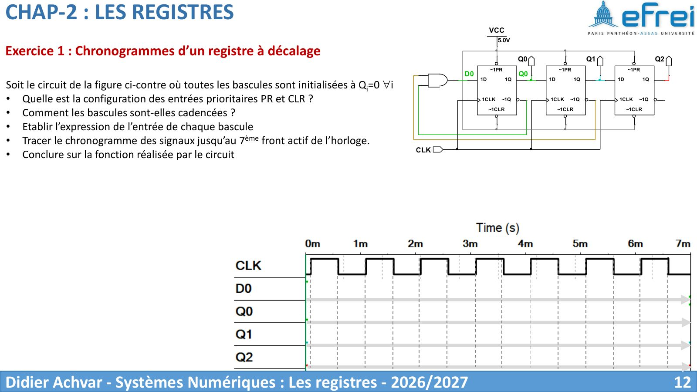
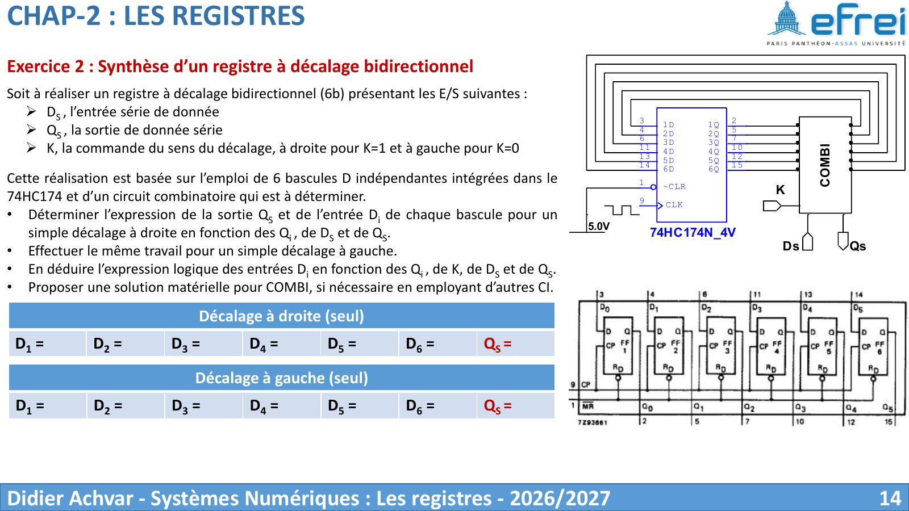
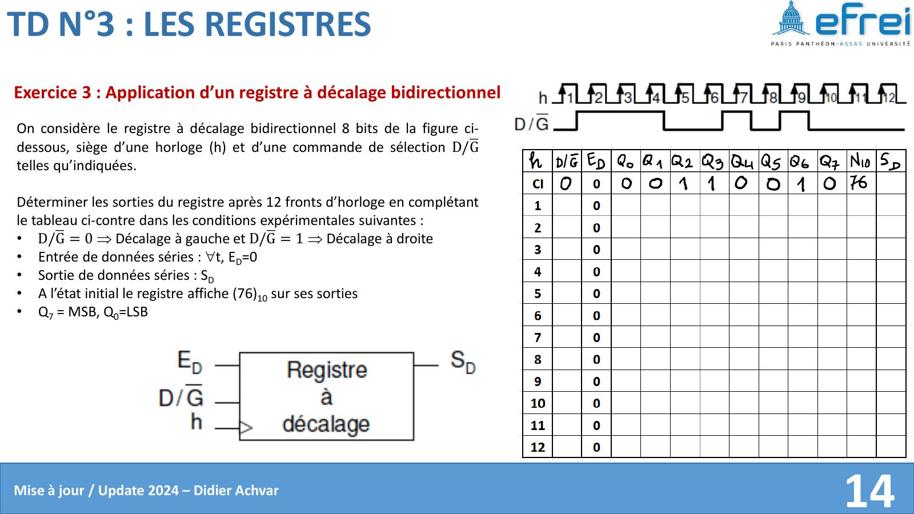
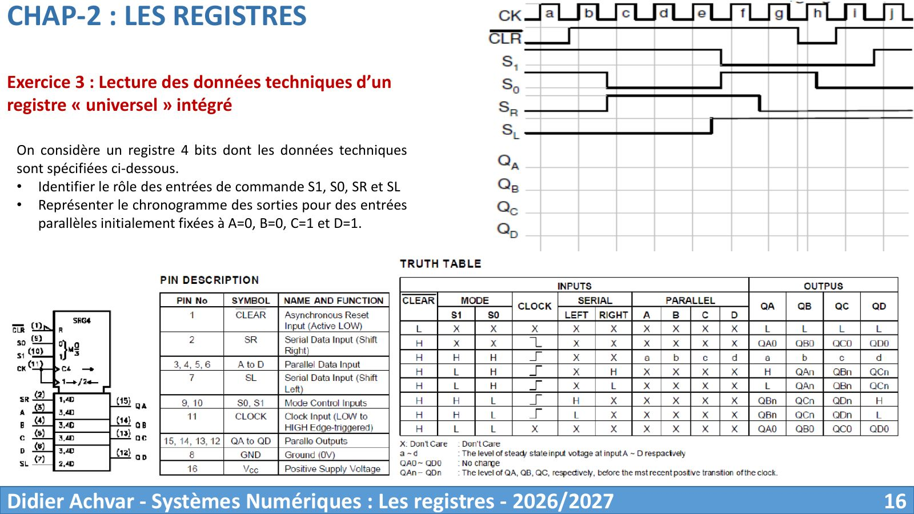
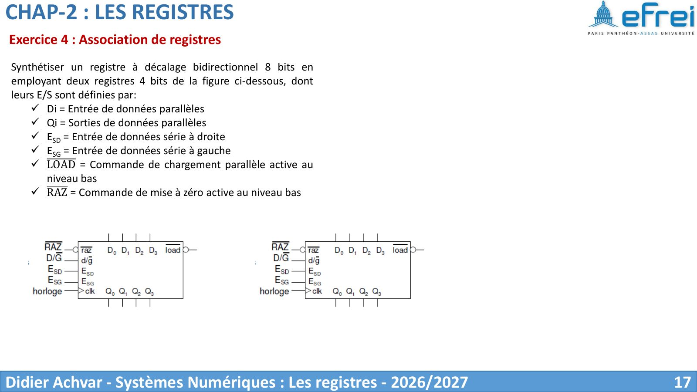
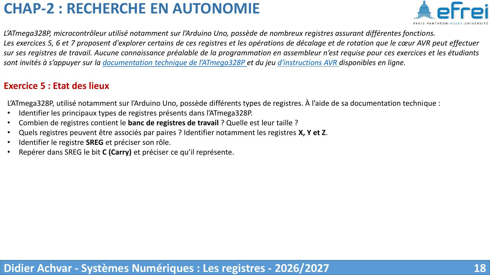
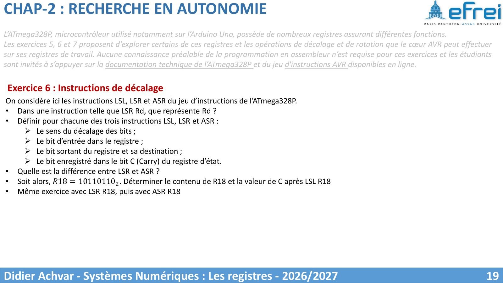
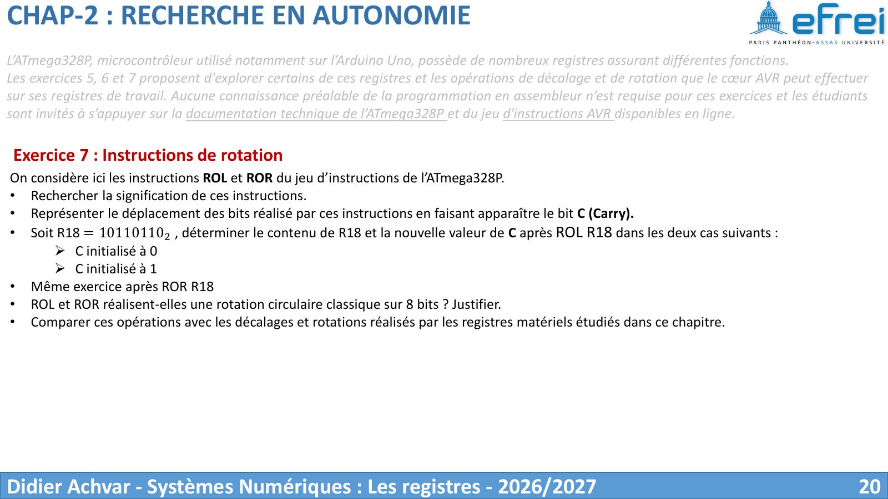

# TD 3 — Les registres

=== "Version simplifiée"

    Énoncés et schémas : onglet **Version papier**. Rappels : [chapitre 2](../cours/chapitre-2-registres.md).

    ## Chronogramme d'un registre à décalage

    !!! methode "Méthode"
        1. Écrire l'entrée de chaque bascule : $D_0 = E$, $D_i = Q_{i-1}$ (vers la droite).
        2. À chaque front, **toutes les bascules copient en même temps** la valeur
           que leur voisine avait **avant** le front.
        3. Conclure : entrée série / sorties parallèles, retard de $n$ périodes, etc.

    !!! piege "Le décalage « en cascade »"
        Il ne faut pas propager un bit à travers tout le registre en un seul front.
        Au front $k$, chaque bascule prend la valeur que sa voisine avait au front
        $k - 1$ : le bit n'avance que d'**une seule case** par front.

    ## Registre bidirectionnel

    Avec une commande $S$ ($S = 1$ décalage à droite, $S = 0$ à gauche) et une entrée
    série $DS$, chaque bascule reçoit :

    $$
    D_i = S\,Q_{i-1} + \overline{S}\,Q_{i+1}
    $$

    avec aux extrémités $D_0 = S\,DS + \overline{S}\,Q_1$ et
    $D_{N-1} = S\,Q_{N-2} + \overline{S}\,DS$. La sortie série vaut
    $QS = S\,Q_{N-1} + \overline{S}\,Q_0$.

    **Implémentation** : un **multiplexeur 2→1 par bascule**, piloté par $S$
    (entrée 1 : voisine de gauche, entrée 0 : voisine de droite). Pour la sortie
    série, un mux de plus.

    ## Registre 8 bits initialisé à $(76)_{10}$

    $76 = 64 + 8 + 4$ = `0100 1100` ($Q_7$ = MSB). Avec $ED = 0$ :

    - décalage à **gauche** : chaque bit monte d'un rang, donc la valeur est **multipliée par 2** (modulo 256) ;
    - décalage à **droite** : chaque bit descend d'un rang, donc on fait une **division entière par 2**.

    On suit la commande $D/\overline{G}$ front par front dans le tableau de l'énoncé.

    ## Registre universel (S1, S0, SR, SL)

    | S1 | S0 | Mode |
    |:--:|:--:|------|
    | 0 | 0 | Maintien |
    | 0 | 1 | Décalage à droite (entrée série SR) |
    | 1 | 0 | Décalage à gauche (entrée série SL) |
    | 1 | 1 | Chargement parallèle (A, B, C, D) |

    ## Association de deux registres 4 bits → 8 bits bidirectionnel

    Pour que les données passent d'un registre à l'autre :

    - décalage à droite : la sortie de droite du registre de gauche va sur l'**ESD** du registre de droite ;
    - décalage à gauche : la sortie de gauche du registre de droite va sur l'**ESG** du registre de gauche ;
    - on relie ensemble les horloges, les $\overline{LOAD}$ et les $\overline{RAZ}$.

    ## Registres de l'ATmega328P (exercices 5 à 7)

    Banc de **32 registres de travail de 8 bits** (R0 à R31). Les paires R26:R27,
    R28:R29 et R30:R31 forment les pointeurs 16 bits **X**, **Y** et **Z**. Le
    registre d'état **SREG** contient notamment le bit **C** (*carry*, retenue), qui
    reçoit le bit sorti lors d'un décalage.

    !!! example "Avec $R18 = 1011\,0110_2$"
        | Instruction | Effet | R18 après | C après |
        |-------------|-------|:---------:|:-------:|
        | `LSL R18` | décalage à gauche, 0 entre à droite, MSB → C | `0110 1100` | 1 |
        | `LSR R18` | décalage à droite, 0 entre à gauche, LSB → C | `0101 1011` | 0 |
        | `ASR R18` | décalage à droite, **le MSB est conservé** (signe), LSB → C | `1101 1011` | 0 |
        | `ROL R18`, C = 0 | rotation à gauche **via C** : C → LSB, MSB → C | `0110 1100` | 1 |
        | `ROL R18`, C = 1 | idem | `0110 1101` | 1 |
        | `ROR R18`, C = 0 | rotation à droite via C : C → MSB, LSB → C | `0101 1011` | 0 |
        | `ROR R18`, C = 1 | idem | `1101 1011` | 0 |

    !!! piege "LSR vs ASR, et ROL/ROR"
        - `LSR` fait entrer un 0 : c'est une division par 2 d'un **non signé**.
          `ASR` recopie le bit de signe : c'est une division par 2 d'un **signé**
          (complément à 2).
        - `ROL`/`ROR` **ne sont pas** des rotations circulaires sur 8 bits : elles
          tournent sur **9 bits** (les 8 bits du registre + C). Une rotation
          matérielle sur 8 bits reboucle directement la sortie série sur l'entrée.

=== "Version papier"

    Énoncés 2026-2027, tirés du support du chapitre 2 (D. Achvar), plus l'exercice du registre 8 bits qui vient du livret de TD 2024.

    [{ loading=lazy .papier }](papier/td3/registres-p12.jpg)
    
Exercice 1 — chronogrammes d'un registre à décalage · Chapitre 2 — Les registres (2026-2027), p. 12

    [{ loading=lazy .papier }](papier/td3/registres-p14.jpg)
    
Exercice 2 — registre bidirectionnel · Chapitre 2 — Les registres (2026-2027), p. 14

    [{ loading=lazy .papier }](papier/td3/livret-p14.jpg)
    
Registre bidirectionnel 8 bits initialisé à 76 · Livret de TD 2024, p. 14

    [{ loading=lazy .papier }](papier/td3/registres-p16.jpg)
    
Exercice 3 — registre universel · Chapitre 2 — Les registres (2026-2027), p. 16

    [{ loading=lazy .papier }](papier/td3/registres-p17.jpg)
    
Exercice 4 — association de registres · Chapitre 2 — Les registres (2026-2027), p. 17

    [{ loading=lazy .papier }](papier/td3/registres-p18.jpg)
    
Exercice 5 — registres de l'ATmega328P · Chapitre 2 — Les registres (2026-2027), p. 18

    [{ loading=lazy .papier }](papier/td3/registres-p19.jpg)
    
Exercice 6 — instructions de décalage · Chapitre 2 — Les registres (2026-2027), p. 19

    [{ loading=lazy .papier }](papier/td3/registres-p20.jpg)
    
Exercice 7 — instructions de rotation · Chapitre 2 — Les registres (2026-2027), p. 20

