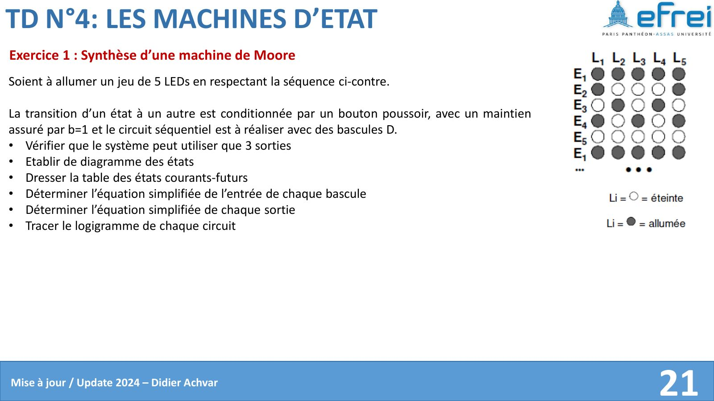
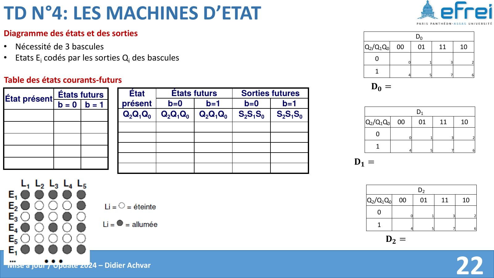
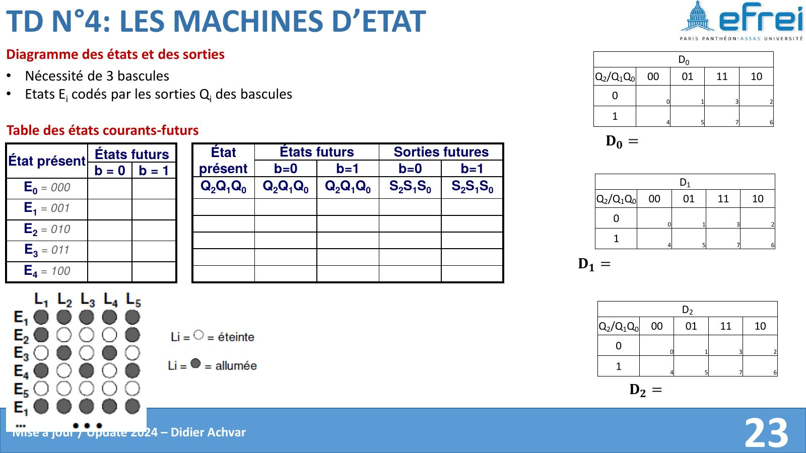
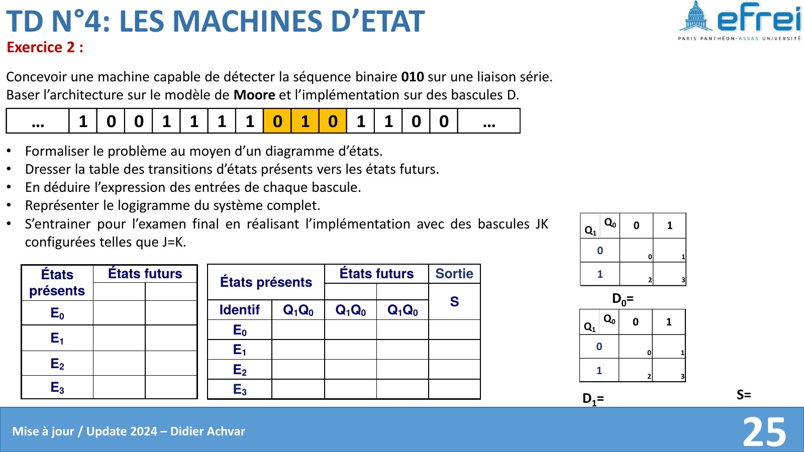
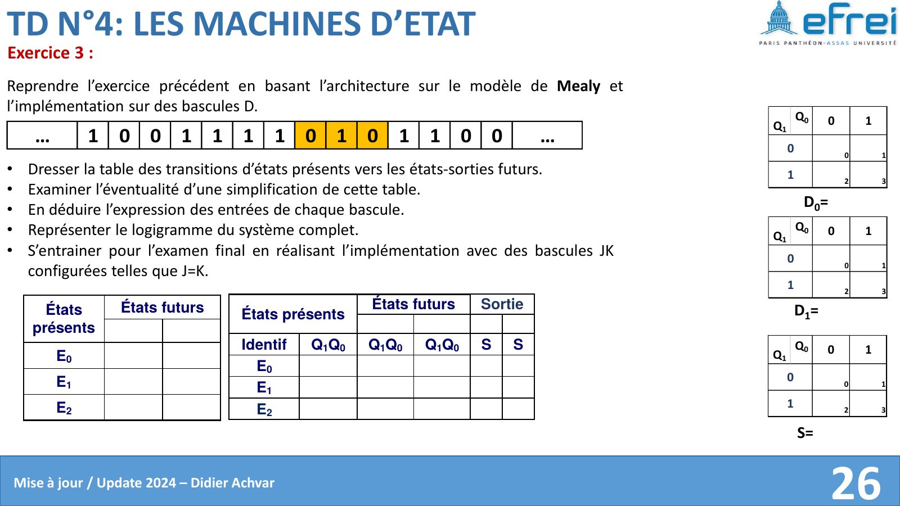

# TD 4 — Les machines à états

=== "Version simplifiée"

    Rappels : [chapitre 4](../cours/chapitre-4-machines-etats.md). Énoncés :
    onglet **Version papier**.

    ## Exercice 1 — Machine de Moore pour 5 LEDs

    Même démarche que l'[exemple du cours](../cours/chapitre-4-machines-etats.md#exemple-sequence-de-leds-commandee-par-un-bouton),
    avec la séquence de l'énoncé :

    1. Vérifier qu'on peut se contenter de **3 sorties** : il faut regarder quelles
       LEDs s'allument toujours ensemble (elles peuvent partager une même sortie).
    2. 5 états → 3 bascules D, $E_k$ codé par $k$ en binaire.
    3. Table états présents / futurs avec $b = 1$ → maintien, $b = 0$ → état suivant.
    4. Les équations $D_2, D_1, D_0$ sont **les mêmes que dans le cours** (seul le
       graphe d'avancement compte, pas les motifs affichés).
    5. Seules les équations des sorties $L_i$ changent : Karnaugh sur $Q_2Q_1Q_0$
       avec 101, 110, 111 en X.

    ## Exercice 2 — Détecteur de la séquence 010 (Moore, bascules D)

    On surveille un bit série $x$ ; la sortie $Z$ vaut 1 quand les trois derniers bits
    reçus sont `010`. Les **chevauchements** sont autorisés : dans `01010`, on détecte
    deux fois.

    **États** (chacun mémorise « ce qu'on a déjà reconnu ») :

    | État | Signification | Code $Q_1Q_0$ | $Z$ |
    |------|---------------|:-------------:|:---:|
    | $S_0$ | rien d'utile | 00 | 0 |
    | $S_1$ | on a reçu `0` | 01 | 0 |
    | $S_2$ | on a reçu `01` | 10 | 0 |
    | $S_3$ | on a reçu `010` | 11 | **1** |

    <figure class="etats-fig"><svg class="etats" viewBox="0 0 680 400" width="680" role="img" aria-label="Graphe des états de Moore : S0 à S3"><defs><marker id="fl-moore" viewBox="0 0 10 10" refX="9" refY="5" markerWidth="7" markerHeight="7" orient="auto-start-reverse"><path d="M0,0 L10,5 L0,10 z" class="ah"/></marker></defs><path class="tr" d="M143.5,234.1 C77.6,304.2 77.6,135.8 141.7,205.0" marker-end="url(#fl-moore)"/><text class="lb" x="76.0" y="224.0" text-anchor="middle">x=1</text><path class="tr" d="M190.4,198.0 Q248.0,135.6 328.8,117.1" marker-end="url(#fl-moore)"/><text class="lb" x="246.8" y="138.4" text-anchor="end">x=0</text><path class="tr" d="M345.9,83.5 C275.8,17.6 444.2,17.6 375.0,81.7" marker-end="url(#fl-moore)"/><text class="lb" x="360.0" y="30.0" text-anchor="middle">x=0</text><path class="tr" d="M389.2,116.7 Q472.0,135.6 528.3,196.5" marker-end="url(#fl-moore)"/><text class="lb" x="472.4" y="138.0" text-anchor="start">x=1</text><path class="tr" d="M530.3,242.6 Q471.9,309.8 390.1,339.2" marker-end="url(#fl-moore)"/><text class="lb" x="474.0" y="315.9" text-anchor="start">x=0</text><path class="tr" d="M379.7,327.4 Q438.1,260.2 519.9,230.8" marker-end="url(#fl-moore)"/><text class="lb" x="436.0" y="262.1" text-anchor="end">x=1</text><path class="tr" d="M520.2,216.5 Q360.0,198.0 201.8,216.3" marker-end="url(#fl-moore)"/><text class="lb" x="440.2" y="199.6" text-anchor="middle">x=1</text><path class="tr" d="M360.0,320.0 Q360.0,230.0 360.0,142.0" marker-end="url(#fl-moore)"/><text class="lb" x="350.0" y="270.2" text-anchor="end">x=0</text><circle class="st" cx="170" cy="220" r="30"/><text class="sn" x="170" y="218" text-anchor="middle">S0</text><text class="ss" x="170" y="234" text-anchor="middle">Z=0</text><circle class="st" cx="360" cy="110" r="30"/><text class="sn" x="360" y="108" text-anchor="middle">S1</text><text class="ss" x="360" y="124" text-anchor="middle">Z=0</text><circle class="st" cx="550" cy="220" r="30"/><text class="sn" x="550" y="218" text-anchor="middle">S2</text><text class="ss" x="550" y="234" text-anchor="middle">Z=0</text><circle class="st" cx="360" cy="350" r="30"/><text class="sn" x="360" y="348" text-anchor="middle">S3</text><text class="ss" x="360" y="364" text-anchor="middle">Z=1</text></svg><figcaption>Graphe de Moore : la sortie Z est écrite dans chaque état.</figcaption></figure>

    !!! piege "Les transitions depuis $S_3$"
        Après `010`, le dernier `0` peut être le début d'une nouvelle séquence :
        avec $x = 0$ on retourne en $S_1$ (et pas en $S_0$), avec $x = 1$ on a `01` →
        $S_2$. Oublier le chevauchement est l'erreur classique.

    | Présent $Q_1Q_0$ | Futur si $x = 0$ | Futur si $x = 1$ | $Z$ |
    |:-:|:-:|:-:|:-:|
    | 00 | 01 | 00 | 0 |
    | 01 | 01 | 10 | 0 |
    | 10 | 11 | 00 | 0 |
    | 11 | 01 | 10 | 1 |

    Avec des D ($D_i = Q_i^+$) :

    $$
    D_1 = x\,Q_0 + \overline{x}\,Q_1\overline{Q_0}, \qquad D_0 = \overline{x}, \qquad Z = Q_1 Q_0
    $$

    **Entraînement examen — avec des JK telles que $J = K$** ($T_i = Q_i \oplus Q_i^+$) :

    $$
    T_0 = \overline{Q_0 \oplus x}, \qquad
    T_1 = x\,\overline{Q_1}\,Q_0 + x\,Q_1\overline{Q_0} + \overline{x}\,Q_1 Q_0
    $$

    ## Exercice 3 — Même détecteur en Mealy

    En Mealy, la sortie est portée par la **transition** : on détecte `010` au moment
    où le dernier `0` arrive. Trois états suffisent :

    | État | Signification | Code $Q_1Q_0$ |
    |------|---------------|:-------------:|
    | $A$ | rien d'utile | 00 |
    | $B$ | reçu `0` | 01 |
    | $C$ | reçu `01` | 10 |

    <figure class="etats-fig"><svg class="etats" viewBox="0 0 680 350" width="680" role="img" aria-label="Graphe des états de Mealy : A, B, C"><defs><marker id="fl-mealy" viewBox="0 0 10 10" refX="9" refY="5" markerWidth="7" markerHeight="7" orient="auto-start-reverse"><path d="M0,0 L10,5 L0,10 z" class="ah"/></marker></defs><path class="tr" d="M187.5,235.6 Q241.8,159.9 329.3,134.1" marker-end="url(#fl-mealy)"/><text class="lb" x="240.8" y="163.3" text-anchor="end">x=0 / Z=0</text><path class="tr" d="M143.5,274.1 C77.6,344.2 77.6,175.8 141.7,245.0" marker-end="url(#fl-mealy)"/><text class="lb" x="104.0" y="318.0" text-anchor="middle">x=1 / Z=0</text><path class="tr" d="M345.9,98.5 C275.8,32.6 444.2,32.6 375.0,96.7" marker-end="url(#fl-mealy)"/><text class="lb" x="360.0" y="45.0" text-anchor="middle">x=0 / Z=0</text><path class="tr" d="M388.8,133.5 Q478.2,159.9 531.3,234.0" marker-end="url(#fl-mealy)"/><text class="lb" x="478.4" y="162.8" text-anchor="start">x=1 / Z=0</text><path class="tr" d="M522.0,249.3 Q437.6,217.0 380.6,149.5" marker-end="url(#fl-mealy)"/><text class="lb" x="435.2" y="225.2" text-anchor="end">x=0 / Z=1</text><path class="tr" d="M520.5,265.3 Q360.0,294.0 201.5,265.6" marker-end="url(#fl-mealy)"/><text class="lb" x="360.5" y="301.7" text-anchor="middle">x=1 / Z=0</text><circle class="st" cx="170" cy="260" r="30"/><text class="sn" x="170" y="265" text-anchor="middle">A</text><circle class="st" cx="360" cy="125" r="30"/><text class="sn" x="360" y="130" text-anchor="middle">B</text><circle class="st" cx="550" cy="260" r="30"/><text class="sn" x="550" y="265" text-anchor="middle">C</text></svg><figcaption>Graphe de Mealy : chaque transition porte « entrée / sortie ».</figcaption></figure>

    | Présent | $x = 0$ : futur / $Z$ | $x = 1$ : futur / $Z$ |
    |:-:|:-:|:-:|
    | A (00) | B (01) / 0 | A (00) / 0 |
    | B (01) | B (01) / 0 | C (10) / 0 |
    | C (10) | B (01) / **1** | A (00) / 0 |

    Avec l'état 11 en X :

    $$
    D_1 = x\,Q_0, \qquad D_0 = \overline{x}, \qquad Z = \overline{x}\,Q_1
    $$

    **Simplification** : un état de moins qu'en Moore, et des équations plus
    simples. En contrepartie, $Z$ dépend directement de $x$ : elle change dès que
    $x$ change (sortie asynchrone), sans attendre l'horloge.

=== "Version papier"

    Énoncés du TD 4 tels qu'ils sont distribués (livret de TD de D. Achvar). Les pages 22 à 24 donnent les tableaux de Karnaugh de l'exercice 1.

    [{ loading=lazy .papier }](papier/td4/livret-p21.jpg)
    
Exercice 1 — machine de Moore, 5 LEDs · Livret de TD 2024, p. 21

    [{ loading=lazy .papier }](papier/td4/livret-p22.jpg)
    
Exercice 1 — diagramme des états, sortie D0 · Livret de TD 2024, p. 22

    [{ loading=lazy .papier }](papier/td4/livret-p23.jpg)
    
Exercice 1 — suite · Livret de TD 2024, p. 23

    [{ loading=lazy .papier }](papier/td4/livret-p24.jpg)
    
Exercice 1 — sortie S1 · Livret de TD 2024, p. 24

    [{ loading=lazy .papier }](papier/td4/livret-p25.jpg)
    
Exercice 2 — détecteur de 010 (Moore) · Livret de TD 2024, p. 25

    [{ loading=lazy .papier }](papier/td4/livret-p26.jpg)
    
Exercice 3 — détecteur de 010 (Mealy) · Livret de TD 2024, p. 26

